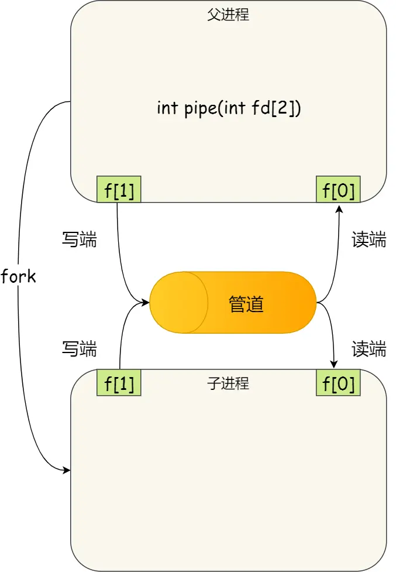

## Blog

### 算法

#### 详细布置

- 150 逆波兰表达式求值 
- 239 滑动窗口最大值
- 347 前K个高频元素
- 总结


#### 150 逆波兰表达式求值 

本题不难，但第一次做的话，会很难想到，所以先看视频，了解思路再去做题 

题目链接/文章讲解/视频讲解：

https://programmercarl.com/0150.%E9%80%86%E6%B3%A2%E5%85%B0%E8%A1%A8%E8%BE%BE%E5%BC%8F%E6%B1%82%E5%80%BC.html

本题还是比较简单的，通过一个栈来存储数字（记得`stoi()`），碰到符号就从栈中弹出两个数字，注意弹栈的顺序

```cpp
class Solution {
public:
    int evalRPN(vector<string>& tokens) {
        stack<int> nums;
        for (string ch : tokens) {
            if (ch != "+" &&
                ch != "-" &&
                ch != "*" &&
                ch != "/")
                nums.push(stoi(ch));
            else {
                int num2 = nums.top();
                nums.pop();
                int num1 = nums.top();
                nums.pop();
                if (ch == "+") nums.push(num1 + num2);
                else if (ch == "-") nums.push(num1 - num2);
                else if (ch == "*") nums.push(num1 * num2);
                else if (ch == "/") nums.push(num1 / num2);
            }
        }
        return nums.top();
    }
};
```


#### 239 滑动窗口最大值

（有点难度，可能代码写不出来，但一刷至少需要理解思路）

之前讲的都是栈的应用，这次该是队列的应用了。

本题算比较有难度的，需要自己去构造单调队列，建议先看视频来理解。 

题目链接/文章讲解/视频讲解：

https://programmercarl.com/0239.%E6%BB%91%E5%8A%A8%E7%AA%97%E5%8F%A3%E6%9C%80%E5%A4%A7%E5%80%BC.html

看到本题，一开始是有思路的，使用队列作为滑动窗口，本来想只使用1个队列，但是考虑到窗口中的元素可能会相等，因此又设置了一个备份。

主要思路就是：当窗口中的元素个数 < k时，就直接往里面放数据；否则，逐个遍历窗口，找到最大元素。

```cpp
class Solution {
public:
    vector<int> maxSlidingWindow(vector<int>& nums, int k) {
        queue<int> window;
        vector<int> ret;
        for (int it : nums) {
            if (window.size() == k - 1) {
                window.push(it);
                int max = window.front();
                queue<int> tmp;
                while (!window.empty()) {
                    if (window.front() > max) max = window.front();
                    tmp.push(window.front());
                    window.pop();
                }
                window = tmp;
                ret.push_back(max);
                window.pop();
            }
            else
                window.push(it);
        }
        return ret;
    }
};
```

在提交的时候超时了，看随想录的思路

1. 使用一个双端队列 `deque` 存储数组元素的索引，保持队列中对应的值单调递减。
    - **队列中存储的是索引**，而不是元素值，这样方便判断元素是否滑出窗口。
2. 对于数组中的每个元素：
    - 如果队首索引超出当前窗口范围，则移除队首索引。
    - 维持队列单调性：移除队尾小于当前元素值的索引。
    - 将当前索引添加到队列。
3. 当窗口形成后（即 i≥k−1*i*≥*k*−1），队首的索引对应的值就是当前窗口的最大值。

```cpp
class Solution {
public:
    vector<int> maxSlidingWindow(vector<int>& nums, int k) {
        deque<int> dq; // 存的是索引，用于维护单调性
        vector<int> ret;
		// 遍历数组的每个元素并动态调整滑动窗口
        for (int i = 0; i < nums.size(); ++i) {
            // 移除滑出窗口的元素
            if (!dq.empty() && dq.front() < i - k + 1)
                dq.pop_front(); // 队列头部的索引，它代表当前窗口的最大值
            // 移除队列中所有小于当前元素的值
            while (!dq.empty() && nums[dq.back()] < nums[i])
                dq.pop_back();
            // 将当前索引加入队列
            dq.push_back(i);
            // 队首元素即为当前窗口的最大值
            if (i >= k - 1) // 当 i >= k - 1 时，表示窗口已经形成
                ret.push_back(nums[dq.front()]);
        }

        return ret;
    }
};
```


#### 347 前K个高频元素

（有点难度，可能代码写不出来，一刷至少需要理解思路）

大/小顶堆的应用， 在C++中就是优先级队列 

本题是 大数据中取前k值 的经典思路，了解想法之后，不算难。

题目链接/文章讲解/视频讲解：

https://programmercarl.com/0347.%E5%89%8DK%E4%B8%AA%E9%AB%98%E9%A2%91%E5%85%83%E7%B4%A0.html

看到提示，用大小顶堆，不会，直接看的视频

大概理解了思路，但是对于优先队列和大小顶堆不是很熟悉，照着敲了一遍

```cpp
class Solution {
public:
    struct compare {
        bool operator()(const pair<int, int>& lhs, const pair<int, int>& rhs) {
            return lhs.second > rhs.second;
        }
    };
    vector<int> topKFrequent(vector<int>& nums, int k) {
        unordered_map<int, int> map;
        for (int it : nums)
            map[it]++;

        priority_queue<pair<int, int>, vector<pair<int, int>>, compare> pq;
        for (auto it = map.begin(); it != map.end(); ++it) {
            pq.push(*it);
            if (pq.size() > k)
                pq.pop();
        }

        vector<int> ret(k);
        for (int i = k - 1; i >= 0; i--) {
            ret[i] = pq.top().first;
            pq.pop();
        }
        return ret;
    }
};
```


#### 总结

栈与队列做一个总结吧，加油

https://programmercarl.com/%E6%A0%88%E4%B8%8E%E9%98%9F%E5%88%97%E6%80%BB%E7%BB%93.html

1. C++中stack，queue 是容器么？

    不是，它们是容器适配器，而不是直接的容器类型。但需要底层容器的支持来实际存储数据。

2. 我们使用的stack，queue是属于那个版本的STL？

    SGI

3. 我们使用的STL中stack，queue是如何实现的？

    栈、队列的底层实现可以是vector，deque，list 都是可以的

4. stack，queue 提供迭代器来遍历空间么？

    不能

栈是容器适配器，底层容器使用不同的容器，导致栈内数据在内存中不一定是连续分布的。

缺省情况下，默认底层容器是deque，那么deque在内存中的数据分布是什么样的呢？ 答案是：不连续的

**递归的实现是栈：每一次递归调用都会把函数的局部变量、参数值和返回地址等压入调用栈中**，然后递归返回的时候，从栈顶弹出上一次递归的各项参数，所以这就是递归为什么可以返回上一层位置的原因

**括号匹配是使用栈解决的经典问题。**一个相邻字符串消除的过程，和栈与队列：匹配问题都是栈的强项 (opens new window)中的对对碰游戏是不是就非常像了

维护元素单调递减的队列就叫做**单调队列，即单调递减或单调递增的队列。C++中没有直接支持单调队列，需要我们自己来一个单调队列**。**单调队列不是一成不变的，而是不同场景不同写法**，总之要保证队列里单调递减或递增的原则，所以叫做单调队列。

**堆是一棵完全二叉树，树中每个结点的值都不小于（或不大于）其左右孩子的值。** 如果父亲结点是大于等于左右孩子就是大顶堆，小于等于左右孩子就是小顶堆。

所以大家经常说的大顶堆（堆头是最大元素），小顶堆（堆头是最小元素），如果懒得自己实现的话，就直接用priority_queue（优先级队列）就可以了，底层实现都是一样的，从小到大排就是小顶堆，从大到小排就是大顶堆。


### 八股文

#### 进程调度算法你了解多少

掌握程度 ：

- 能够清晰地描述至少几种常见的进程调度算法及其特点。
- 知道在不同应用场景下如何选择适合的调度算法。	

参考资料：

[进程调度算法]()

https://xiaolincoding.com/os/4_process/process_base.html#调度算法

[【操作系统】CPU调度算法】]()

https://www.bilibili.com/video/BV1Kz4y117gZ/?share_source=copy_web&vd_source=9bb0aa9c2c3cc1b12ca6f343a55b4e80

> 进程都希望自己能够占用 CPU 进行工作，那么这涉及到前面说过的进程上下文切换。
>
> 一旦操作系统把进程切换到运行状态，也就意味着该进程占用着 CPU 在执行，但是当操作系统把进程切换到其他状态时，那就不能在 CPU 中执行了，于是操作系统会选择下一个要运行的进程。
>
> 选择一个进程运行这一功能是在操作系统中完成的，通常称为**调度程序**（*scheduler*）。

##### 调度的时机

在进程的生命周期中，当进程从一个运行状态到另外一状态变化的时候，其实会触发一次调度。

比如，以下状态的变化都会触发操作系统的调度：

- *从就绪态 -> 运行态*：当进程被创建时，会进入到就绪队列，操作系统会从就绪队列选择一个进程运行；
- *从运行态 -> 阻塞态*：当进程发生 I/O 事件而阻塞时，操作系统必须选择另外一个进程运行；
- *从运行态 -> 结束态*：当进程退出结束后，操作系统得从就绪队列选择另外一个进程运行；

因为，这些状态变化的时候，操作系统需要考虑是否要让新的进程给 CPU 运行，或者是否让当前进程从 CPU 上退出来而换另一个进程运行。

另外，如果硬件时钟提供某个频率的周期性中断，那么可以根据如何处理时钟中断 ，把调度算法分为两类：

- **非抢占式调度算法**挑选一个进程，然后让该进程运行直到被阻塞，或者直到该进程退出，才会调用另外一个进程，也就是说不会理时钟中断这个事情。
- **抢占式调度算法**挑选一个进程，然后让该进程只运行某段时间，如果在该时段结束时，该进程仍然在运行时，则会把它挂起，接着调度程序从就绪队列挑选另外一个进程。这种抢占式调度处理，需要在时间间隔的末端发生**时钟中断**，以便把 CPU 控制返回给调度程序进行调度，也就是常说的**时间片机制**

##### 调度的原则

*原则一*：如果运行的程序，发生了 I/O 事件的请求，那 CPU 使用率必然会很低，因为此时进程在阻塞等待硬盘的数据返回。这样的过程，势必会造成 CPU 突然的空闲。所以，**为了提高 CPU 利用率，在这种发送 I/O 事件致使 CPU 空闲的情况下，调度程序需要从就绪队列中选择一个进程来运行。**

*原则二*：有的程序执行某个任务花费的时间会比较长，如果这个程序一直占用着 CPU，会造成系统吞吐量（CPU 在单位时间内完成的进程数量）的降低。所以，**要提高系统的吞吐率，调度程序要权衡长任务和短任务进程的运行完成数量。**

*原则三*：从进程开始到结束的过程中，实际上是包含两个时间，分别是进程运行时间和进程等待时间，这两个时间总和就称为周转时间。进程的周转时间越小越好，**如果进程的等待时间很长而运行时间很短，那周转时间就很长，这不是我们所期望的，调度程序应该避免这种情况发生。**

*原则四*：处于就绪队列的进程，也不能等太久，当然希望这个等待的时间越短越好，这样可以使得进程更快的在 CPU 中执行。所以，**就绪队列中进程的等待时间也是调度程序所需要考虑的原则。**

*原则五*：对于鼠标、键盘这种交互式比较强的应用，我们当然希望它的响应时间越快越好，否则就会影响用户体验了。所以，**对于交互式比较强的应用，响应时间也是调度程序需要考虑的原则。**

针对上面的五种调度原则，总结成如下：

- **CPU 利用率**：调度程序应确保 CPU 是始终匆忙的状态，这可提高 CPU 的利用率；
- **系统吞吐量**：吞吐量表示的是单位时间内 CPU 完成进程的数量，长作业的进程会占用较长的 CPU 资源，因此会降低吞吐量，相反，短作业的进程会提升系统吞吐量；
- **周转时间**：周转时间是进程运行+阻塞时间+等待时间的总和，一个进程的周转时间越小越好；
- **等待时间**：这个等待时间不是阻塞状态的时间，而是进程处于就绪队列的时间，等待的时间越长，用户越不满意；
- **响应时间**：用户提交请求到系统第一次产生响应所花费的时间，在交互式系统中，响应时间是衡量调度算法好坏的主要标准。

##### 调度算法

在**单核 CPU 系统**中常见的调度算法

- 先来先服务调度算法

  先来后到，**每次从就绪队列选择最先进入队列的进程，然后一直运行，直到进程退出或被阻塞，才会继续从队列中选择第一个进程接着运行。**

  如果当一个长作业先运行了，那么后面的短作业等待的时间就会很长，不利于短作业。

  FCFS 对长作业有利，适用于 CPU 繁忙型作业的系统，而不适用于 I/O 繁忙型作业的系统。

- 最短作业优先调度算法

  **最短作业优先（\*Shortest Job First, SJF\*）调度算法**同样也是顾名思义，它会**优先选择运行时间最短的进程来运行**，这有助于提高系统的吞吐量。

  对长作业不利，很容易造成一种极端现象。比如，一个长作业在就绪队列等待运行，而这个就绪队列有非常多的短作业，那么就会使得长作业不断的往后推，周转时间变长，致使长作业长期不会被运行

- 高响应比优先调度算法

  **高响应比优先 （\*Highest Response Ratio Next, HRRN\*）调度算法**主要是权衡了短作业和长作业

  **每次进行进程调度时，先计算「响应比优先级」，然后把「响应比优先级」最高的进程投入运行**，「响应比优先级」的计算公式：$优先权 = \frac{等待时间 + 要求服务时间}{要求服务时间}$

  - 如果两个进程的「等待时间」相同时，「要求的服务时间」越短，「响应比」就越高，这样短作业的进程容易被选中运行；
  - 如果两个进程「要求的服务时间」相同时，「等待时间」越长，「响应比」就越高，这就兼顾到了长作业进程，因为进程的响应比可以随时间等待的增加而提高，当其等待时间足够长时，其响应比便可以升到很高，从而获得运行的机会；

- 时间片轮转调度算法

  最古老、最简单、最公平且使用最广的算法就是**时间片轮转（\*Round Robin, RR\*）调度算法**，它认为所有的进程同等重要

  **每个进程被分配一个时间段，称为时间片（\*Quantum\*），即允许该进程在该时间段中运行。**

  - 如果时间片用完，进程还在运行，那么将会把此进程从 CPU 释放出来，并把 CPU 分配给另外一个进程；
  - 如果该进程在时间片结束前阻塞或结束，则 CPU 立即进行切换；

  另外，时间片的长度就是一个很关键的点：

  - 如果时间片设得太短会导致过多的进程上下文切换，降低了 CPU 效率；
  - 如果设得太长又可能引起对短作业进程的响应时间变长。将

  一般来说，时间片设为 `20ms~50ms` 通常是一个比较合理的折中值

- 最高优先级调度算法

  对于多用户计算机系统希望调度是有优先级的，即希望调度程序能**从就绪队列中选择最高优先级的进程进行运行，这称为最高优先级（\*Highest Priority First，HPF\*）调度算法**。

  进程的优先级可以分为，静态优先级和动态优先级：

  - 静态优先级：创建进程时候，就已经确定了优先级了，然后整个运行时间优先级都不会变化；
  - 动态优先级：根据进程的动态变化调整优先级，比如如果进程运行时间增加，则降低其优先级，如果进程等待时间（就绪队列的等待时间）增加，则升高其优先级，也就是**随着时间的推移增加等待进程的优先级**。

  该算法也有两种处理优先级高的方法，非抢占式和抢占式：

  - 非抢占式：当就绪队列中出现优先级高的进程，运行完当前进程，再选择优先级高的进程。
  - 抢占式：当就绪队列中出现优先级高的进程，当前进程挂起，调度优先级高的进程运行。

  但是依然有缺点，可能会导致低优先级的进程永远不会运行。

- 多级反馈队列调度算法

  **多级反馈队列（\*Multilevel Feedback Queue\*）调度算法**是「时间片轮转算法」和「最高优先级算法」的综合和发展。

  - 「多级」表示有多个队列，每个队列优先级从高到低，同时优先级越高时间片越短。
  - 「反馈」表示如果有新的进程加入优先级高的队列时，立刻停止当前正在运行的进程，转而去运行优先级高的队列；

  

  工作步骤：

  - 设置了多个队列，赋予每个队列不同的优先级，每个**队列优先级从高到低**，同时**优先级越高时间片越短**；
  - 新的进程会被放入到第一级队列的末尾，按先来先服务的原则排队等待被调度，如果在第一级队列规定的时间片没运行完成，则将其转入到第二级队列的末尾，以此类推，直至完成；
  - 当较高优先级的队列为空，才调度较低优先级的队列中的进程运行。如果进程运行时，有新进程进入较高优先级的队列，则停止当前运行的进程并将其移入到原队列末尾，接着让较高优先级的进程运行；

  可以发现，对于短作业可能可以在第一级队列很快被处理完。对于长作业，如果在第一级队列处理不完，可以移入下次队列等待被执行，虽然等待的时间变长了，但是运行时间也变更长了，所以该算法很好的**兼顾了长短作业，同时有较好的响应时间。**


#### 进程间有哪些通信方式

面试中的掌握程度：

- 能够清晰地描述至少几种常见的进程间通信方式及其特点。
- 知道进程间通信在多任务操作系统中的应用，理解不同IPC机制的使用场景和限制。
- 了解进程间通信可能带来的安全问题，如竞态条件、死锁等，并讨论如何避免这些问题。

参考资料：

[小林coding: 进程通信方式]()

https://xiaolincoding.com/os/4_process/process_commu.html#管道

[【大厂面试笔试题31丨进程间通信方式】]()

https://www.bilibili.com/video/BV1tv411p7WX/?share_source=copy_web&vd_source=9bb0aa9c2c3cc1b12ca6f343a55b4e80

[『面试问答』：进程间通信的方式有哪些？]()

https://www.bilibili.com/video/BV1oX4y177y7/?share_source=copy_web&vd_source=9bb0aa9c2c3cc1b12ca6f343a55b4e80


每个进程的用户地址空间都是独立的，一般而言是不能互相访问的，但内核空间是每个进程都共享的，所以进程之间要通信必须通过内核。

##### 管道

###### 匿名管道`pipe`

```bash
$ ps auxf | grep mysql
```

命令行里的「`|`」竖线就是一个**管道**，它的功能是将前一个命令（`ps auxf`）的输出，作为后一个命令（`grep mysql`）的输入，从这功能描述，可以看出**管道传输数据是单向的**，如果想相互通信，我们需要创建两个管道才行。

「`|`」表示的管道称为**匿名管道**，用完了就销毁

匿名管道的创建，需要通过这个系统调用：`int pipe(int fd[2])`。这里表示创建一个匿名管道，并返回了两个描述符，一个是管道的读取端描述符 `fd[0]`，另一个是管道的写入端描述符 `fd[1]`。注意，这个匿名管道是特殊的文件，只存在于内存，不存于文件系统中


###### 命名管道`fifo`

管道的另外一个类型是**命名管道**，也被叫做 `FIFO`，因为数据是先进先出的传输方式

在使用命名管道前，先需要通过 `mkfifo` 命令来创建，并且指定管道名字：`mkfifo myPipe`，myPipe 就是这个管道的名称，基于 Linux 一切皆文件的理念，所以管道也是以文件的方式存在，文件的类型是 p

```bash
# 管道的读写
$ echo "hello" > myPipe  // 将数据写进管道
                         // 停住了 ...
                         
$ cat < myPipe  // 读取管道里的数据
hello
```

###### 管道

**所谓的管道，就是内核里面的一串缓存**。从管道的一段写入的数据，实际上是缓存在内核中的，另一端读取，也就是从内核中读取这段数据。另外，管道传输的数据是无格式的流且大小受限

使用 `fork` 创建子进程，**创建的子进程会复制父进程的文件描述符**，这样就做到了两个进程各有两个「 `fd[0]` 与 `fd[1]`」，两个进程就可以通过各自的 fd 写入和读取同一个管道文件实现跨进程通信了。



管道只能一端写入，另一端读出，所以上面这种模式容易造成混乱，因为父进程和子进程都可以同时写入，也都可以读出。那么，为了避免这种情况，通常的做法是：

- 父进程关闭读取的 fd[0]，只保留写入的 fd[1]；
- 子进程关闭写入的 fd[1]，只保留读取的 fd[0]；

如果需要双向通信，则应该创建两个管道。

**对于匿名管道，它的通信范围是存在父子关系的进程**。因为管道没有实体，也就是没有管道文件，只能通过 fork 来复制父进程 fd 文件描述符，来达到通信的目的。

**对于命名管道，它可以在不相关的进程间也能相互通信**。因为命令管道，提前创建了一个类型为管道的设备文件，在进程里只要使用这个设备文件，就可以相互通信。

不管是匿名管道还是命名管道，进程写入的数据都是缓存在内核中，另一个进程读取数据时候自然也是从内核中获取，同时通信数据都遵循**先进先出**原则，不支持 lseek 之类的文件定位操作

**管道这种通信方式效率低，不适合进程间频繁地交换数据**

##### 消息队列

比如，A 进程要给 B 进程发送消息，A 进程把数据放在对应的消息队列后就可以正常返回了，B 进程需要的时候再去读取数据就可以了。同理，B 进程要给 A 进程发送消息也是如此。

**消息队列是保存在内核中的消息链表**，在发送数据时，会分成一个一个独立的数据单元，也就是消息体（数据块），消息体是用户自定义的数据类型，消息的发送方和接收方要约定好消息体的数据类型，所以每个消息体都是固定大小的存储块，不像管道是无格式的字节流数据。如果进程从消息队列中读取了消息体，内核就会把这个消息体删除。

消息队列生命周期随内核，如果没有释放消息队列或者没有关闭操作系统，消息队列会一直存在，而前面提到的匿名管道的生命周期，是随进程的创建而建立，随进程的结束而销毁。

**消息队列不适合比较大数据的传输**，因为在内核中每个消息体都有一个最大长度的限制，同时所有队列所包含的全部消息体的总长度也是有上限

**消息队列通信过程中，存在用户态与内核态之间的数据拷贝开销**，因为进程写入数据到内核中的消息队列时，会发生从用户态拷贝数据到内核态的过程，同理另一进程读取内核中的消息数据时，会发生从内核态拷贝数据到用户态的过程

##### 共享内存

现代操作系统，对于内存管理，采用的是虚拟内存技术，也就是每个进程都有自己独立的虚拟内存空间，不同进程的虚拟内存映射到不同的物理内存中。所以，即使进程 A 和 进程 B 的虚拟地址是一样的，其实访问的是不同的物理内存地址，对于数据的增删查改互不影响。

**共享内存的机制，就是拿出一块虚拟地址空间来，映射到相同的物理内存中**。这样这个进程写入的东西，另外一个进程马上就能看到了，都不需要拷贝来拷贝去，传来传去，大大提高了进程间通信的速度


用了共享内存通信方式，带来新的问题，那就是如果多个进程同时修改同一个共享内存，很有可能就冲突了。例如两个进程都同时写一个地址，那先写的那个进程会发现内容被别人覆盖了。

##### 信号量

为了防止多进程竞争共享资源，而造成的数据错乱，所以需要保护机制，使得共享的资源，在任意时刻只能被一个进程访问。**信号量**就实现了这一保护机制

**信号量其实是一个整型的计数器，主要用于实现进程间的互斥与同步，而不是用于缓存进程间通信的数据**。

信号量表示资源的数量，控制信号量的方式有两种原子操作：

- 一个是 **P 操作**，这个操作会把信号量减去 1，相减后如果信号量 < 0，则表明资源已被占用，进程需阻塞等待；相减后如果信号量 >= 0，则表明还有资源可使用，进程可正常继续执行。
- 另一个是 **V 操作**，这个操作会把信号量加上 1，相加后如果信号量 <= 0，则表明当前有阻塞中的进程，于是会将该进程唤醒运行；相加后如果信号量 > 0，则表明当前没有阻塞中的进程；

P 操作是用在进入共享资源之前，V 操作是用在离开共享资源之后，这两个操作是必须成对出现的。

如果要使得两个进程互斥访问共享内存，我们可以初始化信号量为 `1`。


- 进程 A 在访问共享内存前，先执行了 P 操作，由于信号量的初始值为 1，故在进程 A 执行 P 操作后信号量变为 0，表示共享资源可用，于是进程 A 就可以访问共享内存。
- 若此时，进程 B 也想访问共享内存，执行了 P 操作，结果信号量变为了 -1，这就意味着临界资源已被占用，因此进程 B 被阻塞。
- 直到进程 A 访问完共享内存，才会执行 V 操作，使得信号量恢复为 0，接着就会唤醒阻塞中的线程 B，使得进程 B 可以访问共享内存，最后完成共享内存的访问后，执行 V 操作，使信号量恢复到初始值 1。

信号初始化为 `1`，就代表着是**互斥信号量**，它可以保证共享内存在任何时刻只有一个进程在访问，这就很好的保护了共享内存

在多进程里，每个进程并不一定是顺序执行的，它们基本是以各自独立的、不可预知的速度向前推进，但有时候我们又希望多个进程能密切合作，以实现一个共同的任务。用信号量来实现多进程同步的方式，我们可以初始化信号量为 `0`。


- 如果进程 B 比进程 A 先执行了，那么执行到 P 操作时，由于信号量初始值为 0，故信号量会变为 -1，表示进程 A 还没生产数据，于是进程 B 就阻塞等待；
- 接着，当进程 A 生产完数据后，执行了 V 操作，就会使得信号量变为 0，于是就会唤醒阻塞在 P 操作的进程 B；
- 最后，进程 B 被唤醒后，意味着进程 A 已经生产了数据，于是进程 B 就可以正常读取数据了。

信号初始化为 `0`，就代表着是**同步信号量**，它可以保证进程 A 应在进程 B 之前执行

##### 信号

在 Linux 操作系统中， 为了响应各种各样的事件，提供了几十种信号，分别代表不同的意义。我们可以通过 `kill -l` 命令，查看所有的信号

运行在 shell 终端的进程，我们可以通过键盘输入某些组合键的时候，给进程发送信号。例如

- Ctrl+C 产生 `SIGINT` 信号，表示终止该进程；
- Ctrl+Z 产生 `SIGTSTP` 信号，表示停止该进程，但还未结束；

信号事件的来源主要有硬件来源（如键盘 Cltr+C ）和软件来源（如 kill 命令）。

信号是进程间通信机制中**唯一的异步通信机制**，因为可以在任何时候发送信号给某一进程，一旦有信号产生，我们就有下面这几种，用户进程对信号的处理方式。

**1.执行默认操作**。Linux 对每种信号都规定了默认操作，例如，上面列表中的 SIGTERM 信号，就是终止进程的意思。

**2.捕捉信号**。我们可以为信号定义一个信号处理函数。当信号发生时，我们就执行相应的信号处理函数。

**3.忽略信号**。当我们不希望处理某些信号的时候，就可以忽略该信号，不做任何处理。有两个信号是应用进程无法捕捉和忽略的，即 `SIGKILL` 和 `SEGSTOP`，它们用于在任何时候中断或结束某一进程

##### 套接字

管道、消息队列、共享内存、信号量和信号都是在同一台主机上进行进程间通信，那要想**跨网络与不同主机上的进程之间通信，就需要 Socket 通信了。**

Socket 通信不仅可以跨网络与不同主机的进程间通信，还可以在同主机上进程间通信。

创建 socket 的系统调用：`int socket(int domain, int type, int protocal)`

- domain 参数用来指定协议族，比如 AF_INET 用于 IPV4、AF_INET6 用于 IPV6、AF_LOCAL/AF_UNIX 用于本机；
- type 参数用来指定通信特性，比如 SOCK_STREAM 表示的是字节流，对应 TCP、SOCK_DGRAM 表示的是数据报，对应 UDP、SOCK_RAW 表示的是原始套接字；
- protocal 参数原本是用来指定通信协议的，但现在基本废弃。因为协议已经通过前面两个参数指定完成，protocol 目前一般写成 0 即可；

根据创建 socket 类型的不同，通信的方式也就不同：

- 实现 TCP 字节流通信： socket 类型是 AF_INET 和 SOCK_STREAM；
- 实现 UDP 数据报通信：socket 类型是 AF_INET 和 SOCK_DGRAM；
- 实现本地进程间通信： 「本地字节流 socket 」类型是 AF_LOCAL 和 SOCK_STREAM，「本地数据报 socket 」类型是 AF_LOCAL 和 SOCK_DGRAM。另外，AF_UNIX 和 AF_LOCAL 是等价的，所以 AF_UNIX 也属于本地 socket；

针对本地进程间通信的 socket 编程模型，用于在**同一台主机上进程间通信**的场景：

- 本地 socket 的编程接口和 IPv4 、IPv6 套接字编程接口是一致的，可以支持「字节流」和「数据报」两种协议；
- 本地 socket 的实现效率大大高于 IPv4 和 IPv6 的字节流、数据报 socket 实现；

对于本地字节流 socket，其 socket 类型是 AF_LOCAL 和 SOCK_STREAM。

对于本地数据报 socket，其 socket 类型是 AF_LOCAL 和 SOCK_DGRAM。

本地字节流 socket 和 本地数据报 socket 在 bind 的时候，不像 TCP 和 UDP 要绑定 IP 地址和端口，而是**绑定一个本地文件**，这也就是它们之间的最大区别

##### ==**总结**==

由于每个进程的用户空间都是独立的，不能相互访问，这时就需要借助内核空间来实现进程间通信，原因很简单，每个进程都是共享一个内核空间。

Linux 内核提供了不少进程间通信的方式，其中最简单的方式就是管道，管道分为「匿名管道」和「命名管道」。

**匿名管道**顾名思义，它没有名字标识，匿名管道是特殊文件只存在于内存，没有存在于文件系统中，shell 命令中的「`|`」竖线就是匿名管道，通信的数据是**无格式的流并且大小受限**，通信的方式是**单向**的，数据只能在一个方向上流动，如果要双向通信，需要创建两个管道，再来**匿名管道是只能用于存在父子关系的进程间通信**，匿名管道的生命周期随着进程创建而建立，随着进程终止而消失。

**命名管道**突破了匿名管道只能在亲缘关系进程间的通信限制，因为使用命名管道的前提，需要在文件系统创建一个类型为 p 的设备文件，那么毫无关系的进程就可以通过这个设备文件进行通信。另外，不管是匿名管道还是命名管道，进程写入的数据都是**缓存在内核**中，另一个进程读取数据时候自然也是从内核中获取，同时通信数据都遵循**先进先出**原则，不支持 lseek 之类的文件定位操作。

**消息队列**克服了管道通信的数据是无格式的字节流的问题，消息队列实际上是保存在内核的「消息链表」，消息队列的消息体是可以用户自定义的数据类型，发送数据时，会被分成一个一个独立的消息体，当然接收数据时，也要与发送方发送的消息体的数据类型保持一致，这样才能保证读取的数据是正确的。消息队列通信的速度不是最及时的，毕竟**每次数据的写入和读取都需要经过用户态与内核态之间的拷贝过程。**

**共享内存**可以解决消息队列通信中用户态与内核态之间数据拷贝过程带来的开销，**它直接分配一个共享空间，每个进程都可以直接访问**，就像访问进程自己的空间一样快捷方便，不需要陷入内核态或者系统调用，大大提高了通信的速度，享有**最快**的进程间通信方式之名。但是便捷高效的共享内存通信，**带来新的问题，多进程竞争同个共享资源会造成数据的错乱。**

那么，就需要**信号量**来保护共享资源，以确保任何时刻只能有一个进程访问共享资源，这种方式就是互斥访问。**信号量不仅可以实现访问的互斥性，还可以实现进程间的同步**，信号量其实是一个计数器，表示的是资源个数，其值可以通过两个原子操作来控制，分别是 **P 操作和 V 操作**。

与信号量名字很相似的叫**信号**，它俩名字虽然相似，但功能一点儿都不一样。信号是**异步通信机制**，信号可以在应用进程和内核之间直接交互，内核也可以利用信号来通知用户空间的进程发生了哪些系统事件，信号事件的来源主要有硬件来源（如键盘 Cltr+C ）和软件来源（如 kill 命令），一旦有信号发生，**进程有三种方式响应信号 1. 执行默认操作、2. 捕捉信号、3. 忽略信号**。有两个信号是应用进程无法捕捉和忽略的，即 `SIGKILL` 和 `SIGSTOP`，这是为了方便我们能在任何时候结束或停止某个进程。

前面说到的通信机制，都是工作于同一台主机，如果**要与不同主机的进程间通信，那么就需要 Socket 通信了**。Socket 实际上不仅用于不同的主机进程间通信，还可以用于本地主机进程间通信，可根据创建 Socket 的类型不同，分为三种常见的通信方式，一个是基于 TCP 协议的通信方式，一个是基于 UDP 协议的通信方式，一个是本地进程间通信方式。

> 线程通信间的方式呢？
>
> 同个进程下的线程之间都是共享进程的资源，只要是共享变量都可以做到线程间通信，比如全局变量，所以对于线程间关注的不是通信方式，而是关注多线程竞争共享资源的问题，信号量也同样可以在线程间实现互斥与同步：
>
> - 互斥的方式，可保证任意时刻只有一个线程访问共享资源；
> - 同步的方式，可保证线程 A 应在线程 B 之前执行；


#### 解释一下进程同步和互斥，以及如何实现进程同步和互斥

掌握程度：

- 能够清晰地描述进程同步和互斥的定义、目的和区别。
    - 互斥锁：在访问共享资源前，进程必须先获取互斥锁，访问后再释放锁。
    - 信号量：通过P（等待）和V（信号）操作来控制对共享资源的访问。
- 理解不同同步和互斥机制的工作原理和适用场景。
- 知道如何使用常见的同步和互斥工具（如互斥锁、信号量、条件变量等）来实现进程同步和互斥。

参考资料：

[小林coding: 进程同步与互斥]()

https://xiaolincoding.com/os/4_process/multithread_sync.html#竞争与协作

##### 互斥

**竞争条件**（Competition Condition）通常指在多线程或并发编程中，多个线程或进程对共享资源（如内存、文件、变量等）进行操作时，由于缺乏适当的同步机制，导致程序的执行结果依赖于线程的执行顺序或调度方式。这种情况通常是不期望的，因为它可能引发不可预测的错误或程序行为。

每次运行都可能得到不同的结果，因此输出的结果存在**不确定性（indeterminate）**。

由于多线程执行操作共享变量的这段代码可能会导致竞争状态，因此我们将此段代码称为**临界区（critical section），它是访问共享资源的代码片段，一定不能给多线程同时执行。**

**互斥**（Mutual Exclusion，简称 Mutex）指的是当多个线程或进程需要访问共享资源（如变量、文件、数据结构）时，确保在任意时刻只有一个线程或进程能够访问这些资源，从而避免竞争条件和数据不一致的问题


互斥也并不是只针对多线程。在多进程竞争共享资源的时候，也同样是可以使用互斥的方式来避免资源竞争造成的资源混乱

##### 同步

互斥解决了并发进程/线程对临界区的使用问题。这种基于临界区控制的交互作用是比较简单的，只要一个进程/线程进入了临界区，其他试图想进入临界区的进程/线程都会被阻塞着，直到第一个进程/线程离开了临界区

在多线程里，每个线程并不一定是顺序执行的，它们基本是以各自独立的、不可预知的速度向前推进，但有时候我们又希望多个线程能密切合作，以实现一个共同的任务

**所谓同步，就是并发进程/线程在一些关键点上可能需要互相等待与互通消息，这种相互制约的等待与互通信息称为进程/线程同步**。

同步与互斥是两种不同的概念：

- 同步就好比：「操作 A 应在操作 B 之前执行」，「操作 C 必须在操作 A 和操作 B 都完成之后才能执行」等；
- 互斥就好比：「操作 A 和操作 B 不能在同一时刻执行」

##### 互斥与同步的实现和使用

在进程/线程并发执行的过程中，进程/线程之间存在协作的关系，例如有互斥、同步的关系。

为了实现进程/线程间正确的协作，操作系统必须提供实现进程协作的措施和方法，主要的方法有两种：

- *锁*：加锁、解锁操作；

    任何想进入临界区的线程，必须先执行加锁操作。若加锁操作顺利通过，则线程可进入临界区；在完成对临界资源的访问后再执行解锁操作，以释放该临界资源。

    

    根据锁的实现不同，可以分为「忙等待锁」和「无忙等待锁」

    > **原子操作就是要么全部执行，要么都不执行，不能出现执行到一半的中间状态**

    - 忙等待锁

        **忙等待锁**（Spinlock）是一种线程同步机制，在某些情况下用来实现互斥访问共享资源。与普通的互斥锁（如 `std::mutex`）不同，忙等待锁在一个线程尝试获取锁时，如果锁不可用，会在一个循环中不断检查锁是否释放，而不是阻塞线程进入睡眠状态。这种方式被称为**忙等待**（Busy Waiting）。

        自旋锁就是忙等待锁的一种具体实现

    - 无忙等待锁

        **无忙等待锁**（No Spin Lock）是指在进行线程同步时，当一个线程无法获取锁时，它不会在一个循环中进行忙等待，而是将自己挂起或进入阻塞状态，直到锁可用为止。这种方式避免了**忙等待**（busy waiting）导致的 CPU 资源浪费，适用于锁持有时间较长或可能涉及多线程调度的情况。

        相比于自旋锁（或忙等待锁），无忙等待锁使用的是**阻塞式**的等待机制，通常涉及操作系统提供的调度机制，如线程阻塞、休眠或等待队列。

- *信号量*：P、V 操作

    信号量是操作系统提供的一种协调共享资源访问的方法。

    通常**信号量表示资源的数量**，对应的变量是一个整型（`sem`）变量。

    另外，还有**两个原子操作的系统调用函数来控制信号量的**，分别是：

    - *P 操作*：将 `sem` 减 `1`，相减后，如果 `sem < 0`，则进程/线程进入阻塞等待，否则继续，表明 P 操作可能会阻塞；
    - *V 操作*：将 `sem` 加 `1`，相加后，如果 `sem <= 0`，唤醒一个等待中的进程/线程，表明 V 操作不会阻塞；

    P 操作是用在进入临界区之前，V 操作是用在离开临界区之后，这两个操作是必须成对出现的。PV 操作的函数是由操作系统管理和实现的，所以操作系统已经使得执行 PV 函数时是具有原子性的。

    **信号量实现临界区的互斥访问**：

    为每类共享资源设置一个信号量 `s`，其初值为 `1`，表示该临界资源未被占用。

    只要把进入临界区的操作置于 `P(s)` 和 `V(s)` 之间，即可实现进程/线程互斥：

    

    任何想进入临界区的线程，必先在互斥信号量上执行 P 操作，在完成对临界资源的访问后再执行 V 操作。由于互斥信号量的初始值为 1，故在第一个线程执行 P 操作后 s 值变为 0，表示临界资源为空闲，可分配给该线程，使之进入临界区。

    若此时又有第二个线程想进入临界区，也应先执行 P 操作，结果使 s 变为负值，这就意味着临界资源已被占用，因此，第二个线程被阻塞。

    并且，直到第一个线程执行 V 操作，释放临界资源而恢复 s 值为 0 后，才唤醒第二个线程，使之进入临界区，待它完成临界资源的访问后，又执行 V 操作，使 s 恢复到初始值 1。

    对于两个并发线程，互斥信号量的值仅取 1、0 和 -1 三个值，分别表示：

    - 如果互斥信号量为 1，表示没有线程进入临界区；
    - 如果互斥信号量为 0，表示有一个线程进入临界区；
    - 如果互斥信号量为 -1，表示一个线程进入临界区，另一个线程等待进入。

    通过互斥信号量的方式，就能保证临界区任何时刻只有一个线程在执行，就达到了互斥的效果

##### 生产者-消费者问题


生产者-消费者问题描述：

- **生产者**在生成数据后，放在一个缓冲区中；
- **消费者**从缓冲区取出数据处理；
- 任何时刻，**只能有一个**生产者或消费者可以访问缓冲区；

我们对问题分析可以得出：

- 任何时刻只能有一个线程操作缓冲区，说明操作缓冲区是临界代码，**需要互斥**；
- 缓冲区空时，消费者必须等待生产者生成数据；缓冲区满时，生产者必须等待消费者取出数据。说明生产者和消费者**需要同步**。

那么我们需要三个信号量，分别是：

- 互斥信号量 `mutex`：用于互斥访问缓冲区，初始化值为 1；
- 资源信号量 `fullBuffers`：用于消费者询问缓冲区是否有数据，有数据则读取数据，初始化值为 0（表明缓冲区一开始为空）；
- 资源信号量 `emptyBuffers`：用于生产者询问缓冲区是否有空位，有空位则生成数据，初始化值为 n （缓冲区大小）；


如果消费者线程一开始执行 `P(fullBuffers)`，由于信号量 `fullBuffers` 初始值为 0，则此时 `fullBuffers` 的值从 0 变为 -1，说明缓冲区里没有数据，消费者只能等待。

接着，轮到生产者执行 `P(emptyBuffers)`，表示减少 1 个空槽，如果当前没有其他生产者线程在临界区执行代码，那么该生产者线程就可以把数据放到缓冲区，放完后，执行 `V(fullBuffers)` ，信号量 `fullBuffers` 从 -1 变成 0，表明有「消费者」线程正在阻塞等待数据，于是阻塞等待的消费者线程会被唤醒。

消费者线程被唤醒后，如果此时没有其他消费者线程在读数据，那么就可以直接进入临界区，从缓冲区读取数据。最后，离开临界区后，把空槽的个数 + 1


### 总结

对于单调队列和优先队列这2种结构还是不熟悉，因此第239和347题做的都不是很顺利

需要再看一下侯捷老师STL中关于优先队列的视频，然后再重写一下347题。

对于239题，理解了代码的思路，但是自己还写不出来
