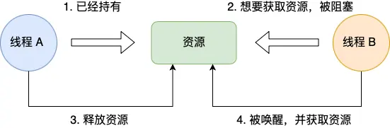
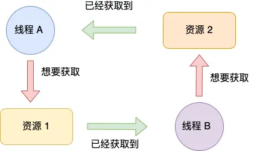

## Blog

### 算法

#### 详细任务

- 理论基础
- 递归遍历（必须掌握）
- 迭代遍历
- 统一迭代
- 层序遍历


#### 理论基础

需要了解 二叉树的种类，存储方式，遍历方式 以及二叉树的定义 

文章讲解：

https://programmercarl.com/%E4%BA%8C%E5%8F%89%E6%A0%91%E7%90%86%E8%AE%BA%E5%9F%BA%E7%A1%80.htm

##### 二叉树的种类

- 满二叉树

    满二叉树：如果一棵二叉树只有度为0的结点和度为2的结点，并且度为0的结点在同一层上，则这棵二叉树为满二叉树

    这棵二叉树为满二叉树，也可以说深度为k，有$2^{k-1}$个节点的二叉树

- 完全二叉树

    在完全二叉树中，除了最底层节点可能没填满外，其余每层节点数都达到最大值，并且最下面一层的节点都集中在该层最左边的若干位置。若最底层为第 h 层（h从1开始），则该层包含 $1 \sim 2^{h-1}$ 个节点。

    

- 二叉搜索树

    二叉搜索树是有数值的了，**二叉搜索树是一个有序树**

    - 若它的左子树不空，则左子树上所有结点的值均小于它的根结点的值；
    - 若它的右子树不空，则右子树上所有结点的值均大于它的根结点的值；
    - 它的左、右子树也分别为二叉排序树

- 平衡二叉搜索树

    平衡二叉搜索树：又被称为AVL（Adelson-Velsky and Landis）树，且具有以下性质：它是一棵空树或它的左右两个子树的高度差的绝对值不超过1，并且左右两个子树都是一棵平衡二叉树。

    **C++中map、set、multimap，multiset的底层实现都是平衡二叉搜索树**，或者说是红黑树

##### 二叉树的存储方式

**二叉树可以链式存储，也可以顺序存储。**

那么链式存储方式就用指针， 顺序存储的方式就是用数组。

顺序存储的元素在内存是连续分布的，而链式存储则是通过指针把分布在各个地址的节点串联一起


用数组来存储二叉树遍历：

- **如果父节点的数组下标是 i，那么它的左孩子就是 i \* 2 + 1，右孩子就是 i \* 2 + 2。**

##### 二叉树的遍历方式

二叉树主要有两种遍历方式：（**这两种遍历是图论中最基本的两种遍历方式**）

1. 深度优先遍历：先往深走，遇到叶子节点再往回走。

    - 前序遍历（递归法，迭代法）：中左右
    - 中序遍历（递归法，迭代法）：左中右
    - 后序遍历（递归法，迭代法）：左右中

    **这里前中后，其实指的就是中间节点的遍历顺序**

    

2. 广度优先遍历：一层一层的去遍历。

    - 层次遍历（迭代法）

经常会使用递归的方式来实现深度优先遍历，也就是实现前中后序遍历，使用递归是比较方便的。**栈其实就是递归的一种实现结构**，也就说前中后序遍历的逻辑其实都是可以借助栈使用递归的方式来实现的

广度优先遍历的实现一般使用队列来实现，这也是队列先进先出的特点所决定的，因为需要先进先出的结构，才能一层一层的来遍历二叉树

##### 二叉树的定义

```cpp
struct TreeNode {
    int val;
    TreeNode *left;
    TreeNode *right;
    TreeNode(int x) : val(x), left(NULL), right(NULL) {}
};
```


#### 递归遍历==**（必须掌握）**==

二叉树的三种递归遍历掌握其规律后，其实很简单 

题目链接/文章讲解/视频讲解：

https://programmercarl.com/%E4%BA%8C%E5%8F%89%E6%A0%91%E7%9A%84%E9%80%92%E5%BD%92%E9%81%8D%E5%8E%86.html

递归算法的三个要素：**每次写递归，都按照这三要素来写**

1. **确定递归函数的参数和返回值：** 确定哪些参数是递归的过程中需要处理的，那么就在递归函数里加上这个参数， 并且还要明确每次递归的返回值是什么进而确定递归函数的返回类型。
2. **确定终止条件：** 写完了递归算法, 运行的时候，经常会遇到栈溢出的错误，就是没写终止条件或者终止条件写的不对，操作系统也是用一个栈的结构来保存每一层递归的信息，如果递归没有终止，操作系统的内存栈必然就会溢出。
3. **确定单层递归的逻辑：** 确定每一层递归需要处理的信息。在这里也就会重复调用自己来实现递归的过程。

##### leetcode题

[144 二叉树的前序遍历]()

使用递归进行遍历，递归的参数就是二叉树的节点和用来记录前序的结果数组，==注意`vec`前面要加`&`==，不然每次递归的就不是同一个数组了，随着递归栈的返回，记录结果的数组会自动释放

递归的终止条件就是当节点为空的时候，就停止递归。

递归的逻辑，就是前序遍历的逻辑，将当前节点放入数组，然后先跳转到左子树节点，再跳转到右子树节点。

```cpp
class Solution {
public:
    void preOrder(TreeNode *root, vector<int> &vec) {
        if (root == nullptr) return ;
        vec.push_back(root->val);
        preOrder(root->left, vec);
        preOrder(root->right, vec);
    }
    vector<int> preorderTraversal(TreeNode* root) {
        vector<int> ret;
        preOrder(root, ret);
        return ret;
    }
};
```

[145 二叉树的后序遍历]()

递归的逻辑，就是后序遍历的逻辑，先跳转到左子树节点，再跳转到右子树节点，最后，再将当前节点放入数组。

```cpp
class Solution {
public:
    void postOrder(TreeNode *root, vector<int> &vec) {
        if (root == nullptr) return ;
        postOrder(root->left, vec);
        postOrder(root->right, vec);
        vec.push_back(root->val);
    }
    vector<int> postorderTraversal(TreeNode* root) {
        vector<int> ret;
        postOrder(root, ret);
        return ret;
    }
};
```

[94 二叉树的中序遍历]()

递归的逻辑，就是中序遍历的逻辑，先跳转到左子树节点，再将当前节点放入数组，最后，跳转到右子树节点。

```cpp
class Solution {
public:
    void inOrder(TreeNode *root, vector<int> &vec) {
        if (root == nullptr) return ;
        inOrder(root->left, vec);
        vec.push_back(root->val);
        inOrder(root->right, vec);
    }
    vector<int> inorderTraversal(TreeNode* root) {
        vector<int> ret;
        inOrder(root, ret);
        return ret;
    }
};
```

**递归的实现就是：每一次递归调用都会把函数的局部变量、参数值和返回地址等压入调用栈中**，然后递归返回的时候，从栈顶弹出上一次递归的各项参数，所以这就是递归为什么可以返回上一层位置的原因


#### 迭代遍历（基础不好的录友，迭代法可以放过）

题目链接/文章讲解/视频讲解：

https://programmercarl.com/%E4%BA%8C%E5%8F%89%E6%A0%91%E7%9A%84%E8%BF%AD%E4%BB%A3%E9%81%8D%E5%8E%86.html

##### 144 前序遍历

一开始没有思路，看了随想录的思路

使用迭代遍历，即非递归，通过自己来模拟栈，而不是像前面一样使用系统栈

先出栈当前节点，并放入结果数组中，表示已遍历；再将该节点的右孩子放入栈中（如果存在），再将其左孩子放入栈中（如果存在）；只要栈非空就继续遍历

之所以先将右孩子入栈，是因为栈FILO的特性，前序遍历先走左孩子，因此让左孩子先出栈。

```cpp
class Solution {
public:
    vector<int> preorderTraversal(TreeNode* root) {
        stack<TreeNode *> st;
        vector<int> vec;

        if (root) st.push(root);
        while (!st.empty()) {
            TreeNode *node = st.top();
            vec.push_back(node->val);
            st.pop();

            if (node->right) st.push(node->right);
            if (node->left) st.push(node->left);
        }
        return vec;
    }
};
```

##### 94 中序遍历

一开始没有思路，看了随想录的思路。前序遍历的代码，不能和中序遍历通用

**在使用迭代法写中序遍历，就需要借用指针的遍历来帮助访问节点，栈则用来处理节点上的元素**

本题的重点在与断链，每入栈一个节点的左孩子，就要断开与这个节点的连接，这样回到该节点时，不会陷入死循环

先深度优先，将每个节点的左孩子入栈，并断开链接，一直到叶子节点为止，然后出栈，加入结果集，此时栈顶元素就是该元素的父亲，而由于在入栈时父节点已经和左孩子断链了，因此不会再次将左孩子入栈，此时该父结点就是叶子节点了，执行同样操作，出栈，然后加入结果集，再将其右孩子入栈，（中序遍历，左中右），这样完成了一轮；此时栈顶为右孩子，执行同样的操作

```cpp
class Solution {
public:
    vector<int> inorderTraversal(TreeNode* root) {
        stack<TreeNode *> st;
        if(root) st.push(root);
        vector<int> vec;
        while(!st.empty()) {
            TreeNode *node;
            while (st.top()->left) {
                node = st.top();
                st.push(node->left);
                node->left = nullptr;
            }
            node = st.top();
            vec.push_back(node->val);
            st.pop();
            if (node->right)
                st.push(node->right);
        }
        return vec;
    }
};
// 解答成功:
//	执行耗时:0 ms,击败了100.00% 的C++用户
//	内存消耗:9.5 MB,击败了99.88% 的C++用户
```

看了随想录中的代码，比我的更加好，只用来一层循环就解决了

```cpp
class Solution {
public:
    vector<int> inorderTraversal(TreeNode* root) {
        stack<TreeNode *> st;
        vector<int> vec;
        TreeNode *node = root;
        while (node || !st.empty()) {
            if (node) {
                st.push(node);
                node = node->left;
            } else {
                node = st.top();
                vec.push_back(node->val);
                st.pop();
                node = node->right;
            }
        }
        return vec;
    }
};
// 解答成功:
//	执行耗时:0 ms,击败了100.00% 的C++用户
//	内存消耗:10 MB,击败了18.75% 的C++用户
```

##### 145 后序遍历

根据后序遍历的顺序 左右中，那么入栈的顺序就是中右左

在看了随想录的提示后，以为先序遍历的思路，但是需要调整一下顺序。没有写出来。

看了代码才知道，就是将先序遍历的结果集逆序！！！

```cpp
class Solution {
public:
    vector<int> postorderTraversal(TreeNode* root) {
        stack<TreeNode *> st;
        vector<int> vec;
        if (!root) return vec;
        st.push(root);
        while (!st.empty()) {
            TreeNode *node = st.top();
            st.pop();
            vec.push_back(node->val);
            if (node->left) st.push(node->left);
            if (node->right) st.push(node->right);
        }
        reverse(vec.begin(), vec.end());
        return vec;
    }
};
```

唯一需要注意的就是在入栈的时候，左右孩子的顺序和先序遍历相反，先让左孩子入栈


#### 统一迭代（基础不好的录友，迭代法可以放过）

这是统一迭代法的写法， 如果学有余力，可以掌握一下

题目链接/文章讲解：

https://programmercarl.com/%E4%BA%8C%E5%8F%89%E6%A0%91%E7%9A%84%E7%BB%9F%E4%B8%80%E8%BF%AD%E4%BB%A3%E6%B3%95.html

**迭代法实现的先中后序，其实风格也不是那么统一，除了先序和后序，有关联，中序完全就是另一个风格了，一会用栈遍历，一会又用指针来遍历**。**针对三种遍历方式，使用迭代法是可以写出统一风格的代码！**

使用栈的话，**无法同时解决访问节点（遍历节点）和处理节点（将元素放进结果集）不一致的情况**。**将访问的节点放入栈中，把要处理的节点也放入栈中但是要做标记**，即将**要处理的节点放入栈之后，紧接着放入一个空指针作为标记**

##### 94 中序遍历

看图做的


按照中序的逆序（右中左）依次将元素入栈，但是在左孩子入栈前，先放入一个`NULL`，表示即将要处理的节点，这个处理就是即将要弹出：如果该节点有右孩子，先弹出，放入右孩子，在入栈；否则出栈后，加入到结果集中。

**中序遍历的流程**：

1. 遇到一个节点时，先将右节点、根节点（延迟处理，标记`nullptr`）和左节点依次压栈。
2. 遇到 `nullptr` 时，弹出标记，将对应的根节点加入结果集。
3. 最后处理右子树。

```cpp
class Solution {
public:
    vector<int> inorderTraversal(TreeNode* root) {
        stack<TreeNode *> st;
        vector<int> vec;
        if (!root) return vec;
        st.push(root);
        while (!st.empty()) {
            TreeNode *node = st.top();
            if (node) {
                st.pop(); // 将该节点弹出，避免重复操作，下面再将右中左节点添加到栈中
                if (node->right) // 添加右节点（空节点不入栈）
                    st.push(node->right);
                st.push(node); // 添加中节点
                st.push(nullptr); // 中节点访问过，但是还没有处理，加入空节点做为标记。
                if (node->left) // 添加左节点（空节点不入栈）
                    st.push(node->left);
            } else {
                // 只有遇到空节点的时候，才将下一个节点放进结果集
                st.pop(); // 将空节点弹出
                node = st.top(); // 重新取出栈中元素
                vec.push_back(node->val); // 加入到结果集
                st.pop();
            }
        }
        return vec;
    }
};
```

- **访问顺序**：左子树 → 根节点 → 右子树

- 空指针插入位置：

    ```cpp
    st.push(node);       // 中节点先入栈（延迟处理）
    st.push(nullptr);    // 添加标记，表示中节点已被访问但未处理
    if (node->left) st.push(node->left); // 最后左子树
    ```

- 空指针的意义：

    - 标记一个节点已被访问但未处理。
    - 确保左子树的节点处理完毕后，回到此节点（即根节点）并将其加入结果集。

##### 144 前序遍历

- **访问顺序**：根节点 → 左子树 → 右子树

- 空指针插入位置：

    ```cpp
    st.push(node);       // 中节点先入栈（立即处理）
    st.push(nullptr);    // 添加标记，表示中节点已被访问但未处理
    if (node->left) st.push(node->left); // 然后左子树
    if (node->right) st.push(node->right); // 最后右子树
    ```

- 空指针的意义：

    - 标记一个节点已被访问但未处理。
    - 确保先处理当前节点（即根节点），然后按左、右子树的顺序处理其子节点。

**前序遍历的流程**：

1. 遇到一个节点时，直接将其加入结果集（延迟处理，标记`nullptr`）。
2. 依次压入右节点、左节点。
3. 遇到 `nullptr` 时，确保当前节点的子树已开始处理。

```cpp
class Solution {
public:
    vector<int> preorderTraversal(TreeNode* root) {
        stack<TreeNode *> st;
        vector<int> vec;
        if (!root) return vec;
        st.push(root);
        while (!st.empty()) {
            TreeNode *node = st.top();
            if (node) {
                st.pop();
                if (node->right) st.push(node->right);
                if (node->left) st.push(node->left);
                st.push(node); // 与中序相比，仅改变这2行
                st.push(nullptr);
            } else {
                st.pop();
                node = st.top();
                vec.push_back(node->val);
                st.pop();
            }
        }
        return vec;
    }
};
```

##### 145 后序遍历

- **访问顺序**：左子树 → 右子树 → 根节点

- 空指针插入位置：

    ```cpp
    st.push(nullptr);    // 添加标记，表示中节点已被访问但未处理
    if (node->right) st.push(node->right); // 然后右子树
    if (node->left) st.push(node->left); // 最后左子树
    ```

- 空指针的意义：

    - 标记一个节点已被访问但未处理。
    - 确保左、右子树的节点完全处理后，再将根节点加入结果集。

**后序遍历的流程**：

1. 遇到一个节点时，压入 `nullptr`，然后依次压入右节点和左节点。
2. 左、右子树处理完成后，遇到 `nullptr`，将当前节点加入结果集。

```cpp
class Solution {
public:
    vector<int> postorderTraversal(TreeNode* root) {
        stack<TreeNode *> st;
        vector<int> vec;
        if (!root) return vec;
        st.push(root);
        while (!st.empty()) {
            TreeNode *node = st.top();
            if (node) {
                st.push(nullptr); // 注意插入NULL的位置
                if (node->right) st.push(node->right);
                if (node->left) st.push(node->left);
            } else {
                st.pop();
                node = st.top();
                vec.push_back(node->val);
                st.pop();
            }
        }
        return vec;
    }
};
```


#### 层序遍历

看完本篇可以一口气刷十道题，试一试， 层序遍历并不难，大家可以很快刷了十道题。

题目链接/文章讲解/视频讲解：

https://programmercarl.com/0102.%E4%BA%8C%E5%8F%89%E6%A0%91%E7%9A%84%E5%B1%82%E5%BA%8F%E9%81%8D%E5%8E%86.html

层序遍历一个二叉树。就是从左到右一层一层的去遍历二叉树。

需要借用一个辅助数据结构即队列来实现，**队列先进先出，符合一层一层遍历的逻辑，而用栈先进后出适合模拟深度优先遍历也就是递归的逻辑。**

**而这种层序遍历方式就是图论中的广度优先遍历，只不过我们应用在二叉树上。**


##### 102 二叉树的层序遍历

可能是以前做过不要求返回层次的，没有想到使用双重循环。

用队列中是否有元素来控制外层循环，用该层中节点的个数来控制内循环，当该层的节点都出队后，此时队列的长度就是下一层节点的个数。

每出队一个元素，都要把它的左右孩子进行入队。

```cpp
class Solution {
public:
    vector<vector<int>> levelOrder(TreeNode* root) {
        queue<TreeNode *> que;
        vector<vector<int>> ret;
        if (!root) return ret;
        que.push(root);
        int count = 1;
        while (!que.empty()) {
            vector<int> vec;
            while (count) {
                TreeNode *node = que.front();
                que.pop();
                count--;
                vec.push_back(node->val);
                if (node->left) que.push(node->left);
                if (node->right) que.push(node->right);
            }
            ret.push_back(vec);
            count = que.size();
        }
        return ret;
    }
};
```

递归的思路：

1. 递归函数：
    - 传入当前节点和当前层次（`level`）。
    - 如果当前节点为 `nullptr`，直接返回。
    - 如果 `result` 中还没有对应 `level` 的子数组，则创建一个。
    - 将当前节点的值加入对应层次的子数组。
    - 对当前节点的左右子节点分别递归，层次值加1。
2. **终止条件**：节点为 `nullptr`。

```cpp
class Solution {
public:
    void level(TreeNode *node, int depth, vector<vector<int>> &vec) {
        if (!node) return ; // 终止条件：节点为空

        if (vec.size() <= depth) // 如果当前层级的容器还不存在，则创建
            vec.push_back(vector<int>());

        vec[depth].push_back(node->val);// 将当前节点加入对应层次的结果中
		
        // 递归处理左子树和右子树
        level(node->left, depth + 1, vec);
        level(node->right, depth + 1, vec);
    }
    vector<vector<int>> levelOrder(TreeNode* root) {
        vector<vector<int>> ret;
        level(root, 0, ret);// 从根节点开始递归，初始层次为0
        return ret;
    }
};
```

其他的层次遍历的题目等二刷的时候再开始做。


### 八股文

#### 什么是死锁，如何预防死锁？

掌握程度：

- 理解死锁的危害，能够清晰地描述死锁的定义和四个必要条件。
- 知道并能够解释常见的死锁预防策略。
- 能够讨论死锁检测和恢复的机制。
- 结合案例和并发编程讨论死锁的预防和处理。

参考资料：

[【面试问答：什么是死锁？，如何预防死锁】]()

https://www.bilibili.com/video/BV1Gv411u7u5/?share_source=copy_web&vd_source=9bb0aa9c2c3cc1b12ca6f343a55b4e80

[小林coding: 如何避免死锁]()

https://xiaolincoding.com/os/4_process/deadlock.html#死锁的概念


##### 死锁

死锁（Deadlock）是一种在**多线程或多进程系统**中发生的现象，指两个或多个线程（或进程）因争夺资源而相互等待，导致它们都无法继续执行的状态。

死锁只有==**同时满足**==以下四个条件才会发生：

- 互斥条件
- 持有并等待条件
- 不可剥夺条件
- 环路等待条件

**互斥（Mutual Exclusion）**

- 资源在同一时间只能被一个线程（或进程）占用。例如，打印机或文件被独占。

    

**占有并等待（Hold and Wait）**

- 一个线程已占有至少一个资源，并且在等待额外资源时不释放其已占有的资源。

    

**不可剥夺（No preemtion）**

- 已分配给线程的资源在其使用完之前，不能被强制剥夺，只能由线程自行释放。

    即，当线程已经持有了资源 ，**在自己使用完之前不能被其他线程获取**，线程 B 如果也想使用此资源，则只能在线程 A 使用完并释放后才能获取。

    

**循环等待（Circuit Wait）**

- 存在一个线程集合，每个线程都在等待下一个线程占有的资源，形成一个循环。例如，线程A等待线程B的资源，线程B又等待线程A的资源。

    

> 死锁代码例子是 C/C++ 写的，在 Linux 下，可以使用 `pstack` + `gdb` 工具来定位死锁问题
>
> pstack 命令可以显示每个线程的栈跟踪信息（函数调用过程），它的使用方式也很简单，只需要 `pstack <pid>` 就可以了。
>
> 在定位死锁问题时，可以多次执行 pstack 命令查看线程的函数调用过程，多次对比结果，确认哪几个线程一直没有变化，且是因为在等待锁，那么大概率是由于死锁问题导致的
>

##### 预防死锁

1. **破坏“循环等待”条件**
    规定资源获取的顺序，例如线程必须先申请资源A，再申请资源B，避免环形等待。
2. **破坏“占有并等待”条件**
    要求线程在申请资源时，必须一次性获取所有需要的资源，若不能满足，则不占有任何资源。
3. **破坏“不可剥夺”条件**
    允许抢占资源。即当一个线程需要资源时，可以强制让另一个线程释放它已占有的资源。
4. **死锁检测与恢复**
    - 定期检测死锁状态。
    - 发生死锁时，终止或回滚某些线程的操作来解除死锁。
5. **超时机制**
    设置线程获取资源的最大等待时间，如果超时未获得资源，则释放已占有的资源并重试。

最常见的并且可行的就是**使用资源有序分配法，来破环环路等待条件**。

即，线程 A 和 线程 B 获取资源的顺序要一样，当线程 A 是先尝试获取资源 A，然后尝试获取资源 B 的时候，线程 B 同样也是先尝试获取资源 A，然后尝试获取资源 B。也就是说，线程 A 和 线程 B 总是以相同的顺序申请自己想要的资源。


#### 介绍一下几种类型的锁

掌握程度：

- 够清晰地描述每种锁的基本概念和用途。
- 理解不同锁机制的适用场景和优缺点。
- 知道如何根据实际需求选择合适的锁机制。
- 了解不同锁机制对性能的影响，并能够讨论如何优化锁的使用。
- 结合并发编程讨论锁的应用。

参考资料：

[小林coding: 什么是悲观锁，乐观锁]()

https://xiaolincoding.com/os/4_process/pessim_and_optimi_lock.html#互斥锁与自旋锁


常见的锁有：互斥锁、自旋锁、读写锁、悲观锁、乐观锁。

多线程访问共享资源的时候，避免不了资源竞争而导致数据错乱的问题，所以我们通常为了解决这一问题，都会在访问共享资源之前加锁。

##### 互斥锁与自旋锁

最底层的两种就是「互斥锁和自旋锁」，有很多高级的锁都是基于它们实现的。其中，最常用的就是互斥锁。

###### 互斥锁

<u>==**互斥锁**==是一种「独占锁」，保证资源**独占访问**，任何时刻只有一个线程可以获得锁。线程如果尝试加锁但锁已被其他线程持有，则会进入**阻塞状态**，直到锁被释放。</u>

比如当线程 A 加锁成功后，此时互斥锁已经被线程 A 独占了，只要线程 A 没有释放手中的锁，线程 B 加锁就会失败，于是就会释放 CPU 让给其他线程，**既然线程 B 释放掉了 CPU，自然线程 B 加锁的代码就会被阻塞**。

**对于互斥锁加锁失败而阻塞的现象，是由操作系统内核实现的**。当加锁失败时，内核会将线程置为「睡眠」状态，等到锁被释放后，内核会在合适的时机唤醒线程，当这个线程成功获取到锁后，于是就可以继续执行。

互斥锁加锁失败时，会从用户态陷入到内核态，让内核帮我们切换线程，虽然简化了使用锁的难度，但是存在一定的性能开销成本，即，会有**两次线程上下文切换的成本**：

- 当线程加锁失败时，内核会把线程的状态从「运行」状态设置为「睡眠」状态，然后把 CPU 切换给其他线程运行；
- 接着，当锁被释放时，之前「睡眠」状态的线程会变为「就绪」状态，然后内核会在合适的时间，把 CPU 切换给该线程运行。

> 线程的上下文切换：
>
> 当两个线程是属于同一个进程，**因为虚拟内存是共享的，所以在切换时，虚拟内存这些资源就保持不动，只需要切换线程的私有数据、寄存器等不共享的数据**

**如果能确定被锁住的代码执行时间很短，就不应该用互斥锁，而应该选用自旋锁，否则使用互斥锁。**所以，在如下场景中可以使用互斥锁：保护共享资源的访问，例如文件读写、数据结构修改

###### 自旋锁

<u>==**自旋锁**==和互斥锁类似，但当一个线程无法获取锁时，它**不会进入阻塞状态**，而是不断轮询检查锁的状态。消耗 CPU 时间来等待锁释放。即，它是通过 CPU 提供的 `CAS` 函数（*Compare And Swap*），在「用户态」完成加锁和解锁操作，不会主动产生线程上下文切换，所以相比互斥锁来说，会快一些，开销也小一些。</u>

`CAS` 函数就把【检查锁的状态】以及【若锁空闲则设置为当前线程持有】这两个步骤合并成一条硬件级指令，形成**原子指令**，这样就保证了这两个步骤是不可分割的，要么一次性执行完两个步骤，要么两个步骤都不执行。

使用自旋锁的时候，当发生多线程竞争锁的情况，加锁失败的线程会「忙等待」，直到它拿到锁。这里的「忙等待」可以用 `while` 循环等待实现，不过最好是使用 CPU 提供的 `PAUSE` 指令来实现「忙等待」，因为可以减少循环等待时的耗电量。

自旋锁开销少，在多核系统下一般不会主动产生线程切换，适合异步、协程等在用户态切换请求的编程方式，但如果被锁住的代码执行时间过长，自旋的线程会长时间占用 CPU 资源，所以自旋的时间和被锁住的代码执行的时间是成「正比」的关系

自旋锁与互斥锁使用层面比较相似，但实现层面上完全不同：**当加锁失败时，互斥锁用「线程切换」来应对，自旋锁则用「忙等待」来应对**。

它的适用场景为：短时间临界区，比如在多核处理器的低延迟同步中。

##### 读写锁

<u>==**读写锁**==由「读锁」和「写锁」两部分构成，如果只读取共享资源用「读锁」加锁，如果要修改共享资源则用「写锁」加锁。因此，它允许多个线程同时读取（读操作之间不会冲突），但只允许一个线程写入，且写操作和读操作互斥。提高了读多写少场景下的并发性能。</u>

读写锁的工作原理是：

- 当「写锁」没有被线程持有时，多个线程能够并发地持有读锁，这大大提高了共享资源的访问效率，因为「读锁」是用于读取共享资源的场景，所以多个线程同时持有读锁也不会破坏共享资源的数据。
- 但是，一旦「写锁」被线程持有后，读线程的获取读锁的操作会被阻塞，而且其他写线程的获取写锁的操作也会被阻塞。

写锁是独占锁，因为任何时刻只能有一个线程持有写锁，类似互斥锁和自旋锁，而读锁是共享锁，因为读锁可以被多个线程同时持有。

> 共享锁：允许多个线程或事务同时访问资源（通常是只读操作），但阻止任何线程或事务对该资源进行写操作

根据实现的不同，读写锁可以分为「读优先锁」和「写优先锁」

- 读优先锁：

    读优先锁期望的是，读锁能被更多的线程持有，以便提高读线程的并发性

    工作方式：当读线程 A 先持有了读锁，写线程 B 在获取写锁的时候，会被阻塞，并且在阻塞过程中，后续来的读线程 C 仍然可以成功获取读锁，最后直到读线程 A 和 C 释放读锁后，写线程 B 才可以成功获取写锁

    缺点：如果一直有读线程获取读锁，那么写线程将永远获取不到写锁，这就造成了写线程「饥饿」的现象

- 写优先锁：优先服务写线程

    工作方式：当读线程 A 先持有了读锁，写线程 B 在获取写锁的时候，会被阻塞，并且在阻塞过程中，后续来的读线程 C 获取读锁时会失败，于是读线程 C 将被阻塞在获取读锁的操作，这样只要读线程 A 释放读锁后，写线程 B 就可以成功获取写锁

    缺点：写优先锁可以保证写线程不会饿死，但是如果一直有写线程获取写锁，读线程也会被「饿死」

**公平读写锁比较简单的一种方式是：用队列把获取锁的线程排队，不管是写线程还是读线程都按照先进先出的原则加锁即可，这样读线程仍然可以并发，也不会出现「饥饿」的现象。**

应用场景：**读写锁适用于能明确区分读操作和写操作的场景**。并且**在读多写少的场景，能发挥出优势**，例如数据库读操作、缓存数据更新等。互斥锁和自旋锁都是最基本的锁，读写锁可以根据场景来选择这两种锁其中的一个进行实现

##### 乐观锁与悲观锁

互斥锁、自旋锁、读写锁，都是属于悲观锁

###### 悲观锁

悲观锁认为**多线程同时修改共享资源的概率比较高，于是很容易出现冲突，所以访问共享资源前，先要上锁**。它的实现方式通常依赖于数据库或系统的锁机制。

悲观锁的工作流程：

1. **加锁**：当一个线程准备访问共享资源时，立即获取锁（如互斥锁或数据库的排他锁）。此时，其他线程若尝试访问该资源，将被阻塞，直到锁被释放。
2. **执行操作**：持有锁的线程可以安全地对资源进行操作（读取、写入等）。
3. **释放锁**：操作完成后，线程释放锁，允许其他线程访问资源。

悲观锁通过加锁保证资源的独占访问，严格防止冲突发生；当资源被其他线程占用时，尝试访问的线程会被阻塞，直到锁被释放，严格保证数据一致性。但是，其开销较大，会降低并发性能；同时，如果多个线程在获取锁时出现循环等待的情况，可能导致死锁。

应用场景：数据库事务，尤其是需要严格一致性保障的场景；文件系统中的文件锁。

###### 乐观锁

乐观锁假设线程对共享资源的访问冲突概率较低，不会加锁，而是在操作完成后通过**版本号**或**CAS（Compare-And-Swap）**机制检查是否有冲突。如果冲突，重试或回滚操作。

乐观锁做事比较乐观，它假定冲突的概率很低，它的工作方式是：**先修改完共享资源，再验证这段时间内有没有发生冲突，如果没有其他线程在修改资源，那么操作完成，如果发现有其他线程已经修改过这个资源，就放弃本次操作**。

**乐观锁全程并没有加锁，所以它也叫无锁编程**。

> 腾讯文档这种实现多人同时编辑，实际上是用了乐观锁，它允许多个用户打开同一个文档进行编辑，编辑完提交之后才验证修改的内容是否有冲突。
>
> 服务端验证冲突的方案：
>
> - 由于发生冲突的概率比较低，所以先让用户编辑文档，但是浏览器在下载文档时会记录下服务端返回的文档版本号；
> - 当用户提交修改时，发给服务端的请求会带上原始文档版本号，服务器收到后将它与当前版本号进行比较，如果版本号不一致则提交失败，如果版本号一致则修改成功，然后服务端版本号更新到最新的版本号。
>
> SVN 和 Git 也是用了乐观锁的思想，先让用户编辑代码，然后提交的时候，通过版本号来判断是否产生了冲突，发生了冲突的地方，需要我们自己修改后，再重新提交

乐观锁虽然去除了加锁解锁的操作，但是一旦发生冲突，重试的成本非常高，所以**只有在冲突概率非常低，且加锁成本非常高的场景时，才考虑使用乐观锁**

##### 总结

| **锁类型** | **适用场景**           | **优点**           | **缺点**               |
| ---------- | ---------------------- | ------------------ | ---------------------- |
| **互斥锁** | 严格互斥保护资源       | 简单易用           | 阻塞线程，可能导致死锁 |
| **自旋锁** | 短时间临界区           | 低延迟，不切换线程 | 消耗 CPU 时间          |
| **读写锁** | 读多写少场景           | 提高并发性能       | 写线程可能饥饿         |
| **悲观锁** | 高冲突场景，保证一致性 | 数据安全           | 并发性能低             |
| **乐观锁** | 低冲突高并发场景       | 高效，适合读多写少 | 冲突频繁时，重试开销大 |


#### 讲一讲你理解的虚拟内存

掌握程度：

- 能够清晰地描述虚拟内存的定义和工作原理。
- 理解虚拟内存如何通过页置换算法来管理内存。
- 知道虚拟内存的优点和可能带来的性能问题。

参考资料：

[【操作系统】内存管理——虚拟内存】]()

https://www.bilibili.com/video/BV18v411a7Vk/?share_source=copy_web&vd_source=9bb0aa9c2c3cc1b12ca6f343a55b4e80

[小林coding: 虚拟内存]()

https://xiaolincoding.com/os/3_memory/vmem.html#虚拟内存


**操作系统会提供一种机制，将不同进程的虚拟地址和不同内存的物理地址映射起来。**如果程序要访问虚拟地址的时候，由操作系统转换成不同的物理地址，这样不同的进程运行的时候，写入的是不同的物理地址

> 程序所使用的内存地址叫做**虚拟内存地址**（*Virtual Memory Address*）
>
> 实际存在硬件里面的空间地址叫**物理内存地址**（*Physical Memory Address*）

进程持有的虚拟地址会通过 CPU 芯片中的内存管理单元（MMU）的映射关系，来转换变成物理地址，然后再通过物理地址访问内存

##### 操作系统是如何管理虚拟地址与物理地址之间的关系？

主要有两种方式，分别是**内存分段和内存分页**

###### 内存分段

程序是由若干个逻辑分段组成的，如可由代码分段、数据分段、栈段、堆段组成。**不同的段是有不同的属性的，所以就用分段（Segmentation）的形式把这些段分离出来**


分段机制下的虚拟地址由两部分组成，**段选择因子**和**段内偏移量**

- **段选择因子**就保存在段寄存器里面。段选择因子里面最重要的是**段号**，用作段表的索引。**段表**里面保存的是这个**段的基地址、段的界限和特权等级**等。
- 虚拟地址中的**段内偏移量**应该位于 0 和段界限之间，如果段内偏移量是合法的，就将段基地址加上段内偏移量得到物理内存地址。

虚拟地址是通过**段表**与物理地址进行映射的，分段机制会把程序的虚拟地址分成 4 个段，每个段在段表中有一个项，在这一项找到段的基地址，再加上偏移量，于是就能找到物理内存中的地址

不足之处：

- 第一个就是**内存碎片**的问题。

    内存碎片主要是外部内存碎片。由于每个段的长度不固定，所以多个段未必能恰好使用所有的内存空间，会产生了多个不连续的小物理内存，导致新的程序无法被装载，所以**会出现外部内存碎片**的问题

- 第二个就是**内存交换的效率低**的问题。

    对于多进程的系统来说，用分段的方式，外部内存碎片是很容易产生的，产生了外部内存碎片，那不得不重新 `Swap` 内存区域，这个过程会产生性能瓶颈

    **如果内存交换的时候，交换的是一个占内存空间很大的程序，这样整个机器都会显得卡顿**

###### 内存分页

**内存分页（Paging）是把整个虚拟和物理内存空间切成一段段固定尺寸的大小**。这样一个连续并且尺寸固定的内存空间，我们叫**页**（*Page*）。在 Linux 下，每一页的大小为 `4KB`。


虚拟地址与物理地址之间通过**页表**来映射。页表是存储在内存里的，**内存管理单元** （*MMU*）用做将虚拟内存地址转换成物理地址的工作

当进程访问的虚拟地址在页表中查不到时，系统会产生一个**缺页异常**，进入系统内核空间分配物理内存、更新进程页表，最后再返回用户空间，恢复进程的运行。

内存分页由于内存空间都是预先划分好的，也就不会像内存分段一样，在段与段之间会产生间隙非常小的内存，这正是分段会产生外部内存碎片的原因。而**采用了分页，页与页之间是紧密排列的，所以不会有外部碎片。**

因为内存分页机制分配内存的最小单位是一页，即使程序不足一页大小，最少只能分配一个页，所以页内会出现内存浪费，所以针对**内存分页机制会有内部内存碎片**的现象

如果内存空间不够，操作系统会把其他正在运行的进程中的「最近没被使用」的内存页面给释放掉，也就是暂时写在硬盘上，称为**换出**（*Swap Out*）。一旦需要的时候，再加载进来，称为**换入**（*Swap In*）。所以，一次性写入磁盘的也只有少数的一个页或者几个页，不会花太多时间，**内存交换的效率就相对比较高。**

在分页机制下，虚拟地址分为两部分，**页号**和**页内偏移**。页号作为页表的索引，**页表**包含物理页每页所在**物理内存的基地址**，这个基地址与页内偏移的组合就形成了物理内存地址


对于一个内存地址转换，其实就是这样三个步骤：

- 把虚拟内存地址，切分成页号和偏移量；
- 根据页号，从页表里面，查询对应的物理页号；
- 直接拿物理页号，加上前面的偏移量，就得到了物理内存地址

###### 段页式内存管理

内存分段和内存分页并不是对立的，它们是可以组合起来在同一个系统中使用的，那么组合起来后，通常称为**段页式内存管理**。

段页式内存管理实现的方式：

- 先将程序划分为多个有逻辑意义的段，也就是前面提到的分段机制；
- 接着再把每个段划分为多个页，也就是对分段划分出来的连续空间，再划分固定大小的页；

这样，地址结构就由**段号、段内页号和页内位移**三部分组成。

用于段页式地址变换的数据结构是每一个程序一张段表，每个段又建立一张页表，段表中的地址是页表的起始地址，而页表中的地址则为某页的物理页号，如图所示：


段页式地址变换中要得到物理地址须经过三次内存访问：

- 第一次访问段表，得到页表起始地址；
- 第二次访问页表，得到物理页号；
- 第三次将物理页号与页内位移组合，得到物理地址。


### 总结

虽然一开始都不会做，但是经过carl哥梳理了一遍知识点后，又有点回忆起来了二叉树的遍历。

前中后序的迭代遍历，以及层序遍历，顺便复习了栈和队列的知识点

统一的迭代遍历现在掌握的还是不是很好，对于在哪里插入`null`，不是很清楚

| 遍历方式 | 节点入栈顺序（从右往左入栈）       | `nullptr` 插入位置                     |
| -------- | ---------------------------------- | -------------------------------------- |
| **前序** | 根 → 右子树 → 左子树               | 根节点入栈后立即插入 `nullptr`         |
| **中序** | 右子树 → 根 → 左子树               | 根节点入栈后，左子树之前插入 `nullptr` |
| **后序** | 根 → 右子树 → 左子树（延迟处理根） | 左右子树之后插入 `nullptr`             |
