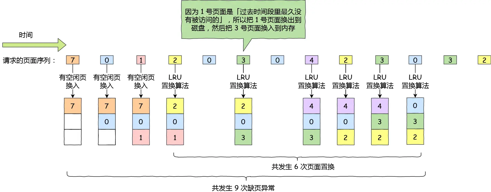

## Blog

### 算法

#### 详细任务

- 226 翻转二叉树
- 101 对称二叉树
- 104 二叉树的最大深度
- 111 二叉树的最小深度


#### 226 翻转二叉树

这道题目 一些做过的同学 理解的也不够深入，建议大家先看我的视频讲解，无论做过没做过，都会有很大收获。

题目链接/文章讲解/视频讲解：

https://programmercarl.com/0226.%E7%BF%BB%E8%BD%AC%E4%BA%8C%E5%8F%89%E6%A0%91.html

根据提示，先看了随想录的视频

使用前序或后序会比较方便。在听了讲解后，本题还是比较简单的，特别是使用递归的情况下。

使用==前序==遍历的思路，首先交换根结点的左右子树，这样，第二层已经实现的翻转，但是第3层从整体上是翻转的，但每个子树的左右孩子并没有翻转，因此，通过递归的方式，让子树的子树也进行翻转，有点类似于之前负负得正的那个思路

```cpp
class Solution {
public:
    TreeNode* invertTree(TreeNode* root) {
        if (!root) return nullptr;
        swap(root->left, root->right);
        root->left = invertTree(root->left);
        root->right = invertTree(root->right);
        return root;
    }
};
```

如果使用中序的话，会有坑，递归始终走左子树，或者右子数，始终！

非递归的思路：使用自己创建的栈来实现

```cpp
class Solution {
public:
    TreeNode* invertTree(TreeNode* root) {
        if (!root) return nullptr;
        stack<TreeNode *> st;
        st.push(root);
        while (!st.empty()) {
            TreeNode *node = st.top();
            if (node) {
                st.pop();
                if (node->right) st.push(node->right);// 压入右子节点
                if (node->left) st.push(node->left);// 压入左子节点
                st.push(node);// 当前节点再次入栈
                st.push(nullptr);// 标记当前节点已访问但未翻转
            } else {
                st.pop();
                node = st.top(); // 取出标记前的节点
                st.pop();
                swap(node->left, node->right);// 翻转左右子节点
            }
        }
        return root;
    }
};
```


#### 101 对称二叉树

先看视频讲解，会更容易一些。 

题目链接/文章讲解/视频讲解：

https://programmercarl.com/0101.%E5%AF%B9%E7%A7%B0%E4%BA%8C%E5%8F%89%E6%A0%91.html

直接看的视频，要判断是否对称，就需要不断比较树中轴两侧对应的节点。

自然地想到使用递归的思路。那么，就需要确定递归的三要素：

1. 确定递归函数的参数和返回值：参数即为需要比较的两个节点，而返回值就是布尔类型

2. 确定终止条件：

    - 如果这两个节点都为空，那么上面一层就是对称的，因此是true
    - 如果这两个节点有1个为空，那么肯定不是对称的了，`false`
    - 如果这两个节点都非空，则比较这两个节点的值，若不相等，则说明不对称

3. 确定单层递归的逻辑：

    也就是两个节点都非空，并且这两个节点相等的情况

    那么就需要再看下一层了，需要比较的就是左节点的左孩子和右节点的右孩子，是否符合递归的终止条件，如果不符合则继续递归下去；否则通过这两个孩子节点能够判断这一层是否对称，如果内层和外层都对称，那么这一层也对称

```cpp
class Solution {
public:
    bool compare(TreeNode *left, TreeNode *right) {
        // 首先排除空节点的情况
        if (left && !right) return false;
        if (!left && right) return false;
        if (!left && !right) return true;
        // 排除了空节点，再排除数值不相同的情况
        if (left->val != right->val) return false;

        // 此时就是：左右节点都不为空，且数值相同的情况
        // 此时才做递归，做下一层的判断
        bool outside = compare(left->left, right->right); // 左子树：左、 右子树：右
        bool inside = compare(left->right, right->left); // 左子树：右、 右子树：左
        bool mid = outside && inside; // 左子树：中、 右子树：中 （逻辑处理）
        return mid;
    }
    bool isSymmetric(TreeNode* root) {
        if (!root) return true;
        return compare(root->left, root->right);
    }
};
```

迭代法：

本题的本质是判断两个树是否是相互翻转的，其实已经不是所谓二叉树遍历的前中后序的关系了

这里我们可以使用队列来比较两个树（根节点的左右子树）是否相互翻转，（**注意这不是层序遍历**）

```cpp
class Solution {
public:
    bool isSymmetric(TreeNode* root) {
        if (!root) return true;
        queue<TreeNode *> que;
        que.push(root->left); // 将左子树头结点加入队列
        que.push(root->right); // 将右子树头结点加入队列

        while (!que.empty()) {
            TreeNode *left = que.front();
            que.pop();
            TreeNode *right = que.front();
            que.pop();
            if (!left && right) return false;
            if (left && !right) return false;
            if (!left && !right) continue; // 左节点为空、右节点为空，此时说明是对称的
            if (left->val != right->val) return false;

            que.push(left->left);
            que.push(right->right);
            que.push(left->right);
            que.push(right->left);
        }
        return true;
    }
};
```


#### 104 二叉树的最大深度（优先掌握递归）

什么是深度，什么是高度，如何求深度，如何求高度，这里有关系到二叉树的遍历方式。

大家 要先看视频讲解，就知道以上我说的内容了，很多录友刷过这道题，但理解的还不够。

题目链接/文章讲解/视频讲解： 

https://programmercarl.com/0104.%E4%BA%8C%E5%8F%89%E6%A0%91%E7%9A%84%E6%9C%80%E5%A4%A7%E6%B7%B1%E5%BA%A6.html

**深度：**二叉树中任意一个节点到根节点的距离。求深度用前序遍历

**高度**：二叉树中任意一个节点到叶子节点的距离。求高度用后序遍历

最大深度也就是根节点的高度

看完随想录的视频，很自然的想到使用递归的思路来解决本题，要获取当前节点的高度就是要获取该节点的左右孩子的高度，那么当前节点的高度就是孩子高度中最大的那个再`+1`

1. 确定递归函数的参数和返回值：参数就是当前节点，而返回值就是当前节点的高度

2. 确定终止条件：

    如果当前节点为`null`，则返回0

3. 确定单层递归的逻辑：

    获取左右孩子中更高的那个，再`+1`

从代码的角度来看，它使用的是==后序遍历==

```cpp
class Solution {
public:
    int getHeight(TreeNode *node) {
        if (!node) return 0;
        int left = getHeight(node->left);
        int right = getHeight(node->right);
        return max(left, right) + 1;
    }
    int maxDepth(TreeNode* root) {
        return getHeight(root);
    }
};
```

迭代法：

使用迭代法思考时，可以发现本题就是层序遍历那题的变种，那题在层序遍历的时候就分过元素的层级，这里只是要求返回有几层

```cpp
class Solution {
public:
    int maxDepth(TreeNode* root) {  
        if (!root) return 0;
        queue<TreeNode *>que;
        que.push(root);
        int depth = 0;
        while (!que.empty()) {
            int count = que.size();
            while (count) {
                TreeNode *node = que.front();
                que.pop();
                count--;
                if (node->left) que.push(node->left);
                if (node->right) que.push(node->right);
            }
            depth++;
        }
        return depth;
    }
};
```


#### 111 二叉树的最小深度

先看视频讲解，和最大深度 看似差不多，其实 差距还挺大，有坑。

题目链接/文章讲解/视频讲解：

https://programmercarl.com/0111.%E4%BA%8C%E5%8F%89%E6%A0%91%E7%9A%84%E6%9C%80%E5%B0%8F%E6%B7%B1%E5%BA%A6.html

**最小深度**：根节点到叶子节点的最小距离就是最小深度

看了随想录的视频后开始做的。主要思路和上面一样，都是使用递归的思路，找两个孩子中高度小的那个，再`+1`作为当前节点的最小高度

但是**注意**，大体思路虽然和上一题比较相似，但是有一个比较大的坑！如果按照上面一题的思路走，会把根节点只有一个孩子的情况变成最小深度为1，即认为根不存在的孩子也是一个叶子节点

从代码的角度来看，它使用的是==后序遍历==

```cpp
class Solution {
public:
    int getHeight(TreeNode *node) {
        if (!node) return 0;
        int left = getHeight(node->left);
        int right = getHeight(node->right);
        // 当一个右子树为空，左不为空，这时并不是最低点
        if (node->left && !node->right)
            return 1 + left;
        // 当一个左子树为空，右不为空，这时并不是最低点
        if (!node->left && node->right)
            return 1 + right;
        return 1 + min(left, right);
    }
    int minDepth(TreeNode* root) {
        return getHeight(root);
    }
};
```

迭代法：大致思路和上一题以及标准的层序遍历是一样的。但是需要注意的是，碰到叶子节点就可以直接返回了不用等队空或者是该层的剩余节点都出队，因为根到最早碰到的叶子节点，那就是最小深度了

```cpp
class Solution {
public:
    int minDepth(TreeNode* root) {
        if (!root) return 0;
        queue<TreeNode *> que;
        que.push(root);
        int height = 0;
        while (!que.empty()) {
            int count = que.size();
            height++;
            while (count) {
                TreeNode *node = que.front();
                que.pop();
                count--;
                if (node->left) que.push(node->left);
                if (node->right) que.push(node->right);

                if (!node->left && !node->right)
                    return height;
            }
        }
        return height;
    }
};
```


### 八股文

#### 你知道的线程同步的方式有哪些

掌握程度：

- 清晰地描述每种线程同步机制的基本概念和用途。
    - 互斥锁
    - 自旋锁
    - 读写锁
    - 条件变量
    - 信号量

- 理解不同同步机制的适用场景和优缺点。
- 知道如何根据实际需求选择合适的线程同步机制。

参考资料：

[【多线程编程：一次性搞懂线程同步机制】]()

https://www.bilibili.com/video/BV1oQ4y1C73G/?share_source=copy_web&vd_source=9bb0aa9c2c3cc1b12ca6f343a55b4e80

[【『面试问答』：线程间同步方式有哪些？】 ]()

https://www.bilibili.com/video/BV19m4y1N7VK/?share_source=copy_web

##### 互斥锁（Mutex, Mutual Exclusion Lock）

- 基本概念：互斥锁是一种简单的线程同步机制，它用于保护共享资源。在同一时刻，只有一个线程能够获取互斥锁并访问被保护的资源，其他线程必须等待锁被释放才能获取锁并访问资源。

- 用途：主要用于防止多个线程同时访问和修改共享数据，确保数据的一致性和完整性。例如，在多个线程对一个全局变量进行读写操作时，使用互斥锁可以避免数据竞争。

- 优点：
    - 简单易懂，容易实现和使用。
    - 能够有效地保护共享资源，避免数据竞争。
- 缺点：
    - 如果锁的使用不当，可能会导致死锁。例如，线程 A 获取了锁 1，等待锁 2，而线程 B 获取了锁 2，等待锁 1，就会造成死锁。
    - 过多地使用互斥锁可能会导致性能下降。因为线程在获取不到锁时会被阻塞，增加了线程的等待时间。
- 适用场景：
    - 当多个线程需要对共享资源进行独占访问，且访问时间相对较长（例如涉及到大量的计算、磁盘 I/O 等操作）时，互斥锁是一个合适的选择。例如，多个线程同时访问一个全局的链表结构进行插入、删除操作，每次只能有一个线程进行操作，以保证链表数据的一致性。
    - 用于保护临界区代码，确保在同一时刻只有一个线程能执行临界区内的代码。比如在一个多线程的文件写入程序中，多个线程可能都要向同一个文件写入数据，使用互斥锁可以保证每次只有一个线程能执行写入操作，避免数据混乱。

##### 自旋锁（Spinlock）

- 基本概念：自旋锁是一种忙等待的同步机制。当一个线程尝试获取自旋锁时，如果锁已经被其他线程占用，那么这个线程不会进入阻塞状态，而是会在一个循环中不断地检查锁是否可用，这个循环就像是线程在 “自旋”。
- 用途：适用于锁被占用的时间非常短的情况。因为在这种情况下，线程进入阻塞状态和唤醒的开销可能比自旋等待更大。例如，在多处理器系统中，对一个简单的共享数据结构进行短暂的修改操作，使用自旋锁可以快速地获取锁并完成操作，避免了线程切换的开销。
- 优点：
    - **低延迟**：在锁的占用时间极短的情况下，自旋锁可以提供比其他阻塞式同步机制（如互斥锁）更低的延迟。因为它避免了线程阻塞和唤醒的过程，这个过程通常涉及到操作系统内核的调度，会产生一定的开销。
    - **适用于多处理器系统**：在多处理器系统中，自旋锁可以有效地利用多个处理器的并行处理能力。当一个线程在一个处理器上自旋等待时，其他处理器可以继续执行其他任务，提高了系统的整体性能。
- 缺点：
    - **浪费处理器资源**：如果锁被占用的时间较长，自旋的线程会一直占用处理器资源，白白消耗 CPU 时间，降低系统的性能。因为线程一直在循环检查锁的状态，而不能去执行其他有用的任务。
    - **可能导致死锁**：如果自旋锁的使用不当，例如在递归调用或者多个锁嵌套的情况下，也可能导致死锁。就像多个线程都在等待对方释放自旋锁，从而使程序无法继续执行。
- 适用场景：
    - 适用于对共享资源的访问时间非常短的情况，例如对一个简单的计数器进行加 1 操作。因为自旋锁在获取不到锁时会一直循环等待（“自旋”），如果等待时间过长，会消耗大量的 CPU 资源，所以短时间的等待是其适用的关键。
    - 在单核处理器上，如果临界区代码执行速度极快，使用自旋锁也可能是可行的。不过在多核环境下，自旋锁的性能优势更能体现出来，比如多个线程频繁地访问和修改一个共享的标志变量，且每次操作时间很短，自旋锁可以快速实现线程间的同步。

##### 读写锁（Read-Write Lock）

- 基本概念：读写锁区分对共享资源的读操作和写操作。允许多个线程同时对共享资源进行读操作，但在进行写操作时，需要独占锁。这是因为读操作不会改变共享资源的状态，多个读操作之间是互不影响的。
- 用途：在对共享资源的读操作远多于写操作的情况下，提高程序的并发性能。例如，一个数据库系统中，大部分操作是读取数据，读写锁可以允许同时有多个线程读取数据，提高数据库的查询效率。
- 优点：
    - 在合适的场景下（读多写少）可以显著提高系统的并发性能。
    - 能够保证数据的一致性，在读操作并发进行的同时，防止写操作对数据的破坏。
- 缺点：
    - 实现相对复杂，需要区分读锁和写锁的获取和释放操作。
    - 如果读 - 写操作的比例不适合（写操作较多），性能可能会比互斥锁还差。
- 适用场景：
    - 当共享资源的访问存在大量的读操作和较少的写操作时，读写锁能提供更好的并发性能。多个线程可以同时对共享资源进行读操作，互不干扰，但当有一个线程要进行写操作时，必须独占资源，其他线程（无论是读还是写）都要等待。
    - 例如在一个缓存系统中，多个线程可能会频繁地读取缓存中的数据，而只有在缓存数据需要更新时才会有写操作。使用读写锁可以允许多个线程同时读取缓存，提高读取效率，而在写操作时保证数据的一致性。

##### 条件变量（Condition Variable）

- 基本概念：条件变量是用于线程间通信的同步机制。它允许一个线程等待某个条件成立后再继续执行。通常与互斥锁一起使用，一个线程在等待条件变量时会释放互斥锁，当条件满足被唤醒时，会重新获取互斥锁。
- 用途：用于实现线程间的同步，当一个线程的执行依赖于另一个线程产生的数据或者状态变化时。例如，一个生产者 - 消费者模型中，消费者线程需要等待生产者生产出数据后才能进行消费。
- 优点：
    - 能够有效地实现线程间的高效通信，提高程序的响应速度。
    - 可以避免线程的忙等待，节省系统资源。
- 缺点：
    - 需要和互斥锁配合使用，使用不当可能会导致程序逻辑错误。
    - 实现复杂程度较高，需要正确处理线程的等待和唤醒操作。
- 适用场景：
    - 用于线程之间需要基于某种条件进行同步的情况。比如一个线程需要等待另一个线程完成某项任务后才能继续执行。例如，在一个生产者 - 消费者模型中，消费者线程需要等待生产者线程生产出数据后才能进行消费，这时就可以使用条件变量来实现这种等待和通知机制。
    - 当多个线程需要协调执行顺序，依据特定的条件来决定是否继续执行时，条件变量是很有效的。比如在一个多线程的任务处理系统中，某些后续任务线程需要等待前置任务线程完成特定的处理并满足一定条件后才能启动，就可以通过条件变量来实现这种依赖关系的同步。

##### 信号量（Semaphore）

- 基本概念：信号量是一个计数器，用于控制对多个共享资源的访问。它可以允许一定数量的线程同时访问共享资源。比如，信号量初始值为 3，就表示可以同时有 3 个线程访问共享资源。线程在访问资源前需要先获取信号量（将计数器减 1），访问结束后释放信号量（将计数器加 1）。
- 用途：
    - 用于资源的分配和管理。例如，在一个有多个打印机的系统中，信号量可以控制同时使用打印机的线程数量。
    - 可以用于控制线程的并发数量，实现线程的限流。
- 优点：
    - 能够灵活地控制并发访问资源的线程数量。
    - 相比于互斥锁，可以更有效地利用资源，提高系统的并发性能。
- 缺点：
    - 信号量的实现相对复杂一些，理解起来可能比互斥锁难。
    - 如果使用不当，也可能导致资源耗尽或者死锁的情况。
- 适用场景：
    - 用于控制对有限数量的共享资源的访问，或者用于实现线程之间的某种顺序依赖关系。例如，有一个系统中有多个打印机资源（假设数量有限），多个线程可能都需要使用打印机，通过信号量可以控制同时访问打印机的线程数量不超过打印机的实际数量。
    - 在多线程的并发编程中，如果需要实现类似于互斥锁的功能，但又希望能够灵活地控制同时允许进入临界区的线程数量（而不是像互斥锁那样严格限制为 1 个），信号量也是一个不错的选择。比如在一个网络服务器中，允许一定数量的客户端同时连接并处理请求，可以使用信号量来控制连接的客户端数量。


#### 有哪些页面置换算法

掌握程度：

- 能够清晰地描述至少几种常见的页面置换算法及其特点。
- 理解不同页面置换算法的工作原理和适用场景。

参考资料：

[小林coding: 页面置换算法]()

https://xiaolincoding.com/os/5_schedule/schedule.html#内存页面置换算法

[【操作系统】10分钟-速解页面置换算法】]()

https://www.bilibili.com/video/BV1Hb4y1J7dD/?share_source=copy_web&vd_source=9bb0aa9c2c3cc1b12ca6f343a55b4e80

> 当 CPU 访问的页面不在物理内存时，便会产生一个<u>**缺页中断**</u>（缺页异常），请求操作系统将所缺页调入到物理内存。那它与一般中断的主要区别在于：
>
> - 缺页中断在指令执行「期间」产生和处理中断信号，而一般中断在一条指令执行「完成」后检查和处理中断信号。
> - 缺页中断返回到该指令的开始重新执行「该指令」，而一般中断返回回到该指令的「下一个指令」执行。
>
> 
>
> 1. 在 CPU 里访问一条 Load M 指令，然后 CPU 会去找 M 所对应的页表项。
> 2. 如果该页表项的状态位是「有效的」，那 CPU 就可以直接去访问物理内存了，如果状态位是「无效的」，则 CPU 则会发送缺页中断请求。
> 3. 操作系统收到了缺页中断，则会执行缺页中断处理函数，先会查找该页面在磁盘中的页面的位置。
> 4. 找到磁盘中对应的页面后，需要把该页面换入到物理内存中，但是在换入前，需要在物理内存中找空闲页，如果找到空闲页，就把页面换入到物理内存中。
> 5. 页面从磁盘换入到物理内存完成后，则把页表项中的状态位修改为「有效的」。
> 6. 最后，CPU 重新执行导致缺页异常的指令。
>
> 其中，对于上面的第4步，如果找不到空闲页的话，就说明此时内存已满了，这时候，就需要**「页面置换算法」**选择一个物理页，如果该物理页有被修改过（脏页），则把它换出到磁盘，然后把该被置换出去的页表项的状态改成「无效的」，最后把正在访问的页面装入到这个物理页中

页面置换算法的功能是，**当出现缺页异常，需调入新页面而内存已满时，选择被置换的物理页面**，也就是说选择一个物理页面换出到磁盘，然后把需要访问的页面换入到物理页。

常见的页面置换算法有如下几种：

##### 最近页面置换算法（OPT）

最佳页面置换算法基本思路是，**置换在「未来」最长时间不访问的页面**。该算法实现需要计算内存中每个逻辑页面的「下一次」访问时间，然后比较，选择未来最长时间不访问的页面。


在这个请求的页面序列中，缺页共发生了 `7` 次（空闲页换入 3 次 + 最优页面置换 4 次），页面置换共发生了 `4` 次。

> 因为程序访问页面时是动态的，我们是无法预知每个页面在「下一次」访问前的等待时间
>
> 所以，最佳页面置换算法作用是为了衡量你的算法的效率，你的算法效率越接近该算法的效率，那么说明你的算法是高效的

##### 先进先出置换算法（FIFO）

「先进先出置换」算法的思想是**选择在内存驻留时间很长的页面进行中置换**


在这个请求的页面序列中，缺页共发生了 `10` 次，页面置换共发生了 `7` 次，跟最佳页面置换算法比较起来，性能明显差了很多

##### 最近最久未使用置换算法（LRU）

最近最久未使用（*LRU*）的置换算法的基本思路是，发生缺页时，**选择最长时间没有被访问的页面进行置换**，也就是说，该算法假设已经很久没有使用的页面很有可能在未来较长的一段时间内仍然不会被使用



在这个请求的页面序列中，缺页共发生了 `9` 次，页面置换共发生了 `6` 次，跟先进先出置换算法比较起来，性能提高了一些。

虽然 LRU 在理论上是可以实现的，但代价很高。为了完全实现 LRU，需要在内存中维护一个所有页面的链表，最近最多使用的页面在表头，最近最少使用的页面在表尾。

困难的是，在每次访问内存时都必须要更新「整个链表」。在链表中找到一个页面，删除它，然后把它移动到表头是一个非常费时的操作。

所以，LRU 虽然看上去不错，但是由于开销比较大，实际应用中比较少使用

##### 时钟页面置换算法（Lock）

时钟页面置换算法就可以两者兼得，它跟 LRU 近似，又是对 FIFO 的一种改进。它即能优化置换的次数，也能方便实现

该算法的思路是，把所有的页面都保存在一个类似钟面的「环形链表」中，一个表针指向最老的页面。

当发生缺页中断时，算法首先检查表针指向的页面：

- 如果它的访问位位是 0 就淘汰该页面，并把新的页面插入这个位置，然后把表针前移一个位置；
- 如果访问位是 1 就清除访问位，并把表针前移一个位置，重复这个过程直到找到了一个访问位为 0 的页面为止；


##### 最不常用置换算法（LFU）

最不常用（*LFU*）算法指**当发生缺页中断时，选择「访问次数」最少的那个页面，并将其淘汰**。

它的实现方式是，对每个页面设置一个「访问计数器」，每当一个页面被访问时，该页面的访问计数器就累加 1。在发生缺页中断时，淘汰计数器值最小的那个页面。

实现方式：每个页面加一个计数器就可以实现了。要增加一个计数器来实现，这个硬件成本是比较高的，另外如果要对这个计数器查找哪个页面访问次数最小，查找链表本身，如果链表长度很大，是非常耗时的，效率不高

LFU 算法只考虑了频率问题，没考虑时间的问题，比如有些页面在过去时间里访问的频率很高，但是现在已经没有访问了，而当前频繁访问的页面由于没有这些页面访问的次数高，在发生缺页中断时，就会可能会误伤当前刚开始频繁访问，但访问次数还不高的页面

这个问题的解决的办法：可以定期减少访问的次数，比如当发生时间中断时，把过去时间访问的页面的访问次数除以 2，也就说，随着时间的流失，以前的高访问次数的页面会慢慢减少，相当于加大了被置换的概率


### 总结

==二叉树类的题目，确定遍历的顺序是非常重要的==

今天的题目，从代码的角度看，还是比较简单的，基本都是递归，代码看起来比较简洁；对于迭代的代码，写熟练的也并不复杂，基本都是层序遍历的变种

主要的难点还是在于思路，基本都是先看视频，再写的，因此没有碰到这方面的问题，在二刷的时候，要重点关注一下这方面的，递归的代码要怎么设计，不要忘记了递归的三要素

1. 确定递归函数的参数和返回值

2. 确定终止条件

3. 确定单层递归的逻辑

> **为什么用前序遍历求二叉树的深度**
>
> 1. **深度的更新机制**：在前序遍历中，我们在访问节点时就能够处理当前节点的深度。对于每个节点来说：
>
>     - 在访问根节点时，当前的深度就已经可以被更新。
>     - 然后递归地去访问左子树和右子树，在访问每个子节点时，再根据递归深度更新当前树的深度。
>
>     通过这种方式，每次递归调用时，前序遍历都会对当前深度进行调整，最终遍历完成时，能够得到树的最大深度。
>
> 2. **递归遍历的性质**：递归是通过栈来模拟的，在前序遍历中，当递归调用处理到子树时，栈中的深度就相当于当前路径的深度。前序遍历保证了我们在处理每一个节点时，都可以及时获取当前路径的深度，而这个深度是递归深入时自动增加的。
>
> 3. **最大深度的计算**：在前序遍历中，首先访问根节点时，假设当前深度是 `1`，然后递归访问左右子树，每访问一个节点时递归深度会增加，最终通过递归结束后，我们就可以得到树的最大深度。
>
> **为什么用后序遍历求二叉树的高度**
>
> 1. **先计算左右子树的高度**：
>     - 在后序遍历中，我们先递归访问左子树，再递归访问右子树，最后访问当前节点。在计算树的高度时，**左右子树的高度需要先被计算出来**，然后再通过当前节点来决定整个树的高度。
>     - 通过后序遍历的顺序，首先能够保证在访问当前节点时，它的左右子树的高度已经被计算并返回。这样我们就可以通过比较左右子树的高度来得出当前节点的高度。
> 2. **递归计算的方式**：
>     - 后序遍历保证了我们在递归处理每个节点时，先处理其子节点，之后再处理它自己。在计算高度时，通常的做法是：对于每个节点，它的高度等于其左右子树中较大的高度加上1。
>     - 在后序遍历中，我们在递归到每个节点时，都可以直接得知左右子树的高度，然后计算当前节点的高度，并返回给父节点。
> 3. **易于递归实现**：
>     - 后序遍历的递归过程使得树的高度计算变得直观：我们通过递归地向下计算每个子树的高度，然后在回溯过程中逐层计算和返回每个节点的高度。
