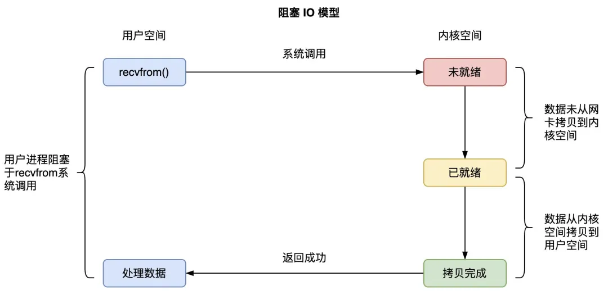
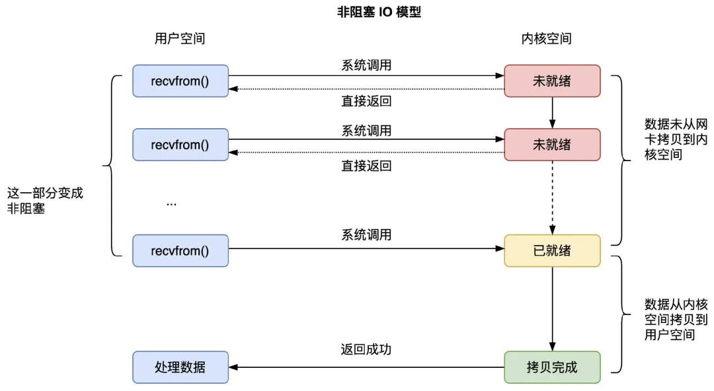
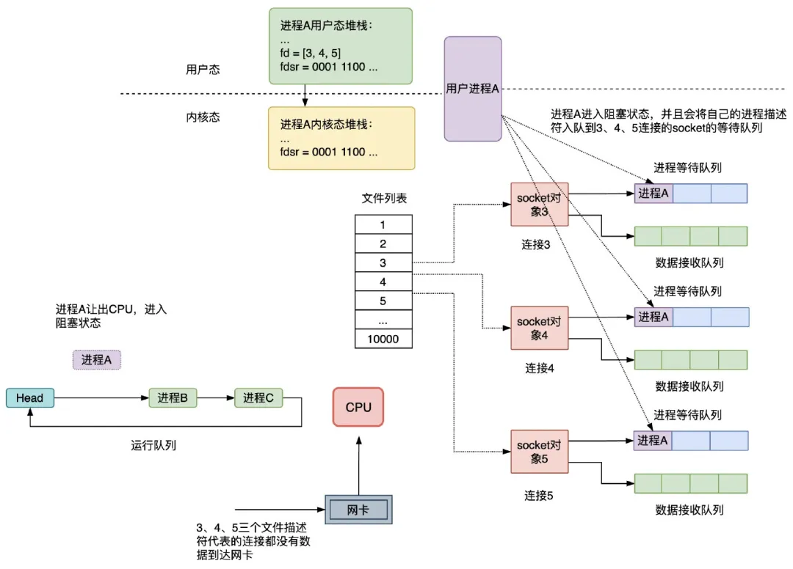
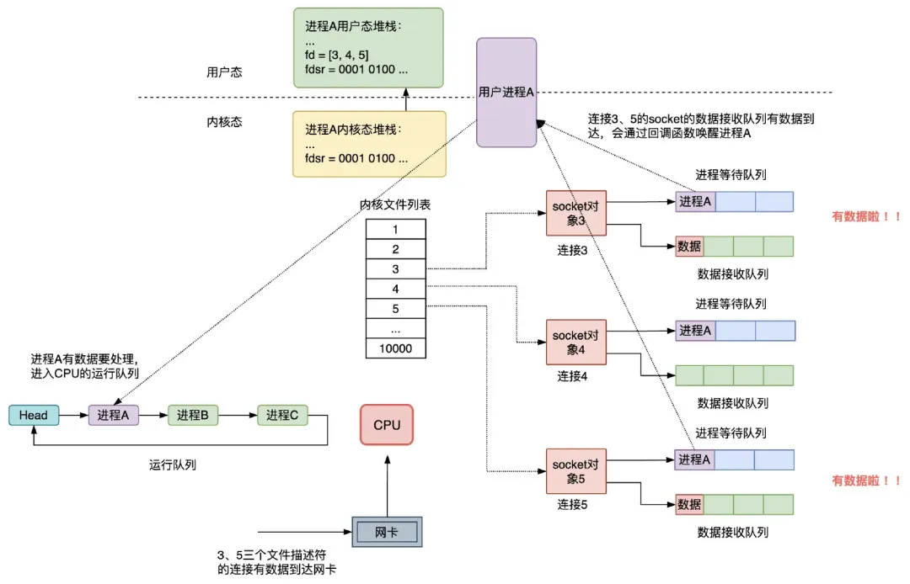
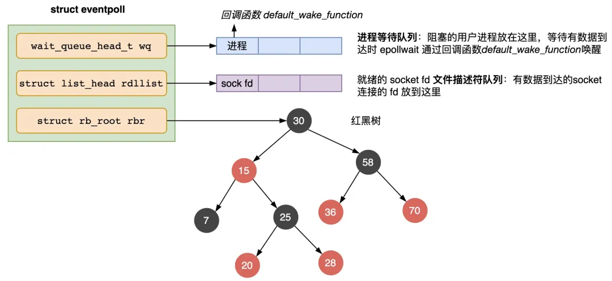
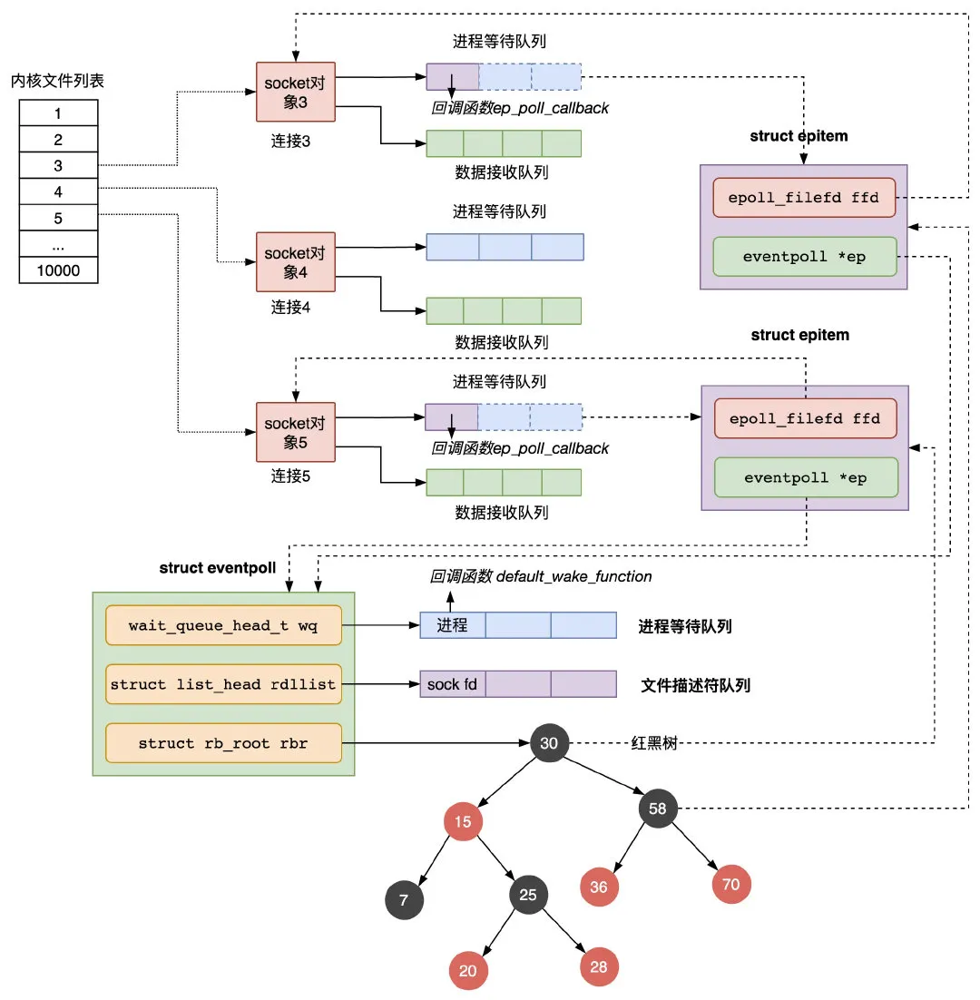
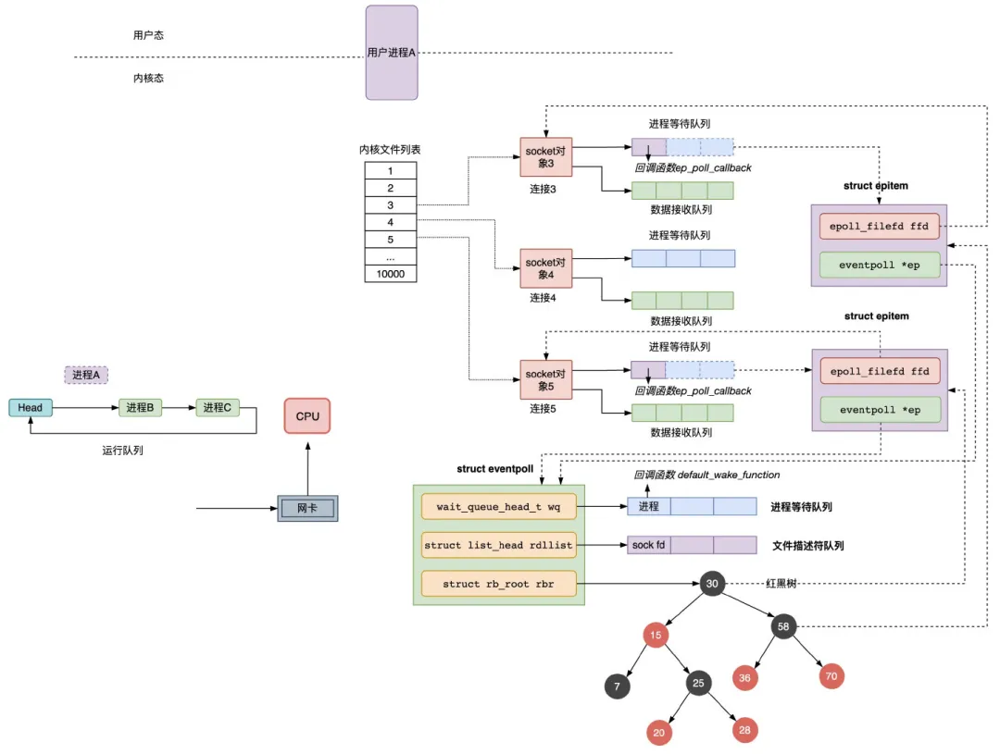

## Blog

### 算法

**迭代法，大家可以直接过，二刷有精力的时候 再去掌握迭代法。**

#### 详细任务

- 110 平衡二叉树
- 257 二叉树的所有路径
- 404 左叶子之和
- 222 完全二叉树的节点个数


#### 110 平衡二叉树（优先掌握递归）

再一次涉及到，什么是高度，什么是深度，可以巩固一下。

题目链接/文章讲解/视频讲解：

https://programmercarl.com/0110.%E5%B9%B3%E8%A1%A1%E4%BA%8C%E5%8F%89%E6%A0%91.html

- 二叉树节点的深度：指从根节点到该节点的最长简单路径边的条数。求深度用==前序遍历==
- 二叉树节点的高度：指从该节点到叶子节点的最长简单路径边的条数。求高度用==后序遍历==

不知道怎么判断高度差不超过1，因此本题还是先看的视频

主要的解题思路还是`递归+`==后序遍历==的思路：要怎么判断当前节点是不是平衡二叉树？

- 看左子树是不是平衡二叉树
- 看右子树是不是平衡二叉树
- 看当前节点的左子树和右子树之差是否大于1

上面的3个条件就是单层递归的逻辑；而递归的终点就是当前节点为空的情况

```cpp
class Solution {
public:
    int getHeight(TreeNode *node) {
        if (!node) return 0;
        int left = getHeight(node->left);
        if (left == -1) return -1;
        int right = getHeight(node->right);
        if (right == -1) return -1;

        if (abs(left - right) > 1) return -1;
        return 1 + max(left, right);
    }

    bool isBalanced(TreeNode* root) {
        return getHeight(root) != -1;
    }
};
```

根据递归的思路，从而写出对应的迭代法

也是采用后序遍历的思路，通过栈模拟递归的过程。判断每个节点的左右子树高度差：如果某个节点的高度差大于1，则直接返回`false`

1. 使用栈保存节点和访问状态（用于标记是否已经处理完子节点）。
2. 后序遍历：先访问左右子节点，再处理当前节点。
3. 对于每个节点：
    - 如果是叶子节点，高度为0。
    - 如果非叶子节点，计算左右子树的高度，并判断高度差是否超过1。
    - 如果超过1，直接返回 `false`。
4. 遍历完成后，如果没有发现不平衡节点，返回 `true`。

```cpp
class Solution {
public:
    int getHeight(TreeNode *node) {
        stack<TreeNode *> st;
        if (node)
        	st.push(node);
        int depth = 0; // 表示当前深度
        int result = 0; // 表示最大深度
        while (!st.empty()) {
            TreeNode *tn = st.top();
            if (tn) {// 如果当前节点未处理
                st.push(nullptr);// 标记为已访问过
                depth++;// 深度增加
                if (tn->right) st.push(tn->right);
                if (tn->left) st.push(tn->left);
            } else { // 当前节点已标记为 NULL，意味着左右子树处理完毕
                st.pop();
                tn = st.top(); // 获取实际节点
                st.pop();
                depth--; // 退回上层，深度减1
            }
            result = max(depth, result); // 更新最大深度
        }
        return result;
    }

    bool isBalanced(TreeNode* root) {
        if (!root) return true;
        stack<TreeNode *> st;
        st.push(root);
        while (!st.empty()) {
            TreeNode *node = st.top(); // 当前节点
            st.pop();
            // 检查当前节点的左右子树是否平衡
            if (abs(getHeight(node->left) - getHeight(node->right)) > 1)
                return false;
            // 按顺序遍历右、左子节点
            if (node->right) st.push(node->right);
            if (node->left) st.push(node->left);
        }
        return true; // 遍历完所有节点，说明是平衡的
    }
};
```

本题，迭代法理解了思路，但是代码还写不出来


#### 257 二叉树的所有路径（优先掌握递归）

这是大家第一次接触到回溯的过程， 我在视频里重点讲解了 本题为什么要有回溯，已经回溯的过程。 

如果对回溯 似懂非懂，没关系， 可以先有个印象。 

题目链接/文章讲解/视频讲解：

https://programmercarl.com/0257.%E4%BA%8C%E5%8F%89%E6%A0%91%E7%9A%84%E6%89%80%E6%9C%89%E8%B7%AF%E5%BE%84.html

没有听懂卡哥说的显式回溯的思路，我提交的是GPT给出的深搜的思路

从根结点开始遍历，每次进入一个节点时，将其值加入路径，直到遇到叶子节点，此时将该路径加入到结果集中。这样回溯是在递归返回时，会回到上一层

本质也是==前序遍历==，先处理当前节点，然后递归处理该节点的左右孩子

```cpp
class Solution {
public:
    void dfs(TreeNode *node, string path, vector<string> &vec) {
        path += to_string(node->val);
        if (!node->left && !node->right) {
            vec.push_back(path);
            return;
        }
        path += "->";
        if (node->left)
            dfs(node->left, path, vec);
        if (node->right)
            dfs(node->right, path, vec);
    }
    vector<string> binaryTreePaths(TreeNode* root) {
        vector<string> ret;
        if (root)
            dfs(root, "", ret);
        return ret;
    }
};
```


#### 404 左叶子之和（优先掌握递归）

其实本题有点文字游戏，搞清楚什么是左叶子，剩下的就是二叉树的基本操作。 

题目链接/文章讲解/视频讲解：

https://programmercarl.com/0404.%E5%B7%A6%E5%8F%B6%E5%AD%90%E4%B9%8B%E5%92%8C.html

这题一开始是有想法的，但是提交之后，发现没有过[1 2 3 4 5 6]这一组测试，一开始没有注意到是左、叶子节点

对于左节点是否是**叶子节点**，应该检查的是 **该节点本身是否是左节点，并且它没有左右子节点**

判断是否为左叶子节点的条件是：

1. `root->left` 存在；
2. `root->left->left == nullptr` 且 `root->left->right == nullptr`。

```cpp
class Solution {
public:
    void getLeft(TreeNode *root, int &sum) {
        if (!root) return;
        if (root->left && !root->left->left && !root->left->right)
            sum += root->left->val;

        if (root->left)
            getLeft(root->left, sum);
        if (root->right)
            getLeft(root->right, sum);

    }
    int sumOfLeftLeaves(TreeNode* root) {
        int sum = 0;
        getLeft(root, sum);
        return sum;
    }
};
```

在看了随想录的思路之后，使用迭代法进行实现

```cpp
class Solution {
public:
    int sumOfLeftLeaves(TreeNode* root) {
        if (!root) return 0;
        stack<TreeNode *> st;
        st.push(root);
        int sum = 0;
        while (!st.empty()) {
            TreeNode *node = st.top();
            st.pop();
            if (node->left && !node->left->left && !node->left->right)
                sum += node->left->val;
            if (node->left) st.push(node->left);
            if (node->right) st.push(node->right);
        }
        return sum;
    }
};
```


#### 222 完全二叉树的节点个数（优先掌握递归）

需要了解，普通二叉树 怎么求，完全二叉树又怎么求

题目链接/文章讲解/视频讲解：

https://programmercarl.com/0222.%E5%AE%8C%E5%85%A8%E4%BA%8C%E5%8F%89%E6%A0%91%E7%9A%84%E8%8A%82%E7%82%B9%E4%B8%AA%E6%95%B0.html

看到这道题，一开始想到的就是层序变量，来统计节点的个数

```cpp
class Solution {
public:
    int countNodes(TreeNode* root) {
        if (!root) return 0;
        queue<TreeNode *> que;
        que.push(root);
        int count = 0;
        while (!que.empty()) {
            TreeNode *node = que.front();
            que.pop();
            count++;
            if (node->left) que.push(node->left);
            if (node->right) que.push(node->right);
        }
        return count;
    }
};
```

在看了视频后，要把这个二叉树当做完全二叉树来做，利用其特性

完全二叉树中，除了最底层节点可能没填满外，其余每层节点数都达到最大值，并且最下面一层的节点都集中在该层最左边的若干位置。若最底层为第 h 层，则该层包含 $1\sim2^{h-1}$  个节点

完全二叉树只有两种情况，情况一：就是满二叉树，情况二：最后一层叶子节点没有满。

对于情况一，可以直接用 2^树深度 - 1 来计算，注意这里根节点深度为1。

```cpp
class Solution {
public:
    int countNodes(TreeNode* root) {
        if (!root) return 0;
        int left = 0, right = 0;
        TreeNode *left_node = root->left;
        TreeNode *right_node = root->right;
        while (left_node) {
            left_node = left_node->left;
            left++;
        }
        while (right_node) {
            right_node = right_node->right;
            right++;
        }
        if (left == right)
            return (2 << left) - 1;

        int left_num = countNodes(root->left);
        int right_num = countNodes(root->right);
        return left_num + right_num + 1;
    }
};
```


### 八股文

#### 熟悉哪些 Linux 命令

掌握程度：

- 掌握关于文件操作，文件内容查看、权限管理、网络管理、进程管理、磁盘管理、软件包管理的一些常用命令，能够清晰地描述每个命令的基本用途和用法。
- 理解不同命令在系统管理、文件操作、网络管理等方面的应用。

参考资料：

 [10分钟视频：【常用的Linux命令介绍：13个基本命令和Shell脚本编程】](https://www.bilibili.com/video/BV1Uv4y127tU/?share_source=copy_web&vd_source=9bb0aa9c2c3cc1b12ca6f343a55b4e80)

https://www.bilibili.com/video/BV1Uv4y127tU/?share_source=copy_web&vd_source=9bb0aa9c2c3cc1b12ca6f343a55b4e80

##### 文件和目录操作

> 总结回答
>
> 1. 文件操作：
>     - `ls`：列出目录内容。
>     - `cd`：改变当前目录。
>     - `pwd`：显示当前工作目录。
>     - `cp`：复制文件或目录。
>     - `mv`：移动或重命名文件。
>     - `rm`：删除文件或目录。
>     - `touch`：创建空文件或更新文件时间戳。
> 2. 文件内容查看：
>     - `cat`：查看文件内容。
>     - `head`：查看文件的前几行。
>     - `tail`：查看文件的后几行，常用于查看日志文件。
> 3. 文件编辑：
>     - `vi` 或 `vim`：强大的文本编辑器。
> 4. 权限管理：
>     - `chmod`：更改文件或目录的访问权限。
>     - `chown`：更改文件或目录的所有者和/或所属组。
> 5. 磁盘管理：
>     - `df`：查看磁盘空间使用情况。
> 6. 网络管理：
>     - `ifconfig` 或 `ip addr`：查看和配置网络接口。
>     - `ping`：测试网络连接。
>     - `netstat`：查看网络状态和统计信息。
>     - `ssh`：安全远程登录。
> 7. 进程管理：
>     - `ps`：查看当前运行的进程。
>     - `kill`：发送信号给进程。
> 8. 软件包管理（根据Linux发行版不同，命令可能有所不同）：
>     - `apt-get`（Debian/Ubuntu）：安装、更新和删除软件包。

###### ls

List  information  about the FILEs (the current directory by default).  Sort entries
       alphabetically if none of -cftuvSUX nor --sort is specified.

-a, --all
              do not ignore entries starting with .（隐藏文件以`.`开头）

-l     use a long listing format，即会显示文件类型、权限信息、文件大小、修改时间等信息

###### cd

The cd utility shall change the working directory of the current shell execution environment by executing the following steps  in sequence. 

> 在 POSIX 标准中，`utility` 指的是一个标准化的工<u>具或命令</u>，比如 `cd`、`ls`、`grep` 等。
>
> `shall`必须它定义了某项功能的强制性要求，意味着这个行为是工具实现时不可或缺的部分。

###### pwd

Print the full filename of the current working directory.

##### 文本文件的阅读&编辑

###### cat

concatenate files and print on the standard output（concatenate 把…联系起来）

###### tail

Print  the  last 10 lines(默认是10行) of each FILE to standard output.  With more than one FILE,
       precede each with a header giving the file name.

###### head

Print  the first 10 lines(默认是10行) of each FILE to standard output.  With more than one FILE,
       precede each with a header giving the file name.

###### less

Less  is a program similar to more(1), but it has many more features.  Less does not
       have to read the entire input file before starting, so with  large  input  files  it
       starts  up  faster  than text editors like vi(1).  Less uses termcap (or terminfo on
       some systems), so it can run on a variety of terminals.  There is even limited  sup‐
       port for hardcopy terminals.  (On a hardcopy terminal, lines which should be printed
       at the top of the screen are prefixed with a caret.)
Commands are based on both more and vi.  Commands may be preceded by a decimal  num‐
       ber,  called  N  in the descriptions below.  The number is used by some commands, as
       indicated.

###### more

more is a filter for paging through text one screenful at a time.(more 是一个用于逐屏翻阅文本的过滤器) This version is especially primitive. Users should realize that less(1) provides more(1) emulation plus extensive enhancements. （filter n.过滤器）

###### nano

nano  is  a  small and friendly editor.  It copies the look and feel of Pico, but is
       free software, and implements several features that Pico  lacks,  such  as:  opening
       multiple  files, scrolling per line, undo/redo, syntax coloring, line numbering, and
       soft-wrapping overlong lines.

Entering text and moving around in a file is straightforward: typing the letters and
       using  the  normal  cursor movement keys.  Commands are entered by using the ==Control==
       (^) and the Alt or Meta (M-) keys. 

###### vim

Vim  is  a text editor that is upwards compatible to Vi.  It can be used to edit all
       kinds of plain text.  It is especially useful for editing programs.

##### 文件属性

###### file

determine file type

file tests each argument in an attempt to classify it.  There are three sets of tests,
     performed in this order: filesystem tests, magic tests, and language tests.  The first
     test that succeeds causes the file type to be printed.

###### where

查找可执行程序的路径

##### 打印命令`echo`

Echo the STRING(s) to standard output.

##### shell编程

```bash
# 变量定义
will$ h="hello"
will$ echo $h # 变量的使用 加$
hello
will$ echo "abc-${h}-def"
abc-hello-def
```

批量打印当前目录下以week开头的文件/目录

```bash
$ for dir in week*
> do
> echo $dir # 重命名是：mv $dir chapter_${dir#week}
> done
# 其中 #表示从变量的开头进行匹配，week是一个通配符模式(类似正则)
# ${dir#week} 表示如果变量的值以 week 开头，则删除这一部分，并返回剩余部分
```


#### 如何查看某个端口有没有被占用

掌握程度：

- 能够清晰地描述至少一种方法来检查端口是否被占用。
- 理解不同工具的输出结果，知道如何根据输出判断端口的使用情况。
- 如果有实际的网络问题排查经验，能够结合案例讨论如何使用命令。


##### 使用 `netstat`

`netstat` 是一个传统工具，用于查看网络连接和端口状态。

1. 查看特定端口是否被占用（以端口 8080 为例）：

    ```bash
    netstat -tuln | grep :8080
    ```

    参数说明：

    - `-t`：显示 TCP 协议的连接。
    - `-u`：显示 UDP 协议的连接。
    - `-l`：显示监听状态的端口。
    - `-n`：显示数字格式（不解析服务名称）。

2. 输出示例（如果端口被占用）：

    ```ruby
    tcp        0      0 0.0.0.0:8080            0.0.0.0:*               LISTEN
    ```

    说明：

    - `LISTEN` 表示端口正在监听。
    - 如果没有输出，说明端口未被占用。

##### 使用`ss`

`ss` 是 `netstat` 的现代替代工具，功能更强，性能更高。

1. 查看特定端口是否被占用：

    ```bash
    ss -tuln | grep :8080
    ```

2. 输出示例（如果端口被占用）：

    ```ruby
    LISTEN    0      128    0.0.0.0:8080         0.0.0.0:*
    ```

##### 使用`lsof`

`lsof` 是一个列出打开文件的工具，但它也可以用于查看端口的占用情况。

1. 查看特定端口是否被占用：

    ```bash
    lsof -i :8080
    ```

    `-i` 用于选择网络接口的相关文件，包括 TCP 和 UDP 套接字以及监听的网络端口

2. 输出示例（如果端口被占用）：

    ```graphql
    COMMAND  PID   USER   FD   TYPE DEVICE SIZE/OFF NODE NAME
    nginx    1234  root   6u   IPv4  12345      0t0  TCP *:8080 (LISTEN)
    ```

    说明：

    - `COMMAND` 表示占用端口的程序名称。
    - `PID` 是进程 ID。
    - `USER` 是运行程序的用户。
    - 如果没有输出，说明端口未被占用。

##### 使用`fuser`

`fuser` 是专门用于查看文件或端口占用的工具。

1. 查看端口是否被占用：

    ```bash
    fuser 8080/tcp
    ```

2. 输出示例（如果端口被占用）：

    ```yaml
    8080/tcp:  1234
    ```

    说明：

    - `1234` 是占用该端口的进程 ID。
    - 如果没有输出，说明端口未被占用。

3. 强制终止占用端口的进程：

    ```bash
    fuser -k 8080/tcp
    ```

##### 使用`curl`

可以用 `curl` 测试某个端口是否可用，尤其是针对本地 HTTP 服务：

1. 测试端口（以端口 8080 为例）：

    ```bash
    curl -I localhost:8080
    ```

2. 如果端口被占用并且有服务运行，会返回 HTTP 响应头。否则会报错。


#### ==**说一下 select、poll 和 epoll**== 【重点】

掌握程度：

- 能够清晰地描述select、poll和epoll的定义和工作原理。
- 理解它们在I/O多路复用中的应用和区别。
- 知道它们各自的限制和适用场景。

参考资料：

[Linux IO模式及 select、poll、epoll详解](https://segmentfault.com/a/1190000003063859#item-3-13)

https://segmentfault.com/a/1190000003063859#item-3-13

[推荐：深入学习IO多路复用 select/poll/epoll 实现原理](https://mp.weixin.qq.com/s?__biz=MjM5ODYwMjI2MA==&mid=2649774761&idx=1&sn=cd93afad37fecb2071d72d7e0dfebf5e&chksm=beccc9d289bb40c4117cdee70f647c72f1f0bf84c71735a5b72f513d6d36a0c427a6070a047d&mpshare=1&scene=1&srcid=0722ngceDqziZ1WKv85ee94u&sharer_shareinfo=78e19e4c66ca592e750f8564805fae5b&sharer_shareinfo_first=78e19e4c66ca592e750f8564805fae5b&version=4.1.6.70203&platform=mac&nwr_flag=1#wechat_redirect)

https://mp.weixin.qq.com/s?__biz=MjM5ODYwMjI2MA==&mid=2649774761&idx=1&sn=cd93afad37fecb2071d72d7e0dfebf5e&chksm=beccc9d289bb40c4117cdee70f647c72f1f0bf84c71735a5b72f513d6d36a0c427a6070a047d&mpshare=1&scene=1&srcid=0722ngceDqziZ1WKv85ee94u&sharer_shareinfo=78e19e4c66ca592e750f8564805fae5b&sharer_shareinfo_first=78e19e4c66ca592e750f8564805fae5b&version=4.1.6.70203&platform=mac&nwr_flag=1#wechat_redirect


`select`/`poll`/`epoll` 是 Linux 服务器提供的三种处理高并发网络请求的 IO 多路复用技术

> 前置知识点：
>
> **缓存I/O**：
>
> 缓存 I/O 又被称作标准 I/O，大多数文件系统的默认 I/O 操作都是缓存 I/O。
>
> 在 Linux 的缓存 I/O 机制中，操作系统会将 I/O 的数据缓存在文件系统的页缓存（ page cache ）中，也就是说，数据会先被拷贝到操作系统内核的缓冲区中，然后才会从操作系统内核的缓冲区拷贝到应用程序的地址空间。
>
> **I/O模式**
>
> 对于一次IO访问（以read举例），数据会先被拷贝到操作系统内核的缓冲区中，然后才会从操作系统内核的缓冲区拷贝到应用程序的地址空间。所以说，当一个read操作发生时，它会经历两个阶段：
>
> 1. 等待数据准备 (Waiting for the data to be ready)
> 2. 将数据从内核拷贝到进程中 (Copying the data from the kernel to the process)
>
> 所以，linux系统产生了下面五种网络模式的方案：
>
> - 阻塞 I/O（blocking IO）
> - 非阻塞 I/O（nonblocking IO）
> - I/O 多路复用（ IO multiplexing）
> - 信号驱动 I/O（ signal driven IO）
> - 异步 I/O（asynchronous IO）

##### Linux 处理网络请求的方式

###### 1. 阻塞 I/O（blocking IO）


1. 服务端通过 **socket() 函数**陷入内核态进行 socket 系统调用，该内核函数会创建 **socket 内核对象**，主要有两个重要的结构体，（**进程）等待队列**，和（**数据）接收队列，**为了方便理解，等待队列前可以加上进程二字，接收队列同样；进程等待队列，存放了服务端的用户进程 A 的进程描述符和回调函数；socket 的数据接收队列，存放网卡接收到的该 socket 要处理的数据；

2. 进程 A 调用 `recv()` 函数接收数据，会进入到 **recvfrom() 系统调用函数**，发现 `socket` 的数据等待队列没有它要接收的数据到达时，进程 A 会让出 CPU，进入阻塞状态，进程 A 的进程描述符和它被唤醒用到的回调函数 callback func 会组成一个结构体叫等待队列项，放入 socket 的进程等待队列；

3. 客户端的发送数据到达服务端的网卡；

4. 网卡首先会将网络传输过来的数据通过 DMA 控制程序复制到内存环形缓冲区 RingBuffer 中；

    > **DMA（Direct Memory Access，直接内存访问）控制程序** 是一种用于管理 **DMA 控制器** 的软件程序或代码，主要负责协调设备与内存之间的直接数据传输，而无需 CPU 的大量干预。
    >
    > DMA 控制器是硬件设备的一部分，它允许外设（如硬盘、网卡、显卡等）直接与系统内存交换数据。通过 DMA 机制，可以显著减少 CPU 的负载，从而提高系统的性能
    >
    > **环形缓冲区（Ring Buffer）** 是一种数据结构，用于在固定大小的内存块中实现循环存储数据。它的设计是一个逻辑上的 **环形结构**，当写入到缓冲区的末尾时，会自动回绕到开头继续写入，覆盖最早的数据（如果缓冲区已满）。常用于需要高效读写、并保持固定存储空间的数据处理场景

5. 网卡向 CPU 发出**硬中断**；

    > **硬中断（Hardware Interrupt）** 是一种由硬件设备发出的信号，用于通知处理器（CPU）需要立即处理某个事件的机制。硬中断是计算机中断系统的一部分，通常由外部设备（如键盘、鼠标、网卡、硬盘等）生成，目的是打断当前执行的程序流程，以快速响应设备的请求。

6. CPU 收到了硬中断后，为了避免过度占用 CPU 处理网络设备请求导致其他设备如鼠标和键盘的消息无法被处理，会调用网络驱动注册的中断处理函数，进行简单快速处理后向内核中断进程 `ksoftirqd` 发出**软中断**，就释放 CPU，由软中断进程处理复杂耗时的网络设备请求逻辑；

7. **内核中断进程 `ksoftirqd`** 收到软中断信号后，会将网卡复制到内存的数据，根据数据报文的 IP 和端口号，将其拷贝到对应 socket 的接收队列；

8. 内核中断进程 `ksoftirqd` 根据 socket 的数据接收队列的数据，通过进程等待队列中的回调函数，唤醒要处理该数据的进程 A，进程 A 会进入 CPU 的运行队列，等待获取 CPU 执行数据处理逻辑；

9. 进程 A 获取 CPU 后，会回到之前调用 **recvfrom() 函数**时阻塞的位置继续执行，这时发现 socket 内核空间的等待队列上有数据，会在内核态将内核空间的 socket 等待队列的数据拷贝到用户空间，然后才会回到用户态执行进程的用户程序，从而真的解除阻塞

用户进程 A 在调用 recvfrom() 系统函数时，有两个阶段都是等待的：

- 在数据没有准备好的时候，进程 A 等待内核 socket 准备好数据；

- 内核准备好数据后，进程 A 继续等待内核将 socket 等待队列的数据拷贝到自己的用户缓冲区；

    在内核完成数据拷贝到用户缓冲区后，进程 A 才会从 recvfrom() 系统调用中返回，并解除阻塞状态

    

在 IO 阻塞逻辑中，还存在：

1. 进程在 `recv` 的时候大概率会被阻塞掉，导致一次进程切换；
2. 当 TCP 连接上的数据到达服务端的网卡、并从网卡复制到内核空间 socket 的数据等待队列时，进程会被唤醒，又是一次进程切换；并且，在用户进程继续执行完 `recvfrom()` 函数系统调用，将内核空间的数据拷贝到了用户缓冲区后，用户进程才会真正拿到所需的数据进行处理；
3. 一个进程同时只能等待一条连接，如果有很多并发，则需要很多进程；

即==阻塞IO一次数据到达会进行**两次进程切换，**一次数据读取有**两处阻塞，单进程对单连接**==。

###### 2. 非阻塞 I/O（nonblocking IO）

为了解决同步阻塞 IO 的问题，操作系统提供了非阻塞的 recv() 函数，这个函数的效果是：如果没有数据从网卡到达内核 socket 的等待队列时，系统调用会直接返回，而不是阻塞的等待。


非阻塞 IO，是将等待数据从网卡到达 socket 内核空间这一部分变成了非阻塞的，用户进程调用 recvfrom() 会重复发送请求检查数据是否到达内核空间，如果没有到，则立即返回，不会阻塞。

当数据已经到达内核空间的 socket 的等待队列后，用户进程依然要等待 recvfrom() 函数将数据从内核空间拷贝到用户空间，才会从 recvfrom() 系统调用函数中返回

非阻塞 IO 模型解决了“**两次进程切换，两处阻塞，单进程对单连接**”中的“**两处阻塞**”问题，将“**两处阻塞**”变成了“**一处阻塞**”，但依然存在“**两次进程切换，一处阻塞，单进程对单连接**”的问题。

###### 3. I/O 多路复用（ IO multiplexing）

要解决“**两次进程切换，单进程对单连接**”的问题，服务器引入了 IO 多路复用技术，通过一个进程处理多个 TCP 连接，不仅降低了服务器处理网络请求的进程数，而且不用在每个连接的数据到达时就进行进程切换，进程可以一直运行并只处理有数据到达的连接，当然，如果要监听的所有连接都没有数据到达，进程还是会进入阻塞状态，直到某个连接有数据到达时被回调函数唤醒。



系统调用 select 函数阻塞执行并返回数据就绪的连接个数，然后调用 recvfrom() 函数将到达内核空间的数据拷贝到用户空间，尽管这两个阶段都是阻塞的，但是由于只会处理有数据到达的连接，整体效率会有极大的提升

这样，阻塞 IO 模型的“**两次进程切换，两处阻塞，单进程对单连接**”问题，通过非阻塞 IO 和多路复用技术，就只剩下了“**一处阻塞**”这个问题，即 Linux 服务器上用户进程一定要等待数据从内核空间拷贝到用户空间，如果这个步骤也变成非阻塞的，也就是进程调用 recvfrom 后立刻返回，内核自行去准备好数据并将数据从内核空间拷贝到用户空间、再 notify 通知用户进程去读取数据，那就是 **IO 异步调用**，不过，Linux 没有提供异步 IO 的实现，真正意义上的网络异步 IO 是 Windows 下的 IOCP（IO 完成端口）模型

##### `select`

在一个进程中使用 select 监控多个连接的主要步骤：

1. 调用 `socket()` 函数建立主机间通信的 socket 结构体，`bind()` 绑定 socket 到当前服务器，`listen()` 监听TCP 连接；

    ```cpp
    int select(
        int nfds,                     // 监控的文件描述符集里最大文件描述符加1
        fd_set *readfds,              // 监控有读数据到达文件描述符集合，引用类型的参数
        fd_set *writefds,             // 监控写数据到达文件描述符集合，引用类型的参数
        fd_set *exceptfds,            // 监控异常发生达文件描述符集合，引用类型的参数
        struct timeval *timeout);     // 定时阻塞监控时间
    ```

2. 调用 `accept()` 函数建立和 几个客户端的 TCP 连接，并把连接的文件描述符放入 fd 文件描述符队列；

    > 文件描述符（file descriptor）是一个非负整数，从 0 开始。进程使用文件描述符来标识一个打开的文件。Linux 中一切皆文件。
    >
    > 系统为每一个进程维护了一个文件描述符表，表示该进程打开文件的记录表，而**文件描述符实际上就是这张表的索引**。每个进程默认都有 3 个文件描述符：0 (stdin)、1 (stdout)、2 (stderr)。

3. 定义一个 fd_set 类型的变量 fdsr；

    ```cpp
    // fd_set 类型表示文件描述符的集合
    int FD_ZERO(int fd, fd_set *fdset);  // 将 fd_set 所有位置 0
    int FD_CLR(int fd, fd_set *fdset);   // 将 fd_set 某一位置 0
    int FD_SET(int fd, fd_set *fd_set);  // 将 fd_set 某一位置 1
    int FD_ISSET(int fd, fd_set *fdset); // 检测 fd_set 某一位是否为 1
    ```

4. 调用 FD_ZERO，将 fdsr 所有位置 0；

5. 调用 FD_SET，将 fdsr 要监听的几个文件描述符的位置 1，表示要监听这几个文件描述符指向的连接；

6. 调用 `select()` 函数，并将 fdsr 参数传递给 select；

    ```cpp
    ret = select(max + 1, &fdsr, NULL, NULL, NULL);  // 调用select系统函数进入内核检查哪个连接的数据到达
    ```

7. `select` 会将 fdsr 中就绪的位置 1，未就绪的位置 0，返回就绪的文件描述符的数量；

8. 当 `select` 返回后，调用 FD_ISSET 检测哪些位为 1，表示对应文件描述符对应的连接的数据已经就绪，可以调用 recv 函数读取该连接的数据了

**select 的执行过程**

在服务器进程 A 启动的时候，要监听的连接的 socket 文件描述符是 3、4、5，如果这三个连接均没有数据到达网卡，则进程 A 会让出 CPU，进入阻塞状态，同时会将进程 A 的进程描述符和被唤醒时用到的回调函数组成等待队列项加入到 socket 对象 3、4、5 的进程等待队列中，注意，这时 select 调用时，fdsr 文件描述符集会从用户空间拷贝到内核空间



当网卡接收到数据，然后网卡通过中断信号通知 CPU 有数据到达，执行中断程序，中断程序主要做了两件事：

1）将网络数据写入到对应 socket 的数据接收队列里面；

2）唤醒队列中的等待进程 A，重新将进程 A 放入 CPU 的运行队列中；

假设连接 3、5 有数据到达网卡，注意，这时 select 调用结束时，fdsr 文件描述符集会从内核空间拷贝到用户空间：



select 实现多路复用的缺点：

1. 性能开销大

    - 调用 select 时会陷入内核，这时需要将参数中的 fd_set 从用户空间拷贝到内核空间，select 执行完后，还需要将 fd_set 从内核空间拷贝回用户空间，高并发场景下这样的拷贝会消耗极大资源；（epoll 优化为不拷贝）

    - 进程被唤醒后，不知道哪些连接已就绪即收到了数据，需要遍历传递进来的所有 fd_set 的每一位，不管它们是否就绪；（epoll 优化为异步事件通知）

    - select 只返回就绪文件的个数，具体哪个文件可读还需要遍历；（epoll 优化为只返回就绪的文件描述符，无需做无效的遍历）

2. 同时能够监听的文件描述符数量太少。受限于 sizeof(fd_set) 的大小，在编译内核时就确定了且无法更改。一般是 32 位操作系统是 1024，64 位是 2048。（poll、epoll 优化为适应链表方式）

##### `poll`

和 select 类似，只是描述 fd 集合的方式不同，poll 使用 pollfd 结构而非 select 的 fd_set 结构

```cpp

struct pollfd {
    int fd;           // 要监听的文件描述符
    short events;     // 要监听的事件
    short revents;    // 文件描述符fd上实际发生的事件
};
```

管理多个描述符也是进行轮询，根据描述符的状态进行处理，但 **poll 无最大文件描述符数量的限制**，**因其基于链表存储**。

select 和 poll 在内部机制方面并没有太大的差异。相比于 select 机制，poll 只是取消了最大监控文件描述符数限制，并没有从根本上解决 select 存在的问题。

##### `epoll`

select 和 poll 在内部机制方面并没有太大的差异。相比于 select 机制，poll 只是取消了最大监控文件描述符数限制，并没有从根本上解决 select 存在的问题。

epoll 的特点是：

- 使用**红黑树**存储**一份**文件描述符集合，每个文件描述符只需在添加时传入一次，无需用户每次都重新传入；—— 解决了 select 中 fd_set 重复拷贝到内核的问题

- 通过异步 IO 事件找到就绪的文件描述符，而不是通过轮询的方式；

- 使用队列存储就绪的文件描述符，且会按需返回就绪的文件描述符，无须再次遍历；

主要涉及到三个函数：

```cpp
int epoll_create(int size);   // 创建一个 eventpoll 内核对象，类似 socket，把它关联到当前进程的已打开文件列表中

int epoll_ctl(int epfd, int op, int fd, struct epoll_event *event);   // 将连接到socket对象添加到 eventpoll 对象上，epoll_event是要监听的事件

int epoll_wait(int epfd, struct epoll_event *events,
               int maxevents, int timeout);      // 等待连接 socket 的数据是否到达
```

说明：

- `eventpoll`

    ```cpp
    struct eventpoll {
     wait_queue_head_t wq;      // 等待队列链表，存放阻塞的进程
    	// 如果当前进程没有数据需要处理，会把当前进程描述符和回调函数 default_wake_functon 构造一个等待队列项，放入当前 wq 对待队列，软中断数据就绪的时候会通过 wq 来找到阻塞在 epoll 对象上的用户进程
        
     struct list_head rdllist;  // 数据就绪的文件描述符都会放到这里
    	// 当有的连接数据就绪的时候，内核会把就绪的连接放到 rdllist 链表里。这样应用进程只需要判断链表就能找出就绪进程，而不用去遍历整棵树
        
     struct rb_root rbr;        // 红黑树，管理用户进程下添加进来的所有 socket 连接
            ......
    }
    ```

    

- epoll_ctl 函数主要负责把服务端和客户端建立的 socket 连接注册到 eventpoll 对象里，会做三件事：

    1. 创建一个 epitem 对象，主要包含两个字段，分别存放 socket fd 即连接的文件描述符，和所属的 eventpoll 对象的指针；

    2. 将一个数据到达时用到的回调函数添加到 socket 的进程等待队列中，注意，跟第 1.1 节的阻塞 IO 模式不同的是，这里添加的 socket 的进程等待队列结构中，只有回调函数，没有设置进程描述符，因为**在 epoll 中，进程是放在 eventpoll 的等待队列中**，等待被 epoll_wait 函数唤醒，而不是放在 socket 的进程等待队列中；

    3. 将第 1）步创建的 epitem 对象插入红黑树；

    

- epoll_wait 函数的动作比较简单，检查 eventpoll 对象的就绪的连接 rdllist 上是否有数据到达，如果没有就把当前的进程描述符添加到一个等待队列项里，加入到 eventpoll 的进程等待队列里，然后阻塞当前进程，等待数据到达时通过回调函数被唤醒。

  当 eventpoll 监控的连接上有数据到达时，通过下面几个步骤唤醒对应的进程处理数据：

  1. socket 的数据接收队列有数据到达，会通过进程等待队列的回调函数 ep_poll_callback 唤醒红黑树中的节点 epitem；

  2. ep_poll_callback 函数将有数据到达的 epitem 添加到 eventpoll 对象的就绪队列 rdllist 中；

  3. ep_poll_callback 函数检查 eventpoll 对象的进程等待队列上是否有等待项，通过回调函数 default_wake_func 唤醒这个进程，进行数据的处理；
  
  4. 当进程醒来后，继续从 epoll_wait 时暂停的代码继续执行，把 rdlist 中就绪的事件返回给用户进程，让用户进程调用 recv 把已经到达内核 socket 等待队列的数据拷贝到用户空间使用。
  
    
  

##### 总结

1. select

    a) 调用 select 时会陷入内核，这时需要将参数中的 fd_set 从用户空间拷贝到内核空间，高并发场景下这样的拷贝会消耗极大资源；（epoll 优化为不拷贝）

    b) 进程被唤醒后，不知道哪些连接已就绪即收到了数据，需要遍历传递进来的所有 fd_set 的每一位，不管它们是否就绪；（epoll 优化为异步事件通知）

    c) select 只返回就绪文件的个数，具体哪个文件可读还需要遍历；（epoll 优化为只返回就绪的文件描述符，无需做无效的遍历）

    d) 同时能够监听的文件描述符数量太少，是 1024 或 2048；（poll 基于链表结构解决了长度限制）

2. poll 只是基于链表的结构解决了最大文件描述符限制的问题，其他 select 性能差的问题依然没有解决；终极的解决方案是 epoll，解决了 select 的前三个缺点；

3. epoll 的实现原理看起来很复杂，其实很简单，注意两个回调函数的使用：数据到达 socket 的等待队列时，通过**回调函数 ep_poll_callback** 找到 eventpoll 对象中红黑树的 epitem 节点，并将其加入就绪列队 rdllist，然后通过**回调函数 default_wake_function** 唤醒用户进程 ，并将 rdllist 传递给用户进程，让用户进程准确读取就绪的 socket 的数据。这种回调机制能够定向准确的通知程序要处理的事件，而不需要每次都循环遍历检查数据是否到达以及数据该由哪个进程处理，日常开发中可以学习借鉴下这种思想


### 总结

今天的代码题还是比较有挑战性的，一开始还是跟昨天一样，直接看随想录的视频，后面2道就开始尝试自己先写了，写完之后再看能够更好的领会，收获更多

对于平衡二叉树，迭代法还没有完全掌握。其他的题目基本上有了思路都能够写出来

二叉树的题目，都是使用了递归三部曲一步一步的把整个过程分析出来。**简短的代码看不出遍历的顺序，也看不出分析的逻辑，还会把必要的回溯的逻辑隐藏了，所以尽量按照原理分析一步一步来，写出来之后，再去优化代码**
