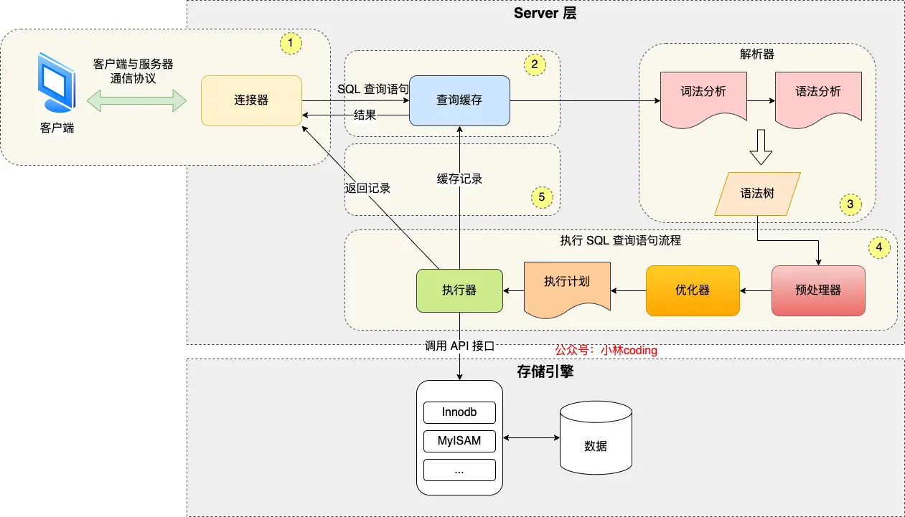

## Blog

### 算法

#### 详细任务

- 513 找树左下角的值
- 路径总和
- 从中序与后序遍历序列构造二叉树


#### 513 找树左下角的值

本题递归偏难，反而迭代简单属于模板题， 两种方法掌握一下 

题目链接/文章讲解/视频讲解：

https://programmercarl.com/0513.%E6%89%BE%E6%A0%91%E5%B7%A6%E4%B8%8B%E8%A7%92%E7%9A%84%E5%80%BC.html

找的是<u>最底层，最左边</u>的值。要找最底层，可以会用层序遍历得到最底层，因此本题直接将层序遍历的输出结果修改一下即可。

这种做法提交后效率非常低。看了随想录上的迭代法后，进行了优化，不需要使用二维数组来记录层序，仅仅只需要记录一下每层的最左边的元素即可，这样到最后得到的就是最底层的最左侧的元素

```cpp
class Solution {
public:
    int findBottomLeftValue(TreeNode* root) {
        queue<TreeNode *> que;
        que.push(root);
        int ret = 0;
        while (!que.empty()) {
            int count = que.size();
            for (int i = 0; i < count; ++i) {
                TreeNode *node = que.front();
                que.pop();
                if (i == 0) ret = node->val;
                if (node->left) que.push(node->left);
                if (node->right) que.push(node->right);
            }
        }
        return ret;
    }
};
```

看了随想录的视频后，使用递归法

递归的终止条件就是当前节点是最底层，也就是叶子节点，并且这个节点是最左边的，即通过当前的深度和之前的记录的最大深度进行比较，如果当前深度大于最大深度，那么它就是这一层的第一个节点

否则，就继续递归，分别往左右孩子的方向进行递归

```cpp
class Solution {
    int maxDepth = -1;
    int result;
public:
    void traversal(TreeNode *node, int depth) {
        if (!node->left && !node->right) {
            if (depth > maxDepth) {
                maxDepth = depth;
                result = node->val;
            }
            return ;
        }
        if (node->left) {
            depth++;
            traversal(node->left, depth);
            depth--;
        }
        if (node->right) {
            depth++;
            traversal(node->right, depth);
            depth--;
        }
    }
    int findBottomLeftValue(TreeNode* root) {
        traversal(root, 0);
        return result;
    }
};
```


#### 路径总和

本题 又一次涉及到回溯的过程，而且回溯的过程隐藏的还挺深，建议先看视频来理解 

[112 路径总和]() 和 [113 路径总和ii]() 一起做了。 优先掌握递归法。

题目链接/文章讲解/视频讲解：

https://programmercarl.com/0112.%E8%B7%AF%E5%BE%84%E6%80%BB%E5%92%8C.html

根据建议，直接看视频

[112路径总和](https://leetcode.cn/problems/path-sum/description/)，主要采用的还是迭代法

1. 确定递归函数的参数和返回值

    参数就是当前的节点和给出的路径和，返回值表示是否等于给出的路径和

2. 确定终止条件

    当前节点是叶子节点：如果路径和为0，则说明等于树中存在给出的路径和，返回true；否则，返回false

3. 确定单层递归的逻辑

    向下递归，在递归前，将路径和设置为减去要递归的节点之后的剩余值

    在递归结束后，还要将这个节点的值加回来，显式的进行回溯

```cpp
class Solution {
public:
    bool traversal(TreeNode *node, int remain) {
        if (!node->left && !node->right) {
            if (remain == 0) return true;
            return false;
        }
        if (node->left) {
            remain -= node->left->val;
            if (traversal(node->left, remain))
                return true;
            remain += node->left->val;
        }
        if (node->right) {
            remain -= node->right->val;
            if (traversal(node->right, remain))
                return true;
            remain += node->right->val;
        }
        return false;
    }
    bool hasPathSum(TreeNode* root, int targetSum) {
        if (!root) return false;
        return traversal(root, targetSum - root->val);
    }
};
```

迭代法：类似于前序遍历的顺序，先访问根节点，将它的值加入到路径和中，然后入栈，然后访问右孩子，将该节点的值加路径和然后入栈，再访问左孩子，将根结点的值和它的值作为该节点的元素，加入到栈中。

每次出栈栈顶元素，判断是否是叶子节点，并且该节点对应的路径和是否为给出的路径和。

```cpp
class Solution {
public:
    bool hasPathSum(TreeNode* root, int targetSum) {
        if (!root) return false;
        stack<pair<TreeNode *, int>> st;
        st.push({root, root->val});
        while (!st.empty()) {
            TreeNode *node = st.top().first;
            int sum = st.top().second;
            st.pop();

            if (!node->left && !node->right && sum == targetSum)
                return true;
            if (node->right)
                st.push({node->right, sum + node->right->val});
            if (node->left)
                st.push({node->left, sum + node->left->val});
        }
        return false;
    }
};
```

[113 路径总和ii](https://leetcode.cn/problems/path-sum-ii/)，思路和上一题基本上一样

```cpp
class Solution {
public:
    void traversal(TreeNode *node, int sum, vector<int> &vec, vector<vector<int>> &ret) {
        if (!node->left && !node->right) {
            int count = 0;
            for (int i : vec)
                count += i;
            if (sum == count)
                ret.push_back(vec);
            return ;
        }
        if (node->left) {
            vec.push_back(node->left->val);
            traversal(node->left, sum, vec, ret);
            vec.pop_back();
        }
        if (node->right) {
            vec.push_back(node->right->val);
            traversal(node->right, sum, vec, ret);
            vec.pop_back();
        }
    }
    vector<vector<int>> pathSum(TreeNode* root, int targetSum) {
        vector<vector<int>> ret;
        if (!root) return ret;
        vector<int> vec;
        vec.push_back(root->val);
        traversal(root, targetSum, vec, ret);
        return ret;
    }
};
```

随想录上的代码更好，比我少了`for`循环计算路径和


#### 从中序与后序遍历序列构造二叉树

本题算是比较难的二叉树题目了，大家先看视频来理解。 

[106 从中序与后序遍历序列构造二叉树]()和 [105 从前序与中序遍历序列构造二叉树]() 一起做，思路一样的

题目链接/文章讲解/视频讲解：

https://programmercarl.com/0106.%E4%BB%8E%E4%B8%AD%E5%BA%8F%E4%B8%8E%E5%90%8E%E5%BA%8F%E9%81%8D%E5%8E%86%E5%BA%8F%E5%88%97%E6%9E%84%E9%80%A0%E4%BA%8C%E5%8F%89%E6%A0%91.html

根据后序遍历和中序遍历的顺序，可以知道后序遍历的最后一个节点就是二叉树的根节点，由此，可以将中序遍历的数组划分为左子树和右子树两段，进而将后序遍历的数组也划分为左子树和右子树的两段

在后序遍历的左右两段中，最后一个元素就是该子树的根节点，从而可以将中序遍历的数组继续进行划分。直到只剩下一个节点，即叶子节点

1. 如果数组大小为零的话，说明是空节点了。
2. 如果不为空，那么取后序数组最后一个元素作为节点元素。
3. 找到后序数组最后一个元素在中序数组的位置，作为切割点
4. 切割中序数组，切成中序左数组和中序右数组 （顺序别搞反了，一定是先切中序数组）
5. 切割后序数组，切成后序左数组和后序右数组
6. 递归处理左区间和右区间

```cpp
class Solution {
public:
    TreeNode *traversal(vector<int> &inorder, vector<int> &postorder) {
        if (!postorder.size()) return nullptr;
        TreeNode *root = new TreeNode(postorder[postorder.size() - 1]);

        if (postorder.size() == 1) return root;

        int split_point = 0;
        while (split_point < inorder.size()) {
            if (inorder[split_point] == root->val)
                break;
            split_point++;
        }
        vector<int> left_inorder(inorder.begin(), inorder.begin() + split_point);
        vector<int> right_inorder(inorder.begin() + split_point + 1, inorder.end());

        vector<int> left_postorder(postorder.begin(), postorder.begin() + left_inorder.size());
        vector<int> right_postorder(postorder.begin() + left_inorder.size(), postorder.end() - 1);

        root->left = traversal(left_inorder, left_postorder);
        root->right= traversal(right_inorder, right_postorder);

        return root;
    }
    TreeNode* buildTree(vector<int>& inorder, vector<int>& postorder) {
        if (!inorder.size() || !postorder.size()) return nullptr;
        return traversal(inorder, postorder);
    }
};
```

理解了本题的思路，但是自己还是写不出来，上面的代码基本上是照着敲的


### 八股文

MySQL介绍

- 小林coding：图解MySQL介绍

    https://xiaolincoding.com/mysql/

- 中长视频：【MySql的系统框架】

    https://www.bilibili.com/video/BV1ve411F794/?share_source=copy_web&vd_source=9bb0aa9c2c3cc1b12ca6f343a55b4e80

- 专栏《MySQL 45讲》

    https://jums.gitbook.io/mysql-shi-zhan-45-jiang


#### 一条SQL查询语句是如何执行的

掌握程度：

- 能够清晰地描述SQL查询的基本执行流程，包括解析、编译、优化、执行和返回结果。
- 理解查询优化的重要性和基本原理。

参考资料：

- 执行一条 select 语句，期间发生了什么？

    https://xiaolincoding.com/mysql/base/how_select.html

- 一条SQL查询语句是如何执行的？

    https://www.bilibili.com/video/BV1eJ4m1s7Mb/?share_source=copy_web&vd_source=9bb0aa9c2c3cc1b12ca6f343a55b4e80

- MySQL 一条SQL的执行过程：彻底搞懂一条SQL的执行过程

    https://www.bilibili.com/video/BV1Gg411z7Zi/?share_source=copy_web&vd_source=9bb0aa9c2c3cc1b12ca6f343a55b4e80


MySQL 的架构共分为两层：**Server 层和存储引擎层**

- **Server 层负责建立连接、分析和执行 SQL**。Server层包括连接器、查询缓存、分析器、优化器、执行器等，涵盖MySQL的大多数核心服务功能，以及所有的内置函数（如日期、时间、数学和加密函数等），所有跨存储引擎的功能都在这一层实现，比如存储过程、触发器、视图等。
- **存储引擎层负责数据的存储和提取**。其架构模式是插件式的，支持InnoDB、MyISAM、Memory等多个存储引擎。现在最常用的存储引擎是InnoDB，它从MySQL 5.5.5版本开始成为了默认存储引擎。

不同的存储引擎共用一个**Server层**，也就是从连接器到执行器的部分



##### 第一步：连接器

先连接到这个数据库上，这时候接待你的就是连接器

连接器负责跟客户端建立连接、获取权限、维持和管理连接。

```mysql
mysql -h$ip -P$port -u$user -p
# -h 指定 MySQL 服务得 IP 地址，如果是连接本地的 MySQL服务，可以不用这个参数；
# -u 指定用户名，管理员角色名为 root；
# -p 指定密码，如果命令行中不填写密码（为了密码安全，建议不要在命令行写密码），就需要在交互对话里面输入密码
mysql -uroot -p #连接local
```

连接命令中的mysql是客户端工具，用来跟服务端建立连接。在完成经典的TCP握手后，连接器就要开始认证你的身份，这个时候用的就是你输入的用户名和密码。

- 如果用户名或密码不对，你就会收到一个"Access denied for user"的错误，然后客户端程序结束执行。

- 如果用户名密码认证通过，连接器会到权限表里面查出你拥有的权限。之后，这个连接里面的权限判断逻辑，都将依赖于此时读到的权限。

    因此，一个用户成功建立连接后，即使用管理员账号对这个用户的权限做了修改，也不会影响已经存在连接的权限。修改完成后，只有再新建的连接才会使用新的权限设置

连接完成后，如果没有后续的动作，这个连接就处于空闲状态，可以通过`show processlist`命令查看，其中Command列显示为`Sleep`，表示现在系统里面有一个空闲连接

客户端如果太长时间没动静，连接器就会自动将它断开。这个时间是由参数`wait_timeout`控制的，默认值是8小时

> 如果在连接被断开之后，客户端再次发送请求的话，就会收到一个错误提醒： Lost connection to MySQL server during query。这时候如果你要继续，就需要重连，然后再执行请求了。
>
> 也可以手动断开空闲的连接，使用的是 `kill connection + id` 的命令，`id`就是`show processlist`中的

数据库里面，长连接是指连接成功后，如果客户端持续有请求，则一直使用同一个连接。短连接则是指每次执行完很少的几次查询就断开连接，下次查询再重新建立一个。

建议在使用中要尽量减少建立连接的动作，也就是尽量使用长连接。但是，全部使用长连接后，可以发现，有些时候MySQL占用内存涨得特别快，这是因为MySQL在执行过程中临时使用的内存是管理在连接对象里面的。这些资源会在连接断开的时候才释放。所以如果长连接累积下来，可能导致内存占用太大，被系统强行杀掉（OOM），从现象看就是MySQL异常重启了

解决方案：

1. 定期断开长连接。使用一段时间，或者程序里面判断执行过一个占用内存的大查询后，断开连接，之后要查询再重连。
2. 如果用的是MySQL 5.7或更新版本，可以在每次执行一个比较大的操作后，通过执行 mysql_reset_connection来重新初始化连接资源。这个过程不需要重连和重新做权限验证，但是会将连接恢复到刚刚创建完时的状态。

连接器的工作可以概括为：

- 与客户端进行 TCP 三次握手建立连接；
- 校验客户端的用户名和密码，如果用户名或密码不对，则会报错；
- 如果用户名和密码都对了，会读取该用户的权限，然后后面的权限逻辑判断都基于此时读取到的权限；

##### 第二步：查询缓存

连接建立完成后，就可以执行select语句了。执行逻辑就会来到第二步：查询缓存。

MySQL拿到一个查询请求后，会先到查询缓存看看，之前是不是执行过这条语句。之前执行过的语句及其结果可能会以key-value对的形式，被直接缓存在内存中。key是查询的语句，value是查询的结果。如果能在缓存中找到key，则对应的value会直接返回给客户端

反之，会继续后面的执行阶段。执行完成后，执行结果会被存入查询缓存中。

但是，不建议使用查询缓存，**因为查询缓存往往弊大于利。**

查询缓存的失效非常频繁，只要有对一个表的更新，这个表上所有的查询缓存都会被清空。对于更新压力大的数据库来说，查询缓存的命中率会非常低

> 可以将参数query_cache_type设置成DEMAND，这样对于默认的SQL语句都不使用查询缓存
>
> 对于确定要使用查询缓存的语句，可以用SQL_CACHE显式指定：
>
> ```mysql
> mysql> select SQL_CACHE * from T where ID=10;
> ```

MySQL 8.0版本直接将查询缓存的整块功能删掉了，也就是说8.0开始彻底没有这个功能了。查询缓存是 server 层的，也就是 MySQL 8.0 版本移除的是 server 层的查询缓存，并不是 Innodb 存储引擎中的 buffer pool。

##### 第三步：解析SQL

如果没有命中查询缓存，就要开始真正执行语句了。在正式执行 SQL 查询语句之前， MySQL 会先对 SQL 语句做解析，这个工作交由「分析器」来完成

分析器先会做“词法分析”。输入的SQL语句是由多个字符串和空格组成的，MySQL需要识别出里面的字符串分别是什么，代表什么。

MySQL从输入的"select"这个关键字识别出来，这是一个查询语句。它也要把字符串“T”识别成“表名T”，把字符串“ID”识别成“列ID”。

做完了这些识别以后，就要做“语法分析”。根据词法分析的结果，语法分析器会根据语法规则，判断输入的这个SQL语句是否满足MySQL语法。如果语句不对，就会收到“You have an error in your SQL syntax”的错误提醒

> 比如下面这个语句select少打了开头的字母“s”。
>
> ```mysql
> mysql> elect * from t where ID=1;
> 
> ERROR 1064 (42000): You have an error in your SQL syntax; check the manual that corresponds to your MySQL server version for the right syntax to use near 'elect * from t where ID=1' at line 1
> ```
>
> 一般语法错误会提示第一个出现错误的位置，所以你要关注的是紧接“use near”的内容

注意，分析器只负责检查语法和构建语法树，但是不会去查表或者字段存不存在

##### 第四步：执行SQL

经过了分析器，MySQL就知道要做什么了。

接着就要进入执行 SQL 查询语句的流程了，每条`SELECT` 查询语句流程主要可以分为下面这三个阶段：

- prepare 阶段，也就是预处理阶段；
- optimize 阶段，也就是优化阶段；
- execute 阶段，也就是执行阶段；

###### 预处理器：

在预处理阶段，会检查 SQL 查询语句中的表或者字段是否存在；将 `select *` 中的 `*` 符号，扩展为表上的所有列

对于 MySQL 5.7 判断表或字段是否存在的工作，是在词法分析&语法分析之后，prepare 阶段之前做的。结论都一样，不是在解析器里做的。而MySQL 8.0 代码结构变化很大，后来判断表或字段是否存在的工作就被放入到 prepare 阶段做了

###### 优化器

在开始执行之前，还要先经过优化器的处理，即需要为 SQL 查询语句先制定一个执行计划，这个工作交由「优化器」来完成的。

**优化器主要负责将 SQL 查询语句的执行方案确定下来**，比如在表里面有多个索引的时候，优化器会基于查询成本的考虑，来决定选择使用哪个索引；或者在一个语句有多表关联（join）的时候，决定各个表的连接顺序。

> 比如你执行下面这样的语句，这个语句是执行两个表的join：
>
> ```mysql
> mysql> select * from t1 join t2 using(ID)  where t1.c=10 and t2.d=20;
> ```
>
> - 既可以先从表t1里面取出c=10的记录的ID值，再根据ID值关联到表t2，再判断t2里面d的值是否等于20。
> - 也可以先从表t2里面取出d=20的记录的ID值，再根据ID值关联到t1，再判断t1里面c的值是否等于10。
>
> 这两种执行方法的逻辑结果是一样的，但是执行的效率会有不同，而优化器的作用就是决定选择使用哪一个方案。
>
> > 要想知道优化器选择了哪个索引，我们可以在查询语句最前面加个 `explain` 命令，这样就会输出这条 SQL 语句的执行计划，然后执行计划中的 key 就表示执行过程中使用了哪个索引

优化器阶段完成后，这个语句的执行方案就确定下来了，然后进入执行阶段。这个工作是由「执行器」完成的。在执行的过程中，执行器就会和存储引擎交互了，交互是以记录为单位的。

执行器和存储引擎的交互过程，主要是说一下三种方式执行过程：

- 主键索引查询

    ```mysql
    select * from product where id = 1;
    ```

    这条查询语句的查询条件用到了主键索引，而且是等值查询，同时主键 id 是唯一，不会有 id 相同的记录，所以优化器决定选用访问类型为 const 进行查询，也就是使用主键索引查询一条记录，那么执行器与存储引擎的执行流程是这样的：

    - 执行器第一次查询，会调用 read_first_record 函数指针指向的函数，因为优化器选择的访问类型为 const，这个函数指针被指向为 InnoDB 引擎索引查询的接口，把条件 `id = 1` 交给存储引擎，**让存储引擎定位符合条件的第一条记录**。
    - 存储引擎通过主键索引的 B+ 树结构定位到 id = 1的第一条记录，如果记录是不存在的，就会向执行器上报记录找不到的错误，然后查询结束。如果记录是存在的，就会将记录返回给执行器；
    - 执行器从存储引擎读到记录后，接着判断记录是否符合查询条件，如果符合则发送给客户端，如果不符合则跳过该记录。
    - 执行器查询的过程是一个 while 循环，所以还会再查一次，但是这次因为不是第一次查询了，所以会调用 read_record 函数指针指向的函数，因为优化器选择的访问类型为 const，这个函数指针被指向为一个永远返回 - 1 的函数，所以当调用该函数的时候，执行器就退出循环，也就是结束查询了。

- 全表扫描

    ```mysql
    select * from product where name = 'iphone';
    ```

    这条查询语句的查询条件没有用到索引，所以优化器决定选用访问类型为 ALL 进行查询，也就是全表扫描的方式查询，那么这时执行器与存储引擎的执行流程是这样的：

    - 执行器第一次查询，会调用 read_first_record 函数指针指向的函数，因为优化器选择的访问类型为 all，这个函数指针被指向为 InnoDB 引擎全扫描的接口，**让存储引擎读取表中的第一条记录**；
    - 执行器会判断读到的这条记录的 name 是不是 iphone，如果不是则跳过；如果是则将记录发给客户的（是的没错，Server 层每从存储引擎读到一条记录就会发送给客户端，之所以客户端显示的时候是直接显示所有记录的，是因为客户端是等查询语句查询完成后，才会显示出所有的记录）。
    - 执行器查询的过程是一个 while 循环，所以还会再查一次，会调用 read_record 函数指针指向的函数，因为优化器选择的访问类型为 all，read_record 函数指针指向的还是 InnoDB 引擎全扫描的接口，所以接着向存储引擎层要求继续读刚才那条记录的下一条记录，存储引擎把下一条记录取出后就将其返回给执行器（Server层），执行器继续判断条件，不符合查询条件即跳过该记录，否则发送到客户端；
    - 一直重复上述过程，直到存储引擎把表中的所有记录读完，然后向执行器（Server层） 返回了读取完毕的信息；
    - 执行器收到存储引擎报告的查询完毕的信息，退出循环，停止查询。

- 索引下推（MySQL 5.6 推出的查询优化策略）

    索引下推能够减少**二级索引**在查询时的回表操作，提高查询的效率，因为它将 Server 层部分负责的事情，交给存储引擎层去处理了。

    ```sql
    select * from t_user  where age > 20 and reward = 100000;
    ```

    联合索引当遇到范围查询 (>、<) 就会停止匹配，也就是 **age 字段能用到联合索引，但是 reward 字段则无法利用到索引**。

    判断记录的 reward 是否等于 100000 的工作交给了存储引擎层，过程如下 ：

    - Server 层首先调用存储引擎的接口定位到满足查询条件的第一条二级索引记录，也就是定位到 age > 20 的第一条记录；
    - 存储引擎定位到二级索引后，**先不执行回表**操作，而是先判断一下该索引中包含的列（reward列）的条件（reward 是否等于 100000）是否成立。如果**条件不成立**，则直接**跳过该二级索引**。如果**成立**，则**执行回表**操作，将完成记录返回给 Server 层。
    - Server 层在判断其他的查询条件（本次查询没有其他条件）是否成立，如果成立则将其发送给客户端；否则跳过该记录，然后向存储引擎索要下一条记录。
    - 如此往复，直到存储引擎把表中的所有记录读完。

##### 总结

- 连接器：建立连接，管理连接、校验用户身份；
- 查询缓存：查询语句如果命中查询缓存则直接返回，否则继续往下执行。MySQL 8.0 已删除该模块；
- 解析 SQL，通过解析器对 SQL 查询语句进行词法分析、语法分析，然后构建语法树，方便后续模块读取表名、字段、语句类型；
- 执行 SQL：执行 SQL 共有三个阶段：
    - 预处理阶段：检查表或字段是否存在；将 `select *` 中的 `*` 符号扩展为表上的所有列。
    - 优化阶段：基于查询成本的考虑， 选择查询成本最小的执行计划；
    - 执行阶段：根据执行计划执行 SQL 查询语句，从存储引擎读取记录，返回给客户端；


#### 事务的四大特性有哪些

掌握程度：

- 能够清晰地描述事务的四大特性，并能够举例说明每个特性的含义和重要性。
- 理解ACID属性如何确保数据库事务的可靠性和安全性。
- 了解当前数据库管理系统在事务处理方面的最新研究和发展，例如多版本并发控制（MVCC）等。

参考资料

- 事务四大特性

    https://xiaolincoding.com/mysql/transaction/mvcc.html#%E4%BA%8B%E5%8A%A1%E6%9C%89%E5%93%AA%E4%BA%9B%E7%89%B9%E6%80%A7


事务就是要保证一组数据库操作，要么全部成功，要么全部失败。在MySQL中，事务支持是在引擎层实现的。MySQL是一个支持多引擎的系统，但并不是所有的引擎都支持事务，InnoDB 引擎它是支持事务的

要实现事务必须要遵守 4 个特性：

- **原子性（Atomicity）**：一个事务中的所有操作，要么全部完成，要么全部不完成，不会结束在中间某个环节，而且事务在执行过程中发生错误，会被回滚到事务开始前的状态，就像这个事务从来没有执行过一样，就好比买一件商品，购买成功时，则给商家付了钱，商品到手；购买失败时，则商品在商家手中，消费者的钱也没花出去。
- **一致性（Consistency）**：是指事务操作前和操作后，数据满足完整性约束，数据库保持一致性状态。比如，用户 A 和用户 B 在银行分别有 800 元和 600 元，总共 1400 元，用户 A 给用户 B 转账 200 元，分为两个步骤，从 A 的账户扣除 200 元和对 B 的账户增加 200 元。一致性就是要求上述步骤操作后，最后的结果是用户 A 还有 600 元，用户 B 有 800 元，总共 1400 元，而不会出现用户 A 扣除了 200 元，但用户 B 未增加的情况（该情况，用户 A 和 B 均为 600 元，总共 1200 元）。
- **隔离性（Isolation）**：数据库允许多个并发事务同时对其数据进行读写和修改的能力，隔离性可以防止多个事务并发执行时由于交叉执行而导致数据的不一致，因为多个事务同时使用相同的数据时，不会相互干扰，每个事务都有一个完整的数据空间，对其他并发事务是隔离的。也就是说，消费者购买商品这个事务，是不影响其他消费者购买的。
- **持久性（Durability）**：事务处理结束后，对数据的修改就是永久的，即便系统故障也不会丢失。

InnoDB 引擎通过什么技术来保证事务的这四个特性的呢？

- 持久性是通过 redo log （重做日志）来保证的；
- 原子性是通过 undo log（回滚日志） 来保证的；
- 隔离性是通过 MVCC（多版本并发控制） 或锁机制来保证的；
- 一致性则是通过持久性+原子性+隔离性来保证；


#### 数据库的事务隔离级别有哪些

掌握程度：

- 能够清晰地描述每个事务隔离级别的定义和特点。
- 理解不同隔离级别对脏读、不可重复读和幻读的影响。
- 知道如何根据应用需求选择合适的事务隔离级别。

参考资料

- 事务隔离级别是怎么实现的

    https://xiaolincoding.com/mysql/transaction/mvcc.html#%E4%BA%8B%E5%8A%A1%E6%9C%89%E5%93%AA%E4%BA%9B%E7%89%B9%E6%80%A7

- 5分钟精通数据库，4种隔离级别的实现原理-事务的隔离性

    https://www.bilibili.com/video/BV1824y1V7Pa/?share_source=copy_web&vd_source=9bb0aa9c2c3cc1b12ca6f343a55b4e80 

​    

当数据库上有多个事务同时执行的时候，就可能出现脏读（dirty read）、不可重复读（non-repeatable read）、幻读（phantom read）的问题，为了解决这些问题，就有了“隔离级别”的概念。

==隔离得越严实，效率就会越低==

SQL标准的事务隔离级别包括：读未提交（read uncommitted）、读提交（read committed）、可重复读（repeatable read）和串行化（serializable ）

- 读未提交是指，一个事务还没提交时，它做的变更就能被别的事务看到。

    可能发生脏读、不可重复读和幻读现象

- 读提交是指，一个事务提交之后，它做的变更才会被其他事务看到。

    可能发生不可重复读和幻读现象，但是不可能发生脏读现象；

- 可重复读是指，一个事务执行过程中看到的数据，总是跟这个事务在启动时看到的数据是一致的。当然在可重复读隔离级别下，未提交变更对其他事务也是不可见的。

    可能发生幻读现象，但是不可能脏读和不可重复读现象；

- 串行化，顾名思义是对于同一行记录，“写”会加“写锁”，“读”会加“读锁”。当出现读写锁冲突的时候，后访问的事务必须等前一个事务执行完成，才能继续执行。

    脏读、不可重复读和幻读现象都不可能会发生。

##### 举例

有一张账户余额表，里面有一条账户余额为 100 万的记录。然后有两个并发的事务，事务 A 只负责查询余额，事务 B 则会将我的余额改成 200 万，下面是按照时间顺序执行两个事务的行为：


在不同隔离级别下，事务 A 执行过程中查询到的余额可能会不同：

- 在「读未提交」隔离级别下，事务 B 修改余额后，虽然没有提交事务，但是此时的余额已经可以被事务 A 看见了，于是事务 A 中余额 V1 查询的值是 200 万，余额 V2、V3 自然也是 200 万了；
- 在「读提交」隔离级别下，事务 B 修改余额后，因为没有提交事务，所以事务 A 中余额 V1 的值还是 100 万，等事务 B 提交完后，最新的余额数据才能被事务 A 看见，因此额 V2、V3 都是 200 万；
- 在「可重复读」隔离级别下，事务 A 只能看见启动事务时的数据，所以余额 V1、余额 V2 的值都是 100 万，当事务 A 提交事务后，就能看见最新的余额数据了，所以余额 V3 的值是 200 万；
- 在「串行化」隔离级别下，事务 B 在执行将余额 100 万修改为 200 万时，由于此前事务 A 执行了读操作，这样就发生了读写冲突，于是就会被锁住，直到事务 A 提交后，事务 B 才可以继续执行，所以从 A 的角度看，余额 V1、V2 的值是 100 万，余额 V3 的值是 200万。


### 总结

今天的题目难度还是比较大的，而且代码量也比较多。

另外，今天的题目都是基于之前几天的代码的基础的，对于二叉树递归的3要素的分析还掌握的不是很好，因此今天的递归代码分析起来比较吃力

对于第3题，理解了Carl哥将的思路，也能够自己想明白，但是自己写的时候还是碰到了比较多的问题。周末抽空的时候，将这道题完整的写一遍，而不是用leetcode的模式，打印出递归过程中的中间信息，这样更有利于掌握这道题的逻辑

