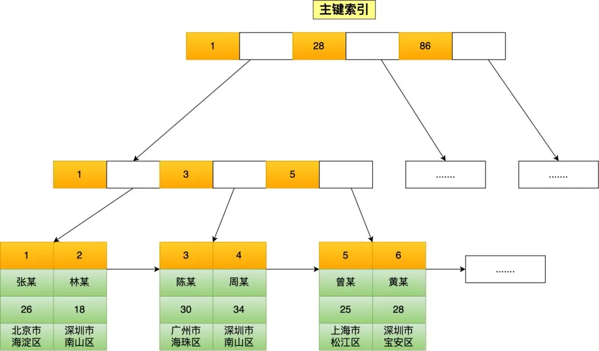
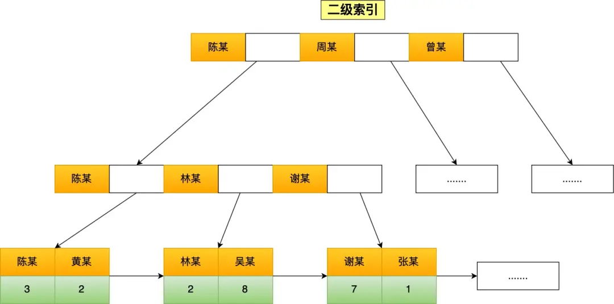

## Blog

### 算法

#### 详细任务

- 654 最大二叉树
- 617 合并二叉树
- 700 二叉搜索树中的搜索
- 98 验证二叉搜索树


#### 654 最大二叉树

又是构造二叉树，昨天大家刚刚做完 中序后序确定二叉树，今天做这个 应该会容易一些， 先看视频，好好体会一下 为什么构造二叉树都是 前序遍历 

题目链接/文章讲解：[https://programmercarl.com/0654.%E6%9C%80%E5%A4%A7%E4%BA%8C%E5%8F%89%E6%A0%91.html](https://programmercarl.com/0654.最大二叉树.html)  

视频讲解：https://www.bilibili.com/video/BV1MG411G7ox  

在看了随想录的视频后，才开始做的。

首先就是判断数组的大小，如果只有一个元素，那么树就只有这一个节点；不然则遍历整个数组，找到其中最大的元素及其对应的下标。从数组开始位置到该下标的那些元素就是二叉树的左子树，剩余的元素则是右子数。需要保证左右子树的节点都是大于0的，即至少有1个节点，这样才能进行递归，因为递归的终止条件就是数组只有1个元素

```cpp
class Solution {
public:
    TreeNode* constructMaximumBinaryTree(vector<int>& nums) {
        TreeNode *node = new TreeNode(nums[0]);
        if (nums.size() == 1) return node;

        int max = nums[0], max_index = 0;
        for (int i = 1; i < nums.size(); ++i)
            if (nums[i] > max) {
                max = nums[i];
                max_index = i;
            }
        node->val = max;

        if (max_index > 0) {
            vector<int> left(nums.begin(), nums.begin() + max_index);
            node->left = constructMaximumBinaryTree(left);
        }
        if (nums.size() - 1 - max_index > 0) {
            vector<int> right(nums.begin() + max_index + 1, nums.end());
            node->right = constructMaximumBinaryTree(right);
        }
        return node;
    }
};
```


#### 617 合并二叉树

这次是一起操作两个二叉树了， 估计大家也没一起操作过两个二叉树，也不知道该如何一起操作，可以看视频先理解一下。 优先掌握递归。

题目链接/文章讲解：[https://programmercarl.com/0617.%E5%90%88%E5%B9%B6%E4%BA%8C%E5%8F%89%E6%A0%91.html](https://programmercarl.com/0617.合并二叉树.html)  

视频讲解：https://www.bilibili.com/video/BV1m14y1Y7JK  

看到这道题还是比较懵逼的，需要同时操作两棵二叉树。看了随想录的视频后，才有了思路

这道题前、中、后序都可以实现，而且代码也基本上一样的，也可以使用迭代法。这里采用前序的方式，更加利于理解

同时操作两棵二叉树，并没有想象中的那么复杂，而且这里是两棵二叉树同步进行，这样其实跟之前的判断二叉树对称的题思路是一样的。创建一个新的二叉树，其根节点就是给出的两棵二叉树根节点之和，其左子树就是给出的两棵二叉树的左子树进行递归，右子树同理。直到有一棵二叉树的节点为空，那么新二叉树的该节点就是另一棵二叉树的该节点

```cpp
class Solution {
public:
    TreeNode* mergeTrees(TreeNode* root1, TreeNode* root2) {
        if (!root1) return root2;
        if (!root2) return root1;

        TreeNode *root = new TreeNode(root1->val + root2->val);
        root->left = mergeTrees(root1->left, root2->left);
        root->right = mergeTrees(root1->right, root2->right);
        return root;
    }
};
```

使用迭代法也是这个思路，只是使用队列来存储一下两棵树的节点。需要注意的就是需要创建新的左子树节点和右子树节点

```cpp
class Solution {
public:
    TreeNode* mergeTrees(TreeNode* root1, TreeNode* root2) {
        if (!root1) return root2;
        if (!root2) return root1;

        TreeNode *merged = new TreeNode(root1->val + root2->val);
        queue<pair<TreeNode *, TreeNode *>> que;
        queue<TreeNode *> ret;
        que.push({root1, root2});
        ret.push(merged);
        while (!que.empty()) {
            auto [node1, node2] = que.front();
            que.pop();
            TreeNode *cur = ret.front();
            ret.pop();
            if (node1->left || node2->left) {
                if (node1->left && node2->left) {
                    TreeNode *left = new TreeNode(node1->left->val + node2->left->val);
                    cur->left = left;
                    que.push({node1->left, node2->left});
                    ret.push(left);
                } else {
                    cur->left = node1->left ? node1->left : node2->left;
                }
            }
            if (node1->right || node2->right) {
                if (node1->right && node2->right) {
                    TreeNode *right= new TreeNode(node1->right->val + node2->right->val);
                    cur->right = right;
                    que.push({node1->right, node2->right});
                    ret.push(right);
                } else {
                    cur->right = node1->right? node1->right : node2->right;
                }
            }
        }
        return merged;
    }
};
```


#### 700 二叉搜索树中的搜索

递归和迭代 都可以掌握以下，因为本题比较简单， 了解一下 二叉搜索树的特性

题目链接/文章讲解: [https://programmercarl.com/0700.%E4%BA%8C%E5%8F%89%E6%90%9C%E7%B4%A2%E6%A0%91%E4%B8%AD%E7%9A%84%E6%90%9C%E7%B4%A2.html](https://programmercarl.com/0700.二叉搜索树中的搜索.html)  

视频讲解：https://www.bilibili.com/video/BV1wG411g7sF  

本题还是比较简单的，看到题目之后，想到的就是使用前序+递归的思路遍历二叉树中的所有节点，但是这样做效率比较低，而且没有用到二叉搜索树的特性。

重新写一版，利用了二叉搜索树$左<中<右$的特性

```cpp
class Solution {
public:
    TreeNode* searchBST(TreeNode* root, int val) {
        if (!root) return nullptr;

        if (root->val == val) return root;
        else if (root->left && val < root->val)
            root = searchBST(root->left, val);
        else if (root->right && val > root->val)
            root = searchBST(root->right, val);
        else return nullptr;

        return root;
    }
};
```

看了随想录的视频后，更新了一下，使代码表述的逻辑更准确

```cpp
class Solution {
public:
    TreeNode* searchBST(TreeNode* root, int val) {
        if (!root || root->val == val)
            return root;

        TreeNode *node = nullptr;
        if (val < root->val)
            node = searchBST(root->left, val);
        else node = searchBST(root->right, val);

        return node;
    }
};
```

迭代法：思路和之前的是一样的

```cpp
class Solution {
public:
    TreeNode* searchBST(TreeNode* root, int val) {
        if (!root || root->val == val)
            return root;

        while (root) {
            if (val < root->val)
                root = root->left;
            else if (val > root->val)
                root = root->right;
            else return root;
        }
        return nullptr;
    }
};
```


#### 98 验证二叉搜索树

遇到 搜索树，一定想着中序遍历，这样才能利用上特性。 

但本题是有陷阱的，可以自己先做一做，然后在看题解，看看自己是不是掉陷阱里了。这样理解的更深刻。

题目链接/文章讲解：[https://programmercarl.com/0098.%E9%AA%8C%E8%AF%81%E4%BA%8C%E5%8F%89%E6%90%9C%E7%B4%A2%E6%A0%91.html](https://programmercarl.com/0098.验证二叉搜索树.html) 

视频讲解：https://www.bilibili.com/video/BV18P411n7Q4  

这道题，看到就有思路的，直接开始写，然后就掉到坑里了，验证是否是BST，左边比较的是最右边的节点是否小于根节点，以及右边的最左边的节点是否大于根节点。我写的时候递归下去后，就没有办法和整棵二叉树的那个根节点进行比较了

在看了随想录的视频后，前面的几种都听懂了，但是最后一种不是很理解

```cpp
class Solution {
public:
    TreeNode *pre = nullptr; // pre 变量指向中序遍历过程中的前一个节点
    bool isValidBST(TreeNode* root) {
        if (!root) return true;

        bool left = isValidBST(root->left);// 递归判断当前节点的左子树是否是有效的二叉搜索树
        if (pre && pre->val >= root->val)
            // 中序遍历应该是一个升序序列，如果当前节点 root->val 小于或等于 pre->val，则说明违反了二叉搜索树的性质
            return false;
        pre = root; // 将 pre 更新为当前的节点 root，以便在接下来的递归过程中，比较当前节点的值与它的右子树节点。
        bool right = isValidBST(root->right);

        return left && right;
    }
};
```


### 八股文

#### MySQL的存储引擎有哪些？

掌握程度：

- 至少回答出InnoDB和MyISAM这两种最常用的存储引擎及其特点，以及它们适用的场景，了解Memory、Archive等其他引擎及其使用场景
- 理解不同存储引擎在事务支持、锁定机制、性能和适用场景方面的差异。
- 知道如何根据业务需求选择合适的存储引擎。

参考资料：

- 视频：MySQL有哪些存储引擎

    https://www.bilibili.com/video/BV1zr4y1x7o7/?share_source=copy_web&vd_source=9bb0aa9c2c3cc1b12ca6f343a55b4e80


MySQL提供了多种存储引擎，在这里只列出部分常见的 ：

- ARCHIVE：用于数据存档的引擎，数据被插入后就不能在修改了，且不支持索引。
- CSV：在存储数据时，会以逗号作为数据项之间的分隔符。
- BLACKHOLE：会丢弃写操作，该操作会返回空内容。
- FEDERATED：将数据存储在远程数据库中，用来访问远程表的存储引擎。
- InnoDB：具备外键支持功能的事务处理引擎
- MEMORY：置于内存的表
- MERGE：用来管理由多个 MyISAM 表构成的表集合
- MyISAM：主要的非事务处理存储引擎
- NDB：MySQL 集群专用存储引擎

##### InnoDB

InnoDB 是功能全面、性能可靠的存储引擎，非常适合需要事务支持和高并发性能的应用场景。它是 MySQL 的一种默认存储引擎，从 MySQL 5.5 版本开始被设为默认存储引擎。

###### 特点：

**1. 事务支持**

- **ACID特性**：InnoDB 支持事务，保证数据库的原子性、一致性、隔离性和持久性（ACID）。
- **事务隔离级别**：支持包括读未提交（Read Uncommitted）、读已提交（Read Committed）、可重复读（Repeatable Read）和可序列化（Serializable）在内的标准隔离级别。

**2. 行级锁**

- 支持**行级锁**，这意味着在并发读写操作时，锁定的粒度更小，从而减少锁冲突，提高了并发性能。
- 对特定行的更新操作不会阻塞其他行的读写操作，非常适合高并发环境。

**3. 外键支持**

- InnoDB 是 MySQL 中支持外键的存储引擎之一。外键允许定义表与表之间的关系，并确保数据完整性。
- 支持在插入、更新或删除操作时进行外键约束检查。

**4. 崩溃恢复**

- 使用**重做日志（Redo Log）**和**撤销日志（Undo Log）**来实现崩溃恢复功能。在系统崩溃或断电后，InnoDB 可以通过重做日志恢复到一致性状态。
- 支持自动检查并修复受损表空间。

**5. 多版本并发控制 (MVCC)**

- InnoDB 使用多版本并发控制来管理并发事务，使读操作不会阻塞写操作，反之亦然。
- MVCC 的实现依赖于 Undo Log，每个事务能“看到”事务开始时的数据快照。

**6. 自动行格式管理**

- InnoDB 自动管理存储行数据的格式，支持动态行长度，提高了数据存储的灵活性。

**7. 数据存储**

- 数据和索引都存储在**表空间**（Tablespace）中。
- 默认情况下，表空间可以是共享表空间文件（如 `ibdata` 文件）或独立的文件（.ibd 文件）。

###### 优缺点

优点：

1. **数据一致性高**：支持事务和外键，适合需要数据一致性保障的应用场景。

2. **高并发性能**：行级锁和 MVCC 提升了高并发性能。

3. **崩溃恢复能力强**：通过重做日志和撤销日志实现数据自动恢复。

4. **支持复杂查询**：对索引的优化和事务的支持使其适合复杂的查询和操作。

缺点：

1. 资源占用较高：

    - 相比 MyISAM，InnoDB 的内存和磁盘空间占用更大。
    - 性能依赖于数据库缓存（InnoDB Buffer Pool）的大小和配置。

2. 只读场景性能可能逊色：

    如果是只读操作场景，性能可能不如轻量化的 MyISAM。

3. **维护复杂性高**：数据存储和日志机制的复杂性使其更难维护。

###### 应用场景

1. **事务性需求**：如银行、支付系统、电商交易等场景，确保事务完整性和一致性。
2. **高并发读写**：如论坛、社交平台、在线游戏等需要高并发处理的系统。
3. **复杂业务逻辑**：需要使用外键来维护数据关系时。

不适合：

1. **以读为主的业务**：如果以大量查询为主，且事务性要求不高，可以考虑性能更优的 MyISAM。
2. **简单日志存储**：对于归档数据或无需复杂操作的场景，Archive 或 CSV 存储引擎可能更适合。

##### MyISAM

**MyISAM** 是 MySQL 的一种存储引擎，曾经是 MySQL 的默认存储引擎（在 MySQL 5.5 之前）。它是一个轻量级的存储引擎，设计简单，读取性能优秀，适用于以查询为主、对数据一致性和事务要求不高的场景。MyISAM 在现代应用中更多被用于日志、数据归档或简单检索场景。

###### 特点

**1. 不支持事务**

- MyISAM 不支持事务管理，也就是说它无法提供 ACID 特性。
- 数据一致性需要由应用程序自行保障。

**2. 表级锁**

- MyISAM 使用表级锁，即一次操作会锁定整个表。
- 写操作会阻塞读操作，读操作之间可以并发进行。
- 高并发写入性能较差，但对于读操作性能表现良好。

**3. 数据存储与索引分离**

- MyISAM 表将数据和索引存储在单独的文件中：
    - **数据文件**：以 `.MYD` 文件存储。
    - **索引文件**：以 `.MYI` 文件存储。
- 数据和索引独立存储，方便备份和恢复。

**4. 不支持外键**

- 不支持外键约束，因此无法直接在数据库层面定义表与表之间的关系。
- 数据完整性需通过应用逻辑保证。

**5. 全文索引**

- MyISAM 支持全文索引（Full-text Index），在处理全文检索（如搜索功能）时非常高效。
- InnoDB 从 MySQL 5.6 开始也支持全文索引，但 MyISAM 的实现更加轻量化。

**6. 索引效率高**

- MyISAM 的索引设计比较简单，尤其在只读查询场景中，其查询效率非常高。

**7. 数据压缩**

- 支持表压缩功能，可以通过工具生成只读的压缩表，节省存储空间。

###### 优缺点

优点：

- **读取性能优秀**：由于索引结构简单且优化良好，MyISAM 的读取性能在某些场景下优于 InnoDB。
- **占用资源少**：内存使用量和磁盘存储需求相对较小。
- **易于维护**：数据和索引分开存储，备份和恢复操作简单。
- **支持全文索引**：适用于需要全文检索的场景。
- **简单易用**：对于没有复杂事务需求的小型应用，MyISAM 足够高效。

缺点：

- **不支持事务**：无法提供事务功能，数据一致性和完整性无法在数据库层面保证。
- **表级锁限制高并发**：在高并发写操作场景下，由于表级锁的存在，性能可能下降。
- 崩溃恢复能力差：
    - 如果系统发生崩溃或断电，数据容易损坏。
    - 需要通过 `myisamchk` 工具进行手动修复。
- **不支持外键**：对于复杂表间关系的处理能力不足。
- **不适合频繁写入场景**：大量写操作会导致表锁定，影响性能。

###### 应用场景

1. 读取操作为主：
    - 数据分析系统。
    - 报表查询场景。
2. 全文检索：
    - 搜索引擎。
    - 内容管理系统（CMS）。
3. 对事务性要求不高的场景：
    - 小型网站或应用。
    - 数据存储与查询场景。

不适合：

- **事务性需求高**：如银行系统、电商交易等需要高一致性保障的业务。
- **高并发写入**：如实时更新的社交平台或物联网数据采集。
- **需要崩溃自动恢复**：如果系统对可靠性要求高，InnoDB 是更好的选择。

##### MEMORY

MEMORY 存储引擎以其极高的读写速度和简单的实现适合特定的应用场景，尤其是在需要快速访问的小型数据集或临时数据处理中。然而，由于其数据仅存储在内存中，无法持久化，因此在关键业务场景中通常不被推荐。如果需要既高性能又可靠的存储，可以考虑将 MEMORY 用作缓存，与其他存储引擎（如 InnoDB）配合使用

**1. 数据存储在内存中**

- 所有表数据都存储在内存中，速度非常快。
- 索引也存储在内存中，访问性能更高。
- 数据的持久性差，服务器重启或宕机会导致数据丢失。

**2. 支持固定长度的表**

- 每行的字段长度是固定的，即使是可变长度字段（如 `VARCHAR`），也会被转换为固定长度格式存储。
- 因此，存储效率较低，但访问效率高。

**3. 支持哈希索引和 B-Tree 索引**

- **哈希索引**（默认）：适合等值查询操作，速度快。
- **B-Tree 索引**：适合范围查询或排序操作。

**4. 不支持事务和外键**

- MEMORY 不支持事务功能（即 ACID 特性）。
- 不支持外键约束，因此数据完整性需要由应用程序负责。

**5. 表大小受内存限制**

- MEMORY 表的大小受可用内存的限制，存储大量数据时可能导致内存耗尽。
- 在 MySQL 中，可以通过 `max_heap_table_size` 参数设置 MEMORY 表的最大大小。

**6. 数据临时性**

- 通常用于会话级临时数据存储。
- 可用于存储非关键性或中间结果的数据。

##### ARCHIVE

ARCHIVE 是一个为数据归档场景量身定制的存储引擎，特别适合存储不常访问的历史数据或日志信息。其高效的压缩功能使其成为节省存储空间的绝佳选择，但缺乏事务支持、索引功能和实时查询能力，使其只适合特定场景。在实际应用中，可以将 ARCHIVE 与其他存储引擎结合使用，以满足不同的数据存储需求。

**1. 数据压缩**

- **自动压缩存储**：ARCHIVE 引擎会对插入的数据进行压缩，默认使用 Zlib 算法。这大幅减少了存储空间需求。
- 数据压缩是无损的，在读取时会自动解压缩。

**2. 只支持插入和查询**

- 支持 `INSERT` 和 `SELECT` 操作。
- 不支持 `UPDATE` 和 `DELETE` 操作，因此数据是**不可修改**的。
- 这种特性使其非常适合存储历史数据或归档数据。

**3. 锁机制**

- 使用表级锁，不支持行级锁。
- 在插入数据时会锁定整个表，这在高并发写入场景下可能会影响性能。

**4. 存储高效**

- 数据和索引分开存储，表中数据按照压缩后的格式存放，因此存储效率极高。
- ARCHIVE 引擎的设计目标是最大程度减少磁盘占用。

**5. 不支持索引（仅支持自动生成的主键索引）**

- 除主键外，ARCHIVE 表不支持创建其他索引。
- 查询性能可能会因为缺乏索引而受到限制，尤其是在数据量很大的情况下。

**6. 无事务支持**

- ARCHIVE 不支持事务操作，也不支持 ACID 特性。

**7. 数据写入是追加模式**

- 数据以追加方式写入表中，因此历史数据不会被覆盖或删除。

##### 总结

| 特性             | **MyISAM**           | **InnoDB**                       | **MEMORY**                     | **ARCHIVE**                      |
| ---------------- | -------------------- | -------------------------------- | ------------------------------ | -------------------------------- |
| **事务支持**     | 不支持               | 支持（ACID 特性）                | 不支持                         | 不支持                           |
| **锁机制**       | 表级锁               | 行级锁 + 表级锁                  | 表级锁                         | 表级锁                           |
| **数据压缩**     | 不支持               | 不支持                           | 不支持                         | 支持（自动压缩）                 |
| **外键支持**     | 不支持               | 支持                             | 不支持                         | 不支持                           |
| **数据存储位置** | 磁盘                 | 磁盘                             | 内存                           | 磁盘（压缩存储）                 |
| **数据丢失风险** | 崩溃后可能丢失       | 数据持久化且支持崩溃恢复         | 数据在内存中，重启或崩溃会丢失 | 数据存储在磁盘，稳定但不支持修改 |
| **支持索引**     | 支持（多种索引类型） | 支持（包括全文索引、B+树索引等） | 支持（哈希索引和 B-Tree 索引） | 仅支持自动生成的主键索引         |
| **全文索引**     | 支持                 | 支持（从 MySQL 5.6 开始）        | 不支持                         | 不支持                           |
| **更新和删除**   | 支持                 | 支持                             | 支持（仅插入和查询）           | 不支持                           |
| **存储效率**     | 中等                 | 相对较高                         | 低（固定长度字段占用更多内存） | 高（压缩后存储）                 |


#### ==**MySQL为什么使用B+树来作索引**==（重点）

掌握程度：

- 能够清晰地描述B+树作为索引结构的优势和适用性。
- 理解B+树如何提高数据库的查询效率和减少磁盘I/O。
- 知道B+树如何支持高效的范围查询和事务处理。

参考资料：

- 视频：MySQL索引数据结构为什么使用B+树，我来告诉你

    https://www.bilibili.com/video/BV1yT4y1w7FS/?share_source=copy_web&vd_source=9bb0aa9c2c3cc1b12ca6f343a55b4e80

- 小林coding：MySQL为什么使用B+树来作索引

    https://xiaolincoding.com/mysql/index/why_index_chose_bpuls_tree.html

    https://mp.weixin.qq.com/s?__biz=MzUxODAzNDg4NQ==&mid=2247502059&idx=1&sn=ccbee22bda8c3d6a98237be769a7c89c&scene=21#wechat_redirect


##### 要求

MySQL 的数据是持久化的，意味着数据（索引+记录）是保存到磁盘上的，而磁盘的访问速度比起内存来说要慢上万倍。而由于数据库的索引是保存在磁盘上的，因此通过索引查找某行数据时，需要先从磁盘读取索引到内存，再通过索引从磁盘中找到某行的数据，然后读入到内存，即查询过程中会发生多次磁盘I/O，耗时长。而且MySQL支持范围查找，因此索引的数据结构要满足尽可能少的磁盘I/O完成查询，且支持高效的范围查找

##### B+树

> 为了支持范围查找，需要索引数据能够按序排列，这样便于使用二分法高效定位数据，如果使用数组来存储，对于插入和删除效率太低；使用链表则查询的效率非常低，二者都不符合要求。因此，可以使用树型结构来进行存储，而且二叉查找树天然就契合二分法，查找、插入、删除的效率都比较高。
>
> 但是为防止出现极端的情况（二叉树退化成链表），更近一步使用平衡二叉树或红黑树，但是，随着插入元素的增加，导致树高增加，即磁盘I/O的操作次数增加，从而影响了整体数据查询的效率。
>
> 为了解决降低树高的问题，考虑到树的特性：==**当树的节点越多的时候，并且树的分叉数 M 越大的时候，M 叉树的高度会远小于二叉树的高度**==。由此引出B树，它不限制一个节点只能有2个子节点，而是允许M个子节点(M>2)，从而降低树高。即B树的每个节点最多可以包括M个子节点，M称为B树的阶，B树就是一个多叉树。
>
> 但是，B 树的每个节点都包含数据（索引+记录），而用户的记录数据的大小很有可能远远超过了索引数据，这就需要花费更多的磁盘 I/O 操作次数来读到「有用的索引数据」。而且，在查询位于底层的某个节点过程中，「非该记录节点」里的记录数据会从磁盘加载到内存，但是这些记录数据是没用的，我们只是想读取这些节点的索引数据来做比较查询，而「非该记录节点」里的记录数据是没用的，这样不仅增多磁盘 I/O 操作次数，也占用内存资源。

基于以上几种数据结构的问题，由此引出了B+树

B+树是一种平衡树结构，广泛用于数据库和文件系统中。它是一种自平衡的多叉树（通常是 m 阶树，其中 m 表示树的阶数），专为磁盘存储和快速查询而设计。与 B 树类似，它能保持数据的有序性，并支持高效的范围查询和插入、删除操作。


B+ 树的特点：

1. B+ 树的非叶子节点不存放实际的记录数据，仅存放索引，因此数据量相同的情况下，相比存储即存索引又存记录的 B 树，B+树的非叶子节点可以存放更多的索引，因此 B+ 树可以比 B 树更「矮胖」，查询底层节点的磁盘 I/O次数会更少。

2. B+ 树有大量的冗余节点，这样使得删除一个节点的时候，可以直接从叶子节点中删除，甚至可以不动非叶子节点，这样删除非常快

    B+ 树的插入也是一样，有冗余节点，插入可能存在节点的分裂（如果节点饱和），但是最多只涉及树的一条路径。而且 B+ 树会自动平衡，不需要像更多复杂的算法，类似红黑树的旋转操作等。

3. **B+ 树所有叶子节点间还有一个链表进行连接，这种设计对范围查找非常有帮助**

##### MySQL 中的 B+ 树

MySQL 的存储方式根据存储引擎的不同而不同，最常用的就是 Innodb 存储引擎，它就是采用了 B+ 树作为了索引的数据结构。


 Innodb 使用的 B+ 树有一些特别的点：

- B+ 树的叶子节点之间是用「双向链表」进行连接，这样的好处是既能向右遍历，也能向左遍历。
- B+ 树点节点内容是数据页，数据页里存放了用户的记录以及各种信息，每个数据页默认大小是 16 KB。

Innodb 根据索引类型不同，分为聚集和二级索引。他们区别在于，聚集索引的叶子节点存放的是实际数据，所有完整的用户记录都存放在聚集索引的叶子节点，而二级索引的叶子节点存放的是主键值，而不是实际数据。

因为表的数据都是存放在聚集索引的叶子节点里，所以 InnoDB 存储引擎一定会为表创建一个聚集索引，且由于数据在物理上只会保存一份，所以聚簇索引只能有一个，而二级索引可以创建多个。

##### 总结

MySQL 默认的存储引擎 InnoDB 采用的是 B+ 作为索引的数据结构，原因有：

- B+ 树的非叶子节点不存放实际的记录数据，仅存放索引，因此数据量相同的情况下，相比存储即存索引又存记录的 B 树，B+树的非叶子节点可以存放更多的索引，因此 B+ 树可以比 B 树更「矮胖」，查询底层节点的磁盘 I/O次数会更少。
- B+ 树有大量的冗余节点（所有非叶子节点都是冗余索引），这些冗余索引让 B+ 树在插入、删除的效率都更高，比如删除根节点的时候，不会像 B 树那样会发生复杂的树的变化；
- B+ 树叶子节点之间用链表连接了起来，有利于范围查询，而 B 树要实现范围查询，因此只能通过树的遍历来完成范围查询，这会涉及多个节点的磁盘 I/O 操作，范围查询效率不如 B+ 树。


#### 说一下索引失效的场景

掌握程度：

- 能够清晰地描述至少几种索引失效的场景。
- 理解索引失效的原因，以及它们对查询性能的影响。
- 知道如何优化查询条件以利用索引。

参考资料

- 视频：MySQL索引失效的底层原理，终于有人讲清楚了

    https://www.bilibili.com/video/BV1Sp4y1e7W6/?share_source=copy_web&vd_source=9bb0aa9c2c3cc1b12ca6f343a55b4e80

- 小林coding：索引失效的场景

    https://xiaolincoding.com/mysql/index/index_lose.html


存储引擎就是负责将数据持久化在磁盘中，而不同的存储引擎采用的索引数据结构也会不相同。MySQL 默认的存储引擎是 InnoDB，它采用 B+Tree 作为索引的数据结构。

在创建表时，InnoDB 存储引擎默认会创建一个主键索引，也就是聚簇索引，其它索引都属于二级索引。

> 主键索引（聚簇索引）是数据库中一种特殊的索引类型，通常是表的默认索引。它将数据表中的行按照主键值的顺序物理存储在磁盘上，也就是说，表的数据和索引是合并在一起的，数据的存储顺序就是索引的顺序。因此，聚簇索引的叶节点存储的是实际的数据行，而不是指向数据的指针。每个表只能有一个聚簇索引，因为数据只能有一个物理存储顺序。

InnoDB 存储引擎，B+ 树索引的叶子节点保存数据本身（如下图）；而MyISAM 存储引擎：B+ 树索引的叶子节点保存数据的物理地址



InnoDB 存储引擎根据索引类型不同，分为聚簇索引（上图就是聚簇索引）和二级索引。它们区别在于，聚簇索引的叶子节点存放的是实际数据，所有完整的用户数据都存放在聚簇索引的叶子节点，而二级索引的叶子节点存放的是主键值，而不是实际数据。

如果将 name 字段设置为普通索引，那么这个二级索引长下图这样（图中叶子节点之间是单向链表，但是实际上是双向链表），**叶子节点仅存放主键值**。



在使用「主键索引」字段作为条件查询的时候，如果要查询的数据都在「聚簇索引」的叶子节点里，那么就会在「聚簇索引」中的 B+ 树检索到对应的叶子节点，然后直接读取要查询的数据。如：`select * from t_user where id=1;`（id 字段为主键索引）

而在使用「二级索引」字段作为条件查询的时候，如果要查询的数据都在「聚簇索引」的叶子节点里，那么需要检索两颗B+树：

- 先在「二级索引」的 B+ 树找到对应的叶子节点，获取主键值；
- 然后用上一步获取的主键值，在「聚簇索引」中的 B+ 树检索到对应的叶子节点，然后获取要查询的数据。

上面这个过程叫做**回表**，如：`select * from t_user where name="林某";`（name 字段为二级索引）

在使用「二级索引」字段作为条件查询的时候，如果要查询的数据在「二级索引」的叶子节点，那么只需要在「二级索引」的 B+ 树找到对应的叶子节点，然后读取要查询的数据，这个过程叫做**覆盖索引**。`select id from t_user where name="林某";`（name 字段为二级索引）

上面这些查询语句的条件都用到了索引列，所以在查询过程都用上了索引。但是并不意味着，查询条件用上了索引列，就查询过程就一定都用上索引

1. ==**当使用左或者左右模糊匹配的时候，也就是 `like %xx` 或者 `like %xx%` 这两种方式都会造成索引失效。**==例如：`select * from t_user where name like '%林';`此时，执行计划中的`type = ALL`表示进行了全表扫描，而没有走索引

相反，如果是`select * from t_user where name like '林%';`则会走`index_name`索引。

**因为索引 B+ 树是按照「索引值」有序排列存储的，只能根据前缀进行比较。**如上图的二级索引图是以 name 字段有序排列存储的。

假设我们要查询 name 字段前缀为「林」的数据，也就是 `name like '林%'`，扫描索引的过程：

- 首节点查询比较：林这个字的拼音大小比首节点的第一个索引值中的陈字大，但是比首节点的第二个索引值中的周字小，所以选择去节点2继续查询；
- 节点 2 查询比较：节点2的第一个索引值中的陈字的拼音大小比林字小，所以继续看下一个索引值，发现节点2有与林字前缀匹配的索引值，于是就往叶子节点查询，即叶子节点4；
- 节点 4 查询比较：节点4的第一个索引值的前缀符合林字，于是就读取该行数据，接着继续往右匹配，直到匹配不到前缀为林的索引值。

如果使用 `name like '%林'` 方式来查询，因为查询的结果可能是「陈林、张林、周林」等之类的，所以不知道从哪个索引值开始比较，于是就只能通过全表扫描的方式来查询。

2. 此外，在查询条件中对索引进行表达式计算，也是无法走索引的。如，`select * from t_user where id + 1 = 10;`因为索引保存的是索引字段的原始值，而不是 id + 1 表达式计算后的值，所以无法走索引，只能通过把索引字段的取值都取出来，然后依次进行表达式的计算来进行条件判断，因此采用的就是全表扫描的方式。而`id = 10 - 1`则是可以的

3. 如果索引字段是字符串类型，但是在条件查询中，输入的参数是整型的话，在执行计划的结果发现这条语句会走全表扫描。如，`select * from t_user where phone = 1300000001;`

    MySQL 的数据类型转换规则是：

    - 如果规则是 MySQL 会将自动「字符串」转换成「数字」，就相当于 select 10 > 9，这个就是数字比较，所以结果应该是 1；
    - 如果规则是 MySQL 会将自动「数字」转换成「字符串」，就相当于 select "10" > "9"，这个是字符串比较，字符串比较大小是逐位从高位到低位逐个比较（按ascii码） ，那么"10"字符串相当于 “1”和“0”字符的组合，所以先是拿 “1” 字符和 “9” 字符比较，因为 “1” 字符比 “9” 字符小，所以结果应该是 0。

    所以， **MySQL 在遇到字符串和数字比较的时候，会自动把字符串转为数字，然后再进行比较**。

4. 对主键字段建立的索引叫做聚簇索引，对普通字段建立的索引叫做二级索引。

    那么**多个普通字段组合在一起创建的索引就叫做联合索引**，也叫组合索引。

    联合索引要能正确使用需要遵循**最左匹配原则**，也就是按照最左优先的方式进行索引的匹配。

    比如，如果创建了一个 `(a, b, c)` 联合索引，如果查询条件是以下这几种，就可以匹配上联合索引：

    - where a=1；
    - where a=1 and b=2 and c=3；
    - where a=1 and b=2；

    需要注意的是，因为有查询优化器，所以 a 字段在 where 子句的顺序并不重要。

    ==联合索引不遵循最左匹配原则就会失效==，因为在联合索引的情况下，数据是按照索引第一列排序，第一列数据相同时才会按照第二列排序。

    也就是说，如果我们想使用联合索引中尽可能多的列，查询条件中的各个列必须是联合索引中从最左边开始连续的列。如果我们仅仅按照第二列搜索，肯定无法走索引。

5. 在 WHERE 子句中，如果在 OR 前的条件列是索引列，而在 OR 后的条件列不是索引列，那么索引会失效。如，`select * from t_user where id = 1 or age = 18;`

    因为OR 的含义就是两个只要满足一个即可，因此只有一个条件列是索引列是没有意义的，只要有条件列不是索引列，就会进行全表扫描。

##### 总结： 6 种会发生索引失效的情况

- 当我们使用左或者左右模糊匹配的时候，也就是 `like %xx` 或者 `like %xx%`这两种方式都会造成索引失效；
- 当我们在查询条件中对索引列使用函数，就会导致索引失效。
- 当我们在查询条件中对索引列进行表达式计算，也是无法走索引的。
- MySQL 在遇到字符串和数字比较的时候，会自动把字符串转为数字，然后再进行比较。如果字符串是索引列，而条件语句中的输入参数是数字的话，那么索引列会发生隐式类型转换，由于隐式类型转换是通过 CAST 函数实现的，等同于对索引列使用了函数，所以就会导致索引失效。
- 联合索引要能正确使用需要遵循最左匹配原则，也就是按照最左优先的方式进行索引的匹配，否则就会导致索引失效。
- 在 WHERE 子句中，如果在 OR 前的条件列是索引列，而在 OR 后的条件列不是索引列，那么索引会失效。


### 总结

凡是构造二叉树类的题目都要使用前序遍历，即中左右的顺序，一定需要先构造出根节点，再递归地构造左右子树

今天的题目一开始拿到题目的时候，感觉还是比较难的，但是只要理解的思路、熟悉的二叉树的遍历，其实也就非常简单了，这些题目都可以说是遍历二叉树的变种，因此还是要多复习复习树的遍历。
