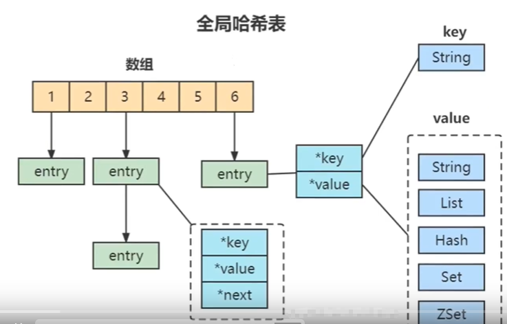
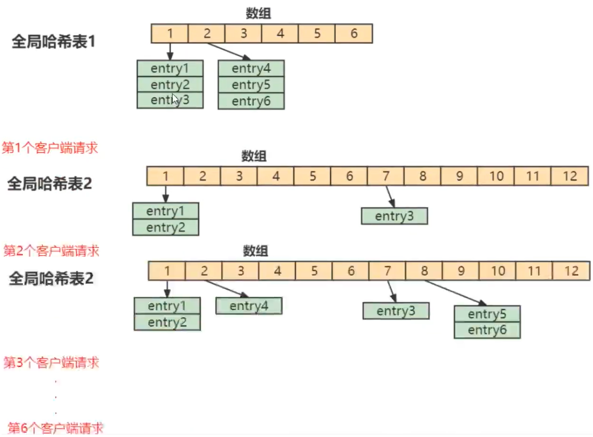

## Blog

### 算法

#### 详细任务

- 235 二叉搜索树的最近公共祖先
- 701 二叉搜索树中的插入操作
- 450 删除二叉搜索树中的节点


#### 235 二叉搜索树的最近公共祖先

相对于 二叉树的最近公共祖先 本题就简单一些了，因为 可以利用二叉搜索树的特性。 

题目链接/文章讲解：[https://programmercarl.com/0235.%E4%BA%8C%E5%8F%89%E6%90%9C%E7%B4%A2%E6%A0%91%E7%9A%84%E6%9C%80%E8%BF%91%E5%85%AC%E5%85%B1%E7%A5%96%E5%85%88.html](https://programmercarl.com/0235.二叉搜索树的最近公共祖先.html)  

视频讲解：https://www.bilibili.com/video/BV1Zt4y1F7ww  

这道题和前一题比较像，但是前一题没有理解透，这题不知道应该如何利用二叉搜索树的特性，直接看视频

本题的基本思路就是从根节点开始向下遍历，碰到的第一个大于p且小于q的节点就是他们的最近公共祖先。因为在二叉搜索树中，公共祖先的定义是：对于节点 `p` 和 `q`，它们的最近公共祖先是离 `p` 和 `q` 最近的一个节点，并且这个节点满足以下条件：

- 节点的值大于等于 `p` 的值且小于等于 `q` 的值。
- 这个节点位于 `p` 和 `q` 的路径中，也就是说它是最接近 `p` 和 `q` 的一个节点。

使用递归的思路不断向下查找符合上面的要求的点

- 如果当前节点 `root->val` 大于 `p->val` 且大于 `q->val`，说明 `p` 和 `q` 都在当前节点的左子树中。
- 递归调用 `lowestCommonAncestor` 方法查找左子树。
- 如果在左子树中找到了公共祖先（`left` 不为空），直接返回左子树的公共祖先。

对于右子数也是同理。最后，如果 `root->val` 大于 `p->val` 且小于 `q->val`，或 `root->val` 小于 `p->val` 且大于 `q->val`，说明当前节点 `root` 是 `p` 和 `q` 的最近公共祖先。
> 疑问：为什么需要在条件中同时检查 `root->val > p->val && root->val > q->val` 或 `root->val < p->val && root->val < q->val`，而不是只判断单一条件？
> 先明确二叉搜索树的特性
>
> 1. 左子树的所有节点值小于根节点值。
> 2. 右子树的所有节点值大于根节点值
>
> 不能够通过`root->val > q->val`直接推出`root->val > p->val`，因为p和q的==相对大小==是未知的：
>
> - 如果 `p->val < q->val`，p 是较小值，q 是较大值。
> - 如果 `p->val > q->val`，p 是较大值，q 是较小值。
>
> > 假设当前根节点值为 `root->val`，且 `p->val` 和 `q->val` 可能大小不同（即 <u>`p->val` 不一定小于 `q->val`</u>）。下面从两种场景进行推导：
> >
> > 1. 若仅判断 `root->val > q->val`：
> >
> >   当 `p->val > q->val` 时，p 在右子树而 q 在左子树，这种情况下显然不能直接判断出 p 和 q 都在左子树。
> >   因此，仅判断 `root->val > q->val` 不够，因为此时 p 可能在另一侧。
> > 2. 若仅判断 `root->val < p->val`：
> >   当 `q->val < p->val` 时，q 在左子树而 p 在右子树，这种情况下也不能直接判断出 p 和 q 都在右子树。
> >   因此，仅判断 `root->val < p->val` 也不够，因为此时 q 可能在另一侧。
> >   由于 p 和 q 的值大小关系未知，需要分别比较根节点与 p 和 q 的值，以确认它们是否同时位于某一侧（左侧或右侧）。
> >
> > 如果仅依赖单一条件（例如 `root->val > q->val` 或 `root->val < p->val`），无法正确处理 p 和 q 分属左右子树的情况。
```cpp
class Solution {
public:
    TreeNode* lowestCommonAncestor(TreeNode* root, TreeNode* p, TreeNode* q) {
        if (!root) return nullptr;
        if (root->val > p->val && root->val > q->val) {
            TreeNode *left = lowestCommonAncestor(root->left, p, q);
            if (left) return left;
        }

        if (root->val < p->val && root->val < q->val) {
            TreeNode *right = lowestCommonAncestor(root->right, p, q);
            if (right) return right;
        }

        return root;
    }
};
```


#### 701 二叉搜索树中的插入操作

本题比想象中的简单，大家可以先自己想一想应该怎么做，然后看视频讲解，就发现 本题为什么比较简单了。

题目链接/文章讲解：[https://programmercarl.com/0701.%E4%BA%8C%E5%8F%89%E6%90%9C%E7%B4%A2%E6%A0%91%E4%B8%AD%E7%9A%84%E6%8F%92%E5%85%A5%E6%93%8D%E4%BD%9C.html](https://programmercarl.com/0701.二叉搜索树中的插入操作.html)  

视频讲解：https://www.bilibili.com/video/BV1Et4y1c78Y  

在BST上插入一个新的节点只需要在叶子节点上就可以找到插入的新节点的位置。之前自己做的时候，能够想明白应该怎么走，但是没有想到在叶子节点这里进行插入

```cpp
class Solution {
public:
    TreeNode* insertIntoBST(TreeNode* root, int val) {
        if (!root) {
            TreeNode *node = new TreeNode(val);
            return node;
        }
        if (val < root->val)
            // 返回的是插入新节点后的左子树
            root->left = insertIntoBST(root->left, val);
        else if (val > root->val)
            root->right = insertIntoBST(root->right, val);

        return root;
    }
};
```

使用迭代法进行遍历。先利用BST的特性，找到要插入的位置，再创建节点进行插入。个人感觉迭代法比起上面的递归法更好理解

```cpp
class Solution {
public:
    TreeNode* insertIntoBST(TreeNode* root, int val) {
        if (!root) {
            TreeNode *node = new TreeNode(val);
            return node;
        }

        TreeNode *node = root, *pre;
        while (node) {
            pre = node;
            if (val < node->val)
                node = node->left;
            else node = node->right;
        }
        if (pre->val > val)
            pre->left = new TreeNode(val);
        else pre->right = new TreeNode(val);
        return root;
    }
};
```


#### 450 删除二叉搜索树中的节点

相对于 插入操作，本题就有难度了，涉及到改树的结构 

题目链接/文章讲解：[https://programmercarl.com/0450.%E5%88%A0%E9%99%A4%E4%BA%8C%E5%8F%89%E6%90%9C%E7%B4%A2%E6%A0%91%E4%B8%AD%E7%9A%84%E8%8A%82%E7%82%B9.html](https://programmercarl.com/0450.删除二叉搜索树中的节点.html)  

视频讲解：https://www.bilibili.com/video/BV1tP41177us  

本题比较复杂，直接看视频

对于删除BST中的节点，会有以下5种情况：

- 第一种情况：没找到删除的节点，遍历到空节点直接返回了

- 找到删除的节点

    - 第二种情况：左右孩子都为空（叶子节点），直接删除节点， 返回NULL为根节点

    - 第三种情况：删除节点的左孩子为空，右孩子不为空，删除节点，右孩子补位，返回右孩子为根节点

    - 第四种情况：删除节点的右孩子为空，左孩子不为空，删除节点，左孩子补位，返回左孩子为根节点

    - 第五种情况：左右孩子节点都不为空，则将删除节点的左子树头结点（左孩子）放到删除节点的右子树的最左面节点的左孩子上，返回删除节点右孩子为新的根节点。

        

```cpp
class Solution {
public:
    TreeNode* deleteNode(TreeNode* root, int key) {
        if (!root) return nullptr;
        if (root->val == key) {
            if (!root->left && !root->right) {
                delete root;
                return nullptr;
            } else if (root->left && !root->right) {
                TreeNode *node = root->left;
                delete root;
                return node;
            } else if (!root->left && root->right) {
                TreeNode *node = root->right;
                delete root;
                return node;
            } else {
                TreeNode *node = root->right;
                while (node->left)
                    node = node->left;
                node->left = root->left;
                node = root->right;
                delete root;
                return node;
            }
        }

        if (root->val > key)
            root->left = deleteNode(root->left, key);
        if (root->val < key)
            root->right = deleteNode(root->right, key);
        return root;
    }
};
```

本题的代码其实很简单，关键就是要上清楚上面的5种情况

迭代法：

```cpp
class Solution {
public:
    TreeNode *deleteOneNode(TreeNode *node) {
        if (!node) return nullptr;
        if (!node->right) return node->left;

        TreeNode *cur = node->right;
        while (cur->left)
            cur = cur->left;
        cur->left = node->left;
        return node->right;
    }
    TreeNode* deleteNode(TreeNode* root, int key) {
        if (!root) return nullptr;

        TreeNode *cur = root, *pre = nullptr;
        while (cur) {
            if (cur->val == key)
                break;
            pre = cur;
            if (cur->val > key) cur = cur->left;
            else cur = cur->right;
        }
        if (!pre)
            return deleteOneNode(cur);
        if (pre->left && pre->left->val == key)
            pre->left = deleteOneNode(cur);
        if (pre->right && pre->right->val == key)
            pre->right = deleteOneNode(cur);
        return root;
    }
};
```


### 八股文

#### MySQL和Redis的区别？

掌握程度：

- 能够清晰地描述MySQL和Redis的基本特性和区别。
- 理解两者在存储方式、性能、数据结构和应用场景上的差异。
- 知道在不同场景下选择MySQL或Redis的原因。
- 结合项目讨论如何使用MySQL和Redis以发挥各自的优势。

参考资料：

- 小林coding：Redis介绍，为什么用Redis作为MySQL的缓存

    https://xiaolincoding.com/redis/base/redis_interview.html#%E8%AE%A4%E8%AF%86-redis

##### MySQL

MySQL 是一个开源的关系型数据库管理系统（RDBMS），广泛应用于各种互联网应用中，特别是在Web开发领域。它使用结构化查询语言（SQL）来管理数据，通过表格来组织和存储数据。MySQL的特点包括高效、稳定、支持事务等。

MySQL 是一个**开源**的数据库，用户可以自由使用、修改和分发。它是**关系型数据库**，数据表之间通过外键和索引进行关联，支持 SQL 查询语言，具有丰富的查询、更新、删除等操作功能。支持原子性、一致性、隔离性和持久性（**ACID**），保证了事务的可靠性。同时，MySQL 提供了**多种存储引擎**，常用的有 InnoDB 和 MyISAM。InnoDB 支持事务、行级锁和外键等特性，是默认的存储引擎。通过分区、分表、分库等技术，可以提高MySQL的**水平扩展能力**，适用于大规模的数据存储。

MySQL 的数据**存储方式**依赖于所选的存储引擎。最常用的存储引擎是 **InnoDB**，它使用以下存储方式：

- **表空间（Table Space）**：数据存储在表空间中，每个表都有一个数据文件。InnoDB 默认将数据存储在物理磁盘上，但也支持内存存储。
- **行级锁定**：InnoDB 使用行级锁定来保证并发访问的安全性，而 MyISAM 只支持表级锁定。
- **B+ 树索引**：InnoDB 使用 B+ 树结构来建立索引，这使得数据查询具有较高的效率，尤其是在有大量数据时。

MySQL 性能主要体现在以下几个方面：

- **查询性能**：MySQL 支持丰富的索引类型（如 B+ 树、哈希索引、全文索引等），可以优化查询性能，尤其是对于复杂的联接查询。
- **事务性能**：InnoDB 支持高效的事务管理，能够保证大规模的并发事务处理，并且在数据库崩溃时能够恢复数据。
- **缓存机制**：MySQL 提供了查询缓存、键缓存等机制，可以大幅度提升查询效率。
- **并发性能**：MySQL 在高并发情况下，通过锁机制和事务控制，能够保证多用户的安全并发操作。

MySQL 中常见的数据结构如下：

- **表（Table）**：最基本的数据存储结构，数据以行和列的形式存储。
- **索引（Index）**：为了加速查询，MySQL 为表创建索引。索引使用 B+ 树或哈希表等数据结构。
- **视图（View）**：虚拟表，用于简化查询。它是基于 SELECT 查询构建的，可以帮助用户更高效地访问数据。
- **存储过程与触发器（Stored Procedure & Trigger）**：用于封装复杂的逻辑，减少代码冗余。

**MySQL的应用场景**

1. 传统Web应用

    大多数传统的企业级Web应用，如电商平台、内容管理系统（CMS）和博客系统，都依赖于MySQL来存储和管理用户信息、商品数据、交易记录等。

    因为这些应用通常需要一个关系型数据库来保证数据的一致性和完整性，同时它们的数据结构往往是高度结构化的，适合存储在表格中。此外，MySQL 强大的查询和事务支持非常适合这类应用。

2. 数据分析

    使用MySQL存储日志数据并进行后期分析，比如电商网站使用MySQL分析用户行为数据，改进营销策略。

    MySQL可以通过索引、聚合函数和复杂查询来快速进行数据分析，尤其是当数据量尚未达到极其庞大的级别时，MySQL能够高效处理。

3. 金融系统

    银行、支付平台等金融机构的核心数据库，存储客户数据、交易记录、账户余额等。

    金融系统对数据的安全性、事务一致性、可靠性有很高的要求。MySQL支持ACID事务，能够确保复杂的财务交易操作是原子性的，且在系统崩溃时可以恢复。

4. 内容管理系统（CMS）

    WordPress 是最流行的开源内容管理系统，它默认使用 MySQL 来存储文章、用户、评论等数据。

    WordPress等CMS需要高效的存储和查询能力来处理大量的文章、评论等结构化数据，MySQL 提供了这种能力，且在中小型网站中表现良好。

在以上的场景中，MySQL是一个**持久化数据**库，它会将数据保存到磁盘；而Redis是一个内存数据库，默认将数据保存在内存中，虽然也支持持久化，但其核心用途是做缓存和快速的数据存取，因此不适合做主要的长期数据存储。

MySQL**支持ACID事务**，这对于处理复杂的业务逻辑、确保数据一致性非常重要；而Redis仅提供简单的事务功能（通过`MULTI`和`EXEC`），但它不具备像MySQL那样的复杂事务机制。

MySQL支持SQL查询，可以方便地管理和查询复杂的关系型数据；而Redis主要是一个键值存储，虽然支持多种数据结构（如列表、集合、哈希等），但它更适合存储简单的、非结构化的数据。

MySQL支持**复杂的SQL查询**、联接操作、聚合、子查询等，非常适合需要复杂数据分析的场景；Redis虽然支持一些简单的查询操作，但不具备SQL查询语言，无法进行复杂的数据处理。


##### Redis

Redis 是一个开源的高性能键值存储系统，它通常被用于缓存、消息队列、实时数据处理等场景。与 MySQL 等关系型数据库不同，Redis 是一个内存数据库，主要以键值对（Key-Value）的方式存储数据，支持丰富的数据结构，能够提供非常快速的数据访问速度。

Redis 是一个**内存数据库**，所有数据被存储在内存中，只有在需要持久化时才会将数据写入磁盘。因此相较于磁盘存储的数据库（如 MySQL），内存存储使得 Redis 具有极高的读取和写入速度。而由于 Redis 是内存数据库，默认情况下，数据在服务崩溃时可能丢失，因此需要根据应用需求设置持久化策略。

尽管 Redis 是内存数据库，但它支持将**数据持久化**到磁盘中。Redis 提供两种持久化方式：

- **RDB（快照）**：定期将数据存储为二进制文件。在指定时间间隔内保存数据库的快照，适合用于备份和恢复。
- **AOF（追加文件）**：将每个写操作追加到文件中。记录所有写操作，通过日志文件恢复数据。相比 RDB 更为可靠，但会影响性能。

除了基本的字符串类型外，Redis 还支持**多种数据结构**，这使得它不仅仅是一个简单的键值存储，而是一个功能丰富的数据存储平台。常见的数据结构包括：

- **字符串（String）**：最基本的类型，适用于存储简单的数据，如数字、字符串等。
- **列表（List）**：双端链表，支持从两端插入和删除元素，适合用于消息队列等场景。
- **集合（Set）**：无序集合，支持基本的集合操作（如并集、交集、差集），适合用于标签、粉丝列表等场景。
- **有序集合（Sorted Set）**：有序集合，允许对元素进行排序，支持按分数排序，适合实现排行榜等功能。
- **哈希（Hash）**：键值对集合，适合存储对象或结构化数据，如存储用户信息。
- **位图（Bitmap）**：用位表示布尔值，适合存储统计信息（如活跃用户）。
- **HyperLogLog**：用于做数据去重统计，如统计唯一访问者数量。

Redis 支持**单线程**的事件驱动架构，在**高并发**的情况下表现非常好。Redis 使用**单线程模型**来处理所有请求，这虽然意味着无法利用多核 CPU 的计算能力，但通过 I/O 多路复用技术，Redis 仍然能够在高并发的场景下提供优异的性能。再加上，Redis 是一个内存数据库，数据存储在内存中，读写操作极为快速，它的性能通常远超传统的磁盘数据库，能够处理每秒数百万次的操作。而且 Redis 的操作通常是秒级别的，适用于需要**低延迟**的场景，如实时数据处理、在线游戏等。

此外，Redis 支持**发布/订阅**模式，适用于实时消息推送系统。Redis 还支持主从复制、分片（Cluster）和高可用机制（如 Redis Sentinel）等**分布式特性**。

**Redis的应用场景**

1. **缓存**
    Redis 最常见的应用场景之一就是缓存系统。很多应用中，数据库查询操作往往会成为性能瓶颈，尤其是对于热门数据，Redis 作为缓存层，可以大大提高访问速度，减轻数据库负担。

    例如，在电商网站中，商品信息、价格、库存等数据通常会被频繁访问。通过将这些数据缓存到 Redis 中，能够减少对 MySQL 的访问，降低数据库压力，并提升用户体验。

    相较于使用MySQL，Redis有**速度**、**缓存机制**、**减少数据库压力**等方面的优势。

    Redis 存储在内存中，读写速度比 MySQL 快得多，适合高频访问的场景。

    Redis 提供了丰富的缓存策略（如 LRU、TTL、过期时间等），能够根据需求灵活管理缓存数据。

    通过将热点数据缓存在 Redis 中，能够大大减少 MySQL 的查询压力，提高系统的整体性能。

2. **消息队列**
    Redis 支持发布/订阅模式、列表和集合等数据结构，能够高效实现消息队列的功能。在高并发、实时消息传递的场景中，Redis 是非常合适的选择。

    在社交平台或即时通讯应用中，消息传递是核心功能。通过 Redis 的发布/订阅机制，可以快速实现消息的广播与推送。

    相较于使用MySQL，Redis有**高吞吐量**、**低延迟**、**数据结构支持**等方面的优势。

    Redis 支持高并发写入，能够处理大量的实时消息。

    Redis 提供非常低的延迟，适合实时消息推送。

    Redis 提供了适合消息队列的列表数据结构，可以方便地实现队列操作（如 `LPUSH` 和 `BRPOP`）。

3. **实时分析和计数器**
    Redis 的高性能和丰富的数据结构使其非常适合用来做实时计数和数据分析，如实时用户活动统计、实时网站点击量等。

    在某些网站中，统计用户实时在线人数或页面访问量需要快速响应，这时可以利用 Redis 来实时更新计数器。

    相较于使用MySQL，Redis有**高性能计数**、**实时性**等方面的优势。

    Redis 提供原子操作，适合高频次的计数操作，且对内存的优化使其能够处理大规模并发。

    Redis 具有低延迟特点，能够实时更新和读取数据，保证实时统计的准确性。

4. **Session 存储**
    许多 Web 应用需要存储用户的登录会话信息，Redis 在这种场景下非常适用。Redis 提供了高效的存储与读取，并且可以自动过期，适合存储短期有效的会话数据。

    在一个 Web 应用中，可以通过 Redis 存储用户的会话信息（如登录状态、购物车信息等）。

    相较于使用MySQL，Redis有**性能**、**自动过期**等方面的优势。

    会话数据需要频繁读取和更新，Redis 的内存存储和高性能特性非常适合这个需求。

    Redis 支持键值对自动过期，非常适合处理会话数据，避免过期数据占用资源。


#### Redis有什么优缺点？为什么用Redis查询会比较快

掌握程度：

- **能够清晰地描述Redis的主要优点**：如速度快、支持多种数据结构、持久化等。
- **理解Redis的缺点**：如内存限制、数据持久化开销等。
- **知道Redis查询速度快的原因**：如内存存储、优化的数据结构、非阻塞I/O等。
- 了解如何针对Redis进行性能优化。

参考资料：

- 视频：什么是 Redis，有什么优缺点？

    https://www.bilibili.com/video/BV17P4y1F7ef/?share_source=copy_web&vd_source=9bb0aa9c2c3cc1b12ca6f343a55b4e80

- 视频：Redis刷题01：Redis为什么快？

    https://www.bilibili.com/video/BV14m4y1k7C2/?share_source=copy_web&vd_source=9bb0aa9c2c3cc1b12ca6f343a55b4e80

Redis是一个键值(key-value)类型的NoSQL数据库（Not Only/ non-relational Structured Query Language）

##### Redis的优点：

1. 基于内存操作，因此读写速度会比基于硬盘的关系型数据库更快
2. 支持丰富的数据结构，string, hash, list, set, zset(sorted set)
3. 支持事务，而且操作都有原子性
4. 按key设置过期时间，到期后自动删除
5. 支持主从(master-slave)复制来实现数据备份，主机会自动将数据同步到从机，基于这一优点，可以实现读写分离

##### Redis的缺点：

- 内存成本相对硬盘较高

##### Redis为什么快？

- 纯内存访问，比起访问磁盘会快很多
- Redis内部执行命令，是单线程，可以避免了上下文切换带来的开销
- 渐进式ReHash、缓存时间戳

**Redis的key和value的数据组织结构**

为了实现从键到值的快速访问，Redis使用了一个hash table来保存所有键值对。一个哈希表，其实就是一个数组，数组的每个元素称为一个哈希桶，即一个哈希表由多个哈希桶组成，每个hash捅中，保存了键值对数据。如果发生hash冲突，则使用链表来解决，就死同一个哈希桶中的多个元素用一个链表来保存，它们之间依次用指针连接



全局哈希表，一般来说，在应用进行访问时，数组的长度在刚开始不会很长，但是随着程序的运行，不断地往数组中插入`key-val`，那么hash冲突也会变多，这时检索效率会下降，因此数组会进行扩容，扩容后每个hash桶的数据会分散到不同的位置，这里会涉及到元素的移动，这个过程称之为==ReHash==。而如果扩容后如果数据量长度过大，在ReHash过程中就会阻塞IO

为了解决这个性能问题，Redis采用渐进式ReHash：

- 首先，Redis默认使用了两个全局哈希表：哈希表1和哈希表2

- 一开始，刚插入数据时，默认使用哈希表1，此时的哈希表2并没有被分配空间，随着数据逐步增多，Redis开始执行ReHash：

    1. 给哈希表2分配更大的空间，例如是当前哈希表1的2倍
    2. 把哈希表1中的数据重新映射并拷贝到哈希表2中
    3. 释放哈希表1的空间

    在上面的第二步涉及大量的数据拷贝，如果一次性把哈希表1中的数据迁移完，会造成Redis线程阻塞，无法服务其他请求。此时Redis就无法快速访问数据了

- 在Redis开始执行ReHash，Redis仍然正常处理客户端请求，但是要加入一个额外的处理：

    

    处理第1个请求时，把哈希表1中的第1个索引位置上的所有entries拷贝到哈希表2中

    处理第2个请求时，把哈希表1中的第2个索引位置上的所有entries拷贝到哈希表2中

    ……，直到把所有的索引位置的数据都拷贝到哈希表2中

    这样就巧妙地把一次性大量拷贝的开销，分摊到了多次处理请求的过程中，避免了耗时操作，保证了数据的快速访问

    因此，这里基本也可以保证根据key找value的操作在O(1)左右

- 不过要注意，如果Redis中有海量的数据key值，这个ReHash过程会很长，虽然采用渐进式ReHash，但在ReHash过程中，还是会导致请求有不小的卡顿，并且像一些统计命令也会非常卡顿，比如Keys

- 按照Redis的配置每个实例能存储的最大的key数量为$2^{32} \approx 2.5亿$，但是尽量把key数量控制在千万一下，这样就可以避免ReHash导致的卡顿问题，如果数据确实比较多，可以采用分区hash存储

**缓存时间戳**

在平时的编程中，使用系统时间戳，`time()`来获取系统的毫秒时间戳；而Redis则不行，因为每次获取系统时间戳，都是一次**系统调用**，即调用操作系统相关的函数，会涉及到上下文切换，因此系统调用相对来说是比较费时间的，作为单线程的Redis承受不起，所以它需要对时间进行缓存，由一个定时任务，每毫秒更行一次时间缓存，获取时间都是从缓存中直接拿


### 总结

今天的题目总的来说，还是比较有难度的。

首先就是235，有2个值的思考的地方，一个就是Carl哥说的怎么判断就是最近父节点的问题，另一个就是上面自己在做题过程中发现的，为什么需要判断双重条件；

701题，看到的题目的时候，感觉是比较难的，但是尝试做的时候就会发现，并没有想象中的那么难，关键还是在什么时候插入叶节点，可能是之前判空直接返回形成的思维惯性，导致一下子没有想到是在那里创建叶子节点并返回；

最后一题的删除，也是属于看起来比较难，但是做起来的比较简单的，想明白删除节点的情况，以及删除后，二叉树应该怎么调整，这道题做起来就比较简单了，而且这道题的逻辑非常容易理解。