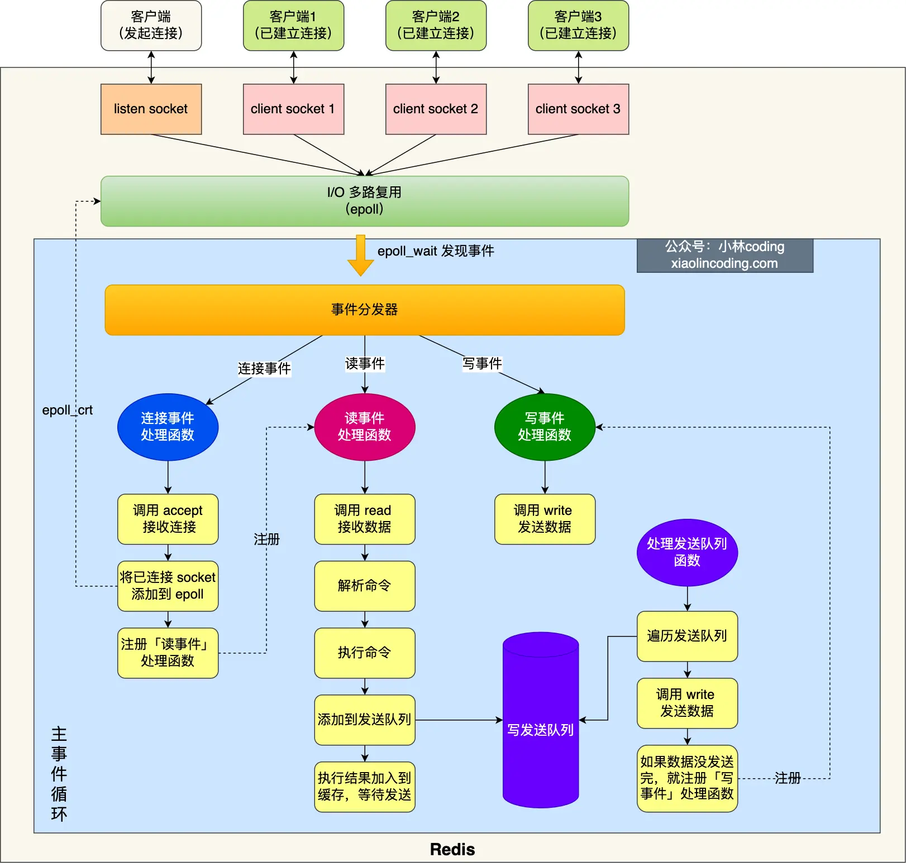

## Blog

### 算法

#### 详细任务

- 669 修剪二叉搜索树
- 108 将有序数据转换为二叉搜索树
- 538 把二叉搜索树转换为累加树
- 二叉树总结篇


#### 669 修剪二叉搜索树

**这道题目比较难**，比 添加增加和删除节点难的多，建议先看视频理解。

题目链接/文章讲解： [https://programmercarl.com/0669.%E4%BF%AE%E5%89%AA%E4%BA%8C%E5%8F%89%E6%90%9C%E7%B4%A2%E6%A0%91.html](https://programmercarl.com/0669.修剪二叉搜索树.html)  

视频讲解： https://www.bilibili.com/video/BV17P41177ud  

在看了讲解视频后，感觉本题的代码还是比较简单的，但是在思路上还是有比较多需要注意的地方。

首先就是修剪的操作中，删除节点是通过递归的返回值来进行的，这点自己是不太容易想到的。

另外一个就是，对于子树根节点的处理，如果根节点的值不符合要求，如果直接返回`NULL`，那么就相当于是直接将该子树整个都删掉了，但是子树的子树可能是符合要求的，在这里需要对左右子树分别进行判断：

- 如果子树的根节点小于边界，那么就意味着子树的右孩子可能是在边界范围内的，注意是可能，因此需要递归进行判断，通过返回值来删除根节点
- 如果子树的根节点大于边界，也是同理，判断子树的左孩子

上面仅仅是对根节点的处理，还需要处理左孩子和右孩子，同样使用递归，进入左子树和右子树进行判断

```cpp
class Solution {
public:
    TreeNode* trimBST(TreeNode* root, int low, int high) {
        if (!root) return nullptr;
        if (root->val < low)
            return trimBST(root->right, low, high);
        if (root->val > high)
            return trimBST(root->left, low, high);
        root->left = trimBST(root->left, low, high);
        root->right = trimBST(root->right, low, high);
        return root;
    }
};
```

迭代法的思路基本上也是和上面的递归法类似，也是基于前序遍历的顺序，先处理根节点，如果根节点的值小于边界，那么就让根节点的右孩子取而代之（搜索树 l < root < r）；根节点大于边界，也是同理，取左孩子。

然后开始处理子树，这里需要先记录一下当前节点，因为是需要分别处理左右子树。先处理左子树，先进入循环，即保证当前节点非空，如果当前节点的左子树值小于边界，那么就取左子树的右孩子（它可能在范围内）；无需考虑左子树大于边界，这样根也一定大于边界，在上面就处理了

对于右子树的逻辑也是同理

```cpp
class Solution {
public:
    TreeNode* trimBST(TreeNode* root, int low, int high) {
        if (!root) return nullptr;
        while (root && (root->val < low || root->val > high)) {
            if (root->val < low)
                root = root->right;
            else root = root->left;
        }
        TreeNode *cur = root;
        while (cur) {
            while (cur->left && cur->left->val < low)
                cur->left = cur->left->right;
            cur = cur->left;
        }
        cur = root;
        while (cur) {
            while (cur->right && cur->right->val > high)
                cur->right = cur->right->left;
            cur = cur->right;
        }
        return root;
    }
};
```


#### 108 将有序数据转换为二叉搜索树

本题就简单一些，可以尝试先自己做做。

[https://programmercarl.com/0108.%E5%B0%86%E6%9C%89%E5%BA%8F%E6%95%B0%E7%BB%84%E8%BD%AC%E6%8D%A2%E4%B8%BA%E4%BA%8C%E5%8F%89%E6%90%9C%E7%B4%A2%E6%A0%91.html](https://programmercarl.com/0108.将有序数组转换为二叉搜索树.html)  

视频讲解：https://www.bilibili.com/video/BV1uR4y1X7qL  

看到题目后，没有具体的思路，但是很容易想成链表，不知道什么时候应该连接到右子树上去，不知道什么时候应该作为根节点（PS：这里需要重新回顾一下【后序构造二叉树】和【构造最大二叉树】这两道题目）

如何构造二叉树：整体思路就是选取一个中间的节点，然后将数组分为左区间和右区间，递归遍历左区间，然后去构成左子树；再递归遍历右区间，然后构成右子树

基于这个构造二叉树的方法，那么本题的解题思路就是不断找数组的中间节点，这样能够保证左右区间的元素个数相等；再递归左边区间，找中间节点；递归右边区间找中间节点，依次递归下去，直到该区间只剩一个节点。

```cpp
// 基于上面的思路自己写的
class Solution {
public:
    TreeNode* traversal(vector<int>& nums) {
        if (nums.empty()) return nullptr;
        if (nums.size() == 1)
            return new TreeNode(nums[0]);
        int idx = nums.size() / 2;
        TreeNode *root = new TreeNode(nums[idx]);
        vector<int> left(nums.begin(), nums.begin() + idx);
        root->left = traversal(left);
        vector<int> right(nums.begin() + idx + 1, nums.end());
        root->right = traversal(right);
        return root;
    }
    TreeNode* sortedArrayToBST(vector<int>& nums) {
        return traversal(nums);
    }
};
```

听了Carl哥的课之后，在自己写的代码中，上面的`traversal`的参数，传递的是假的引用（相当于没有用`&`），每次使用的都是新的`vector`，每一层递归都会进行拷贝构造，这样会使得程序的性能很差。

> 如果这样写，`root->left = traversal(vector<int>(nums.begin(), nums.begin() + idx));`需要把参数中的`&`去掉。不过这种写法和上面的效率一样都很低

上面函数的返回值，表示在对应的数组中，所构造的平衡二叉搜索树的根节点

根据随想录的代码，在写的时候需要考虑清楚区间的范围是左闭右开，还是左闭右闭？由此得出的递归终止条件也是不同的

```cpp
class Solution {
public:
    TreeNode* traversal(vector<int>& nums, int l, int r) {
        if (l > r) return nullptr;
        int mid = l + ((r - l) >> 1);
        TreeNode *root = new TreeNode(nums[mid]);
        root->left = traversal(nums, l, mid - 1);
        root->right = traversal(nums, mid + 1, r);
        return root;
    }
    TreeNode* sortedArrayToBST(vector<int>& nums) {
        return traversal(nums, 0, nums.size() - 1);
    }
};
```

迭代法，还是基于上面的思路。通过三个队列来模拟，一个队列放遍历的节点，一个队列放左区间下标，一个队列放右区间下标。

```cpp
class Solution {
public:
    TreeNode* sortedArrayToBST(vector<int>& nums) {
        if (nums.size() == 0) return nullptr;
        TreeNode *root = new TreeNode();
        queue<TreeNode *> queNode;
        queue<int> leftIdx;
        queue<int> rightIdx;

        queNode.push(root);
        leftIdx.push(0);
        rightIdx.push(nums.size() - 1);

        while (!queNode.empty()) {
            TreeNode *cur = queNode.front();
            queNode.pop();
            int left = leftIdx.front();
            leftIdx.pop();
            int right = rightIdx.front();
            rightIdx.pop();

            int mid = left + ((right - left) >> 1);
            cur->val = nums[mid];

            if (left < mid) {
                cur->left = new TreeNode();
                queNode.push(cur->left);
                leftIdx.push(left);
                rightIdx.push(mid - 1);
            }
            if (right > mid) {
                cur->right = new TreeNode();
                queNode.push(cur->right);
                leftIdx.push(mid + 1);
                rightIdx.push(right);
            }
        }
        return root;
    }
};
```


#### 538 把二叉搜索树转换为累加树

本题也不难，在求二叉搜索树的最小绝对差 和 众数 那两道题目 都讲过了 双指针法，思路是一样的。

[https://programmercarl.com/0538.%E6%8A%8A%E4%BA%8C%E5%8F%89%E6%90%9C%E7%B4%A2%E6%A0%91%E8%BD%AC%E6%8D%A2%E4%B8%BA%E7%B4%AF%E5%8A%A0%E6%A0%91.html](https://programmercarl.com/0538.把二叉搜索树转换为累加树.html)  

视频讲解：https://www.bilibili.com/video/BV1d44y1f7wP

看完题目没有思路，直接看的视频

可以基于上面一题的思路，先将这个二叉树转变为数组，然后将这个数组转变为累加数组，再转换为原二叉树的累加树。基于这种思路，就可以把基本的逻辑理解了，那么在此基础上再进行优化，直接对二叉树进行操作，即，本题唯一的难点就在于，比较难以想到使用 右--中--左 这种顺序来进行遍历，同时使用这种顺序已经能够满足“新值大于等于原树节点”的条件了，不需要画蛇添足，在根节点的逻辑中再进行判断

```cpp
class Solution {
public:
    int pre = 0;
    void traversal(TreeNode *node) {
        if (!node) return;
        traversal(node->right);
        node->val += pre;
        pre = node->val;
        traversal(node->left);
    }
    TreeNode* convertBST(TreeNode* root) {
        pre = 0;
        traversal(root);
        return root;
    }
};
```

迭代法和递归的思路基本上一样，也是使用 右--中--左 这种顺序来进行遍历，先找到最大的节点，然后从这个节点开始累加，并记录上一个节点的值

```cpp
class Solution {
public:
    int pre = 0;
    void traversal(TreeNode *node) {
        stack<TreeNode *> st;
        TreeNode *curr = node;
        while (curr || !st.empty()) {
            if (curr) {
                st.push(curr);
                curr = curr->right;
            } else {
                curr = st.top();
                st.pop();
                curr->val += pre;
                pre = curr->val;
                curr = curr->left;
            }
        }
    }
    TreeNode* convertBST(TreeNode* root) {
        pre = 0;
        traversal(root);
        return root;
    }
};
```


#### 二叉树总结篇

好了，二叉树大家就这样刷完了，做一个总结吧

[https://programmercarl.com/%E4%BA%8C%E5%8F%89%E6%A0%91%E6%80%BB%E7%BB%93%E7%AF%87.html](https://programmercarl.com/二叉树总结篇.html)   

递归算法的三个要素：**每次写递归，都按照这三要素来写**

1. **确定递归函数的参数和返回值：** 确定哪些参数是递归的过程中需要处理的，那么就在递归函数里加上这个参数， 并且还要明确每次递归的返回值是什么进而确定递归函数的返回类型。
2. **确定终止条件：** 写完了递归算法, 运行的时候，经常会遇到栈溢出的错误，就是没写终止条件或者终止条件写的不对，操作系统也是用一个栈的结构来保存每一层递归的信息，如果递归没有终止，操作系统的内存栈必然就会溢出。
3. **确定单层递归的逻辑：** 确定每一层递归需要处理的信息。在这里也就会重复调用自己来实现递归的过程。

做题总结：

- 涉及到二叉树的构造，无论普通二叉树还是二叉搜索树一定前序，都是先构造中节点。
- 求普通二叉树的属性，一般是后序，一般要通过递归函数的返回值做计算。
- 求二叉搜索树的属性，一定是中序了，要不白瞎了有序性了。

注意在普通二叉树的属性中，我用的是一般为后序，例如单纯求深度就用前序，[二叉树：找所有路径 (opens new window)](https://programmercarl.com/0257.二叉树的所有路径.html)也用了前序，这是为了方便让父节点指向子节点。

所以求普通二叉树的属性还是要具体问题具体分析。


### 八股文

#### Redis的数据类型有那些？

掌握程度：

- **能够列举Redis支持的数据类型**：至少列举上述数据类型中的5种。
- **理解每种数据类型的特点和使用场景**：例如，列表适用于实现队列，有序集合适用于排行榜。
- **知道数据类型的内部实现**：例如，列表的内部实现是一个双向链表，集合的内部实现是一个哈希表。

参考资料：

- 小林coding ：Redis 数据类型

    https://xiaolincoding.com/redis/base/redis_interview.html#redis-数据类型以及使用场景分别是什么


Redis提供了丰富的数据类型，常见的有五种数据类型：**String（字符串），Hash（哈希），List（列表），Set（集合）、Zset（有序集合）**。以及后序版本更新所支持的：**BitMap（2.2 版新增）、HyperLogLog（2.8 版新增）、GEO（3.2 版新增）、Stream（5.0 版新增）**

###### string

String 是最基本的 key-value 结构，key 是唯一标识，value 是具体的值，value其实不仅是字符串， 也可以是数字（整数或浮点数），value 最多可以容纳的数据长度是 `512M`

其底层的数据结构实现主要是 int 和 SDS（简单动态字符串）。SDS不同于C字符串因为 SDS 相比于 C 的原生字符串：

- **SDS 不仅可以保存文本数据，还可以保存二进制数据**。因为 `SDS` 使用 `len` 属性的值而不是空字符来判断字符串是否结束，并且 SDS 的所有 API 都会以处理二进制的方式来处理 SDS 存放在 `buf[]` 数组里的数据。所以 SDS 不光能存放文本数据，而且能保存图片、音频、视频、压缩文件这样的二进制数据。

    

- **SDS 获取字符串长度的时间复杂度是 O(1)**。因为 C 语言的字符串并不记录自身长度，所以获取长度的复杂度为 O(n)；而 SDS 结构里用 `len` 属性记录了字符串长度，所以复杂度为 `O(1)`。

- **Redis 的 SDS API 是安全的，拼接字符串不会造成缓冲区溢出**。因为 SDS 在拼接字符串之前会检查 SDS 空间是否满足要求，如果空间不够会自动扩容，所以不会导致缓冲区溢出的问题。

如果一个字符串对象保存的是整数值，并且这个整数值可以用`long`类型来表示，那么字符串对象会将整数值保存在字符串对象结构的`ptr`属性里面（将`void*`转换成 long），并将字符串对象的编码设置为`int`。

如果字符串对象保存的是一个字符串，并且这个字符申的长度小于等于 32 字节（redis 2.+版本），那么字符串对象将使用一个简单动态字符串（SDS）来保存这个字符串，并将对象的编码设置为`embstr`， `embstr`编码是专门用于保存短字符串的一种优化编码方式

如果字符串对象保存的是一个字符串，并且这个字符串的长度大于 32 字节（redis 2.+版本），那么字符串对象将使用一个简单动态字符串（SDS）来保存这个字符串，并将对象的编码设置为`raw`

`embstr`和`raw`编码不同之处在于`embstr`会通过一次内存分配函数来分配一块连续的内存空间来保存`redisObject`和`SDS`，而`raw`编码会通过调用两次内存分配函数来分别分配两块空间来保存`redisObject`和`SDS`

String 类型的应用场景：缓存对象、常规计数、分布式锁、共享 session 信息等。

###### List

List 列表是简单的字符串列表，**按照插入顺序排序**，可以从头部或尾部向 List 列表添加元素。

列表的最大长度为 `2^32 - 1`，也即每个列表支持超过 `40 亿`个元素。

其底层数据结构是由**双向链表或压缩列表**实现的

- 如果列表的元素个数小于 `512` 个（默认值，可由 `list-max-ziplist-entries` 配置），列表每个元素的值都小于 `64` 字节（默认值，可由 `list-max-ziplist-value` 配置），Redis 会使用**压缩列表**作为 List 类型的底层数据结构；
- 如果列表的元素不满足上面的条件，Redis 会使用**双向链表**作为 List 类型的底层数据结构；
- **在 Redis 3.2 版本之后，List 数据类型底层数据结构就只由 quicklist 实现了，替代了双向链表和压缩列表**

List 类型的应用场景：消息队列（但是有两个问题：1. 生产者需要自行实现全局唯一 ID；2. 不能以消费组形式消费数据）等

###### Hash

Hash 是一个键值对（key - value）集合，其中 value 的形式如： `value=[{field1，value1}，...{fieldN，valueN}]`。Hash 特别适合用于存储对象

其底层数据结构是由**压缩列表或哈希表**实现的：

- 如果哈希类型元素个数小于 `512` 个（默认值，可由 `hash-max-ziplist-entries` 配置），所有值小于 `64` 字节（默认值，可由 `hash-max-ziplist-value` 配置）的话，Redis 会使用**压缩列表**作为 Hash 类型的底层数据结构；
- 如果哈希类型元素不满足上面条件，Redis 会使用**哈希表**作为 Hash 类型的 底层数据结构
- **在 Redis 7.0 中，压缩列表数据结构已经废弃了，交由 listpack 数据结构来实现**

Hash 类型的应用场景：缓存对象、购物车等。

###### Set

Set 类型是一个无序并唯一的键值集合，它的存储顺序不会按照插入的先后顺序进行存储。

一个集合最多可以存储 `2^32-1` 个元素。概念和数学中个的集合基本类似，可以交集，并集，差集等等，所以 Set 类型除了支持集合内的增删改查，同时还支持多个集合取交集、并集、差集。

Set 只能存储非重复元素，且Set 是无序方式存储元素的

其底层数据结构是由**哈希表或整数集合**实现的：

- 如果集合中的元素都是整数且元素个数小于 `512` （默认值，`set-maxintset-entries`配置）个，Redis 会使用**整数集合**作为 Set 类型的底层数据结构；
- 如果集合中的元素不满足上面条件，则 Redis 使用**哈希表**作为 Set 类型的底层数据结构

Set 类型的应用场景：聚合计算（并集、交集、差集）场景，比如点赞、共同关注、抽奖活动等。

###### Zset

Zset 类型（有序集合类型）相比于 Set 类型多了一个排序属性 score（分值），对于有序集合 ZSet 来说，每个存储元素相当于有两个值组成的，一个是有序集合的元素值，一个是排序值。

有序集合保留了集合不能有重复成员的特性（分值可以重复），但不同的是，有序集合中的元素可以排序。

其底层数据结构是由**压缩列表或跳表**实现的：

- 如果有序集合的元素个数小于 `128` 个，并且每个元素的值小于 `64` 字节时，Redis 会使用**压缩列表**作为 Zset 类型的底层数据结构；
- 如果有序集合的元素不满足上面的条件，Redis 会使用**跳表**作为 Zset 类型的底层数据结构；
- **在 Redis 7.0 中，压缩列表数据结构已经废弃了，交由 listpack 数据结构来实现了**

Zset 类型的应用场景：排序场景，比如排行榜、电话和姓名排序等。

###### BitMap

Bitmap，即位图，是一串连续的二进制数组（0和1），可以通过偏移量（offset）定位元素。BitMap通过最小的单位bit来进行`0|1`的设置，表示某个元素的值或者状态，时间复杂度为O(1)。

由于 bit 是计算机中最小的单位，使用它进行储存将非常节省空间，特别适合一些数据量大且使用**二值统计的场景**。

其本身是用 String 类型作为底层数据结构实现的一种统计二值状态的数据类型。

String 类型是会保存为二进制的字节数组，所以，Redis 就把字节数组的每个 bit 位利用起来，用来表示一个元素的二值状态，你可以把 Bitmap 看作是一个 bit 数组

BitMap的应用场景：二值状态统计的场景，比如签到、判断用户登陆状态、连续签到用户总数等

###### HyperLogLog

Redis HyperLogLog 是 Redis 2.8.9 版本新增的数据类型，是一种用于「统计基数」的数据集合类型，基数统计就是指统计一个集合中不重复的元素个数。但要注意，HyperLogLog 是统计规则是基于概率完成的，不是非常准确，标准误算率是 0.81%。

所以，简单来说 HyperLogLog **提供不精确的去重计数**。

HyperLogLog 的优点是，在输入元素的数量或者体积非常非常大时，计算基数所需的内存空间总是固定的、并且是很小的。

在 Redis 里面，**每个 HyperLogLog 键只需要花费 12 KB 内存，就可以计算接近 `2^64` 个不同元素的基数**，和元素越多就越耗费内存的 Set 和 Hash 类型相比，HyperLogLog 就非常节省空间。

HyperLogLog的应用场景：海量数据基数统计的场景，比如百万级网页 UV 计数等

###### GEO

GEO 是 Redis 3.2 版本新增的数据类型，主要用于存储地理位置信息，并对存储的信息进行操作。

在日常生活中，我们越来越依赖搜索“附近的餐馆”、在打车软件上叫车，这些都离不开基于位置信息服务（Location-Based Service，LBS）的应用。LBS 应用访问的数据是和人或物关联的一组经纬度信息，而且要能查询相邻的经纬度范围，GEO 就非常适合应用在 LBS 服务的场景中

其底层数据结构是直接使用了 Sorted Set 集合类型。GEO 类型使用 GeoHash 编码方法实现了经纬度到 Sorted Set 中元素权重分数的转换，这其中的两个关键机制就是「对二维地图做区间划分」和「对区间进行编码」。一组经纬度落在某个区间后，就用区间的编码值来表示，并把编码值作为 Sorted Set 元素的权重分数

这样，就可以把经纬度保存到 Sorted Set 中，利用 Sorted Set 提供的“按权重进行有序范围查找”的特性，实现 LBS 服务中频繁使用的“搜索附近”的需求

GEO的应用场景：存储地理位置信息的场景，比如滴滴叫车

###### Stream

Redis Stream 是 Redis 5.0 版本新增加的数据类型，Redis 专门为消息队列设计的数据类型。

在 Redis 5.0 Stream 没出来之前，消息队列的实现方式都有着各自的缺陷，例如：

- 发布订阅模式，不能持久化也就无法可靠的保存消息，并且对于离线重连的客户端不能读取历史消息的缺陷；
- List 实现消息队列的方式不能重复消费，一个消息消费完就会被删除，而且生产者需要自行实现全局唯一 ID。

基于以上问题，Redis 5.0 便推出了 Stream 类型也是此版本最重要的功能，用于完美地实现消息队列，它支持消息的持久化、支持自动生成全局唯一 ID、支持 ack 确认消息的模式、支持消费组模式等，让消息队列更加的稳定和可靠

Stream的应用场景：消息队列，相比于基于 List 类型实现的消息队列，有这两个特有的特性：自动生成全局唯一消息ID，支持以消费组形式消费数据。


#### Redis是单线程的还是多线程的，为什么？

掌握程度：

- **能够清晰地描述Redis的线程模型**：说明Redis之前是单线程模型，6.0版本后引入了I/O多线程。
- **理解单线程模型的原因**：列举单线程模型的优点，如原子性操作、性能考虑等。
- **知道Redis 6.0多线程的变化**：描述引入I/O多线程的目的和效果。

参考资料：

- 小林coding：Redis 线程模型

    https://xiaolincoding.com/redis/base/redis_interview.html#redis-线程模型


**Redis 单线程指的是「接收客户端请求->解析请求 ->进行数据读写等操作->发送数据给客户端」这个过程是由一个线程（主线程）来完成的**，这也是我们常说 Redis 是单线程的原因。

但是，**Redis 程序并不是单线程的**，Redis 在启动的时候，是会**启动后台线程**（BIO）的：

- **Redis 在 2.6 版本**，会启动 2 个后台线程，分别处理关闭文件、AOF 刷盘这两个任务；

    之所以 Redis 为「关闭文件、AOF 刷盘、释放内存」这些任务创建单独的线程来处理，是因为这些任务的操作都是很耗时的，如果把这些任务都放在主线程来处理，那么 Redis 主线程就很容易发生阻塞，这样就无法处理后续的请求了。

- **Redis 在 4.0 版本之后**，新增了一个新的后台线程，用来异步释放 Redis 内存，也就是 lazyfree 线程。

    例如执行 `unlink key` / `flushdb async` / `flushall async` 等命令，会把这些删除操作交给后台线程来执行，好处是不会导致 Redis 主线程卡顿。

    因此，当要删除一个大 key 的时候，不要使用 del 命令删除，因为 del 是在主线程处理的，这样会导致 Redis 主线程卡顿，因此我们应该使用 unlink 命令来异步删除大key。

> 后台线程相当于一个消费者，生产者把耗时任务丢到任务队列中，消费者（BIO）不停轮询这个队列，拿出任务就去执行对应的方法即可

##### Redis的单线程模式



蓝色部分是一个事件循环，由主线程负责；网络 I/O 和命令处理都是单线程。

**Redis的初始化**：

- 首先，调用 epoll_create() 创建一个 epoll 对象和调用 socket() 创建一个服务端 socket
- 然后，调用 bind() 绑定端口和调用 listen() 监听该 socket；
- 然后，将调用 epoll_ctl() 将 listen socket 加入到 epoll，同时注册「连接事件」处理函数。

初始化完后，主线程就进入到一个**事件循环函数**：

- 首先，先调用**处理发送队列函数**，看是发送队列里是否有任务，如果有发送任务，则通过 write 函数将客户端发送缓存区里的数据发送出去，如果这一轮数据没有发送完，就会注册写事件处理函数，等待 epoll_wait 发现可写后再处理 。
- 接着，调用 epoll_wait 函数等待事件的到来：
    - 如果是**连接事件**到来，则会调用**连接事件处理函数**，该函数会做这些事情：调用 accpet 获取已连接的 socket -> 调用 epoll_ctl 将已连接的 socket 加入到 epoll -> 注册「读事件」处理函数；
    - 如果是**读事件**到来，则会调用**读事件处理函数**，该函数会做这些事情：调用 read 获取客户端发送的数据 -> 解析命令 -> 处理命令 -> 将客户端对象添加到发送队列 -> 将执行结果写到发送缓存区等待发送；
    - 如果是**写事件**到来，则会调用**写事件处理函数**，该函数会做这些事情：通过 write 函数将客户端发送缓存区里的数据发送出去，如果这一轮数据没有发送完，就会继续注册写事件处理函数，等待 epoll_wait 发现可写后再处理 

这就是 Redis 单线模式的工作方式


#### Redis 持久化机制有哪些？

掌握程度：

- **能够清晰地定义Redis的持久化机制**：解释RDB和AOF的基本概念及其作用。
- **理解RDB和AOF的优缺点**：列举并解释RDB和AOF的特点，以及它们在数据安全性和性能方面的影响。
- **知道触发持久化的方式**：描述如何通过命令和配置文件触发RDB和AOF的持久化。

参考资料：

- 小林coding：Redis 持久化机制

    https://xiaolincoding.com/redis/base/redis_interview.html#redis-持久化


为了保证内存中的数据不会丢失，Redis 实现了数据持久化的机制，这个机制会把数据存储到磁盘，这样在 Redis 重启就能够从磁盘中恢复原有的数据

Redis 共有三种数据持久化的方式：

- **AOF 日志**：每执行一条写操作命令，就把该命令以追加的方式写入到一个文件里；
- **RDB 快照**：将某一时刻的内存数据，以二进制的方式写入磁盘；
- **混合持久化方式**：Redis 4.0 新增的方式，集成了 AOF 和 RBD 的优点；

##### AOF 日志

Redis 在执行完一条写操作命令后，就会把该命令以追加的方式写入到一个文件里，然后 Redis 重启时，会读取该文件记录的命令，然后逐一执行命令的方式来进行数据恢复


Reids 是先执行写操作命令后，才将该命令记录到 AOF 日志里。

Redis 写入 AOF 日志的过程：


1. Redis 执行完写操作命令后，会将命令追加到 server.aof_buf 缓冲区；
2. 然后通过 write() 系统调用，将 aof_buf 缓冲区的数据写入到 AOF 文件，此时数据并没有写入到硬盘，而是拷贝到了内核缓冲区 page cache，等待内核将数据写入硬盘；
3. 具体内核缓冲区的数据什么时候写入到硬盘，由内核决定。Redis 提供了 3 种写回硬盘的策略（在 Redis.conf 配置文件中的 appendfsync 配置项可以有以下 3 种参数）：
    - **Always**，这个单词的意思是「总是」，所以它的意思是每次写操作命令执行完后，同步将 AOF 日志数据写回硬盘；
    - **Everysec**，这个单词的意思是「每秒」，所以它的意思是每次写操作命令执行完后，先将命令写入到 AOF 文件的内核缓冲区，然后每隔一秒将缓冲区里的内容写回到硬盘；
    - **No**，意味着不由 Redis 控制写回硬盘的时机，转交给操作系统控制写回的时机，也就是每次写操作命令执行完后，先将命令写入到 AOF 文件的内核缓冲区，再由操作系统决定何时将缓冲区内容写回硬盘。

Redis 为了避免 AOF 文件越写越大，提供了 **AOF 重写机制**，当 AOF 文件的大小超过所设定的阈值后，Redis 就会启用 AOF 重写机制，来压缩 AOF 文件。

AOF 重写机制是在重写时，读取当前数据库中的所有键值对，然后将每一个键值对用一条命令记录到「新的 AOF 文件」，等到全部记录完后，就将新的 AOF 文件替换掉现有的 AOF 文件

##### RDB 快照

AOF 日志记录的是操作命令，不是实际的数据，所以用 AOF 方法做故障恢复时，需要全量把日志都执行一遍，一旦 AOF 日志非常多，势必会造成 Redis 的恢复操作缓慢。因此，Redis 增加了 RDB 快照

> RDB 快照就是记录某一个瞬间的内存数据，记录的是实际数据，而 AOF 文件记录的是命令操作的日志，而不是实际的数据

在 Redis 恢复数据时， RDB 恢复数据的效率会比 AOF 高些，因为直接将 RDB 文件读入内存就可以，不需要像 AOF 那样还需要额外执行操作命令的步骤才能恢复数据

Redis 提供了两个命令来生成 RDB 文件，分别是 save 和 bgsave，他们的区别就在于是否在「主线程」里执行：

- 执行了 save 命令，就会在主线程生成 RDB 文件，由于和执行操作命令在同一个线程，所以如果写入 RDB 文件的时间太长，**会阻塞主线程**；

- 执行了 bgsave 命令，会创建一个子进程来生成 RDB 文件，这样可以**避免主线程的阻塞**；

- Redis 还可以通过配置文件的选项来实现每隔一段时间自动执行一次 bgsave 命令

    ```c
    save 900 1 // 900 秒之内，对数据库进行了至少 1 次修改
    save 300 10 // 300 秒之内，对数据库进行了至少 10 次修改
    save 60 10000 // 60 秒之内，对数据库进行了至少 10000 次修改
    ```

Redis 的快照是**全量快照**，也就是说每次执行快照，都是把内存中的「所有数据」都记录到磁盘中。所以执行快照是一个比较重的操作，如果频率太频繁，可能会对 Redis 性能产生影响

执行 bgsave 过程中，Redis 依然**可以继续处理操作命令**的，也就是数据是能被修改的，关键的技术就在于**写时复制技术（Copy-On-Write, COW）**

##### 混合持久化方式

RDB 优点是数据恢复速度快，但是快照的频率不好把握。频率太低，丢失的数据就会比较多，频率太高，就会影响性能。

AOF 优点是丢失数据少，但是数据恢复不快。

使用了混合持久化，AOF 文件的**前半部分是 RDB 格式的全量数据，后半部分是 AOF 格式的增量数据**。

这样的好处在于，重启 Redis 加载数据的时候，由于前半部分是 RDB 内容，这样**加载的时候速度会很快**。加载完 RDB 的内容后，才会加载后半部分的 AOF 内容，这里的内容是 Redis 后台子进程重写 AOF 期间，主线程处理的操作命令，可以使得**数据更少的丢失**


### 总结

今天的题目，虽然一开始看上去比较难，但是实际上手之后，会发现比起前一天的题目来说，是比较简单的，归根到底，还是二叉树的遍历。像前2题，都是二叉搜索树中最常用的中序遍历，基于中序遍历完成题目的逻辑，像669是判断根节点是否在规定范围；108是通过根节点将数组划分为左右两个子树

最后一题也是比较简单的，只是因为逻辑特殊，用到的是后序遍历，通过这个后序遍历找到最大值，然后通过递归开始累加

需要多思考应该怎么将遍历顺序和本题的逻辑结合起来，充分的利用递归的思想
