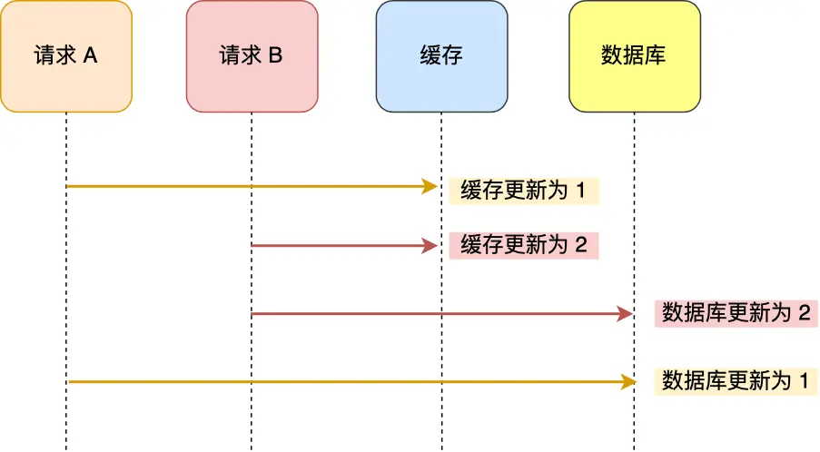
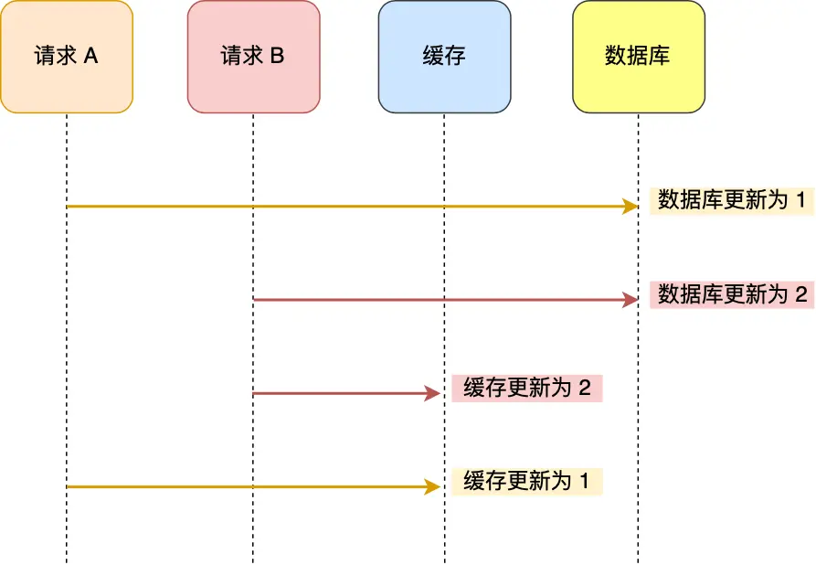
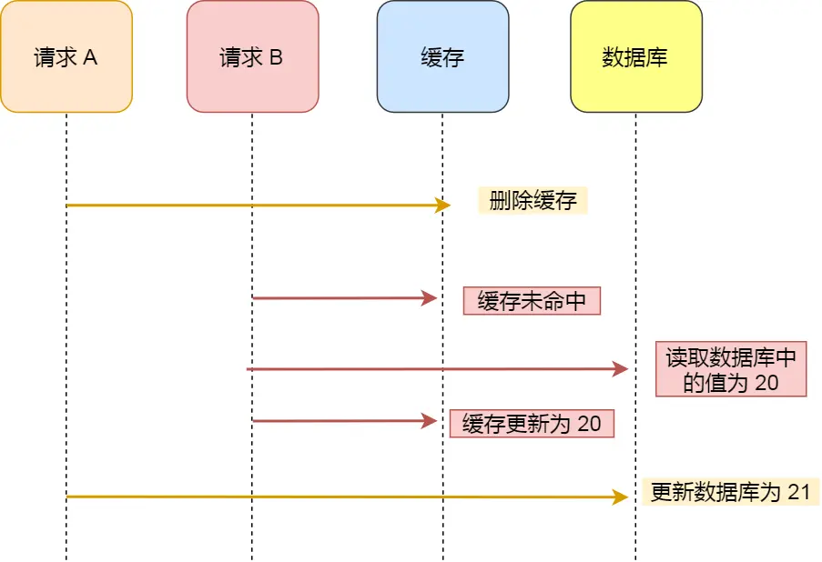
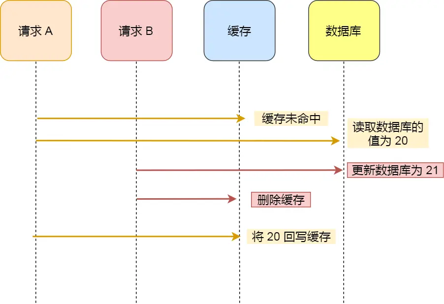

## Blog

### 算法

#### 详细任务

- 理论基础
- 77 组合
- 216 组合总和 Ⅲ
- 17 电话号码的字母组合


#### 理论基础

其实在讲解二叉树的时候，就给大家介绍过回溯，这次正式开启回溯算法，大家可以先看视频，对回溯算法有一个整体的了解。

题目链接/文章讲解：[https://programmercarl.com/%E5%9B%9E%E6%BA%AF%E7%AE%97%E6%B3%95%E7%90%86%E8%AE%BA%E5%9F%BA%E7%A1%80.html](https://programmercarl.com/回溯算法理论基础.html)  

视频讲解：https://www.bilibili.com/video/BV1cy4y167mM

回溯法也可以叫做回溯搜索法，它是一种搜索的方式。回溯和递归是相辅相成的，而回溯也可以说是递归的副产品，只要有递归就会有回溯。

通常，递归函数下面的部分就是回溯的逻辑。**回溯函数也就是递归函数，指的都是一个函数**

回溯法并不是什么高效的算法，**回溯的本质是穷举，穷举所有可能，然后选出我们想要的答案**

回溯法，一般可以解决如下几种问题：

- 组合问题：N个数里面按一定规则找出k个数的集合

- 排列问题：N个数按一定规则全排列，有几种排列方式

    > **组合是不强调元素顺序的，排列是强调元素顺序**。

- 切割问题：一个字符串按一定规则有几种切割方式

- 子集问题：一个N个数的集合里有多少符合条件的子集

- 棋盘问题：N皇后，解数独等等

**回溯法解决的问题都可以抽象为==树形结构==**。回溯就是一个递归的过程，递归一定是有终止的。回溯法通常可以抽象为一棵n叉树（高度有限的树）。一般来说，这棵树的宽度就是在回溯法中处理的集合的大小，通常用`for`循环来进行遍历；而树的深度，就是递归的深度，用递归处理

##### 回溯三部曲

- 回溯函数模板返回值以及参数

    在回溯算法中，一般来说，递归函数都是没有返回值的，即为`void`

    函数名业界称为`backtracking`

    因为回溯算法需要的参数可不像二叉树递归的时候那么容易一次性确定下来，所以一般是先写逻辑，然后需要什么参数，就填什么参数

    ```cpp
    void backtracking(参数)
    ```

- 回溯函数终止条件

    回溯法可以抽象为树形结构，而遍历树形结构一定要有终止条件，所以回溯也有要终止条件。

    什么时候达到了终止条件，树中就可以看出，一般来说搜到叶子节点了，也就找到了满足条件的一条答案，把这个答案存放起来，并结束本层递归。

    即收集结果，子集问题就是在树的每个节点收集结果，收集完结果，不要忘记`return`

    ```cpp
    if (终止条件) {
        存放结果;
        return;
    }
    ```

- 回溯搜索的遍历过程

  回溯法一般是在集合中递归搜索，集合的大小构成了树的宽度，递归的深度构成的树的深度

  

  在处理完终止条件后，进入单层搜索的逻辑，一般情况下，是一个`for`循环，用来处理集合中的每个元素。可以理解为一个节点有多少个孩子，这个for循环就执行多少次
  
  在循环体中处理节点，然后调用递归函数，递归的下面就是回溯的操作，即撤销处理节点的情况，然后结束循环。
  
  **for循环可以理解是横向遍历，backtracking（递归）就是纵向遍历**

```cpp
void backtracking(参数) {
    if (终止条件) {
        存放结果;
        return;
    }

    for (选择：本层集合中元素（树中节点孩子的数量就是集合的大小）) {
        处理节点;
        backtracking(路径，选择列表); // 递归
        回溯，撤销处理结果
    }
}
```


#### 77 组合

对着 在 回溯算法理论基础 给出的 代码模板，来做本题组合问题，大家就会发现 写回溯算法套路。

在回溯算法解决实际问题的过程中，大家会有各种疑问，先看视频介绍，基本可以解决大家的疑惑。

本题关于剪枝操作是大家要理解的重点，因为后面很多回溯算法解决的题目，都是这个剪枝套路。 

一开始看到题目没有思路，直接看视频。

跟着Carl哥的思路，将本题抽象成一棵树，树的每个节点就是备选池，分支的权重则表示当前的路径，随着树深度的加深，每层的节点中减少一种元素，而到该节点的权重则为所需的组合。

那么根据回溯3步曲，终止条件就是权重的组合大小为k时，所需执行的逻辑就是将这种组合加入到结果集中；遍历的过程：逐个遍历当前节点即备选池中的元素，将他们逐个加入到路径组合中，延伸出树的下一层，然后递归进去，最后进行回溯，即让该元素回到备选池中，从树的角度看就是回到上一层

```cpp
class Solution {
public:
    vector<int> path;
    vector<vector<int>> ret;
    void backtracking(int n, int k, int idx) {
        if (path.size() == k) {
            ret.push_back(path);
            return ;
        }
        for (int i = idx; i <= n; ++i) {
            path.push_back(i);
            backtracking(n, k, i + 1);
            path.pop_back();
        }
        return ;
    }

    vector<vector<int>> combine(int n, int k) {
        backtracking(n, k, 1);
        return ret;
    }
};
```

看完视频马上写的代码，理解的思路，但是代码并不是根据自己理解写出来的，过几天重新再写一遍

上面的代码是本题的基础版，提交之后可以发现效率并不高，这是因为走了很多的无用分支，从而导致了多次的回溯。因此，可以进行对应的剪枝操作，对抽象成的树进行剪枝

这里是对“剩余需要选取的元素个数”进行剪枝，从而减小了搜索空间。原来`for (int i = idx; i <= n; ++i)`，表示从当前元素的下一个元素`idx`开始，尝试选取数字。这个遍历过程中，没有考虑到当前已经选择了多少个数字，因此会进行一些不必要的递归调用，比如，当剩下的数字个数已经不够时，还会继续递归下去。

例如：假设`n = 5`，`k = 3`，并且已经选择了1个数字，那么此时组合中只是需要选择2个数字即可，如果选中的是`{1}`那么剩下的`2, 3, 4, 5`都有必要选取一次，并且进行递归；而如果当前选中的元素是`{3}`，那么唯一的选择就是`{3, 4, 5}`(其他的比如重复)，因此就没有必要再去走`{3, 5, X}`这一分支了，甚至后面也没有必要再走选中`{4}`或者是选中`{5}`的分支了

```cpp
for (int i = idx; i <= n - (k - path.size()) + 1; ++i) {
	path.push_back(i);
	backtracking(n, k, i + 1);
	path.pop_back();
}
```

- `path.size()` 代表当前已经选取的数字个数：这意味着我们还需要选取`k - path.size()`个数字

- 剩余元素的个数必须足够

    需要确保从当前位置`i`开始之后，还能选出足够多的数字来满足“还需要选取`k - path.size()`个元素”的要求。

    假设从当前位置`i`开始，最多能选择到`n`，那么剩下的数字个数就是`n - i + 1`。为了保证足够的数字可选，要求：`n - i + 1 >= k - path.size()`，即从当前位置开始选择，后面能有足够的数字。

- `k - path.size()`是当前还需要选择的数字个数

    `n - (k - path.size()) + 1`是我们从当前元素`i`起，最多能选择的最后一个元素的下标

    如果`i`大于这个值，就不可能选择足够的元素了，因此递归会提前结束，剪枝操作会跳过不必要的递归分支

通过这种剪枝方式，我们避免了在剩余的数字不够时仍然继续递归，减少了递归的次数和计算量。这样修改后的代码在某些情况下会更高效，特别是当剩余选项较少时，递归会更早终止，从而避免了不必要的探索。

可以发现，剪枝操作需要修改的地方并不多，就本题来说，只是改变了for循环中i的范围。这种剪枝操作在回溯算法中特别常见，一般也都是在这种位置进行剪枝，适当的缩小这个范围

题目链接/文章讲解：[https://programmercarl.com/0077.%E7%BB%84%E5%90%88.html](https://programmercarl.com/0077.组合.html)   

视频讲解：https://www.bilibili.com/video/BV1ti4y1L7cv 

剪枝操作：https://www.bilibili.com/video/BV1wi4y157er


#### 216 组合总和 Ⅲ

如果把 组合问题理解了，本题就容易一些了。 

本题的代码基本和上一题的代码没有什么区别，唯一变化的就是判断递归结束的条件变化了一下，不仅需要判断元素的个数，还要判断元素和

同时，对于剪枝操作也是一样，需要修改for循环的范围。如题目中给出的用例`k = 3, n = 7`，当path中的元素为1, 2，那么for循环中走到i = 4后，进入backtracking，判断该组合是符合条件的时候，就应该结束这一层的for循环，因为后面的组合中元素之和一定是大于要求的n的

具体来说，若当前组合的和已经超过了 `n`，那么接下来的数字一定无法组成符合条件的组合，因此可以立即停止进一步的递归。

```cpp
class Solution {
public:
    vector<int> path;
    vector<vector<int>> ret;
    void backtracking(int k, int n, int idx) {
        if (path.size() == k) {
            int sum = 0;
            for (int num : path)
                sum += num;
            if (sum == n)
                ret.push_back(path);
            return ;
        }
        for (int i = idx; i <= 9; ++i) {
            if (accumulate(path.begin(), path.end(), 0) + i > n)
                break;
            path.push_back(i);
            backtracking(k, n, i + 1);
            path.pop_back();
        }
        return;
    }
    vector<vector<int>> combinationSum3(int k, int n) {
        backtracking(k, n, 1);
        return ret;
    }
};
```

> `accumulate` 是 C++ 标准库中的一个函数，用来对容器中的元素进行累加。`path.begin()` 和 `path.end()` 分别指向路径中的第一个和最后一个元素，而 `0` 是累加的初始值。通过 `accumulate` 可以很方便地计算出当前路径的和。

题目链接/文章讲解：[https://programmercarl.com/0216.%E7%BB%84%E5%90%88%E6%80%BB%E5%92%8CIII.html](https://programmercarl.com/0216.组合总和III.html)   

视频讲解：https://www.bilibili.com/video/BV1wg411873x

进行了2个地方的剪枝一个是对和的大小进行剪枝，另一个是对循环的范围进行剪枝

```cpp
// carl的代码
class Solution {
private:
    vector<vector<int>> result; // 存放结果集
    vector<int> path; // 符合条件的结果
    void backtracking(int targetSum, int k, int sum, int startIndex) {
        if (sum > targetSum) { // 剪枝操作
            return; 
        }
        if (path.size() == k) {
            if (sum == targetSum) result.push_back(path);
            return; // 如果path.size() == k 但sum != targetSum 直接返回
        }
        for (int i = startIndex; i <= 9 - (k - path.size()) + 1; i++) { // 剪枝
            sum += i; // 处理
            path.push_back(i); // 处理
            backtracking(targetSum, k, sum, i + 1); // 注意i+1调整startIndex
            sum -= i; // 回溯
            path.pop_back(); // 回溯
        }
    }

public:
    vector<vector<int>> combinationSum3(int k, int n) {
        result.clear(); // 可以不加
        path.clear();   // 可以不加
        backtracking(n, k, 0, 1);
        return result;
    }
};
```


#### 17 电话号码的字母组合

本题大家刚开始做会有点难度，先自己思考20min，没思路就直接看题解。 

自己做的时候感觉还是比较棘手的，没有想到使用`vector`或者是`map`将数字和字母建立映射。

之后的回溯，和上面两道题大致是一样，可以套用上面三部曲的思路，首先是确定递归的边界，就是当组合的元素个数和给定的数字串的长度相同时，就可以将这种组合加入结果集并退出了。递归的过程就是用第一个数字对应的字母和下一个数字对应的字母集逐个组合（组合完退出）

```cpp
class Solution {
public:
    vector<string> letterMap = {
            "", "",
            "abc",
            "def",
            "ghi",
            "jkl",
            "mno",
            "pqrs",
            "tuv",
            "wxyz"
    };
    vector<string> ret;
    string s;
    void backtracking(const string digits, int idx) {
        if (digits.size() == idx) {
            ret.push_back(s);
            return ;
        }
        int num = digits[idx] - '0';
        string letter = letterMap[num];
        for (int i = 0; i < letter.size(); ++i) {
            s.push_back(letter[i]);
            backtracking(digits, idx + 1);
            s.pop_back();
        }
        return ;
    }
    vector<string> letterCombinations(string digits) {
        s.clear();
        ret.clear();
        if (digits.empty()) return ret;

        backtracking(digits, 0);
        return ret;
    }
};
```

题目链接/文章讲解：[https://programmercarl.com/0017.%E7%94%B5%E8%AF%9D%E5%8F%B7%E7%A0%81%E7%9A%84%E5%AD%97%E6%AF%8D%E7%BB%84%E5%90%88.html](https://programmercarl.com/0017.电话号码的字母组合.html)   

视频讲解：https://www.bilibili.com/video/BV1yV4y1V7Ug


### 八股文

#### **介绍一下Redis缓存雪崩和缓存穿透，如何解决这些问题？**

掌握程度：

- 能够清晰地定义缓存雪崩和缓存穿透。能够解释导致缓存雪崩和缓存穿透的原因。
- 掌握解决方案：描述至少两种解决缓存雪崩和缓存穿透的策略。能够根据不同的业务场景选择最合适的解决方案

参考资料：

- [视频：【什么是Redis缓存雪崩、穿透、击穿，十分钟给你讲的明明白白】 ]()

    https://www.bilibili.com/video/BV1f5411b7ux/?share_source=copy_web
    
- [什么是缓存雪崩、击穿、穿透？]()

    https://xiaolincoding.com/redis/cluster/cache_problem.html

> 用户的数据一般都是存储于数据库，数据库的数据是落在磁盘上的，磁盘的读写速度可以说是计算机里最慢的硬件了。
>
> 当用户的请求，都访问数据库的话，请求数量一上来，数据库很容易就奔溃的了，所以为了避免用户直接访问数据库，会用 Redis 作为缓存层。
>
> 因为 Redis 是内存数据库，我们可以将数据库的数据缓存在 Redis 里，相当于数据缓存在内存，内存的读写速度比硬盘快好几个数量级，这样大大提高了系统性能。

##### 缓存雪崩

为了保证缓存中的数据与数据库中的数据一致性，会给 Redis 里的数据设置过期时间，当缓存数据过期后，用户访问的数据如果不在缓存里，业务系统需要重新生成缓存，因此就会访问数据库，并将数据更新到 Redis 里，这样后续请求都可以直接命中缓存。

当**大量缓存数据在同一时间过期（失效）或者 Redis 故障宕机**时，如果此时有大量的用户请求，都无法在 Redis 中处理，于是全部请求都直接访问数据库，从而导致数据库的压力骤增，严重的会造成数据库宕机，从而形成一系列连锁反应，造成整个系统崩溃，这就是**缓存雪崩**的问题。

###### 大量数据同时过期

针对大量数据同时过期而引发的缓存雪崩问题，常见的应对方法有下面这几种：

1. 均匀设置过期时间；

    如果要给缓存数据设置过期时间，应该避免将大量的数据设置成同一个过期时间。

    可以在对缓存数据设置过期时间时，**给这些数据的过期时间加上一个随机数**，这样就保证数据不会在同一时间过期。

2. 互斥锁；

    当业务线程在处理用户请求时，**如果发现访问的数据不在 Redis 里，就加个互斥锁，保证同一时间内只有一个请求来构建缓存**（从数据库读取数据，再将数据更新到 Redis 里），当缓存构建完成后，再释放锁。

    对于未能获取互斥锁的请求，要么等待锁释放后重新读取缓存，要么就返回空值或者默认值。

    实现互斥锁的时候，最好设置**超时时间**，不然第一个请求拿到了锁，然后这个请求发生了某种意外而一直阻塞，一直不释放锁，这时其他请求也一直拿不到锁，整个系统就会出现无响应的现象。

3. 后台更新缓存；

    业务线程不再负责更新缓存，缓存也不设置有效期，而是**让缓存“永久有效”，并将更新缓存的工作交由后台线程定时更新**。

    > 缓存数据不设置有效期，并不是意味着数据一直能在内存里，因为**当系统内存紧张的时候，有些缓存数据会被“淘汰”**，而在缓存被“淘汰”到下一次后台定时更新缓存的这段时间内，业务线程读取缓存失败就返回空值，业务的视角就以为是数据丢失了。
    >
    > 对于这个问题，有2种解决方式：
    >
    > - 后台线程不仅负责定时更新缓存，而且也负责**频繁地检测缓存是否有效**，检测到缓存失效了，原因可能是系统紧张而被淘汰的，于是就要马上从数据库读取数据，并更新到缓存
    >
    >     这种方式的检测时间间隔不能太长，太长也导致用户获取的数据是一个空值而不是真正的数据，所以检测的间隔最好是毫秒级的，但是总归是有个间隔时间，用户体验一般
    >
    > - 在业务线程发现缓存数据失效后（缓存数据被淘汰），**通过消息队列发送一条消息通知后台线程更新缓存**，后台线程收到消息后，在更新缓存前可以判断缓存是否存在，存在就不执行更新缓存操作；不存在就读取数据库数据，并将数据加载到缓存
    >
    >     这种方式相比上一种方式缓存的更新会更及时，用户体验也比较好
    >
    >     在业务刚上线的时候，我们最好提前把数据缓起来，而不是等待用户访问才来触发缓存构建，这就是所谓的**缓存预热**，后台更新缓存的机制刚好也适合干这个事情。

###### Redis 故障宕机

针对 Redis 故障宕机而引发的缓存雪崩问题，常见的应对方法有下面这几种：

1. 服务熔断或请求限流机制；

    因为 Redis 故障宕机而导致缓存雪崩问题时，可以启动**服务熔断**机制，**暂停业务应用对缓存服务的访问，直接返回错误**，不用再继续访问数据库，从而降低对数据库的访问压力，保证数据库系统的正常运行，然后等到 Redis 恢复正常后，再允许业务应用访问缓存服务。

    > 服务熔断机制是保护数据库的正常允许，但是暂停了业务应用访问缓存服系统，全部业务都无法正常工作
    >
    > 为了减少对业务的影响，可以启用**请求限流**机制，**只将少部分请求发送到数据库进行处理，再多的请求就在入口直接拒绝服务**，等到 Redis 恢复正常并把缓存预热完后，再解除请求限流的机制。

2. 构建 Redis 缓存高可靠集群；

    服务熔断或请求限流机制是缓存雪崩发生后的应对方案，最好通过**主从节点的方式构建 Redis 缓存高可靠集群**。

    如果 Redis 缓存的主节点故障宕机，从节点可以切换成为主节点，继续提供缓存服务，避免了由于 Redis 故障宕机而导致的缓存雪崩问题

##### 缓存击穿

在业务中，通常会有几个数据会被频繁地访问，比如秒杀活动，这类被频地访问的数据被称为热点数据

如果缓存中的**某个热点数据过期**了，此时大量的请求访问了该热点数据，就无法从缓存中读取，直接访问数据库，数据库很容易就被高并发的请求冲垮，这就是**缓存击穿**的问题

> 缓存击穿跟缓存雪崩很相似，你可以认为缓存击穿是缓存雪崩的一个子集

解决缓存击穿可以采取前面说到两种方案：

- 互斥锁方案，保证同一时间只有一个业务线程更新缓存，未能获取互斥锁的请求，要么等待锁释放后重新读取缓存，要么就返回空值或者默认值。
- 不给热点数据设置过期时间，由后台异步更新缓存，或者在热点数据准备要过期前，提前通知后台线程更新缓存以及重新设置过期时间

##### 缓存穿透

当用户访问的数据，**既不在缓存中，也不在数据库中**，导致请求在访问缓存时，发现缓存缺失，再去访问数据库时，发现数据库中也没有要访问的数据，没办法构建缓存数据，来服务后续的请求。那么当有大量这样的请求到来时，数据库的压力骤增，这就是**缓存穿透**的问题。

缓存穿透的发生一般有这两种情况：

- 业务误操作，缓存中的数据和数据库中的数据都被误删除了，所以导致缓存和数据库中都没有数据
- 黑客恶意攻击，故意大量访问某些读取不存在数据的业务

针对缓存穿透问题，常见的应对方法有下面这几种：

1. 非法请求的限制

    当有大量恶意请求访问不存在的数据的时候，也会发生缓存穿透，因此在 API 入口处我们要判断求请求参数是否合理，请求参数是否含有非法值、请求字段是否存在，如果判断出是恶意请求就直接返回错误，避免进一步访问缓存和数据库。

2. 缓存空值或者默认值

    当线上业务发现缓存穿透的现象时，可以针对查询的数据，在缓存中设置一个空值或者默认值，这样后续请求就可以从缓存中读取到空值或者默认值，返回给应用，而不会继续查询数据库。

3. 使用布隆过滤器快速判断数据是否存在，避免通过查询数据库来判断数据是否存在

    可以在写入数据库数据时，使用布隆过滤器做个标记，然后在用户请求到来时，业务线程确认缓存失效后，可以通过查询布隆过滤器快速判断数据是否存在，如果不存在，就不用通过查询数据库来判断数据是否存在。

    即使发生了缓存穿透，大量请求只会查询 Redis 和布隆过滤器，而不会查询数据库，保证了数据库能正常运行，Redis 自身也是支持布隆过滤器的

    > **布隆过滤器**
    >
    > 布隆过滤器（Bloom Filter）是一种用于集合元素判重或检测元素是否属于某个集合的数据结构。它是一个基于位数组和哈希函数的概率型数据结构，具有高效的查询性能，但允许一定的错误率（假阳性）
    >
    > 布隆过滤器以空间效率为代价换取查询效率。它可以告诉你某个元素 **“可能在集合中”** 或 **“肯定不在集合中”**。
    >
    > **工作原理**
    >
    > 布隆过滤器由「初始值都为 0 的位图数组」和「 N 个哈希函数」两部分组成
    >
    > 在写入数据库数据时，在布隆过滤器里做个标记，这样下次查询数据是否在数据库时，只需要查询布隆过滤器，如果查询到数据没有被标记，说明不在数据库中。
    >
    > 1. 使用 N 个哈希函数分别对数据做哈希计算，得到 N 个哈希值
    > 2. 将第一步得到的 N 个哈希值对位图数组的长度取模，得到每个哈希值在位图数组的对应位置
    > 3. 将每个哈希值在位图数组的对应位置的值设置为 1
    >
    > **查询布隆过滤器说数据存在，并不一定证明数据库中存在这个数据，但是查询到数据不存在，数据库中一定就不存在这个数据**


#### **如何保证数据库和缓存的一致性**

掌握程度：

- 能够解释为什么数据库和缓存的一致性
- 列举并解释在数据库和缓存同步过程中可能遇到的问题。
- 描述至少三种以上保证数据库和缓存一致性的策略。
- 够根据不同的业务场景选择最合适的一致性保证策略。

参考资料：

- [【视频：数据库与缓存的数据一致性问题分析】 ]()

    https://www.bilibili.com/video/BV1dU4y1f7Pa/?share_source=copy_web&vd_source=9bb0aa9c2c3cc1b12ca6f343a55b4e80
    
- [数据库和缓存如何保证一致性？]()

    https://xiaolincoding.com/redis/architecture/mysql_redis_consistency.html


对于缓存和数据库数据一致性的问题，有一个经典的解决方案——**Cache Aside Pattern**，它分为3步：

1. 缓存命中：程序先从缓存中读取数据，如果命中，则直接返回
2. 缓存失效：程序先从缓存中读取数据，如果没有命中，则从数据库中读取，成功之后将数据放到缓存中
3. 更新数据：这里就涉及到数据的一致性问题了，它的方案是：==**程序先更新数据库，再删除缓存**==

对于数据更新来说，有4种可能：

- 先更新缓存，再更新数据库

    如果更新缓存成功了，再去更新数据库，但是数据库更新失败了，此时数据库就需要回滚，那就还需要回滚缓存，而有的缓存不是简单的缓存数据，而是经过一系列计算，将结果进行缓存，对于这种缓存就相当于进行了大量的无效计算；而且对于持久化来说，数据库是要优于缓存的，且存储也以数据库为中心，所以一定是先更新数据库。

    

    假设「请求 A 」和「请求 B 」两个请求，同时更新「同一条」数据，则可能出现上图的顺序：

    A 请求先将缓存的数据更新为 1，然后在更新数据库前，B 请求来了， 将缓存的数据更新为 2，紧接着把数据库更新为 2，然后 A 请求将数据库的数据更新为 1。

- 先更新数据库，再更新缓存

    假设「请求 A 」和「请求 B 」两个请求，同时更新「同一条」数据，则可能出现下图的顺序：

    A 请求（线程A）先将数据库的数据更新为 1，然后在更新缓存前，CPU资源被线程B抢到了，请求 B（线程B） 将数据库的数据更新为 2，紧接着也把缓存更新为 2，此时线程B执行完成，然后 A 请求更新缓存为 1，这种情况是很有可能出现的。

    此时，数据库中最新的数据应该是 2，但是由于CPU争抢的原因，更新到缓存中的数据并不是最新的而是 1，是一个脏数据，**出现了缓存和数据库中的数据不一致的现象**

    

**无论是「先更新数据库，再更新缓存」，还是「先更新缓存，再更新数据库」，这两个方案都存在并发问题，当两个请求并发更新同一条数据的时候，可能会出现缓存和数据库中的数据不一致的现象**。

在更新数据时，**不更新缓存，而是删除缓存中的数据。然后，到读取数据时，发现缓存中没了数据之后，再从数据库中读取数据，更新到缓存中。**这个策略是**Cache Aside 策略**（旁路缓存）

该策略又可以细分为「读策略」和「写策略」

- **写策略的步骤：**
    - 更新数据库中的数据；
    - 删除缓存中的数据。

- **读策略的步骤：**
    - 如果读取的数据命中了缓存，则直接返回数据；
    - 如果读取的数据没有命中缓存，则从数据库中读取数据，然后将数据写入到缓存，并且返回给用户。


那么，对于写策略来说，就有以下2种可能

- 先删除缓存，再更新数据库

    假设请求A（线程A） 先删除缓存，然后切换到请求B（线程B），读取缓存，发现不存在，则从数据库中读取到旧值，读取完成后，再次切换到请求A，它将一个新值写入数据库，然后切换到请求B，它则会将之前从数据库中获取的那个旧值写入缓存，此时就造成了数据不一致

    

    **先删除缓存，再更新数据库，在「读 + 写」并发的时候，还是会出现缓存和数据库的数据不一致的问题**

- 先更新数据库，再删除缓存

    假如某个用户数据在缓存中不存在（或缓存刚好失效），请求 A 读取数据时从数据库中查询，在未写入缓存中时另一个请求 B 更新数据。它更新数据库为新值，并且清空缓存。这时请求 A 把从数据库中读到的旧值数据写入到缓存中。

    最终，缓存中为旧值，而数据库中为新值，还是出现了数据不一致的情况

    

    但是，在实际中，这个问题出现的概率并不高。**因为缓存的写入通常要远远快于数据库的写入**，所以在实际中很难出现请求 B 已经更新了数据库并且删除了缓存，请求 A 才更新完缓存的情况。

    而一旦请求 A 早于请求 B 删除缓存之前更新了缓存，那么接下来的请求就会因为缓存不命中而从数据库中重新读取数据，所以不会出现这种不一致的情况。

    另一个概率不高的原因就是，A的查询请求往往会比B的更新请求要快，因为B的更新请求通常会加锁，而查询操作则不会，因此基本上是A从数据库中查询到结果后，写回缓存，然后B再更新数据库。

    所以，**「先更新数据库 + 再删除缓存」的方案，是可以保证数据一致性的**。

    但是 ，万一就是出现了上面的更新数据库比查询数据库还要快的情况，一般的解决方法就是==延迟删除==，即请求B更新完数据库后，让请求B睡几百毫秒，等请求A把旧值写入缓存后，再让请求B唤醒，删除缓存


### 总结

粗略的了解了一下什么是回溯，本质上就是一个递归，它是一种暴力搜索的算法。感觉循环的次数不确定的时候，可以试一下回溯算法。

在使用回溯的时候，本质就是要将题目抽象成一棵树，每次递归就是进入树的下一层。基于这个树，套用今天将的递归三部曲来作为解题的模板：

- 回溯函数模板返回值以及参数
- 回溯函数终止条件
- 回溯搜索的遍历过程
