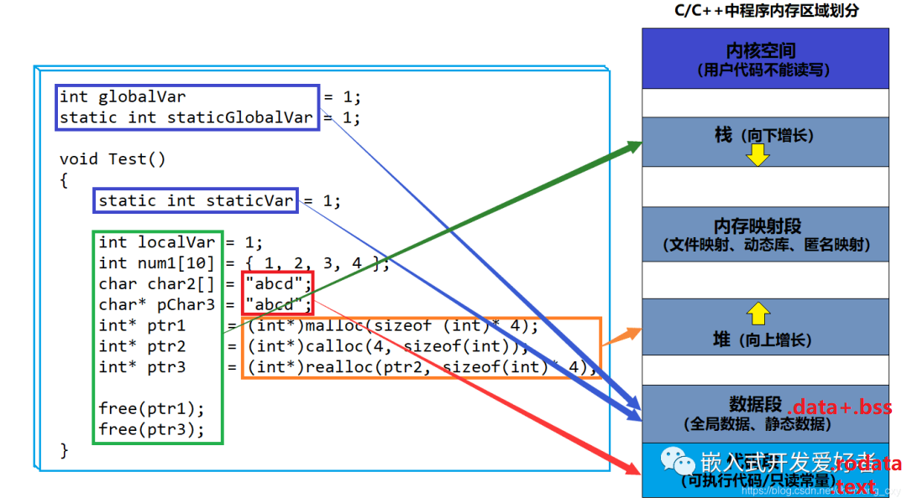

## Blog

### 算法

#### 详细任务

- 39 组合总和
- 40 组合总和 Ⅱ
- 131 分割回文串


#### 39 组合总和

本题是 集合里元素可以用无数次，那么和组合问题的差别 其实仅在于 startIndex上的控制

本题和昨天的“组合”基本上是一个套路，按照回溯三部曲套用即可。需要注意的是，题目中给出的数组没有说明是从小到大排的（提交的时候有用例是从大到小的），需要先处理一遍；另一个小难点是`backtracking`中`idx`的确定，或者说是循环范围的确定，和调用该函数时这个参数到底传`i`还是`i+1`，因为数组中的元素是能够重复使用的，因此剩余的选取元素中需要包括当前选中的元素，从而确定循环的起始点是`idx`

```cpp
class Solution {
public:
    vector<int> nums;
    vector<vector<int>> ret;
    void backtracking(vector<int>& candidates, int target, int idx, int sum) {
        if (sum == target) {
            ret.push_back(nums);
            return;
        }
        for (int i = idx; i < candidates.size(); ++i) {
            if ((sum + candidates[i]) > target)
                break;
            nums.push_back(candidates[i]);
            backtracking(candidates, target, i, sum + candidates[i]);
            nums.pop_back();
        }
        return;
    }
    vector<vector<int>> combinationSum(vector<int>& candidates, int target) {
        std::sort(candidates.begin(), candidates.end());
        backtracking(candidates, target, 0, 0);
        return ret;
    }
};
```

题目链接/文章讲解：[https://programmercarl.com/0039.%E7%BB%84%E5%90%88%E6%80%BB%E5%92%8C.html](https://programmercarl.com/0039.组合总和.html) 

视频讲解：https://www.bilibili.com/video/BV1KT4y1M7HJ


#### 40 组合总和 Ⅱ

本题开始涉及到一个问题了：去重。

注意题目中给我们 集合是有重复元素的，那么求出来的 组合有可能重复，但题目要求不能有重复组合。 

初看这道题，感觉和上面一题非常类似，但是写完后才发现会出现重复的组合，就拿给出的用例来说，候选数的集合中有两个1，这意味着组合中也可能会有这两个1的同样的组合，那么就需要去重，想到的一个偷懒的办法就是先用`set`来存储组合的结果集，然后转换成题目要求的`vector`，这么做在提交的时候会超时，显而易见效率非常低

看了讲解的视频后，去重就是将使用过的元素跳过，具体来说，就是对树层去重，而不必对树枝去重，即组合中是可以有数值相同的元素。

```cpp
class Solution {
public:
    vector<int> path;
    vector<vector<int>> ret;
    vector<bool> used; // 记录在当前回溯过程中哪些元素已经被选中（或者说已经被“使用”了）
    void backtracking(vector<int> &candidates, int target, int idx, int sum, vector<bool> used) {
        if (target == sum) {
            ret.push_back(path);
            return ;
        }
        for (int i = idx; i < candidates.size(); ++i) {
            if (sum + candidates[i] > target)
                break;
            // 去重逻辑：
            if (i > 0 && candidates[i] == candidates[i - 1] && !used[i - 1])
                // i > 0 保证 i - 1 合法
                /* !used[i - 1]这是关键点！
                * 这里检查前一个元素是否在当前递归调用中已经被使用过。
                * 如果前一个元素没有被使用（即 used[i - 1] 为 false），
                * 就意味着当前这个重复的数字与上一个相同的数字处于同一个层次选择中，
                * 而且上一个数字因为没有被选中，
                * 所以当前这个数字如果被选中，会产生与之前相同的组合，从而导致重复。 
                */
                continue;
            path.push_back(candidates[i]);
            used[i] = true;
            backtracking(candidates, target, i + 1, sum + candidates[i], used);
            path.pop_back();
            used[i] = false;
        }
        return ;
    }
    vector<vector<int>> combinationSum2(vector<int>& candidates, int target) {
        std::sort(candidates.begin(), candidates.end());
        used.resize(candidates.size());
        backtracking(candidates, target, 0, 0, used);
        return ret;
    }
};
```

本题的关键就是理解去重的逻辑。要去重的是“同一树层上的使用过”，如何判断同一树层上元素（相同的元素）是否使用过了呢。

**如果`candidates[i] == candidates[i - 1]` 并且 `used[i - 1] == false`，就说明：前一个树枝，使用了candidates[i - 1]，也就是说同一树层使用过candidates[i - 1]**。


在图中将used的变化用橘黄色标注上，可以看出在candidates[i] == candidates[i - 1]相同的情况下：

- used[i - 1] == true，说明同一树枝candidates[i - 1]使用过
- used[i - 1] == false，说明同一树层candidates[i - 1]使用过

简单来说，这个条件是为了确保对于相同的数字，只有在前一个数字已经在当前路径中被选用的情况下，才能选择当前这个数字。否则，如果前一个相同的数字没有被使用，那么选择当前数字会导致重复组合的生成。

题目链接/文章讲解：[https://programmercarl.com/0040.%E7%BB%84%E5%90%88%E6%80%BB%E5%92%8CII.html](https://programmercarl.com/0040.组合总和II.html)   

视频讲解：https://www.bilibili.com/video/BV12V4y1V73A


#### 131 分割回文串

**本题较难**，大家先看视频来理解 分割问题，明天还会有一道分割问题，先打打基础

思考了一下，确实没有很好的思路，这题不像前面几题，递归的终止条件要么是长度，要么是和，而本题还没有相同递归的终止条件是什么。

在看了视频之后，首先明确一下组合和切割的不同：

- 组合问题：选取一个a之后，在bcdef中再去选取第二个，选取b之后在cdef中再选取第三个.....。
- 切割问题：切割一个a之后，在bcdef中再去切割第二段，切割b之后在cdef中再切割第三段.....。


递归用来纵向遍历，for循环用来横向遍历，切割线（就是图中的红线）切割到字符串的结尾位置，说明找到了一个切割方法。

在明确了切割的概念之后，剩下的就是转为成代码了

因为是分割，所以中间结果是一个个区间，因此需要使用`vector`来存储。

递归的终止条件是是否遍历到给定字符串的最后，走到了，说明这种分割方式已经分割完毕了。

本层递归的逻辑是，将通过当前的`idx`和上一次的`idx`来确定分割的边界，中间的就是分出来的字符串，如果是回文，则将这个加入到当前的分法的中间集中；如果不是，说明可能这个并不是边界，继续往后走。将字符串处理完后，通过递归继续处理当前方法后面的分割。

```cpp
class Solution {
public:
    vector<string> path; // 记录当前分割方案
    vector<vector<string>> ret; // 存储所有符合条件的分割方案
    bool isPalindrome(string str, int start, int end) {
        for (int i = start, j = end; i < j; ++i, --j)
            if (str[i] != str[j])
                return false;
        return true;
    }
    void backtracking(string s, int idx) {
        if (idx >= s.size()) {
            ret.push_back(path);
            return;
        }
        for (int i = idx; i < s.size(); ++i) {
            if (isPalindrome(s, idx, i)) {
                // 如果 s[idx:i] 是回文串
                string str = s.substr(idx, i - idx + 1);
                path.push_back(str);
            } else
                continue;
            backtracking(s, i + 1); // 递归处理剩余的部分
            path.pop_back(); // 回溯，撤销上一步选择
        }
        return;
    }
    vector<vector<string>> partition(string s) {
        backtracking(s, 0);
        return ret;
    }
};
```

对于上面的代码还不是很理解，看着随想录边理解边写的。需要复习

题目链接/文章讲解：[https://programmercarl.com/0131.%E5%88%86%E5%89%B2%E5%9B%9E%E6%96%87%E4%B8%B2.html](https://programmercarl.com/0131.分割回文串.html)  

视频讲解：https://www.bilibili.com/video/BV1c54y1e7k6  


### 八股文

#### **静态变量和全局变量、局部变量的区别、在内存上是怎么分布的**

掌握程度：

- 能够清晰地定义静态变量、全局变量和局部变量，解释它们的基本定义和特点。
- 理解它们的区别：包括生命周期、作用域、内存分配和初始化。
- 知道内存分布：描述它们在内存中的存储位置，如栈和数据段。

参考资料：

- [菜鸟教程：C++ 全局变量、局部变量、静态全局变量、静态局部变量的区别]()

    https://www.runoob.com/note/36010

C++ 变量根据定义的位置的不同的生命周期，具有不同的作用域，作用域可分为 6 种：**全局作用域**，**局部作用域**，**语句作用域**，**类作用域**，**命名空间作用域和文件作用域**。

##### 从作用域看：

<u>全局变量具有全局作用域</u>。全局变量只需在一个源文件中定义，就可以作用于所有的源文件。其他不包含全局变量定义的源文件需要用`extern`关键字再次声明这个全局变量。

<u>静态局部变量具有局部作用域</u>，它只被初始化一次，自从第一次被**初始化直到程序运行结束**都一直存在，它和全局变量的区别在于全局变量对所有的函数都是可见的，而静态局部变量只对定义自己的函数体始终可见。

<u>局部变量也只有局部作用域</u>，它是自动对象（auto），它在程序运行期间不是一直存在，而是只在函数执行期间存在，函数的一次调用执行结束后，变量被撤销，其所占用的内存也被收回。

<u>静态全局变量也具有全局作用域</u>，它与全局变量的区别在于如果程序包含多个文件的话，它**作用于定义它的文件里**，不能作用到其它文件里，即——被`static`关键字修饰过的变量具有文件作用域。这样即使两个不同的源文件都定义了相同名字的静态全局变量，它们也是不同的变量。

##### 从分配内存空间看：

<u>全局变量，静态局部变量，静态全局变量</u>都在==静态存储区==分配空间，而<u>局部变量</u>在==栈==里分配空间。

全局变量本身就是静态存储方式， 静态全局变量当然也是静态存储方式。这两者在存储方式上并无不同。这两者的区别虽在于非静态全局变量的作用域是整个源程序，当一个源程序由多个源文件组成时，非静态的全局变量在各个源文件中都是有效的。

而静态全局变量则限制了其作用域， 即只在定义该变量的源文件内有效，在同一源程序的其它源文件中不能使用它。由于静态全局变量的作用域局限于一个源文件内，只能为该源文件内的函数公用，因此可以避免在其它源文件中引起错误。

- <u>静态变量</u>会被放在程序的<u>静态数据存储区（数据段）</u>(全局可见)中，这样可以在下一次调用的时候还可以保持原来的赋值。这一点是它与堆栈变量和堆变量的区别。

- 变量用static告知编译器，自己仅仅在变量的作用范围内可见。这一点是它与全局变量的区别。

    > `static` 这个说明符在不同的地方所起的作用是不同的

把局部变量改变为静态变量后是改变了它的存储方式即改变了它的生存期。

把全局变量改变为静态变量后是改变了它的作用域，限制了它的使用范围。

> 建议：
>
> - 若全局变量仅在单个C文件中访问，则可以将这个变量修改为静态全局变量，以降低模块间的耦合度；
> - 若全局变量仅由单个函数访问，则可以将这个变量改为该函数的静态局部变量，以降低模块间的耦合度；
> - 设计和使用访问动态全局变量、静态全局变量、静态局部变量的函数时，需要考虑重入问题，因为他们都放在静态数据存储区，全局可见；
> - 如果我们需要一个可重入的函数，那么，我们一定要避免函数中使用static变量(这样的函数被称为：带“内部存储器”功能的的函数)
> - 函数中必须要使用static变量情况:比如当某函数的返回值为指针类型时，则必须是static的局部变量的地址作为返回值，若为auto类型，则返回为错指针。

| **特性**       | **静态变量**                   | **全局变量**                                  | **局部变量**             |
| -------------- | ------------------------------ | --------------------------------------------- | ------------------------ |
| **生命周期**   | 整个程序运行期间               | 整个程序运行期间                              | 函数或代码块执行期间     |
| **作用域**     | 定义位置决定（函数内或文件内） | 全局（可被多文件访问，`static` 修饰则文件内） | 定义所在的函数或代码块内 |
| **内存分配**   | 全局/静态存储区                | 全局/静态存储区                               | 栈区                     |
| **默认初始化** | 自动初始化为零或默认值         | 自动初始化为零或默认值                        | 不自动初始化，值未定义   |

> **static 全局变量**:改变作用范围，不改变存储位置
>
> **static 局部变量**：改变存储位置，不改变作用范围
>
> **静态函数** ：在函数的返回类型前加上static关键字,函数即被定义为静态函数。静态函数与普通函数不同，它只能在声明它的文件当中可见，不能被其它文件使用。
>
> 如果在一个源文件中定义的函数，只能被本文件中的函数调用，而不能被同一程序其它文件中的函数调用，这种函数也称为内部函数。定义一个内部函数，只需在函数类型前再加一个“static”关键字即可。


#### **指针和引用的区别**

掌握程度：

- 能够清晰地定义指针和引用：解释它们的基本定义和特点。
- 理解它们的区别：包括定义方式、可变性、内存分配和内存管理。
- 知道使用场景：描述指针和引用适用的不同编程场景

参考资料：

- [【为什么C++既有指针又有引用 | 指针和引用的区别 |】]()

    https://www.bilibili.com/video/BV1xP411e75w/?share_source=copy_web&vd_source=9bb0aa9c2c3cc1b12ca6f343a55b4e80

##### 指针

指针是一个变量，存储的是另一个变量的内存地址

```cpp
int a = 10;
int* ptr = &a; // ptr 是指向 a 的指针
// int* ptr 表示 ptr 是一个指向 int 类型的指针
// *ptr 解引用操作，用于访问指针所指向地址的值
```

**指针的特点**

1. **存储地址**：指针存储变量的内存地址。

2. **可以为空**：指针可以被赋值为 `nullptr`，表示指针不指向任何有效对象。

3. **动态分配**：可以通过指针动态分配内存。

4. **可以修改**：指针可以指向不同的变量，支持指针运算（如递增、递减等）。

    **指针赋值**：`ptr = &b`

    **解引用**：`*ptr = 30`

    **指针运算**（用于数组）：

    ```cpp
    int arr[3] = {1, 2, 3};
    int* p = arr; // p 指向数组的第一个元素
    std::cout << *(p + 1); // 输出 2
    ```

**指针的常见用途**：

1. 动态内存分配

    ```cpp
    int* p = new int(5); // 动态分配内存并初始化为 5
    delete p;           // 释放内存
    ```

2. 函数参数传递（通过地址传递）：

    ```cpp
    void modify(int* x) {
        *x = 10;
    }
    int val = 5;
    modify(&val);
    ```

3. 实现复杂数据结构（如链表、树等）

##### 引用

引用（reference）是一个变量的别名，与原变量绑定，不能更改引用的绑定对象

```cpp
int a = 10;
int& ref = a; // ref 是 a 的引用
// int& ref 表示 ref 是一个指向 int 类型变量的引用
```

一旦 `ref` 被初始化为 `a` 的别名，就始终引用 `a`

**引用的特点**

1. **必须初始化**：引用在声明时必须绑定到一个变量。
2. **不可为空**：引用始终指向一个有效的变量（与指针可以为 `nullptr` 不同）。
3. **不可更改绑定**：引用一旦绑定到一个变量，不能再更改为绑定其他变量。
4. **语法简洁**：引用的语法比指针更加直观，没有解引用操作符。

**引用的常见用途**：

- **传递参数**：通过引用传递避免拷贝，提高性能。

- **返回值优化**：用引用返回对象以避免拷贝开销。

    ```cpp
    int& getValue(int& x) {
        return x;
    }
    ```

- **实现运算符重载**：重载操作符通常通过引用返回。

| **特性**         | **指针**                               | **引用**                             |
| ---------------- | -------------------------------------- | ------------------------------------ |
| **定义与初始化** | 声明时可以未初始化；可以为 `nullptr`   | 必须初始化；不能为空                 |
| **绑定关系**     | 可指向不同变量                         | 一旦绑定，不能更改                   |
| **修改能力**     | 可改变指向的地址                       | 只能修改所引用变量的值               |
| **语法**         | 使用 `*` 解引用，`&` 获取地址          | 语法更加简洁，无需解引用符           |
| **内存使用**     | 存储变量地址，占用额外的指针存储空间   | 是变量的别名，不占用额外存储空间     |
| **动态分配**     | 支持动态分配内存                       | 不支持                               |
| **用途**         | 灵活，用于动态内存分配、数组等复杂操作 | 语法清晰，常用于参数传递和返回值优化 |

> 1. 引用的本质是指针的语法糖，但引用更加安全和高效。
> 2. 指针提供了更大的灵活性，可以动态分配内存并自由修改地址。
> 3. 引用语法更简洁，且更倾向于在不需要动态分配内存的情况下使用。


#### **C++内存分区**

掌握程度：

- 能够清晰地描述C++中的内存分区：包括栈、堆、全局/静态存储区、常量存储区、代码段、数据段和BSS段。
- 理解各分区的特点和用途：解释每个内存分区的作用和存储的数据类型。
- 知道内存分配和释放的机制：描述如何在栈和堆上分配和释放内存

参考资料：

- [博客：C++内存分区]()

    https://blog.csdn.net/u011718663/article/details/118186352?ops_request_misc=%7B%22request%5Fid%22%3A%22172225930216800211537941%22%2C%22scm%22%3A%2220140713.130102334.pc%5Fall.%22%7D&request_id=172225930216800211537941&biz_id=0&utm_medium=distribute.pc_search_result.none-task-blog-2~all~first_rank_ecpm_v1~hot_rank-12-118186352-null-null.142\^v100^pc_search_result_base6&utm_term=C%2B%2B内存&spm=1018.2226.3001.4187

-  [【C++面试100问】第八十六问：内存分区模型是怎么做的？】]()

    https://www.bilibili.com/video/BV1ZJ4m1g71r/?share_source=copy_web&vd_source=9bb0aa9c2c3cc1b12ca6f343a55b4e80

从本质上看，C++内存模型分成包含`.text`，`.rodata`，`.data`，`.bss`，堆，栈，内存映射区，内核空间。：

- `.text`代码段：存储的是程序源代码编译后的机器执行。是只读的
- `.rodata`只读数据段：存放的是程序中的只读数据，一般是程序里面的只读变量和字符串常量
- `.data`数据段：存放的是已经初始化了的全局静态变量和局部静态变量
- `.bss`(Block Started by Symbol)：存放的是未初始化的全局静态变量和局部静态变量
- 堆区：一般由程序员分配释放，若程序员不释放，存放一些new创建的对象
- 栈区：由编译器自动分配释放，存放函数的参数值，局部变量的值等
- 内核空间：是操作系统内存管理的一部分，用于存储和运行操作系统内核的代码和数据



> 有人认为把常量区归于代码段；有人认为它是独立的
>
> 有人认为数据段是指`.data`，有人说数据段是`.data + .bss`，也有人认为数据段是`.data + .bss + .rodata`
>
> 这只是分类方式不同

> 上面所说的**内存模型**，指的是虚拟内存。可执行文件中存在`.text`和`.data`和`.rodata`，不存在`.bss`、堆、栈。
>
> 不存在`.bss`是因为它的内容是在可执行文件中用于存储未初始化的全局变量和静态变量的内存区域。为了节省空间，在程序加载到内存时，`.bss`段中的变量会被自动初始化为0或空指针。由于`.bss`段中的变量都是未初始化的，它们在可执行文件中实际上不占用任何空间，只是记录了这些变量的符号和大小信息
>
> 不存在堆、栈是因为它们都是动态加载的，在程序运行时才分配

> 为什么要把程序的指令和数据分开，分成这么多级？
>
> 1. 出于保护只读区域的原因：程序的指令和数据分开，因为数据区域对进程来说是可读可写的，而指令区可读，分开处理可以防止程序的指令被有意或无意地改写
> 2. 对于现代CPU来说，指令和数据区分有利于提高程序的局部性，现代CPU的缓存一般都设计成指令缓存和数据缓存，程序的指令和数据分开存放对于提高CPU缓存命中率有好处
> 3. 共享：最重要的原因，程序中运行多个程序时，它们的指令是一样的，内存中只用保存一份，将指令和数据分开，可以使指令共享，节省资源

```cpp
#include <iostream>

int globalVar = 1;
static int staticGlobalVar = 2;

void Test() {
    std::cout << "globalVar = " << globalVar << ", address = " << &globalVar << std::endl;
    std::cout << "staticGlobalVar = " << staticGlobalVar << ", address = " << &staticGlobalVar << std::endl;

    static int staticVar = 3;
    std::cout << "staticVar = " << staticVar << ", address = " << &staticVar << std::endl;

    int localVar = 4;
    std::cout << "localVar = " << localVar << ", address = " << &localVar << std::endl;
    
    int num[10] = {101, 102, 103, 104};
    std::cout << "num = {"; 
    for (auto &it : num)
        std::cout << it << " ";
    std::cout << "}, address = " << num << std::endl;
    char str[] = "abcd";
    std::cout << "str = " << str << ", address = " << &str << std::endl;
    const char *p = "abcd";
    std::cout << "abcd , address in .rodata = " << (void *)p << std::endl;
    char *pchar = "zyx";
    std::cout << "pchar = " << pchar << ", address = " << &pchar << std::endl;
    const char *q = "zyx";
    std::cout << "zyx , address in .rodata = " << (void *)q << std::endl;

    int *ptr1 = (int *)malloc(sizeof(int) * 4);
    std::cout << "ptr1 = " << ptr1 << ", address = " << &ptr1 << std::endl;
    int *ptr2 = (int *)calloc(4, sizeof(int));
    std::cout << "ptr2 = " << ptr2 << ", address = " << &ptr2 << std::endl;
    int *ptr3 = (int *)realloc(ptr2, sizeof(int) * 4);
    std::cout << "ptr3 = " << ptr3 << ", address = " << &ptr3 << std::endl;

    free(ptr1);
    free(ptr3);
}

int main()
{
    Test();
    return 0;
}

/*
全局变量：（已初始化）					==> .data
globalVar = 1, 							address = 0x56f80a589010
全局静态变量：（已初始化）			   ==> .data
staticGlobalVar = 2, 					address = 0x56f80a589014
函数内部的 局部静态变量（已初始化）		==> .data
staticVar = 3, 							address = 0x56f80a589018
函数内部的 局部变量（已初始化）		 ==> 栈
localVar = 4, 							address = 0x7ffe1711ad1c
函数内部的 局部变量（已初始化）		 ==> 栈
num = {101 102 103 104 0 0 0 0 0 0 }, 	address = 0x7ffe1711ad70
函数内部的 局部变量（已初始化）		 ==> 栈
str = abcd, 							address = 0x7ffe1711ada3
						abcd , address in .rodata = 0x56f80a587069
函数内部的 局部变量（已初始化）		 ==> 栈
pchar = zyx, 							address = 0x7ffe1711ad20
						zyx , address in .rodata = 0x56f80a58708b
new出来的变量，						==> 堆
ptr1 = 0x56f80bff86c0, 					address = 0x7ffe1711ad28
ptr2 = 0x56f80bff86e0, 					address = 0x7ffe1711ad30
ptr3 = 0x56f80bff86e0, 					address = 0x7ffe1711ad38
	ptr1, ptr2, ptr3 本身是函数内部的变量，其指向堆空间
*/
```

##### 生命周期

**数据段**，**`.bss`**：与程序的生命周期相同。（与下面的代码段一样）

**代码段**：在程序加载到内存时被分配，并在程序结束时被释放。

具体来说，就是在`main()`函数执行完后，再调用C++运行库中相关的函数来销毁全局变量和静态变量

**堆**：堆上的内存需要在运行时手动分配和释放；如果不手动释放，堆上内存在程序结束时由操作系统释放。与上面的全局变量和静态变量是并行或是在它们之后。

**栈**：离开它的作用域后由系统释放

##### ==堆和栈的区别==

- 内存分配方式的不同：

    堆上的内存是动态分配的，程序在运行时可以根据需要分配和释放内存。在C++中，可以使用`new`（或`new[]`）操作符分配堆内存、使用`delete`（或`delete[]`）操作符释放堆内存。在C语言中，可以使用`malloc`、`calloc`和`realloc`函数分堆内存、使用`free`函数释放堆内存。

    栈上的内存是自动分配和释放的。通常用于存储函数调用过程中的局部变量、返回地址和寄存器状态等信息。当函数被调用时，栈上的内存会自动分配；当函数返回时，栈上的内存会自动释放。

- 生命周期的不同：

    **堆**：堆上的内存生命周期取决于程序员手动分配和释放。分配的堆内存在程序运行过程中一直存在。直到被显式释放或程序结束

    **栈**：栈上的内存生命周期与函数调用相关。局部变量在函数被调用时自动分配内存，函数返回时自动释放内存

- 内存管理的不同：

    **堆**：堆上的内存需要程序员手动管理。程序员负责在适当的时机分配和释放内存，以避免内存泄漏和资源浪费。手动管理堆内存可能导致错误，如内存泄漏、野指针、重复释放等。

    **栈**：栈上的内存由操作系统和编译器自动管理，程序员无需关心内存分配和释放的细节。这使得栈上的内存更容易使用，但局部变量的生命周期受到函数调用的限制

- 内存大小的不同

    **堆**：堆的大小通常比栈大得多，因此可以用于存储较大的数据结构和对象。然而，分配和释放堆内存的操作相对较慢，可能导致程序性能下降

    **栈**：栈的大小相对较小，适用于存储较小的数据结构和对象。分配和释放栈内存的操作非常快速，但栈空间有限，可能导致栈溢出错误


### 总结

对于组合问题的基本框架，感觉已经掌握了，但是对于分割，还是有些一知半解，需要再次重做131题，并且增加对分割问题的求解
