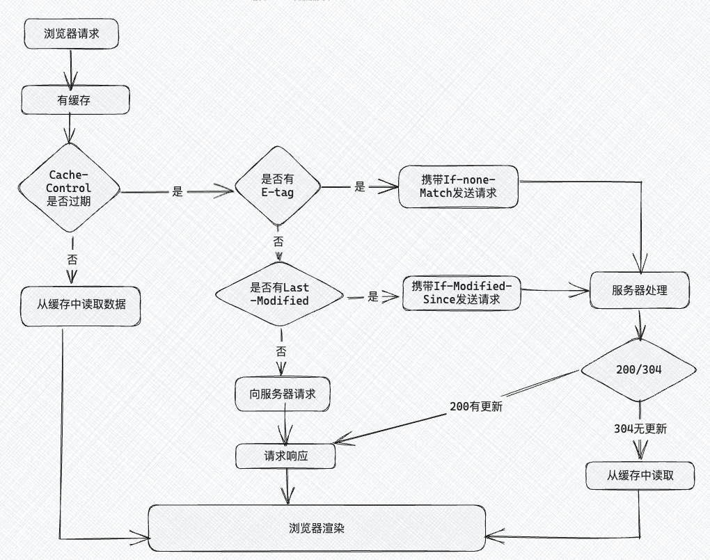

## Blog

### 算法

####  详细布置 

- 链表理论基础 

- 203 移除链表元素 

- 707 设计链表 

- 206 反转链表 


#### 链表理论基础

建议：了解一下链表基础，以及链表和数组的区别 

文章链接：[https://programmercarl.com/%E9%93%BE%E8%A1%A8%E7%90%86%E8%AE%BA%E5%9F%BA%E7%A1%80.html](https://programmercarl.com/链表理论基础.html)

链表的定义：

```cpp
struct ListNode
{
    int val;
    ListNode *next;
    ListNode(int x)
    : val(x)
    , next(nullptr)
    {}
};
// 初始化
ListNode *head = new ListNode(1);
// 使用默认的无参构造也可以
ListNode *head = new ListNode();
head->_val = 1;
```

与数组的对比

| 类型 | 插入、删除的时间复杂度 | 查询的时间复杂度 | 适用场景                         |
| ---- | ---------------------- | ---------------- | -------------------------------- |
| 数组 | O(n)                   | O(1)             | 数据量固定，频繁查询，较少增删   |
| 链表 | O(1)                   | O(n)             | 数据量不固定，频繁增删，较少查询 |


#### 203 移除链表元素  

建议： 本题最关键是要理解 虚拟头结点的使用技巧，这个对链表题目很重要。 

题目链接/文章讲解/视频讲解：：[https://programmercarl.com/0203.%E7%A7%BB%E9%99%A4%E9%93%BE%E8%A1%A8%E5%85%83%E7%B4%A0.html](https://programmercarl.com/0203.移除链表元素.html)[[1\]](#_msocom_1) 

这是一道比较基础的链表题，需要注意的是，在移除元素的时候，一定要处理好该节点的前驱和后继，即要让前驱的`next`指向后继节点，因此需要用一个变量专门记录一下删除节点的前驱

```cpp
class Solution {
public:
    ListNode* removeElements(ListNode* head, int val) {
        while (head && head->val == val) {
            ListNode *tmp = head;
            head = head->next;
            delete tmp;
        }
        if (!head) return nullptr;

        ListNode *p = head->next, *q = head;
        while (p) {
            if (p->val == val) {
                ListNode *tmp = p;
                p = p->next;
                q->next = p;
                delete tmp;
            } else {
                q = p;
                p = p->next;
            }
        }
        return head;
    }
};
```

在看了随想录后，上面的代码可以直接使用`p->next->val`来判断值，这样就不必再记录前一个节点了，不过需要先判断该节点是否存在

另一种思路：使用虚拟头结点，这样第一个节点的移除和其他节点一样。记得释放申请的虚拟头节点

```cpp
class Solution {
public:
    ListNode* removeElements(ListNode* head, int val) {
        ListNode *dummyHead = new ListNode();
        dummyHead->next = head;
        ListNode *p = dummyHead;
        while (p->next) {
            if (p->next->val == val) {
                ListNode *tmp = p->next;
                p->next = tmp->next;
                delete tmp;
            } else
                p = p->next;
        }
        head = dummyHead->next;
        delete dummyHead;
        return head;
    }
};
```

还可以使用递归的思路来解决问题，递归出口是空；递归处理的逻辑是，如果当前节点是要移除的，适应新节点来记录下一个节点的位置，并释放当前节点；如果不是要移除的，直接更新为下一个节点


#### 707 设计链表  

建议： 这是一道考察 链表综合操作的题目，不算容易，可以练一练 使用虚拟头结点 

题目链接/文章讲解/视频讲解：[https://programmercarl.com/0707.%E8%AE%BE%E8%AE%A1%E9%93%BE%E8%A1%A8.html](https://programmercarl.com/0707.设计链表.html)[[2\]](#_msocom_2) [[3\]](#_msocom_3) [[4\]](#_msocom_4) [[5\]](#_msocom_5) [[6\]](#_msocom_6) [[7\]](#_msocom_7) 

开始有点懵，没有使用C++写过链表，因此不知道这个链表类应该怎么设计，瞄了一眼随想录中类的数据成员和构造函数，然后开始写

注意：链表的序列号是从0开始的；在插入时，注意顺序；插入上删除的时候，都需要找前一个节点

```cpp
class MyLinkedList {
public:
    // 定义链表节点的结构体
    struct LinkedNode {
        int val;
        struct LinkedNode *next;
        LinkedNode(int data):val(data), next(nullptr){}
    };

    MyLinkedList() {
        _dummyHead = new LinkedNode(0);
        _size = 0;
    }

    ~MyLinkedList() {
        LinkedNode *cur = _dummyHead;
        while (cur) {
            LinkedNode *tmp = cur;
            cur = cur->next;
            delete tmp;
        }
    }

    int get(int index) {
        if (index < 0 || index >= _size)
            return -1;
        LinkedNode *cur = _dummyHead->next;
        while (index --) 
            cur = cur->next;
        return cur->val;
    }
    
    void addAtHead(int val) {
        LinkedNode *newNode = new LinkedNode(val);
        newNode->next = _dummyHead->next;
        _dummyHead->next = newNode;
        _size ++;
    }
    
    void addAtTail(int val) {
        LinkedNode *cur = _dummyHead;
        while (cur->next) cur = cur->next;
        cur->next = new LinkedNode(val);
        _size ++;
    }
    
    void addAtIndex(int index, int val) {
        if (index > _size) return;
        if (index <= 0) {
            addAtHead(val);
            return ;
        }
        if (index == _size) {
            addAtTail(val);
            return ;
        }

        LinkedNode *newNode = new LinkedNode(val);
        LinkedNode *cur = _dummyHead;
        while (index --)
            cur = cur->next;
        newNode->next = cur->next; // 不要忘记处理后继
        cur->next = newNode;
        _size ++;
    }
    
    void deleteAtIndex(int index) {
        if (index < 0 || index >= _size) return ;

        LinkedNode *cur = _dummyHead;
        while (index --)
            cur = cur->next;

        LinkedNode *tmp = cur->next;
        cur->next = tmp->next;
        delete tmp;
        tmp = nullptr; // 处理野指针
        _size --;
    }

private:
    int _size;
    LinkedNode* _dummyHead;
};
```


#### 206 反转链表

建议先看我的视频讲解，视频讲解中对 反转链表需要注意的点讲的很清晰了，看完之后大家的疑惑基本都解决了。 

题目链接/文章讲解/视频讲解：[https://programmercarl.com/0206.%E7%BF%BB%E8%BD%AC%E9%93%BE%E8%A1%A8.html](https://programmercarl.com/0206.翻转链表.html) 

创建一个新的链表，将原链表的每个节点使用头插法依次插入新链表中。先将原链表的节点取出（断开后继），使用头插法插入新链表中，并更新该节点的后继

```cpp
class Solution {
public:
    ListNode* reverseList(ListNode* head) {
        if (!head) return nullptr;

        ListNode *dummyHead = new ListNode();
        ListNode *p = head, *q = dummyHead;
        while (p) {
            ListNode *tmp = p->next;
            p->next = q->next;
            q->next = p;
            p = tmp;
        }
        ListNode *node = dummyHead->next;
        delete dummyHead;
        return node;
    }
};
```

随想录中，介绍了另一种方法，双指针的写法

使用`cur`来记录当前节点，`pre`来记录当前节点的前一个节点（初始化时是作为整个链表的尾节点，因此需初始化为NULL），将`cur->next`指向`pre`，这样遍历一遍后，就达到了翻转的效果。注意，最后需要将head更新为pre，当遍历完成后pre就是头节点

```cpp
	ListNode* reverseList(ListNode* head) {
        ListNode *cur = head, *pre = nullptr;
        while (cur) {
            ListNode *tmp = cur->next;
            cur->next = pre;
            pre = cur;
            cur = tmp;
        }
        return pre;
    }
```

基于以上的思路，用递归的方式来进行解题

```cpp
class Solution {
public:
    ListNode* reverseList(ListNode* head) {
        return reverse(head, nullptr);
    }

    ListNode *reverse(ListNode *cur, ListNode *pre) {
        if (cur == nullptr) return pre;
        ListNode *tmp = cur->next;
        cur->next = pre;
        return reverse(tmp, cur);
    }
};
```


### 八股文

#### HTTP请求中常见的状态码 

掌握程度：

●状态码：能够根据1xx、2xx、3xx、4xx、5xx分类描述状态码，并对每个类别中的常见状态码能够解释其含义和使用场景。

●缓存：知道3xx状态码中的重定向是如何工作的。

●进阶：能够结合实际案例来讨论状态码的使用。

参考资料：

[【学习新姿势】用说唱RAP学会常用HTTP状态码](https://www.bilibili.com/video/BV1jY411u7Zn/?share_source=copy_web&vd_source=9bb0aa9c2c3cc1b12ca6f343a55b4e80)

[MDN: HTTP响应状态码](https://developer.mozilla.org/zh-CN/docs/Web/HTTP/Status)

[小林coding: HTTP请求中常见的状态码有哪些](https://xiaolincoding.com/network/2_http/http_interview.html#http-常见的状态码有哪些)


在HTTP协议中，状态码主要用于表示服务器对请求的响应情况。状态码被分成五大类：1xx（信息性响应）、2xx（成功）、3xx（重定向）、4xx（客户端错误）和5xx（服务器错误）。

##### 1xx 信息性响应

1xx状态码表示请求已经接收，服务器正在处理中，但还没有完成整个请求。

- **100 Continue**：服务器收到请求的初始部分，客户端可以继续发送其余部分。在大数据上传或分块传输时，服务器会用这个状态码来通知客户端继续传输。
- **101 Switching Protocols**：服务器接受客户端的请求，并将协议从HTTP/1.1切换到其他协议，比如WebSocket。

##### 2xx 成功

2xx状态码表示客户端请求已成功被服务器接收、理解并接受。

- **200 OK**：最常见的成功状态码，表示请求成功，服务器返回了所需的资源。适用于GET请求的资源获取，POST请求的资源创建，DELETE请求的资源删除等。
- **201 Created**：表示请求成功且服务器已经创建了新的资源，通常在POST请求创建资源后返回。
- **204 No Content**：请求成功但服务器没有返回任何内容。常用于删除资源的请求，表示操作成功但没有额外数据返回。
- **206 Partial Content**：服务器只返回了部分内容，一般用于文件分块下载。客户端请求只需部分内容时，服务器返回206表示部分数据响应。

##### 3xx 重定向

3xx状态码表示客户端请求的资源已被转移，客户端需要进行额外操作才能完成请求。

- **301 Moved Permanently**：永久重定向，表示请求的资源已永久移动到新的URL。浏览器会自动更新书签。
- **302 Found**：临时重定向，资源暂时被移动到新的URL。通常在需要维护网站内容或者变更资源位置时使用。
- **304 Not Modified**：用于缓存控制。当客户端的缓存资源与服务器资源无差别时，服务器返回304状态码，提示客户端直接使用缓存。
- **307 Temporary Redirect**：和302类似，表示临时重定向，但不允许更改请求方法，比如POST必须仍然是POST。
- **308 Permanent Redirect**：和301类似，表示永久重定向，且不允许更改请求方法。

##### 4xx 客户端错误

4xx状态码表示客户端请求存在错误，服务器无法处理。

- **400 Bad Request**：请求格式不正确或参数有误，服务器无法理解。常用于表单输入或API请求中的参数校验失败。
- **401 Unauthorized**：表示请求需要身份验证，通常是未提供有效的身份认证信息。
- **403 Forbidden**：服务器理解请求但拒绝执行。客户端可能没有访问权限，或者请求资源限制访问。
- **404 Not Found**：最常见的错误之一，表示请求的资源不存在。用户访问不存在的网页或文件时会返回该状态码。
- **405 Method Not Allowed**：请求的方法不被允许。例如，对某个API的POST请求不允许，服务器会返回405。
- **408 Request Timeout**：请求超时，通常在服务器等待客户端发送请求超时后返回。网络延迟或资源不足导致。

##### 5xx 服务器错误

5xx状态码表示服务器在处理请求时出现内部错误，导致无法完成请求。

- **500 Internal Server Error**：服务器内部错误，导致请求无法处理。可能由于代码异常、配置错误等原因。
- **501 Not Implemented**：服务器不支持请求的方法，比如服务器未实现PATCH方法。
- **502 Bad Gateway**：服务器作为网关或代理，在与上游服务器通信时接收到无效响应。多用于代理服务器，表示上游服务器故障。
- **503 Service Unavailable**：服务器暂时不可用，通常是过载或维护所致。服务器一段时间后可能恢复正常。
- **504 Gateway Timeout**：网关或代理服务器等待上游服务器响应超时。常见于代理服务器或负载均衡器与后端服务器的通信问题。
- **505 HTTP Version Not Supported**：服务器不支持请求使用的HTTP协议版本。例如，客户端使用了过时的协议版本，而服务器仅支持较新版本。

##### 重定向的工作流程：

1. 客户端发起请求：用户在浏览器中输入URL并发起HTTP请求。
2. 服务器响应：服务器接收到请求后，发现请求的资源已被移动（无论是临时还是永久），就会返回一个3xx状态码。这个响应中会包含新的URL（Location头部），指示客户端重定向到哪个地址。
3. 客户端处理重定向：
   - 自动重定向：大多数现代浏览器会自动处理3xx状态码，读取Location头部中的新URL，并向该地址发起新的请求。例如：
     - 如果收到301 Moved Permanently状态码，浏览器会将请求的URL更新为新的URL，并将其请求方法（如GET或POST）相应地转发。
     - 对于302 Found，浏览器同样会自动重定向，但如果原始请求是POST请求，浏览器会将其转换为GET请求来发起新的请求。
   - 手动重定向：如果开发者使用了如HTTP库等工具或客户端程序进行请求，可能需要手动处理重定向。例如，某些API客户端可能需要检查响应状态码并决定是否再次请求新的URL。
4. 接收新响应：客户端发起新的请求后，服务器会返回请求的新资源（200 OK状态码）或其他响应状态码。


#### 什么是强缓存和协商缓存

什么是强缓存和协商缓存 

掌握程度：

●基本概念：区分强缓存和协商缓存的概念，并解释它们的不同用途。

●工作流程: 能够描述浏览器和服务器在强缓存和协商缓存中如何交互。

●HTTP头部字段: 知道实现强缓存和协商缓存的HTTP头部字段，如 Cache-Control, Last-Modified, ETag, If-Modified-Since, If-None-Match。

●性能优化: 理解缓存机制如何提高Web应用的性能和用户体验。

参考资料：

[小林coding: HTTP缓存](https://xiaolincoding.com/network/2_http/http_interview.html#http-缓存技术)

 [视频解析：【HTTP缓存过程】](https://www.bilibili.com/video/BV1kV4y1K7Rx/?share_source=copy_web&vd_source=9bb0aa9c2c3cc1b12ca6f343a55b4e80)

[MDN文档](https://developer.mozilla.org/zh-CN/docs/Web/HTTP/Caching#概览)


强缓存和协商缓存是HTTP缓存机制的两种基本类型，它们的主要作用是减少客户端和服务器之间的请求次数，提高Web应用的性能和用户体验



##### 强缓存

概念： 强缓存是指在缓存有效期内，浏览器直接从本地缓存中读取资源，而不向服务器发送任何请求。这种缓存策略的主要优点是能有效减少网络请求，从而加快页面加载速度。

用途： 强缓存适用于那些不经常变化的资源，如静态文件（CSS、JavaScript、图片等）。通过强缓存，可以在用户多次访问同一资源时快速加载，提升用户体验。

HTTP头部字段：

- **Expires**：表示资源的过期时间，格式为HTTP日期。例如：
  - `Expires: Wed, 21 Oct 2024 07:28:00 GMT`
  - 如果本地时间不准确（或与服务器时间不一致）会出错，因此使用Cache-Control

- **Cache-Control**：用于指定强缓存的策略。例如：
  - `max-age=3600`：表示资源在缓存中可存活3600秒。
  - `public`：表示资源可以被任何缓存存储。
  - `private`：表示资源只能被用户自己的浏览器缓存。

浏览器与服务器的交互过程：

1. 客户端（浏览器）请求资源。
2. 服务器返回资源，并在响应头中设置`Cache-Control`或`Expires`。
3. 客户端将资源缓存到本地，并记录其有效期。
4. 下次请求相同资源时，客户端直接从缓存中读取，无需发送请求。

##### 协商缓存

概念： 协商缓存是指在强缓存失效后，浏览器会向服务器发送请求，询问缓存的资源是否可以使用。如果服务器认为缓存仍然有效，便会返回304 Not Modified状态码，允许客户端使用本地缓存的资源。

用途： 协商缓存适用于那些会发生变化但又不频繁变动的资源，像API响应或动态内容。通过协商缓存，浏览器可以在资源未发生变化时，避免重新下载，进一步提升性能。

HTTP头部字段：

- **Last-Modified**：服务器上次修改资源的时间。当浏览器请求资源时，会发送`If-Modified-Since`头部，指示上次缓存的时间。服务器根据这个时间判断资源是否修改，如果未修改，返回304状态码。
- **ETag**：为资源生成唯一标识符（如文件的内容哈希值）。浏览器在请求时会发送`If-None-Match`头部，携带ETag值，服务器根据ETag判断资源是否修改，未修改时返回304。

浏览器与服务器的交互过程：

1. 客户端请求资源，且缓存已过期。
2. 服务器返回资源，并在响应头中设置`Last-Modified`或`ETag`。
3. 客户端缓存资源，同时记录`Last-Modified`或`ETag`。
4. 当再次请求相同资源时，客户端向服务器发送`If-Modified-Since`或`If-None-Match`请求。
5. 服务器检查资源状态：
   - 如果未修改，返回304 Not Modified，客户端继续使用缓存。
   - 如果已修改，返回新的资源和200 OK状态码，客户端更新缓存。

##### 缓存机制如何提高性能和用户体验

- 减少网络请求：强缓存能够让浏览器直接从本地加载资源，避免与服务器的重复通信，降低延迟，提高页面加载速度。
- 降低带宽消耗：通过使用缓存，浏览器可以避免下载相同的资源，减少了带宽消耗，尤其在移动网络环境下显得尤为重要。
- 提升响应速度：用户在重复访问时，能够更快地看到页面内容，提升了用户体验。
- 优化服务器负载：缓存能减少服务器的请求压力，提升系统的整体性能，能够更好地处理大量用户请求。


### 总结

今天的题目还是比较基础，在看到题目后基本都有思路，对链表类的结构不熟悉，看过一遍后有了映像；然后对于翻转链表的题，随想录中的双指针解法（即逐个翻转节点指向）的思路值得学习


