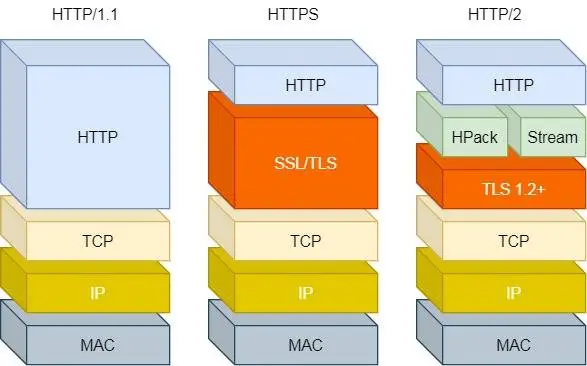

## Blog

### 算法

####  详细布置 

- 24 两两交换链表中的节点 

- 19 删除链表的倒数第N个节点 

- 面试题 02.07. 链表相交 

- 142 环形链表II 

- 总结


#### 24 两两交换链表中的节点

用虚拟头结点，这样会方便很多。

本题链表操作就比较复杂了，建议大家先看视频，视频里我讲解了注意事项，为什么需要temp保存临时节点。

题目链接/文章讲解/视频讲解： [https://programmercarl.com/0024.%E4%B8%A4%E4%B8%A4%E4%BA%A4%E6%8D%A2%E9%93%BE%E8%A1%A8%E4%B8%AD%E7%9A%84%E8%8A%82%E7%82%B9.html](https://programmercarl.com/0024.两两交换链表中的节点.html)

看到本题，一开始确实没有思路，因此直接看了卡哥的视频

解题思路：遍历链表，注意：当前的指针一定要指向需要操作的两个节点的前一个，同时需要用一个临时指针来记录一下（类似于普通的交换也需要使用tmp），另外需要特别注意的使断链的顺序，在断开前需要确保能够找到下一个要操作的节点

```cpp
class Solution {
public:
    ListNode* swapPairs(ListNode* head) {
        ListNode *dummyHead = new ListNode();
        dummyHead->next = head;
        ListNode *cur = dummyHead;
        while (cur->next && cur->next->next) {
            ListNode *tmp = cur->next;
            cur->next = tmp->next;
            tmp->next = cur->next->next;
            cur->next->next = tmp;
            cur = cur->next->next;
        }
        head = dummyHead->next;
        delete dummyHead;
        return head;
    }
};
```


#### 19 删除链表的倒数第N个节点 

双指针的操作，要注意，删除第N个节点，那么我们当前遍历的指针一定要指向 第N个节点的前一个节点，建议先看视频。

题目链接/文章讲解/视频讲解：[https://programmercarl.com/0019.%E5%88%A0%E9%99%A4%E9%93%BE%E8%A1%A8%E7%9A%84%E5%80%92%E6%95%B0%E7%AC%ACN%E4%B8%AA%E8%8A%82%E7%82%B9.html](https://programmercarl.com/0019.删除链表的倒数第N个节点.html)

注意，删除的倒数的节点。首先想到的思路就是先遍历一遍，求出总节点数。看了给出的提示，可以使用快慢指针的思路，快慢指针的间距就是N，就是N而不是N-1，需要慢指针找到要删除节点的前一个节点

```cpp
class Solution {
public:
    ListNode* removeNthFromEnd(ListNode* head, int n) {
        ListNode *dummyHead = new ListNode();
        dummyHead->next = head;
        ListNode *fast = dummyHead, *slow = dummyHead;
        while (fast->next) {
            fast = fast->next;
            if (n > 0) n --;
            else slow = slow->next;
        }
        ListNode *tmp = slow->next;
        slow->next = tmp->next;
        delete tmp;
        head = dummyHead->next;
        delete dummyHead;
        return head;
    }
};
```


#### 160 链表相交

本题没有视频讲解，大家注意 数值相同，不代表指针相同。

题目链接/文章讲解：[https://programmercarl.com/%E9%9D%A2%E8%AF%95%E9%A2%9802.07.%E9%93%BE%E8%A1%A8%E7%9B%B8%E4%BA%A4.html](https://programmercarl.com/面试题02.07.链表相交.html)

看到题，一开始的想法就使用双重循环逐个比对两个链表的节点。直接看随想录

首先让两个链表尾对齐，移动指针使两链表的当前节点到尾部节距离相同，开始同时遍历，找到指针相同的就是相交点

```cpp
class Solution {
public:
    ListNode *getIntersectionNode(ListNode *headA, ListNode *headB) {
        ListNode *curA = headA, *curB = headB;
        int countA = 0, countB = 0;
        while (curA) {
            countA ++;
            curA = curA->next;
        }
        while (curB) {
            countB ++;
            curB = curB->next;
        }
        int len = min(countA, countB);
        curA = headA, curB = headB;
        while (countA > len) {
            curA = curA->next;
            countA --;
        }
        while (countB > len) {
            curB = curB->next;
            countB --;
        }
        while (curA && curA != curB) {
            curA = curA->next;
            curB = curB->next;
        }
        if (curA) {
            cout << "Intersected at '" << curA->val << "'\n";
            return curA;
        } else {
            cout << "No intersection\n";
            return nullptr;
        }
    }
};
```


#### 142 环形链表II 

算是链表比较有难度的题目，需要多花点时间理解 确定环和找环入口，建议先看视频。

题目链接/文章讲解/视频讲解：[https://programmercarl.com/0142.%E7%8E%AF%E5%BD%A2%E9%93%BE%E8%A1%A8II.html](https://programmercarl.com/0142.环形链表II.html)

根据上一题，很自然的想到用快慢指针来求解问题。但是快慢指针怎么走呢？我的思路是快指针走2格，慢指针走1格，这样如果环存在，快慢指针总有一步会重合；而如果没有环，那么快指针则会指向null。但是这样做却不好定位Pos的值

看了随想录后，要求环的开始位置，继续使用快慢指针，不过这次指针移动的速度是一样的但是起始位置不同，一个从头结点还是移动，另一个从相遇点开始，两个指针碰到的位置就是环的起始位置

```cpp
class Solution {
public:
    ListNode *detectCycle(ListNode *head) {
        ListNode *fast = head, *slow = head;
        while (fast && fast->next) {
            slow = slow->next;
            fast = fast->next->next;
            if (fast == slow) {
                ListNode *index1 = head;
                ListNode *index2 = fast;
                while (index1 != index2) {
                    index1 = index1->next;
                    index2 = index2->next;
                }
                return index1;
            }
        }
        return nullptr;
    }
};
```


### 八股文

####  HTTP1.0和HTTP1.1的区别

掌握程度：

●特性：掌握 HTTP1.1 的特性，能够描述其优缺点。

●主要区别: 能够清晰地描述HTTP/1.0和HTTP/1.1的主要区别（持久连接和管道）

●持久连接: 知道HTTP/1.1支持持久连接。

●管道化: 理解HTTP/1.1的管道化技术。

参考资料：

[技术蛋老师：【HTTP/1.1，HTTP/2和HTTP/3的区别】](https://www.bilibili.com/video/BV1vv4y1U77y/?share_source=copy_web&vd_source=9bb0aa9c2c3cc1b12ca6f343a55b4e80)

[小林coding: HTTP1.1特性](https://xiaolincoding.com/network/2_http/http_interview.html#http-1-1-的优点有哪些)


 

##### HTTP/1.0

默认情况下每次请求都使用**短连接**，即客户端发送请求后，服务器响应并关闭连接。这种方式导致每个资源请求都需要重新建立TCP连接，产生较高的网络开销。

##### HTTP/1.1

引入了**持久连接（Persistent Connection）**，即默认使用长连接，可以在一个连接上完成多个请求和响应。持久连接的使用有效减少了TCP连接的建立和断开带来的延迟。

同时还**新增头部字段**，HTTP/1.1引入了多个新的头部字段，如`Host`（指定主机名）字段。因为HTTP/1.0没有Host字段支持，在同一个服务器上运行多个网站时需要为每个网站分配一个IP。

HTTP/1.1增加了更多状态码，例如`206 Partial Content`、`303 See Other`、`409 Conflict`等，以满足更多场景的需求。

HTTP/1.1提供了更灵活的缓存控制头部`Cache-Control`，允许客户端和服务器根据缓存策略更精准地管理资源的缓存。

支持部分内容请求（Range Requests），允许客户端只请求资源的某个部分，这样可以断点续传或分段加载资源，而HTTP/1.0不支持这一特性。

##### HTTP/1.1的特性

1. 持久连接（Persistent Connection）

   概念： HTTP/1.1的持久连接机制允许在单个TCP连接中连续发送多个请求和接收响应。在`Connection: keep-alive`的情况下，连接在传输完成后不会立即关闭，客户端可以重用该连接进行其他请求。

   优点：

   - 减少延迟：避免每次请求都建立新的TCP连接，从而减少TCP三次握手和四次挥手的开销。
   - 提高性能：在连接复用的情况下，多个请求可以共享一个TCP连接，提高了传输效率，特别适合网页中包含大量静态资源的情况。

   缺点：

   - 资源占用：持久连接会增加服务器资源的占用，特别是在高并发请求下，服务器需要维护大量长时间的TCP连接，会占用更多的内存和处理能力。
   - 连接维持时间：如果连接保持时间设置过长，会造成连接资源浪费，而如果时间过短，又会导致频繁的重新连接。

2. 管线化（Pipelining）

   概念： HTTP/1.1支持管线化请求，即客户端可以在接收到第一个请求的响应之前，连续发送多个请求。这样客户端就无需等待前一个请求完成再发下一个请求。

   优点：

   - 提高传输效率：在同一个连接中串行发送多个请求，提高了网络资源的利用率，减少了等待时间。
   - 减少延迟：由于可以提前发送请求，管线化机制在理想情况下能够降低整体的请求延迟。

   缺点：

   - 实现难度高：管线化对服务器和中间代理的处理要求较高，容易出现阻塞问题（即响应的“队头阻塞”），导致后续请求需要等待前一个请求完成才能得到响应。浏览器实现也很少，因为管线化容易导致一些兼容性问题。
   - 不广泛支持：管线化的复杂性使得大部分浏览器（如Chrome、Firefox等）默认不启用这一功能，主要因为代理服务器、中间路由器等对管线化支持有限。

##### HTTP/1.1 的优缺点总结

###### 优点

- 简单：HTTP 基本的报文格式就是 `header + body`，头部信息也是 `key-value` 简单文本的形式
- 灵活且易于扩展：HTTP 基本的报文格式就是 `header + body`，头部信息也是 `key-value` 简单文本的形式。而且HTTP工作在应用层，其下层可以随意变换，如：
  - HTTPS 就是在 HTTP 与 TCP 层之间增加了 SSL/TLS 安全传输层；
  - HTTP/1.1 和 HTTP/2.0 传输协议使用的是 TCP 协议，而到了 HTTP/3.0 传输协议改用了 UDP 协议。

- 持久连接和管线化：减少了连接开销，提高了请求的并发性和传输效率。
- 缓存和带宽优化：通过Cache-Control和Range Requests等机制更有效地控制资源缓存和带宽使用。
- 增强的请求控制：新的状态码和头部字段提高了客户端和服务器之间的通信灵活性，增强了对请求的控制。

###### 缺点

- 不安全：通信使用明文（不加密），内容可能会被窃听；不验证通信方的身份，因此有可能遭遇伪装；无法证明报文的完整性，所以有可能已遭篡改。

- 队头阻塞：管线化容易出现“队头阻塞”，影响请求的整体响应时间。
- 服务器资源占用：持久连接会在高并发情况下加重服务器负担。
- 管线化的兼容性问题：由于代理服务器和部分网络设备对管线化支持不佳，影响了这一特性的广泛应用。

###### 既是优点，又是缺点

- 无状态

  无状态的**好处**，因为服务器不会去记忆 HTTP 的状态，所以不需要额外的资源来记录状态信息，这能减轻服务器的负担，能够把更多的 CPU 和内存用来对外提供服务。

  无状态的**坏处**，既然服务器没有记忆能力，它在完成有关联性的操作时会非常麻烦。解法方案有很多种，其中比较简单的方式用 **Cookie** 技术

- 明文传输

  明文意味着在传输过程中的信息，是可方便阅读的，比如 Wireshark 抓包都可以直接肉眼查看，为我们调试工作带了极大的便利性

  HTTP 的所有信息内容都毫无隐私可言，很容易就能被窃取

##### HTTP/1.1性能瓶颈

- 请求/响应头部（Header）未经压缩就发送，首部信息越多延迟越长。只能压缩`Body`部分
- 发送冗长的首部。每次互相发送相同的首部造成的浪费较多
- 服务器是按请求的顺序响应的，如果服务器响应慢，会招致客户端一只请求不到数据，也就是队头阻塞
- 没有请求优先级控制
- 请求只能从客户端开始，服务器只能被动响应


####  HTTP2.0与HTTP1.1的区别？ 

掌握程度

●改进之处：了解 HTTP/1.1 协议存在的性能问题

●头部压缩: 了解 HTTP/2 的头部压缩机制，以及它如何减少数据传输量。

●二进制协议: 理解 HTTP/2 使用二进制协议对性能的改进。

●多路复用: 知道 HTTP/2 支持在单个连接上并行发送多个请求和响应，以及它如何减少连接开销。

●服务器推送: 知道服务器推送的概念，以及它如何帮助优化页面加载时间。

●协议细节: 对 HTTP/2 的协议细节有深入了解，如帧的类型和用途、流的状态管理等。

●理解 HTTP/2 队头阻塞问题的原因。

参考资料：

[小林coding: HTTP/2做了什么优化](https://xiaolincoding.com/network/2_http/http_interview.html#http-2-做了什么优化)

[小林coding: HTTP/2 牛逼在哪？](https://xiaolincoding.com/network/2_http/http2.html)

##### HTTP/1.1 存在的问题

1. 队头阻塞

   HTTP/1.1在管线化请求时，多个请求和响应必须按顺序处理。这意味着如果前一个请求发生延迟，后续请求将被阻塞，导致整体响应时间增加。这种现象被称为“队头阻塞”

2. 连接开销

   每个HTTP请求在HTTP/1.1中都需要建立和关闭TCP连接（除非使用持久连接），这增加了延迟和资源消耗

3. 头部冗余

   HTTP/1.1中的请求和响应头部是以文本格式发送的，且在多个请求中可能包含重复的信息，导致传输的数据量增大。

4. 并行请求限制

   尽管HTTP/1.1支持持久连接，但在同一个连接中只允许一个请求的发送，无法实现真正的并行处理。



##### HTTP/2.0进行的优化

- 头部压缩

  头部压缩（HPACK）： HTTP/2.0使用一种名为HPACK的头部压缩算法，通过压缩请求和响应头部减少数据传输量。具体原理包括：

  - **静态表和动态表**：HPACK使用静态表来存储常见的头部字段（如`Content-Type`、`User-Agent`等），并动态维护一个表来存储先前发送过的头部字段。这样，后续请求中可以使用索引引用而不是重复发送整个头部。
  - **压缩效率**：通过去除重复和冗余的信息，HPACK能够显著减少需要传输的字节数，降低带宽消耗，特别是在高频率请求中效果尤为明显。

- 二进制格式

  HTTP/2 不再像 HTTP/1.1 里的纯文本形式的报文，而是全面采用了**二进制格式**，头信息和数据体都是二进制，并且统称为帧（frame）：**头信息帧（Headers Frame）和数据帧（Data Frame）**。其优势包括：

  - **高效解析**：二进制格式相较于文本格式更易于计算机解析，减少了解析时间。
  - **减少传输开销**：二进制协议减少了由于文本编码带来的额外开销，能够有效减少数据包的大小

- 并发传输

  HTTP/1.1 的实现是基于请求-响应模型的。同一个连接中，HTTP 完成一个事务（请求与响应），才能处理下一个事务，也就是说在发出请求等待响应的过程中，是没办法做其他事情的，如果响应迟迟不来，那么后续的请求是无法发送的，也造成了**队头阻塞**的问题

  而HTTP/2.0允许在单个连接上并行发送多个请求和响应，这一特性通过==流（Stream）==实现。

  具体来说：1 个 TCP 连接包含多个 Stream，Stream 里可以包含 1 个或多个 Message，Message 对应 HTTP/1 中的请求或响应，由 HTTP 头部和报文体构成。Message 里包含一条或者多个 Frame，Frame 是 HTTP/2 最小单位，以二进制压缩格式存放 HTTP/1 中的内容（头部和报文体）

  针对不同的 HTTP 请求用独一无二的 Stream ID 来区分，接收端可以通过 Stream ID 有序组装成 HTTP 消息，不同 Stream 的帧是可以乱序发送的，因此可以并发不同的 Stream ，也就是 HTTP/2 可以并行交错地发送请求和响应。

- 服务器主动推送资源

  HTTP/2.0 还在一定程度上改善了传统的「请求 - 应答」工作模式，服务端不再是被动地响应，可以**主动**向客户端发送消息。

  客户端和服务器**双方都可以建立 Stream**， Stream ID 也是有区别的，客户端建立的 Stream 必须是奇数号，而服务器建立的 Stream 必须是偶数号。

###### HTTP/2.0 的队头阻塞原因

尽管HTTP/2.0通过引入流的概念和并行请求解决了HTTP/1.1的队头阻塞问题，但还是存在“队头阻塞”的问题，只不过问题不是在 HTTP 这一层面，而是在 TCP 这一层：

HTTP/2 是基于 TCP 协议来传输数据的，TCP 是字节流协议，TCP 层必须保证收到的字节数据是完整且连续的，这样内核才会将缓冲区里的数据返回给 HTTP 应用，那么当`前 1 个字节数据`没有到达时（如：丢包重传），后收到的字节数据只能存放在内核缓冲区里，只有等到这 1 个字节数据到达时，HTTP/2 应用层才能从内核中拿到数据，这就是 HTTP/2 队头阻塞问题。


####  HTTP3.0有了解过吗？ 

掌握程度

●QUIC 协议: 理解 HTTP/3 是基于 UDP 的 QUIC 协议 而不是 TCP。

●性能提升: 知道 HTTP/3 相对于 HTTP/2 在性能上的提升，特别是在连接建立和 队头阻塞 方面。

加分项：

●技术细节: 对 QUIC 协议的技术细节有深入了解，如它的数据包结构、传输机制等。

●性能对比: 能够对比 HTTP/2 和 HTTP/3 在性能和使用场景上的差异。

参考资料：

[小林coding: HTTP/3 做了哪些优化？](https://xiaolincoding.com/network/2_http/http_interview.html#http-3-做了哪些优化)

[小林coding: HTTP/3 强势来袭](https://xiaolincoding.com/network/2_http/http3.html)

[极客时间：HTTP专栏](https://time.geekbang.org/column/article/115564)


HTTP/2 队头阻塞的问题是因为 TCP，所以 HTTP/3 把 HTTP 下层的 TCP 协议改成了 UDP！UDP 发送是不管顺序，也不管丢包的，所以不会出现像 HTTP/2 队头阻塞的问题

而UDP 是不可靠传输的，但基于 UDP 的 **QUIC 协议**（Quick UDP Internet Connections） 可以实现类似 TCP 的可靠性传输，QUIC通过在UDP上实现可靠性、流量控制和拥塞控制等功能。

QUIC 有以下 5 个特点：

- 无队头阻塞

  QUIC 协议也有类似 HTTP/2 Stream 与多路复用的概念，也是可以在同一条连接上并发传输多个 Stream，Stream 可以认为就是一条 HTTP 请求。

  而当某个流发生丢包时，只会阻塞这个流，其他流不会受到影响，因此不存在队头阻塞问题。这与 HTTP/2 不同，HTTP/2 只要某个流中的数据包丢失了，其他流也会因此受影响

- 更快的连接建立

  传统TCP连接建立需要经过三次握手，这个过程会增加初始连接的延迟，尤其是在高延迟网络环境中

  而QUIC支持0-RTT连接建立，使得在已经与服务器建立过连接后，客户端可以在不需要等待的情况下直接发送数据，显著减少了连接建立时间；即使是新连接，QUIC也通过优化的握手过程实现了更快的连接建立，通常只需一次往返（1-RTT）即可完成。

- 连接迁移

  基于 TCP 传输协议的 HTTP 协议，由于是通过四元组（源 IP、源端口、目的 IP、目的端口）确定一条 TCP 连接。

  因此在移动设备中，网络环境可能会不断变化，比如用户从Wi-Fi切换到移动网络。这种情况下，TCP连接通常会中断，需要重新建立连接，这会导致延迟。

  而QUIC使用连接标识符（Connection ID）来维持连接状态，即使客户端的网络地址发生变化。这样，无论设备如何切换网络，QUIC都能保持连接的连续性。当客户端改变网络连接时，它可以通过新网络继续使用相同的QUIC连接，避免了重新建立连接的开销，提高了用户体验。
  
- 向前纠错机制：每个数据包除了它本身的内容之外，还包括了部分其他数据包的数据，因此少量的丢包可以通过其他包的冗余数据直接组装而无需重传。向前纠错牺牲了每个数据包可以发送数据的上限，但是减少了因为丢包导致的数据重传。

- 安全性：HTTP/3默认使用TLS加密，确保了数据传输的安全性。


### 总结

对于链表的题目，大家最大的困惑可能就是 什么使用用虚拟头结点，什么时候不用虚拟头结点？ 

一般涉及到 增删改操作，用虚拟头结点都会方便很多， 如果只能查的话，用不用虚拟头结点都差不多。

当然大家也可以为了方便记忆，统一都用虚拟头结点。

[https://www.programmercarl.com/%E9%93%BE%E8%A1%A8%E6%80%BB%E7%BB%93%E7%AF%87.html](https://www.programmercarl.com/链表总结篇.html)


今天的题目都比较难，拿到手一开始都是没有想法的，看了提示或者是看了随想录之后才解决问题

