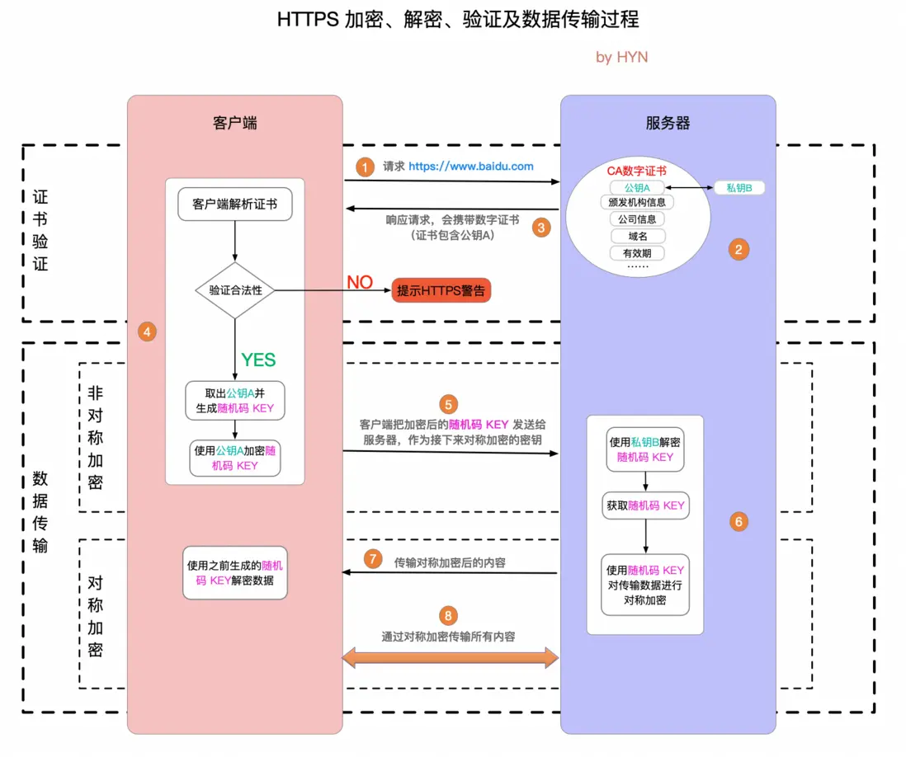

## Blog

### 算法

#### 242 有效的字母异位词 

看到题目，首先想到的也是使用双重循环逐个遍历，但是这样做性能实在是太差了

然后想到用哈希表的思路，分别将s和t构造成set，然后进行比较，在提交的时候对于`aa,a`这样的数据没有通过。于是使用的`multiset`，但是性能非常差

在看了随想录后，一开始是没有理解题意，判断两个词是否有相同的字母组成，其中字母的顺序可以不一致

```cpp
bool isAnagram(string s, string t) {
        vector<int> record(26);
        for (char ch : s)
            record[ch - 'a'] ++;
        for (char ch : t)
            record[ch - 'a'] --;
        for (int num : record)
            if (num != 0)
                return false;
        return true;
}
```

在哈希的范围比较小的情况下用数组即可，如果范围比较大，用set；如果值是key-val使用map


#### 349 两个数组的交集 

做之前看了“建议”，使用了set先进行了去重

对于STL容器的使用还是不熟，set是不能取下标的

```cpp
class Solution {
public:
    vector<int> intersection(vector<int>& nums1, vector<int>& nums2) {
        set<int> s1(nums1.begin(), nums1.end());
        set<int> s2(nums2.begin(), nums2.end());
        vector<int> num;
        for (int it : s1) {
            if (s2.count(it))
                num.push_back(it);
        }
        return num;
    }
};
```

看了随想录后，对于STL中set的使用不过关，使用`unordered_set`在查找的效率上比`set`更高，而且不需要将两个数都设置成容器

```cpp
class Solution {
public:
    vector<int> intersection(vector<int>& nums1, vector<int>& nums2) {
        unordered_set<int> ret, us1(nums1.begin(), nums1.end());
        for (int num : nums2) {
            if (us1.find(num) != us1.end())
                ret.insert(num);
        }
        return vector<int>(ret.begin(), ret.end());
    }
};
```


#### 202 快乐数 

看到这道一开始没有思路，不知道如果不是1怎么判断结束

在看了随想录中的思路后，**求和的过程中，sum会重复出现**，==给定一个元素，判断在集合中是否出现过，第一反应就是使用hash table==，所以每次得到一个中间的结果，就判断一下，如果没有在集合中就加入集合

一开始使用的是`set`，经过上面一题，可以使用`unordered_set`，提高查找效率

```cpp
class Solution {
public:
    bool isHappy(int n) {
        unordered_set<int> ret;
        while (1) {
            int sum = 0;
            while (n) {
                int figure = n % 10;
                sum += figure * figure;
                n /= 10;
            }
            if (sum == 1) return true;
            if (ret.find(sum) != ret.end())
                return false;
            else ret.insert(sum);
            n = sum;
        }
    }
};
```


#### 1 两数之和

一开始想到的是使用区间和的方法，创建一个新数组，数据的元素为该原数组开始元素到改位置元素之和，找到大于`target`的第一项元素，开始减去元素的值

```cpp
class Solution {
public:
    vector<int> twoSum(vector<int>& nums, int target) {
        unordered_map<int, int> sum_map; // 用于存储前缀和及其对应的索引
        int sum = 0;

        for (int i = 0; i < nums.size(); ++i) {
            sum += nums[i];  // 计算前缀和

            // 如果前缀和减去目标值在 map 中，说明找到一个符合条件的区间
            if (sum == target) {
                return {0, i}; // 如果从头到 i 索引就是目标值，直接返回
            }
            if (sum_map.find(sum - target) != sum_map.end()) {
                return {sum_map[sum - target] + 1, i}; // 找到符合条件的起始和终止下标
            }

            sum_map[sum] = i; // 将当前前缀和和索引存入 map
        }

        // 如果没有找到符合条件的区间，返回空向量
        return {};
    }
};
```

在提交的时候，发现理解错了题意，`target`可以是不相邻的两个元素之和

看了一下随想录的思路，==遇到元素是否出现过，用哈希法来处理==。

直接遍历数组，根据当前元素找其与`target`的差是否出现过，若出现过，则返回下标；否则将这个元素和对应的下标插入到`map`中，即用`map`来存遍历过的元素

因为无需关注元素的顺序，同时主要的操作是查询，所以使用`unordered_map`

```cpp
class Solution {
public:
    vector<int> twoSum(vector<int>& nums, int target) {
        unordered_map<int, int> ret;
        for (int i = 0; i < nums.size(); ++i) {
            if (ret.find(target - nums[i]) != ret.end())
                return {ret.find(target - nums[i])->second, i};
            ret[nums[i]] = i;
        }
        return {};
    }
};
```


### 八股文

#### HTTPS和HTTP有哪些区别

**HTTP**：是一种无状态的应用层协议，主要用于在Web浏览器和服务器之间传输超文本数据。HTTP协议工作在TCP协议之上，通常使用80端口。

- 安全性

  不提供任何加密机制，数据以明文形式传输，容易受到窃听、篡改和中间人攻击。

- 数据加密

  数据传输时没有任何加密，攻击者可以轻易获取传输内容。

- 身份验证

  不需要证书，不验证服务器身份，用户无法确认自己连接的是合法网站。

- 性能

  由于没有加密过程，传输速度相对较快

- 用途

  适用于不需要保护敏感信息的场合，如公共网站、博客等。


**HTTPS**：是在HTTP的基础上增加了一层SSL/TLS加密，用于安全的数据传输。HTTPS协议也工作在TCP之上，但通常使用443端口。

- 安全性

  数据经过加密，提供了更高的安全性，可以防止数据在传输过程中被窃取或篡改。

- 数据加密

  使用SSL/TLS协议进行加密，确保数据传输的机密性和完整性。

- 身份验证

  使用SSL/TLS证书进行身份验证，以证明网站的身份，确保用户与真正的服务器建立连接，有效防止伪装和钓鱼网站。

- 性能

  由于加密和解密的过程，可能会稍微影响性能，但随着技术的发展，性能差距已大幅缩小。

- 用途

  适用于需要保护用户数据和隐私的场合，如网上银行、电子商务、社交媒体和任何涉及敏感信息的网站。

HTTPS的加密技术：

1. **数据加密**：在数据传输前，通过SSL/TLS协议将数据进行加密，只有拥有正确密钥的接收方才能解密数据。这使得数据在传输过程中即使被拦截，也无法被读取。
2. **身份验证**：通过数字证书，HTTPS能够验证服务器的身份，确保用户连接的是合法的服务器，而不是伪装的恶意网站。这有助于防止中间人攻击。
3. **数据完整性**：HTTPS使用消息摘要算法（如SHA-256）来确保数据在传输过程中没有被修改。如果数据在传输中被篡改，接收方可以检测到，从而拒绝接受该数据。
4. **安全握手**：在建立连接之前，客户端和服务器之间会进行安全握手，包括协商加密算法和生成共享密钥，这进一步增强了安全性。

**HTTPS 和 HTTP 的区别：**

- 最最重要的区别就是安全性，HTTP 明文传输，不对数据进行加密安全性较差。HTTPS (HTTP + SSL / TLS)的数据传输过程是加密的，安全性较好。
- 使用 HTTPS 协议需要申请 CA 证书，一般免费证书较少，因而需要一定费用。证书颁发机构如：Symantec、Comodo、DigiCert 和 GlobalSign 等。
- HTTP 页面响应速度比 HTTPS 快，这个很好理解，由于加了一层安全层，建立连接的过程更复杂，也要交换更多的数据，难免影响速度。
- 由于 HTTPS 是建构在 SSL / TLS 之上的 HTTP 协议，所以，要比 HTTP 更耗费服务器资源。
- HTTPS 和 HTTP 使用的是完全不同的连接方式，用的端口也不一样，前者是 443，后者是 80。


#### HTTPS工作原理 

##### 非对称加密

> 对称加密：客户端和服务器共用同一秘钥，该秘钥可以用于加密一段内容，也可以用于解密一段内容。因此虽然效率高，但是存在安全性问题

非对称加密：将秘钥分为公钥和私钥，加解密需要使用这两个不同秘钥。

公钥通常存放在客户端，私钥通常存在在服务器。使用公钥加密的数据只有用私钥才能解密；使用私钥加密的数据也只有使用公钥才能解密

数据交换的过程：甲方生成一对密钥并将其中的一把作为公钥对外公开；得到该公钥的乙方使用公钥对机密信息进行加密后再发送给甲方；甲方再用自己保存的私钥对加密后的信息进行解密。


在上述过程中，客户端在拿到服务器的公钥后，会生成一个随机码 (用 KEY 表示，这个 KEY 就是后续双方用于对称加密的密钥)，然后客户端使用公钥把 KEY 加密后再发送给服务器，服务器使用私钥将其解密，这样双方就有了同一个密钥 KEY，然后双方再使用 KEY 进行对称加密交互数据。在非对称加密传输 KEY 的过程中，即便第三方获取了公钥和加密后的 KEY，在没有私钥的情况下也无法破解 KEY (私钥存在服务器，泄露风险极小)，也就保证了接下来对称加密的数据安全。

##### HTTPS原理解析



HTTPS 的整个通信过程可以分为两大阶段：证书验证和数据传输阶段，数据传输阶段又可以分为非对称加密和对称加密两个阶段。

1. 客户端请求 HTTPS 网址，然后连接到 server 的 443 端口 (HTTPS 默认端口，类似于 HTTP 的80端口)。

2. 采用 HTTPS 协议的服务器必须要有一套数字 CA (Certification Authority)证书，证书是需要申请的，并由专门的数字证书认证机构(CA)通过非常严格的审核之后颁发的电子证书 (当然了是要钱的，安全级别越高价格越贵)。颁发证书的同时会产生一个私钥和公钥。私钥由服务端自己保存，不可泄漏。公钥则是附带在证书的信息中，可以公开的。证书本身也附带一个证书电子签名，这个签名用来验证证书的完整性和真实性，可以防止证书被篡改。

3. 服务器响应客户端请求，将证书传递给客户端，证书包含公钥和大量其他信息，比如证书颁发机构信息，公司信息和证书有效期等。Chrome 浏览器点击地址栏的锁标志再点击证书就可以看到证书详细信息。

4. 客户端解析证书并对其进行验证。如果证书不是可信机构颁布，或者证书中的域名与实际域名不一致，或者证书已经过期，就会向访问者显示一个警告，由其选择是否还要继续通信。

   如果证书没有问题，客户端就会从服务器证书中取出服务器的公钥A。然后客户端还会生成一个随机码 KEY，并使用公钥A将其加密。

5. 客户端把加密后的随机码 KEY 发送给服务器，作为后面对称加密的密钥。

6. 服务器在收到随机码 KEY 之后会使用私钥B将其解密。经过以上这些步骤，客户端和服务器终于建立了安全连接，完美解决了对称加密的密钥泄露问题，接下来就可以用对称加密愉快地进行通信了。

7. 服务器使用密钥 (随机码 KEY)对数据进行对称加密并发送给客户端，客户端使用相同的密钥 (随机码 KEY)解密数据。

8. 双方使用对称加密传输所有数据。

##### 进阶

> SSL 和 TLS 协议可以为通信双方提供识别和认证通道，从而保证通信的机密性和数据完整性。TLS 协议是从Netscape SSL 3.0协议演变而来的，不过这两种协议并不兼容，SSL 已经逐渐被 TLS 取代，所以下文就以 TLS 指代安全层。 TLS 握手是启动 HTTPS 通信的过程，类似于 TCP 建立连接时的三次握手。 在 TLS 握手的过程中，通信双方交换消息以相互验证，相互确认，并确立它们所要使用的加密算法以及会话密钥 (用于对称加密的密钥)。可以说，TLS 握手是 HTTPS 通信的基础部分。

**TLS 握手**


1. **"client hello"消息：**客户端通过发送"client hello"消息向服务器发起握手请求，该消息包含了客户端所支持的 TLS 版本和密码组合以供服务器进行选择，还有一个"client random"随机字符串。
2. **"server hello"消息：**服务器发送"server hello"消息对客户端进行回应，该消息包含了数字证书，服务器选择的密码组合和"server random"随机字符串。
3. **验证：**客户端对服务器发来的证书进行验证，确保对方的合法身份，验证过程可以细化为以下几个步骤：
   1. 检查数字签名
   2. 验证证书链 (这个概念下面会进行说明)
   3. 检查证书的有效期
   4. 检查证书的撤回状态 (撤回代表证书已失效)
4. **"premaster secret"字符串：**客户端向服务器发送另一个随机字符串"premaster secret (预主密钥)"，这个字符串是经过服务器的公钥加密过的，只有对应的私钥才能解密。
5. **使用私钥：**服务器使用私钥解密"premaster secret"。
6. **生成共享密钥**：客户端和服务器均使用 client random，server random 和 premaster secret，并通过相同的算法生成相同的共享密钥 **KEY**。
7. **客户端就绪：**客户端发送经过共享密钥 **KEY**加密过的"finished"信号。
8. **服务器就绪：**服务器发送经过共享密钥 **KEY**加密过的"finished"信号。
9. **达成安全通信：**握手完成，双方使用对称加密进行安全通信。

> **数字证书 (digital certificate)：**
>
> 在非对称加密通信过程中，服务器需要将公钥发送给客户端，在这一过程中，公钥很可能会被第三方拦截并替换，然后这个第三方就可以冒充服务器与客户端进行通信，这就是传说中的“中间人攻击”(man in the middle attack)。
>
> 解决此问题的方法是通过受信任的第三方交换公钥，具体做法就是服务器不直接向客户端发送公钥，而是要求受信任的第三方，也就是证书认证机构 (Certificate Authority, 简称 CA)将公钥合并到数字证书中，然后服务器会把公钥连同证书一起发送给客户端，私钥则由服务器自己保存以确保安全。
>
> **数字签名 (digital signature)：**这个概念很好理解，其实跟人的手写签名类似，是为了确保数据发送者的合法身份，也可以确保数据内容未遭到篡改，保证数据完整性。与手写签名不同的是，数字签名会随着文本数据的变化而变化。具体到数字证书的应用场景，数字签名的生成和验证流程如下：
>
> 1. 服务器对证书内容进行信息摘要计算 (常用算法有 SHA-256等)，得到摘要信息，再用私钥把摘要信息加密，就得到了数字签名
> 2. 服务器把数字证书连同数字签名一起发送给客户端
> 3. 客户端用公钥解密数字签名，得到摘要信息
> 4. 客户端用相同的信息摘要算法重新计算证书摘要信息，然后对这两个摘要信息进行比对，如果相同，则说明证书未被篡改，否则证书验证失败
>
> **证书链 (certificate chain)：**也称为证书路径，是用于认证实体合法身份的证书列表，具体到 HTTPS 通信中，就是为了验证服务器的合法身份。之所以使用证书链，是为了保证根证书 (root CA certificate)的安全，中间层可以看做根证书的代理，起到了缓冲的作用
>
> 证书链从根证书开始，并且证书链中的每一级证书所标识的实体都要为其下一级证书签名，而根证书自身则由证书颁发机构签名。客户端在验证证书链时，必须对链中所有证书的数字签名进行验证，直到达到根证书为止。

 TLS 握手的目的是建立安全连接，通信双方在这个过程中：

- 商定双方通信所使用的的 TLS 版本 (例如 TLS1.0, 1.2, 1.3等等)；
- 确定双方所要使用的密码组合；
- 客户端通过服务器的公钥和数字证书上的数字签名验证服务端的身份；
- 生成会话密钥，该密钥将用于握手结束后的对称加密。

参考资料：https://segmentfault.com/a/1190000021494676


#### TCP和UDP的区别

##### TCP

**基本特性**

- **面向连接**：TCP在通信之前需要先建立连接，形成三次握手（三次握手的过程用于确认连接的可靠性）。只有在连接建立后，数据才会开始传输，结束时则需要四次挥手来关闭连接。
- **可靠性传输**：TCP提供确认应答、丢包重传和超时重发等机制，确保数据可靠地从发送端传送到接收端。即使在网络不稳定的情况下，TCP也会尝试补救。
- **顺序控制**：TCP在数据传输时会为数据包编号，接收端根据编号对数据包进行重新排序，以确保数据按顺序到达。
- **流量控制**：TCP通过滑动窗口协议和拥塞控制机制调节传输速度，以防止网络拥塞或发送端传输过快导致接收端无法及时处理。
- **全双工通信**：TCP连接支持双向数据传输，发送和接收端都可以同时发送和接收数据。

**TCP的可靠性**

TCP是一种可靠传输协议，具备多种机制来保证数据的完整性和传输顺序。这些机制为它提供了可靠性，但也增加了传输的复杂度和时间开销。

- **确认应答机制**：TCP在数据传输过程中，每发送一个数据包都会等待接收端的确认（ACK）。如果确认未能在规定的时间内返回，TCP会自动重传数据包。这个机制确保了每个数据包成功到达。
- **超时重传**：当网络不稳定导致数据包丢失时，TCP会通过设定的超时时间来判断是否丢包，并自动重发未确认的数据包，保证数据不会因丢失而缺失。
- **数据包排序**：TCP会对数据包编号，接收端根据编号对数据包进行排序。即使数据包乱序到达，TCP也能重新排列，保证接收的数据顺序正确。
- **流量控制**：TCP使用滑动窗口协议，调整数据的发送速度以适应接收端的处理能力，避免因发送端过快而导致的网络拥塞。
- **拥塞控制**：TCP通过慢启动、拥塞避免等算法来减少网络拥塞的风险。这些机制通过控制数据发送速率，在网络繁忙时减少发送量，从而降低丢包率和网络延迟。

**三次握手**

1. **第一次握手**（客户端发送 SYN）：客户端向服务器发送一个带有同步标志（SYN = 1）的请求包，表示请求建立连接。这个包中会包含一个初始序列号 Seq=X*S**e**q*=*X*，用于后续的数据确认。
2. **第二次握手**（服务器响应 SYN + ACK）：服务器收到客户端的请求后，如果同意建立连接，则发送一个带有确认标志（ACK = 1）和同步标志（SYN = 1）的数据包，表示确认收到客户端的请求并同意建立连接。服务器也生成一个初始序列号 Seq=Y*S**e**q*=*Y*，并将确认号设置为 Ack=X+1*A**c**k*=*X*+1，以此确认收到了客户端的序列号。
3. **第三次握手**（客户端确认 ACK）：客户端收到服务器的确认包后，再发送一个带有确认标志（ACK = 1）的数据包，确认收到服务器的序列号 Seq=Y*S**e**q*=*Y*。此时，客户端的确认号为 Ack=Y+1*A**c**k*=*Y*+1，这代表连接已建立，客户端和服务器可以开始通信。

> **三次握手的目的**：三次握手确保双方能够正常收发消息，并同步双方的初始序列号。它能够有效防止“旧连接请求”误导服务器，从而确保连接的有效性。
>
> 三次握手主要是为了确保通信的可靠性。两次握手无法解决旧的连接请求可能误导服务器的问题。通过三次握手，客户端和服务器可以确认彼此的发送和接收能力正常，避免误接入一个已经失效的连接请求。

**四次挥手**

1. **第一次挥手**（客户端发送 FIN）：当客户端完成数据发送后，发送一个带有终止标志（FIN = 1）的数据包，告知服务器“我已经发送完数据，准备关闭连接”。
2. **第二次挥手**（服务器回应 ACK）：服务器收到客户端的 FIN 包后，发送一个带有确认标志（ACK = 1）的数据包，确认已收到客户端的关闭请求，但此时可能还有未发送的数据，因此服务器不会立即关闭连接。
3. **第三次挥手**（服务器发送 FIN）：当服务器完成所有数据发送后，向客户端发送一个带有终止标志（FIN = 1）的数据包，表示“我也已经发送完数据，可以关闭连接”。
4. **第四次挥手**（客户端回应 ACK）：客户端收到服务器的 FIN 包后，发送一个带有确认标志（ACK = 1）的数据包，确认断开连接。此时，客户端进入“TIME_WAIT”状态，等待一段时间（通常是2倍的报文最长生存时间）后才彻底断开，以确保服务器能收到ACK。若等待期内没有收到服务器的重发请求，客户端彻底关闭连接。

> **四次挥手的目的**：四次挥手确保双方都完成了数据发送，并确认对方也准备关闭连接。这个过程可以避免一方突然断开连接导致的数据丢失或未完全传输的问题。
>
> 四次挥手的原因在于TCP是全双工的传输协议。关闭连接时，双方必须分别关闭自己的发送和接收通道，因此需要两次 FIN 和两次 ACK 来分别完成双方的连接释放。

**流量控制**

流量控制的目的是**调节发送端的数据发送速度**，确保接收端能够及时处理数据，防止接收方因处理不过来而丢包。在TCP中，流量控制通过“滑动窗口”机制实现。

滑动窗口机制

滑动窗口是一种动态的窗口大小控制机制，允许发送方在未收到确认（ACK）之前发送一定数量的数据。窗口大小会根据接收方的处理能力动态调整：

- **接收窗口（Receive Window）**：每次接收方发送ACK时，会携带一个窗口大小的数值（称为“接收窗口”），表示当前接收方还能接收的数据量。
- **发送窗口（Send Window）**：发送窗口是发送端能发送的数据量，由接收窗口的大小决定。发送窗口越大，意味着可以在没有收到ACK的情况下发送更多的数据。

流量控制的步骤

1. **初始阶段**：发送方在开始传输前，会先通过握手来获取接收方的接收窗口大小。
2. **动态调整**：当接收方缓冲区快要满时，会减少接收窗口的大小。发送方接收到这个数值后，会相应地减慢发送速率。
3. **停止发送**：当接收窗口变为零时，发送方会暂停发送数据，等待接收窗口重新开放。

**拥塞控制**

拥塞控制的目标是避免整个网络发生拥塞，保证网络资源的合理使用。拥塞控制基于发送方和网络的状态进行动态调整，核心思想是**让发送方逐步增加发送速率，直到发现网络有拥塞的迹象**，再适当减慢速率。拥塞控制有以下四个主要算法：

1. 慢启动（Slow Start）
   - 在传输开始时，发送方的拥塞窗口（cwnd）初始值较小（通常为1个MSS，最大报文段）。
   - 每次收到一个ACK后，拥塞窗口成倍增长（指数增长），逐渐增加传输速率，直到达到一个阈值（ssthresh）为止。
   - 这种指数增长能迅速提升传输速度，但在到达某个阈值后，开始采用更为缓慢的增长方式，以避免过快增加带来的拥塞。

2. 拥塞避免（Congestion Avoidance）
   - 当拥塞窗口达到阈值（ssthresh）后，慢启动进入拥塞避免阶段。此时，窗口增长速度由指数增长转为线性增长。
   - 拥塞窗口每收到一个ACK增加一个MSS，以平稳的方式增加发送速率，直到出现拥塞或网络接近拥塞为止。

3. 快速重传（Fast Retransmit）
   - 当发送方连续收到三个相同的ACK时，认为这个数据包可能已经丢失，便立即重传丢失的数据包，而无需等待超时。
   - 快速重传可以加速丢包后的重发过程，减少等待超时的时间，提高传输效率。

4. 快速恢复（Fast Recovery）
   - 快速重传后，TCP进入快速恢复阶段，而不是回到慢启动。
   - 在快速恢复中，将阈值设为当前拥塞窗口的一半，然后继续线性增长，而不是从1个MSS开始指数增长。
   - 当发送方不再收到重复的ACK时，它认为丢包情况已经恢复，继续正常发送数据。

拥塞控制的整体过程

1. **开始阶段**：发送方初始化进入慢启动，指数增长发送速率。
2. **拥塞避免**：达到阈值后，线性增长窗口，逐步增加速率。
3. **检测拥塞**：如果发生丢包或连续收到重复的ACK，认为网络出现拥塞，将拥塞窗口减小一半并更新阈值。
4. **快速恢复**：在丢包恢复后，按线性方式增长，逐步恢复到原速率。

##### UDP

**基本特性**

- **无连接**：UDP不需要建立连接，可以直接发送数据包，简化了传输过程，节省了建立连接的时间和资源消耗。
- **不可靠传输**：UDP不提供数据确认、重传和排序功能，因此数据包可能丢失、重复或乱序到达。它依赖应用层协议来处理这些问题。
- **低延迟**：由于没有额外的握手和确认步骤，UDP传输的延迟比TCP低，适合需要实时响应的应用场景。
- **简单的报文结构**：UDP的头部信息较少，数据开销小，适合对传输效率要求较高的应用。

**UDP的效率**

相比TCP的可靠性，UDP的设计追求的是传输效率。它放弃了许多控制机制，使数据传输更直接快速，但可靠性较低。

- **无连接传输**：UDP在发送数据前不需要建立连接，也没有三次握手等连接建立的过程。因此，UDP在传输开始阶段速度更快，省去了连接确认的时间。
- **无确认和重传**：UDP在发送数据后不等待接收端的确认，也没有重传机制，这意味着发送端可以连续不断地发送数据包，不受等待响应的影响。因此，即使个别数据包丢失，UDP也不会重发。
- **较小的头部开销**：UDP数据包的头部信息很少，只有8字节，相比TCP的20字节头部要轻量得多。这使得UDP的网络开销小，数据负载占用更多空间，更适合带宽有限的网络环境。
- **无序到达**：UDP不保证数据包的顺序，也不重新排列乱序到达的数据包。这一特性进一步减少了协议的处理时间，提高了数据传输的速度。

**UDP的校验和计算**

UDP校验和（Checksum）是UDP头部的一个16位字段。它对UDP数据包的整个内容进行计算，包括UDP头部、数据部分和一个伪首部（Pseudo Header）。如果数据在传输过程中没有损坏，那么接收方计算出的校验和应该为零；如果不为零，说明数据出现了错误。

校验和的计算方法是**取反求和法**，具体步骤如下：

1. **分段求和**：将伪首部、UDP头部和UDP数据部分按16位分段，如果数据长度是奇数，则在末尾补0，使得所有分段都是16位。
2. **累加和**：将所有16位的分段进行累加。如果累加过程中产生了进位（超过16位），则将高16位的进位加到低16位。
3. **取反**：将累加和的结果取反，得到校验和。
4. **传输与验证**：发送端计算并填充校验和，接收端收到数据后重新计算一次，检查结果是否为0。如果是0，说明数据传输正确；否则认为有错误。

##### 区别

| 特性             | TCP                                              | UDP                                          |
| ---------------- | ------------------------------------------------ | -------------------------------------------- |
| **是否面向连接** | 是，需建立连接（三次握手）                       | 否，直接传输                                 |
| **可靠性**       | 提供可靠传输，确保数据完整有序                   | 不可靠，可能丢失、重复或乱序                 |
| **数据顺序**     | 保证数据包按序到达                               | 不保证顺序，乱序到达需要应用层处理           |
| **传输速度**     | 较慢，因确认和流量控制而增加了延迟               | 较快，无需确认机制                           |
| **数据结构**     | 头部信息多，较大                                 | 头部信息少，开销小                           |
| **适用场景**     | 适合文件传输、电子邮件、网页浏览等需要可靠性场景 | 适合实时视频、在线游戏、语音通话等实时性场景 |


### 总结

给定一个元素，判断在集合中是否出现过，第一反应就是使用hash table；如果数据很大，用set而不是vector；如果数值分布很分散，也使用set比较合适

对于哈希表这个数据结构不是很熟悉，以及对STL的`set`和`map`的函数并不是很熟悉，做的时候还是有参考cppreference

