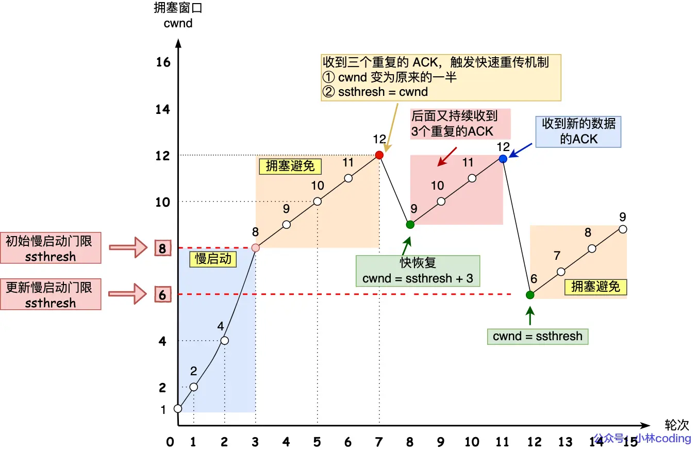

## Blog

### 算法

#### 详细布置  

- 454 四数相加II 
- 383 赎金信 
- 15 三数之和
- 18 四数之和 
- 总结


#### 454 四数相加II

建议：本题是 使用map 巧妙解决的问题，好好体会一下 哈希法 如何提高程序执行效率，降低时间复杂度，当然使用哈希法 会提高空间复杂度，但一般来说我们都是舍空间 换时间， 工业开发也是这样。

题目链接/文章讲解/视频讲解：

https://programmercarl.com/0454.%E5%9B%9B%E6%95%B0%E7%9B%B8%E5%8A%A0II.html

看到题目首先想到的还是暴力解法，使用循环，但这是四重循环，效率实在是太低了

然后想到的是昨天两数之和的思路，这里是4个数的和，但是具体怎么做没有思路

看了随想录的思路：

1. 首先定义 一个unordered_map，key放a和b两数之和，value 放a和b两数之和出现的次数。
2. 遍历大A和大B数组，统计两个数组元素之和，和出现的次数，放到map中。
3. 定义int变量count，用来统计 a+b+c+d = 0 出现的次数。
4. 再遍历大C和大D数组，找到如果 0-(c+d) 在map中出现过的话，就用count把map中key对应的value也就是出现次数统计出来。
5. 最后返回统计值 count 就可以了

```cpp
class Solution {
public:
    int fourSumCount(vector<int>& nums1, vector<int>& nums2, vector<int>& nums3, vector<int>& nums4) {
        unordered_map<int, int> ab;
        for (int i = 0; i < nums1.size(); ++i)
            for (int j = 0; j < nums2.size(); ++j)
            ab[nums1[i] + nums2[j]]++;
        int count = 0;
        for (int k = 0; k < nums3.size(); ++k)
            for (int l = 0; l < nums4.size(); ++l) {
                int num = 0 - nums3[k] - nums4[l];
                if (ab.find(num) != ab.end())
                    count += ab[num];
            }
        return count;
    }
};
```


#### 383 赎金信

建议：本题 和 242.有效的字母异位词 是一个思路 ，算是拓展题 

题目链接/文章讲解：

https://programmercarl.com/0383.%E8%B5%8E%E9%87%91%E4%BF%A1.html

看到题目一开始想到的用`multiset`，将两个string都转成`multiset`，如果存在同时删除元素，但是这样会出现迭代器失效的问题

于是想到用`map`结构，值为字母出现的个数，如果有出现过则值--，一开始使用`find`来查找，后来，对于示例2，想到可以直接使用值是否>0来判断是否出现过

```cpp
class Solution {
public:
    bool canConstruct(string ransomNote, string magazine) {
        unordered_map<char, int> mag;
        for (char ch : magazine)
            mag[ch]++;
        for (char ch : ransomNote) {
            if (mag[ch] > 0)
                mag[ch]--;
            else
                return false;
        }
        return true;
    }
};
```


#### 15 三数之和

建议：本题虽然和 两数之和 很像，也能用哈希法，但用哈希法会很麻烦，双指针法才是正解，可以先看视频理解一下 双指针法的思路，文章中讲解的，没问题 哈希法很麻烦。 

题目链接/文章讲解/视频讲解：

https://programmercarl.com/0015.%E4%B8%89%E6%95%B0%E4%B9%8B%E5%92%8C.html

一开始想到是暴力解法，使用三重循环，可能会超时

然后想到是四数相加的思路，先找到一个数，然后用两重循环找到对应的负数。但是没有办法确定第一个数

看了卡哥的视频，通过双重循环确定前两个数，然后用`0 - a - b`来获取第三个数是否出现过。同时三个数都需要进行去重

```cpp
class Solution {
public:
    vector<vector<int>> threeSum(vector<int>& nums) {
        vector<vector<int>> ret;
        sort(nums.begin(), nums.end());
        // 排序的目的是为了更方便地去重、减少不必要的计算和提高效率
        for (int i = 0; i < nums.size(); ++i) {
            // 若第一个元素大于0，后续元素也会大于0
            if (nums[i] > 0) break;
            if (i > 0 && nums[i - 1] == nums[i])
                // i > 0 确保数组的第一个元素（即 i = 0 时）不会被跳过
                // nums[i] == nums[i - 1] 意味着当前的 nums[i] 和上一个元素相同，因此选择 nums[i] 作为第一个元素时，生成的三元组会和上一轮中生成的完全一样
                continue;
            unordered_set<int> c_set;
            for (int j = i + 1; j < nums.size(); ++j) {
                if (j > i + 2 && nums[j - 1] == nums[j] && nums[j - 2] == nums[j - 1])
                    // j > i + 2 避免对前两个元素进行重复检查，因为前两个元素（nums[i] 和 nums[j]）直接组成的组合还没有重复可能性
                    // nums[j] == nums[j-1] && nums[j-1] == nums[j-2] 则进一步确保连续出现的三个 b 不会被重复加入结果。这样可以避免在不同 i 固定时，因 j 指向同样的值导致重复的 b 组合
                    continue;
                int c = 0 - nums[i] - nums[j];
                if (c_set.find(c) != c_set.end()) {
                    ret.push_back({nums[i], nums[j], c});
                    c_set.erase(c);
                } else
                    c_set.insert(nums[j]);
                // 当 j 从 i+1 开始向右遍历时，我们逐步将 nums[j] 添加到集合 set 中。这样做的目的是在当前 i 固定的情况下，动态记录所有可能作为 c 的候选值
                // 当我们计算出 c=−(a+b) 时，检查 set 是否包含这个 c。如果 c 在 set 中，则说明在之前的 nums[j] 遍历中已经遇到过 c
            }
        }
        return ret;
    }
};
```

双指针法

通过循环遍历得到第一个数，根据这个数找对应的相反数。这个相反数又由两个数相加而成。在数组剩余的元素中找这两个数，使用双指针法，分别指向剩余内容的开始和结尾，双指针不断向中间靠近。

逻辑：如果三数之和>0，则第三个数应该减少；若<0，则第二个应该增加；如果等于0，那么加入结果集，并移动双指针，在移动时，注意去重。

```cpp
class Solution {
public:
    vector<vector<int>> threeSum(vector<int>& nums) {
        vector<vector<int>> ret;
        sort(nums.begin(), nums.end());
        for (int i = 0; i < nums.size(); ++i) {
            if (nums[i] > 0) return ret;
            if (i > 0 && nums[i - 1] == nums[i])
                // 去重，避免在外层循环中对相同的 nums[i] 进行重复计算
                continue;
            int left = i + 1, right = nums.size() - 1;
            while (left < right) {
                int sum = nums[i] + nums[left] + nums[right];
                if (sum > 0) right--;
                else if (sum < 0) left++;
                else {
                    ret.push_back({nums[i], nums[left], nums[right]});
                    while (left < right && nums[left] == nums[left + 1])
                        left++;
                    while (left < right && nums[right] == nums[right - 1])
                        right--;
                    left++, right--;
                }
            }
        }
        return ret;
    }
};
```

这里需要注意3个数的去重逻辑`num[i] == num[i + 1]`和`nums[i - 1] == nums[i]`，第1个和第3个数使用后者：第一个数若使用前者无法保证{-1， -1， 2}这种情况，会直接跳过。

而第2个和第3个数的去重逻辑则取决于指针移动的方向


#### 18 四数之和 

建议： 要比较一下，本题和 454.四数相加II 的区别，为什么 454.四数相加II 会简单很多，这个想明白了，对本题理解就深刻了。 本题 思路整体和 三数之和一样的，都是双指针，但写的时候 有很多小细节，需要注意，建议先看视频。 

题目链接/文章讲解/视频讲解：

https://programmercarl.com/0018.%E5%9B%9B%E6%95%B0%E4%B9%8B%E5%92%8C.html

一开始想到的思路是基于上一题的双指针的思路，但是使用两重循环来确定前两个数

- 外层两个循环 `k` 和 `i` 选择两个固定数值。
- 内层使用双指针法（`left` 和 `right`）来查找剩余两个数值。

同时在每层循环中都进行了 **剪枝** 和 **去重** 操作，以减少不必要的计算和重复结果

两个剪枝操作不仅判断 `nums[k]` 和 `nums[k] + nums[i]` 是否超过 `target`，还额外检查它们是否大于等于 0。原因在于这里需要应对不同情况的 `target`，尤其是负数目标值的情况。

如果 `target` 是负数，而 `nums[k]` 是一个负数时，即使 `nums[k] > target`，依然可能通过后续负数达到 `target`

例如：当 `target = -5`，如果当前 `nums[k] = -2`，那么 `nums[k] > target` 是成立的，但此时可能通过后续负数使得四数之和达到 `target`，所以不能直接 `break`

```cpp
class Solution {
public:
    vector<vector<int>> fourSum(vector<int>& nums, int target) {
        vector<vector<int>> ret;
        sort(nums.begin(), nums.end());
        for (int i = 0; i < nums.size(); ++i) {
            if (nums[i] > target && nums[i] >= 0) break;
            if (i > 0 && nums[i - 1] == nums[i])
                continue;
            for (int j = i + 1; j < nums.size(); ++j) {
                if (nums[i] + nums[j] > target && nums[i] + nums[j] >= 0)
                    break;
                if (j > i + 1 && nums[j - 1] == nums[j])
                    continue;
                int left = j + 1, right = nums.size() - 1;
                while (left < right) {
                    long sum = (long)nums[i] + (long)nums[j] + (long)nums[left] + (long)nums[right];
                    if (sum > target) right--;
                    else if (sum < target) left++;
                    else {
                        ret.push_back({nums[i], nums[j], nums[left], nums[right]});
                        while (left < right && nums[left] == nums[left + 1])
                            left++;
                        while (left < right && nums[right] == nums[right - 1])
                            right--;
                        left++, right--;
                    }
                }
            }
        }
        return ret;
    }
};
```

最后需要注意，在提交的时候，对于测试用例：`[0,0,0,1000000000,1000000000,1000000000,1000000000],1000000000`会出现有符号整数的溢出，因此需要使用`long`类型，如上面代码，而不是简单将`sum`设置为`long`类型


### 八股文

#### TCP连接如何确保可靠性

掌握程度：

- 能够清晰地描述TCP协议的工作原理和关键特性。
- 理解TCP如何通过各种机制确保数据传输的可靠性。
    - 连接管理：三次握手，四次挥手
    - 差错控制：序列号和确认应答机制
    - 超时重传机制
    - 流量控制
    - 拥塞控制
- 知道TCP的流量控制和拥塞控制对于网络性能的影响。

参考资料：
[小林coding: TCP如何确保可靠性](https://xiaolincoding.com/network/3_tcp/tcp_feature.html#重传机制)

[『深入 TCP/IP 系列』一文搞懂 TCP 的可靠性](https://juejin.cn/post/6861491957534261255?searchId=20240712111538B2D895A393D1A22595FB#heading-6)


TCP 是一种面向有连接通信的协议，全称：`传输控制协议`；英文名：`Transmission Control Protocol`，它提供了复杂的控制机制，而控制机制的目的，就是为了保证数据传输的可靠性

##### 1. 三次握手和四次挥手

- **三次握手**：在建立连接时，TCP客户端和服务器之间会进行三次握手来确认彼此的存在和通信能力。这三次握手的过程确保了双方的准备就绪，从而避免了因网络延迟或其他原因导致的数据丢失。
- **四次挥手**：在关闭连接时，双方会进行四次挥手，确保传输的所有数据都能成功到达对方，并且双方都确认了连接的关闭状态，避免出现“半开连接”或数据丢失的情况。

##### 2. 差错控制

**TCP 差错控制** 的作用，包括检测损坏的报文段、丢失的报文段、失序的报文段，并进行纠正。

差错控制就是为了当应用程序将数据交付给 `TCP` 后，就依靠 `TCP` 将整个数据流**按序**、**没有损坏**、**没有丢失**，**没有重复**的交付给另一端的应用程序。

差错控制的方法有：**校验和**、**确认应答**、**重传** 三种。

- **校验和**

  `TCP` 可以通过 **校验和** 字段检测出数据是否损坏，每一个 TCP 首部都会包含 **校验和** 字段，当检测到数据损坏时，由 `接收方 TCP` 将损坏的报文段丢弃。

- **确认应答**

  在 `TCP` 中，**发送端** 的数据到达 **接收端** 时，**接收端** 会返回一个“我收到消息了”的通知，这个通知就是 **确认应答（ACK）**。

  确认应答（ACK）中，需要注意的点：

  1. `ACK` 是不需要被确认应答的（否则就陷入了死循环，双方互相发送“我知道了”，直到网络挂掉为止🤕）。
  2. 在发送数据时会尽量的捎带上 `ACK`，从而减小通信量，提高网络的利用率，这种机制被称为 **捎带应答**，就如三次握手中的第二次握手时，发送 `SYN` 时，捎带上了 `ACK`。
  3. 如果接收方收到了数据，但是没有数据要发送，也就无法做 **捎带应答**。这时候，**确认应答** 会被推迟发送，直到有新的数据到达（和这个数据一起 **确认应答**），或者经过一段时间（通常是 **500ms**），这又被称为 **延迟应答** 。

  **如果发送端收到了确认应答，说明数据已经成功的到达了对端，反之，数据就很有可能丢失了，这时候就需要重传。**

- **重传**

  当报文段损坏、丢失、或者延迟了，就需要重传。目前 `TCP` 共实现了两种重传机制：超时重传和快重传

  - 超时重传

    当发送端发送数据后，如果在 **特定时间间隔** 内还没有收到 `ACK`，就会进行超时重传，这里未收到确认应答有两种情况：

    第一种：在发送数据的过程中，数据由于网络拥堵等原因丢失了。

    第二种：对端收到了数据，在返回 `ACK` 时，`ACK` 在途中丢失。

    `TCP` 会计算每次 **发送数据** 直到收到 **确认应答** 的这段时间，即 `RTT`，再和一个 **偏差值** 相加，从而计算出 **超时重传时间**。

    > `RTT`，英文全称：`Round Trip Time`，它的英文名生动表明了它的意思：报文段的往返时间。
    >
    > 考虑到网络环境的不同，v以及随时可能发生的网络波动，**超时重传时间** 仅仅根据每次的 `RTT` 计算是不够的，还需要加上 **偏差值**，如果网络稳定性较差，那么相应的 **偏差值** 也会较大，相反的，若网络比较稳定，则 **偏差值** 也会较小。

    由于最初的数据包还不知道其 `RTT`，所以其 **超时重传时间** 一般设置为 `6秒`。

    > 超时时间都以 `0.5秒` 为单位进行控制，即 `0.5秒` 的整数倍，并且数据再重发后，还是如果还是收不到 `ACK`，重传时间就会以 $2^N$倍延长，此外，如果重发达到了一定的次数还未收到 `ACK`，则发送方会强制断开连接。

  - 快重传

    快重传，也被称为高速重发控制，英文全称：`Fast Retransmission`

    快重传基于窗口控制，是指在 **发送端** 在连续三次收到同一个确认应答后，就会将其对应的数据进行重发，这种机制比超时重传更加高效。

    > 
    >
    > 在上图，发送方发出了 1，2，3，4，5 份数据：
    >
    > - 第一份 Seq1 先送到了，于是就 Ack 回 2；
    > - 结果 Seq2 因为某些原因没收到，Seq3 到达了，于是还是 Ack 回 2；
    > - 后面的 Seq4 和 Seq5 都到了，但还是 Ack 回 2，因为 Seq2 还是没有收到；
    > - **发送端收到了三个 Ack = 2 的确认，知道了 Seq2 还没有收到，就会在定时器过期之前，重传丢失的 Seq2。**
    > - 最后，收到了 Seq2，此时因为 Seq3，Seq4，Seq5 都收到了，于是 Ack 回 6 

    还有一种实现重传机制的方式叫：`SACK`（ Selective Acknowledgment）， **选择性确认**。这种方式需要在 TCP 头部「选项」字段里加一个 `SACK` 的东西，它**可以将已收到的数据的信息发送给「发送方」**，这样发送方就可以知道哪些数据收到了，哪些数据没收到，知道了这些信息，就可以**只重传丢失的数据**。

    另一种，Duplicate SACK 又称 `DSACK`，其主要**使用了 SACK 来告诉「发送方」有哪些数据被重复接收了。**

##### 3. 流量控制

`TCP` 为了保证可靠性，还实现了 端到端 的 **流量控制**，控制了发送方发送的数据量（流量），其目的是为了避免 **发送方一味的发送数据**，导致 **网络拥塞**，或者超出 **接收方的最大接收能力** 后，**接收方丢弃数据**，进一步触发重传机制，浪费网络流量而进行的控制。

通过流量控制，**发送端** 将不会随心所欲的发送数据，而是需要根据 **接收端的实际接受能力** 控制发送的数据量。

`TCP` 的 **流量控制** 主要通过 **窗口控制** 实现

> `TCP` 以一个段为单位，每发送一个段就要进行一次确认应答（ACK）处理，这样传输的方式有一个缺点，就是包的往返时间越长，效率就越低。

所以 `TCP` 引入了 **窗口** 这个概念，在窗口范围内，即使没有收到 `ACK`，也可以继续发送数据，无需一直等待 `ACK`，这个机制的实现使用了大量的缓冲区。

TCP 首部 中带有 **窗口大小** 字段，在返回 `ACK` 时，就会带上这个字段，**接收端** 接收到了这个字段后，就对会自己的 **窗口大小** 进行更新（滑动）。

其实 **窗口大小的更新**，叫做 **窗口滑动**。

窗口是如何滑动的：


1. 已发送并被确认数据可以从缓冲区清除。
2. `5 ~ 8`的数据被发送之后，还未收到 `ACK`，但由于其 **窗口大小** 可以容纳 10 个 MSS，所以可以继续发送 `9 ~ 14`的数。
3. `15 ~ 18` 是后续需要发送的数据，但由于 **流量控制**，暂时还不能发送。
4. 当收到了 `5 ~ 8` 的 `ACK`，**发送窗口** 整体向右滑动，使新的数据进入到窗口中，新的数据可以发送。
5. 窗口按照以上规律不断向前滑动，因此这种机制被称为：**滑动窗口机制**

除了 **发送窗口**，**接收端** 也拥有自己的 **“接收窗口”**，只有在 **接收窗口** 滑动时（同时发出 `ACK`），**发送窗口** 才有可能滑动，并且 **发送窗口** 始终小于 **接收窗口**。

##### 4. 拥塞控制

> **拥塞** 是由于网络中的路由器由于 **超载** 而引起的严重延迟现象，拥塞的发生会造成数据丢失，进而引发 **超时重传**，而超时重传又会进一步加剧拥塞，如果不进行控制，最终会导致整个网络的瘫痪

为了避免和消除网络拥塞，RFC 2581（RFC 2581是一个关于TCP拥塞控制算法的规范文档，标题为 *"TCP Congestion Control"*） 为 `TCP` 定义了 **四种拥塞控制机制** ：

1. 慢启动
2. 拥塞避免
3. 快重传
4. 快恢复

**拥塞控制策略** 核心就是如何控制 **拥塞窗口**。**拥塞控制** 主要通过利用 **发送窗口** 限制数据流的速度，减缓注入网络的数据流量后，拥塞自然就会解除。

而起关键作用的 **发送窗口** 的大小，取决于两个因素，一个是 **接收窗口** 的大小，另一个就是 **拥塞窗口**。**发送窗口** 的最终大小取决于两者中较小的那一个，和 **接收窗口** 一样，**拥塞窗口** 也会在控制中不断调整，一旦发现拥塞，`TCP` 就会减小 **拥塞窗口**，进而控制 **发送窗口**。

`TCP` 处理拥塞有三个策略，**慢启动**、**拥塞避免**、**拥塞检测**，`TCP` 循环往复地采用三个策略来控制 **拥塞窗口** 大小。


- **慢启动**

  `TCP` 首先使用 **慢启动** 阶段，在建立连接时，将 **拥塞窗口** 设置为一个 1 个 MSS大小发送数据，但随着收到每个报文段的 `ACK`，**拥塞窗口** 大小将按照 **指数规律增长**

  虽然呈指数规律增长，但不会无止境的继续下去，当窗口的大小到达 **慢启动阀值** 时（一般为 65535 字节），就会进入下一个阶段： **拥塞避免** 

- **拥塞避免**

  拥塞避免阶段， **拥塞窗口** 大小将按照加法： **线性规律增长**。

  增加值的公式为：$(1 个数据段的字节数 \div 拥塞窗口大小（字节）) \times 1 个数据段字节数$。

  公式比较麻烦，我们只要记住，在这个阶段，**拥塞窗口** 若要增加，最大也只增加 1 个 MSS 大小。（如上图）

  在此阶段，减缓了 **拥塞窗口** 的增长，但仍在增加，直到 **拥塞被检测**

- **拥塞检测**

  `TCP` 通过两个条件来判断是否发生拥塞：

  1. 是否 **超时**
  2. 是否 **连续收到三个相同的 `ACK`**

  当拥塞发生时，**拥塞窗口** 大小必须减少，否则会加剧拥塞，同时 **拥塞窗口** 大小减少的程度，也会根据触发的条件不同而不同，有两种情况：

  1. 发生 **超时** 时

  如果发生超时，那么拥塞的可能性很大，遇到这种情况 `TCP` 的反应也比较强烈，直接将 **慢启动阀值** 设为当前窗口的一半（见上图），并且将当前 **拥塞窗口** 重新设置为 1 个 MSS，然后重新进入慢启动阶段。

  2. 连续收到三个相同的 `ACK`

  如果连续收到了三个相同的 `ACK`，那么拥塞的可能性比较小，之前传输的一个报文段可能在途中丢失了，但之后的几个又正常的到达了，这个时候，`TCP` 会触发 快重传和 **快恢复**。

  - 快恢复

  当触发 **快恢复** 时，`TCP` 会将 **慢启动阀值** 设为当前窗口的一半，**拥塞窗口** 设置为当前的阀值（某些实现里可能不一样）。

> **MSS**，英文全称：`Maximum Segment Size`，即 **最大消息长度**，在 `TCP` 传递大量数据时，数据将以 MSS 大小分割发送。
>
> `TCP` 中的 **MSS** 是在三次握手时，在两端主机之前计算得出，两端主机在发起 `SYN`（建立连接请求） 时，会在首部中写入自己能够适应的 **MSS** 大小，然后在两者中选择较小的一个投入使用。


#### TCP拥塞控制机制

掌握程度：

- 能够解释为什么需要拥塞控制，即动态调整数据的发送速率，防止网络过载，保证网络的稳定和高效。
- 掌握拥塞控制的主要算法
    - 慢启动：开始时，发送窗口大小逐渐增加，直到达到一个阈值。
    - 拥塞避免：超过阈值后，窗口大小增长速度减慢，采用线性增长。
    - 快重传：当接收方检测到失序的包时，立即发送重复确认，触发发送方进行重传。
    - 快恢复：在快重传后，不立即回到慢启动状态，而是尝试继续以当前窗口大小发送。

参考资料：
[【计算机网络微课堂第069讲 TCP的拥塞控制】 ](https://www.bilibili.com/video/BV1kJ41177io/?share_source=copy_web&vd_source=9bb0aa9c2c3cc1b12ca6f343a55b4e80)

> 流量控制是避免「发送方」的数据填满「接收方」的缓存
>
> 一般来说，计算机网络都处在一个共享的环境。因此也有可能会因为其他主机之间的通信使得网络拥堵
>
> 在网络出现拥堵时，如果继续发送大量数据包，可能会导致数据包时延、丢失等，这时 TCP 就会重传数据，但是一重传就会导致网络的负担更重，于是会导致更大的延迟以及更多的丢包，这个情况就会进入恶性循环被不断地放大....
>
> 当网络发送拥塞时，TCP 会自我牺牲，降低发送的数据量。

**拥塞控制**的目的就是**避免「发送方」的数据填满整个网络。**

##### 拥塞窗口

为了在「发送方」调节所要发送数据的量，定义了一个叫做「**拥塞窗口**」的概念。

**拥塞窗口 cwnd**是发送方维护的一个的状态变量，它会根据**网络的拥塞程度动态变化的**。

> 发送窗口的值是swnd = min(cwnd, rwnd)，也就是拥塞窗口和接收窗口中的最小值

拥塞窗口 `cwnd` 变化的规则：

- 只要网络中没有出现拥塞，`cwnd` 就会增大；
- 但网络中出现了拥塞，`cwnd` 就减少；

只要「发送方」没有在规定时间内接收到 ACK 应答报文，也就是**发生了超时重传，就会认为网络出现了拥塞。**

##### 拥塞控制算法

- 慢启动

  TCP 在刚建立连接完成后，首先是有个慢启动的过程，这个慢启动的意思就是一点一点的提高发送数据包的数量

  ==当发送方每收到一个 ACK，拥塞窗口 cwnd 的大小就会加 1。==

  > 假定拥塞窗口 `cwnd` 和发送窗口 `swnd` 相等，下面举个栗子：
  >
  > - 连接建立完成后，一开始初始化 `cwnd = 1`，表示可以传一个 `MSS` 大小的数据。
  > - 当收到一个 ACK 确认应答后，cwnd 增加 1，于是一次能够发送 2 个
  > - 当收到 2 个的 ACK 确认应答后， cwnd 增加 2，于是就可以比之前多发2 个，所以这一次能够发送 4 个
  > - 当这 4 个的 ACK 确认到来的时候，每个确认 cwnd 增加 1， 4 个确认 cwnd 增加 4，于是就可以比之前多发 4 个，所以这一次能够发送 8 个。

  慢启动算法，发包的个数是**指数性的增长**。慢启动门限 `ssthresh` （slow start threshold）状态变量

  - 当 `cwnd` < `ssthresh` 时，使用慢启动算法。
  - 当 `cwnd` >= `ssthresh` 时，就会使用「拥塞避免算法」。

- 拥塞避免

  当拥塞窗口 `cwnd` 「超过」慢启动门限 `ssthresh` 就会进入拥塞避免算法。

  一般来说 `ssthresh` 的大小是 `65535` 字节。

  ==每当收到一个 ACK 时，cwnd 增加 1/cwnd==

  > 接上前面的慢启动的栗子，现假定 `ssthresh` 为 `8`：
  >
  > - 当 8 个 ACK 应答确认到来时，每个确认增加 1/8，8 个 ACK 确认 cwnd 一共增加 1，于是这一次能够发送 9 个 `MSS` 大小的数据，变成了**线性增长。**

  拥塞避免算法就是将原本慢启动算法的指数增长变成了线性增长，还是增长阶段，但是增长速度缓慢了一些。

  就这么一直增长着后，网络就会慢慢进入了拥塞的状况了，于是就会出现丢包现象，这时就需要对丢失的数据包进行重传。

  当触发了重传机制，也就进入了「拥塞发生算法」。

- 拥塞发生

  当网络出现拥塞，也就是会发生数据包重传，重传机制主要有两种：

  - 超时重传

    当发生了「超时重传」，则就会使用拥塞发生算法。

    这个时候，ssthresh 和 cwnd 的值会发生变化：

    - `ssthresh` 设为 `cwnd/2`，
    - `cwnd` 重置为 `1` （是恢复为 cwnd 初始化值，我这里假定 cwnd 初始化值 1）

    接着，就重新开始慢启动，慢启动是会突然减少数据流的

  - 快速重传

    因为超时重传会直接变为初始值，从而造成网络卡顿，可以使用另一种更好的方式，就是「快速重传算法」

    当接收方发现丢了一个中间包的时候，发送三次前一个包的 ACK，于是发送端就会快速地重传，不必等待超时再重传。

    - `cwnd = cwnd/2` ，也就是设置为原来的一半;
    - `ssthresh = cwnd`;
    - 进入快速恢复算法

- 快速恢复

  快速重传和快速恢复算法一般同时使用，快速恢复算法是认为，你还能收到 3 个重复 ACK 说明网络也不那么糟糕，所以没有必要像 `RTO` 超时那么强烈。

  进入快速恢复之前，`cwnd` 和 `ssthresh` 已被更新了：

  - `cwnd = cwnd/2` ，也就是设置为原来的一半;
  - `ssthresh = cwnd`;

  然后，进入快速恢复算法如下：

  - 拥塞窗口 `cwnd = ssthresh + 3` （ 3 的意思是确认有 3 个数据包被收到了）；
  - 重传丢失的数据包；
  - 如果再收到重复的 ACK，那么 cwnd 增加 1；
  - 如果收到新数据的 ACK 后，把 cwnd 设置为第一步中的 ssthresh 的值，原因是该 ACK 确认了新的数据，说明从 duplicated ACK 时的数据都已收到，该恢复过程已经结束，可以回到恢复之前的状态了，也即再次进入拥塞避免状态；



> 1. 在快速恢复的过程中，首先 ssthresh = cwnd/2，然后 cwnd = ssthresh + 3，表示网络可能出现了阻塞，所以需要减小 cwnd 以避免，加 3 代表快速重传时已经确认接收到了 3 个重复的数据包；
> 2. 随后继续重传丢失的数据包，如果再收到重复的 ACK，那么 cwnd 增加 1。加 1 代表每个收到的重复的 ACK 包，都已经离开了网络。这个过程的目的是尽快将丢失的数据包发给目标。
> 3. 如果收到新数据的 ACK 后，把 cwnd 设置为第一步中的 ssthresh 的值，恢复过程结束。


#### TCP 流量控制机制

掌握程度

- 能够解释流量控制的目的。能够清晰地描述TCP流量控制的基本工作原理和关键组件。
- 知道 TCP 是使用滑动窗口机制来实现流量控制，理解TCP滑动窗口协议的工作原理，包括窗口大小的通告和更新
- 知道流量控制与拥塞控制的区别和它们在TCP中的作用。
- 了解TCP报文结构，特别是与流量控制相关的字段。

参考资料：
 [【计算机网络微课堂第068讲 TCP的流量控制】](https://www.bilibili.com/video/BV1EJ411n7y7/?share_source=copy_web&vd_source=9bb0aa9c2c3cc1b12ca6f343a55b4e80)


TCP 提供一种机制可以让「发送方」根据「接收方」的实际接收能力控制发送的数据量，这就是所谓的流量控制。

利用滑动窗口机制在TCP连接上实现对发送方的流量控制

假设有A、B两台主机，已经建立了TCP连接。A给B发送数据，B对A进行流量控制。

A发送的每个TCP报文段可携带100Bytes数据；在建立TCP连接时，B告诉A，其接收窗口为400

因此(在不考虑拥塞的情况下)A会将发送窗口也设置为400

> 发送窗口的值是swnd = min(cwnd, rwnd)，也就是拥塞窗口和接收窗口中的最小值

所以A在未收到B发来的ACK时，可以将`0~400`序号的数据都发送出去


对于下图中，主机B的`rwnd=300`的窗口调整报文丢失，此时B会一直等待A发送数据，而A没有接收到窗口调整的报文，认为对端的窗口还是`0`，并不会一直等待B发送非零窗口的通知。

A在接收到`rwnd=0`的通知时，就会启动持续计时器，当计时器超时后会发送零窗口的探测报文（仅携带1字节数据），B一定会对探测报文进行回应，发送带有`rwnd`的通知

TCP规定，即使`rwnd=0`也必须接受零窗口探测报文段、确认报文段以及携带有紧急数据的报文段


零窗口探测报文段也有重传计时器，当该计时器超时后零窗口探测报文段会被重传。因此不必担心零窗口探测报文丢失


#### UDP怎么实现可靠传输

[小林coding: 如何基于 UDP 协议实现可靠传输？](https://xiaolincoding.com/network/3_tcp/quic.html#quic-是如何实现可靠传输的)


UDP（User Datagram Protocol，用户数据报协议）本身是一个无连接的协议，数据传输时不需要建立连接，也不提供重传、确认等机制，所以UDP被称为不可靠传输协议

因此要基于 UDP 实现的可靠传输协议，而传输层无法保证数据的可靠传输，只能通过**应用层**来实现了

以下是一些常用的方法：

1. 应用层确认机制：在应用层上，可以实现自定义的确认机制。发送方在发送数据后等待接收方的确认消息，如果在一定时间内未收到确认，则重新发送数据。这样可以确保数据的可靠传输。
2. 数据校验和重传：在UDP数据包中添加校验和字段，接收方在接收数据时计算校验和并与发送方的校验和进行比较。如果不匹配，则要求发送方重新发送数据。
3. 序列号和确认号：类似于TCP协议的序列号和确认号机制，发送方给每个数据包分配一个唯一的序列号，接收方收到数据后发送确认消息，并在其中包含确认号。发送方根据确认号判断哪些数据包已经被成功接收，可以进行相应的重传。
4. 超时重传：发送方可以设置一个超时计时器，如果在指定时间内未收到确认消息，则认为数据丢失，触发重传操作。
5. 流量控制和拥塞控制：通过控制发送数据的速率和接收数据的处理速度，可以避免网络拥塞和数据丢失。这可以通过动态调整发送速率、使用滑动窗口等方法来实现。

现在市面上已经有基于 UDP 协议实现的可靠传输协议的成熟方案了，那就是 QUIC 协议，已经应用在了 HTTP/3。

HTTP/3 ，在 UDP 报文头部与 HTTP 消息之间，共有 3 层头部：


- Packet Header 

  Packet Header 首次建立连接时和日常传输数据时使用的 Header 是不同的。细分这两种：

  - Long Packet Header 用于首次建立连接。
  - Short Packet Header 用于日常传输数据。

  QUIC 也是需要三次握手来建立连接的，主要目的是为了协商连接 ID。协商出连接 ID 后，后续传输时，双方只需要固定住连接 ID，从而实现连接迁移功能。所以，日常传输数据的 Short Packet Header 只需要传输 Destination Connection ID

  Short Packet Header 中的 `Packet Number` 是每个报文独一无二的编号，它是**严格递增**的，也就是说就算 Packet N 丢失了，重传的 Packet N 的 Packet Number 已经不是 N，而是一个比 N 大的值。这样做，解决了TCP 重传的歧义问题，可以更加精确计算 RTT

  QUIC 使用的 Packet Number 单调递增的设计，可以让数据包不再像 TCP 那样必须有序确认，QUIC 支持乱序确认，当数据包Packet N 丢失后，只要有新的已接收数据包确认，当前窗口就会继续向右滑动。

  而待发送端获知数据包Packet N 丢失后，会将需要重传的数据包放到待发送队列，重新编号比如数据包Packet N+M 后重新发送给接收端，对重传数据包的处理跟发送新的数据包类似，这样就不会因为丢包重传将当前窗口阻塞在原地，从而解决了队头阻塞问题。

- Frame Header

  一个 Packet 报文中可以存放多个 QUIC Frame

  每一个 Frame 都有明确的类型，针对类型的不同，功能也不同，自然格式也不同

  对于上面的的数据重传问题，使用如下的方式保证重传数据包内容一致：**通过 Stream ID + Offset 字段信息实现数据的有序性**，通过比较两个数据包的 Stream ID 与 Stream Offset ，如果都是一致，就说明这两个数据包的内容一致

  总的来说，**QUIC 通过单向递增的 Packet Number，配合 Stream ID 与 Offset 字段信息，可以支持乱序确认而不影响数据包的正确组装**，摆脱了TCP 必须按顺序确认应答 ACK 的限制，解决了 TCP 因某个数据包重传而阻塞后续所有待发送数据包的问题


### 总结

今天的题目还是比较有难度的，不过，还是需要牢记：==给定一个元素，判断在集合中是否出现过，第一反应就是使用hash table==

三种常见的哈希结构：数组、set、map

- 在[242.有效的字母异位词 (opens new window)](https://programmercarl.com/0242.有效的字母异位词.html)中，我们提到了数组就是简单的哈希表，但是数组的大小是受限的！

  这道题目包含小写字母，那么使用数组来做哈希最合适不过。

- 在[383.赎金信 (opens new window)](https://programmercarl.com/0383.赎金信.html)中同样要求只有小写字母，那么就给我们浓浓的暗示，用数组

**上面两道题目用map确实可以，但使用map的空间消耗要比数组大一些，因为map要维护红黑树或者符号表，而且还要做哈希函数的运算。所以数组更加简单直接有效**

- 数组的大小是有限的，受到系统栈空间（不是数据结构的栈）的限制。

  如果数组空间够大，但哈希值比较少、特别分散、跨度非常大，使用数组就造成空间的极大浪费。

  此时一样的做映射的话，就可以使用set

  std::set和std::multiset底层实现都是红黑树，std::unordered_set的底层实现是哈希， 使用unordered_set 读写效率是最高的

使用数组和set来做哈希法的局限：

- 数组的大小是受限制的，而且如果元素很少，而哈希值太大会造成内存空间的浪费。

- set是一个集合，里面放的元素只能是一个key，而两数之和这道题目，不仅要判断y是否存在而且还要记录y的下标位置，因为要返回x 和 y的下标。所以set 也不能用

- std::unordered_map 底层实现为哈希，std::map 和std::multimap 的底层实现是红黑树

  同理，std::map 和std::multimap 的key也是有序的
