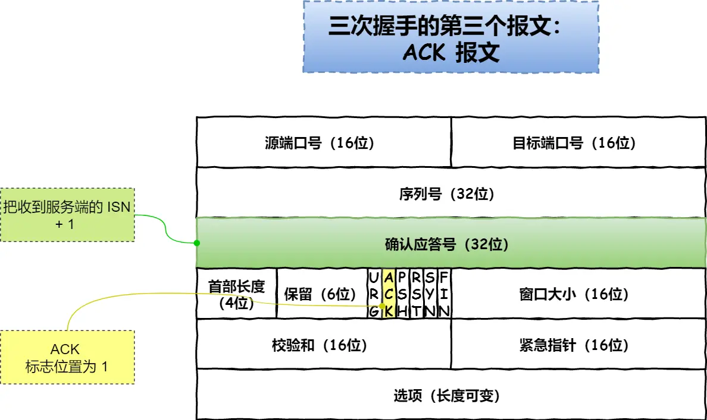

## Blog

### 算法

#### 详细布置

- 344 反转字符串
- 541 反转字符串II
- 卡码网：54 替换数字


#### 344 反转字符串

建议： 本题是字符串基础题目，就是考察 reverse 函数的实现，同时也明确一下 平时刷题什么时候用 库函数，什么时候 不用库函数 

题目链接/文章讲解/视频讲解：

https://programmercarl.com/0344.%E5%8F%8D%E8%BD%AC%E5%AD%97%E7%AC%A6%E4%B8%B2.html

这个题想到的就是用双指针方法，一个指向开始，一个指向最后，交换两个指针指向的元素，并且让两个指针不断向中间靠近

```cpp
class Solution {
public:
    void reverseString(vector<char>& s) {
        int left = 0, right = s.size() - 1;
        while (left < right) {
            swap(s.at(left), s.at(right));
            left++;
            right--;
        }
    }
};
```


#### 541 反转字符串II

建议：本题又进阶了，自己先去独立做一做，然后在看题解，对代码技巧会有很深的体会。 

题目链接/文章讲解/视频讲解：

https://programmercarl.com/0541.%E5%8F%8D%E8%BD%AC%E5%AD%97%E7%AC%A6%E4%B8%B2II.html

看到题目，想到用双指针中的快慢指针来做。

具体的思路是设置3个指针：一个快指针，走2K步后，慢指针a不动，指向原来位置，慢指针b向前走k步，然后通过循环交换a，b指向的元素；结束后，让两个慢指针同步到快指针所指向的位置，然后快指针继续移动。

```cpp
class Solution {
public:
    string reverseStr(string s, int k) {
        int a, b, c;
        a = b = c = 0;
        while (c < s.size()) {
            c += 2 * k;
            b += k - 1;
            if (b >= s.size())
                b = s.size() - 1;
            while (a < b)
                swap(s[a++], s[b--]);
            a = b = c;
        }
        return s;
    }
};
```


#### 卡码网：54 替换数字

建议：对于线性数据结构，填充或者删除，后序处理会高效的多。好好体会一下。

题目链接/文章讲解：

https://programmercarl.com/kamacoder/0054.%E6%9B%BF%E6%8D%A2%E6%95%B0%E5%AD%97.html

因为替换的内容和原来的内容不是同样大小的，所以想到用vector，将原来的每个字符作为vector中的一个元素

```cpp
#include <iostream>
#include <vector>
using std::cin;
using std::cout;
using std::string;
using std::vector;
 
int main() {
    string s;
    vector<string> str;
    cin >> s;
    for (char ch : s) {
        if (ch >= '0' && ch <= '9')
            str.push_back("number");
        else str.push_back(string(1, ch));
    }
    for (auto it : str)
        cout << it;
    return 0;
}
```

在看了随想录后，从后向前开始遍历，同时也使用双指针法。

这种首先需要算出需要扩容的大小。让旧指针指向原来数组的末尾，新指针指向计算后扩容的数组的末尾。如果是数字，移动新指针，并倒序填入"number"；否则，将旧指针指向的元素填入新指针指向的位置

```cpp
#include <iostream>
#include <vector>
using std::cin;
using std::cout;
using std::string;
using std::vector;
 
int main() {
    string s;
    while (cin >> s) {
        int count = 0;
        for (int i = 0; i < s.size(); ++i)
            if (s[i] >= '0' && s[i] <= '9')
                count++;
        int old = s.size() - 1, change;
        s.resize(s.size() + count * 5);
        change = s.size() - 1;
        while (old >= 0) {
            if (s[old] >= '0' && s[old] <= '9') {
                s[change--] = 'r';
                s[change--] = 'e';
                s[change--] = 'b';
                s[change--] = 'm';
                s[change--] = 'u';
                s[change--] = 'n';
            } else s[change--] = s[old];
            old--;
        }
        cout << s << "\n";
    }
    return 0;
}
```

==**其实很多数组填充类的问题，其做法都是先预先给数组扩容带填充后的大小，然后在从后向前进行操作。**==


### 八股文

#### TCP三次握手过程

掌握程度：

- 能够清晰地描述TCP三次握手的每个步骤和目的。
- 理解序列号和确认号的重要性，以及它们在建立连接中的作用。
- 扩展：知道三次握手过程中可能存在的安全问题，如SYN洪泛攻击，以及如何防范。

参考资料：
[动画解析：【一条视频讲清楚TCP协议与UDP协议-什么是三次握手与四次挥手】 ](https://www.bilibili.com/video/BV1kV411j7hA/?share_source=copy_web&vd_source=9bb0aa9c2c3cc1b12ca6f343a55b4e80)
[模拟回答：【面试官居然把TCP三次握手问得这么详细】 ](https://www.bilibili.com/video/BV1iN4y1L7wF/?share_source=copy_web&vd_source=9bb0aa9c2c3cc1b12ca6f343a55b4e80)


**TCP 连接**：用于保证可靠性和流量控制维护的某些状态信息，这些信息的组合，包括 **Socket、序列号和窗口大小**称为连接。

TCP 是面向连接的协议，所以使用 TCP 前必须先建立连接，而**建立连接是通过三次握手来进行的**。握手的主要作用就是确认双方的接收和发送能力是否正常


一开始，客户端和服务端都处于 `CLOSE` 状态。先是服务端主动监听某个端口，处于 `LISTEN` 状态


客户端会随机初始化序号（`client_isn`），将此序号置于 TCP 首部的「序号」字段中，同时把 `SYN` 标志位置为 `1`，表示 `SYN` 报文。接着把第一个 SYN 报文发送给服务端，表示向服务端发起连接，该报文不包含应用层数据，之后客户端处于 `SYN-SENT` 状态。

)

服务端收到客户端的 `SYN` 报文后，首先服务端也随机初始化自己的序号（`server_isn`），将此序号填入 TCP 首部的「序号」字段中，其次把 TCP 首部的「确认应答号」字段填入 `client_isn + 1`, 接着把 `SYN` 和 `ACK` 标志位置为 `1`。最后把该报文发给客户端，该报文也不包含应用层数据，之后服务端处于 `SYN-RCVD` 状态。



客户端收到服务端报文后，还要向服务端回应最后一个应答报文，首先该应答报文 TCP 首部 `ACK` 标志位置为 `1` ，其次「确认应答号」字段填入 `server_isn + 1` ，最后把报文发送给服务端，这次报文可以携带客户到服务端的数据，之后客户端处于 `ESTABLISHED` 状态。

服务端收到客户端的应答报文后，也进入 `ESTABLISHED` 状态。

==**第三次握手是可以携带数据的，前两次握手是不可以携带数据的**==

一旦完成三次握手，双方都处于 `ESTABLISHED` 状态，此时连接就已建立完成，客户端和服务端就可以相互发送数据了。

##### 为什么是三次握手？不是两次、四次

- 三次握手才可以阻止重复历史连接的初始化（主要原因）

  假设，客户端先发送了 SYN（seq = 90）报文，然后客户端宕机了，而且这个 SYN 报文还被网络阻塞了，服务端并没有收到，接着客户端重启后，又重新向服务端建立连接，发送了 SYN（seq = 100）报文（*注意！不是重传 SYN，重传的 SYN 的序列号是一样的*）。

  

  **如果是两次握手连接，就无法阻止历史连接**，因为**在两次握手的情况下，服务端没有中间状态给客户端来阻止历史连接，导致服务端可能建立一个历史连接，造成资源浪费**。即，在两次握手的情况下，服务端在收到 SYN 报文后，就进入 ESTABLISHED 状态，意味着这时可以给对方发送数据，但是客户端此时还没有进入 ESTABLISHED 状态，假设这次是历史连接，客户端判断到此次连接为历史连接，那么就会回 RST 报文来断开连接，而服务端在第一次握手的时候就进入 ESTABLISHED 状态，所以它可以发送数据的，但是它并不知道这个是历史连接，它只有在收到 RST 报文后，才会断开连接。

- 三次握手才可以同步双方的初始序列号

  TCP 协议的通信双方， 都必须维护一个「序列号」， 序列号是可靠传输的一个关键因素，它的作用：

  - 接收方可以去除重复的数据；
  - 接收方可以根据数据包的序列号按序接收；
  - 可以标识发送出去的数据包中， 哪些是已经被对方收到的（通过 ACK 报文中的序列号知道）；

  序列号在 TCP 连接中占据着非常重要的作用，所以当客户端发送携带「初始序列号」的 `SYN` 报文的时候，需要服务端回一个 `ACK` 应答报文，表示客户端的 SYN 报文已被服务端成功接收，那当服务端发送「初始序列号」给客户端的时候，依然也要得到客户端的应答回应，**这样一来一回，才能确保双方的初始序列号能被可靠的同步。**

  四次握手其实也能够可靠的同步双方的初始化序号，但由于**第二步和第三步可以优化成一步**，所以就成了「三次握手」。

  而两次握手只保证了一方的初始序列号能被对方成功接收，没办法保证双方的初始序列号都能被确认接收。

- 三次握手才可以避免资源浪费

  如果只有「两次握手」，当客户端发生的 `SYN` 报文在网络中阻塞，客户端没有接收到 `ACK` 报文，就会重新发送 `SYN` ，**由于没有第三次握手，服务端不清楚客户端是否收到了自己回复的 `ACK` 报文，所以服务端每收到一个 `SYN` 就只能先主动建立一个连接**，这会造成什么情况呢？

  如果客户端发送的 `SYN` 报文在网络中阻塞了，重复发送多次 `SYN` 报文，那么服务端在收到请求后就会**建立多个冗余的无效链接，造成不必要的资源浪费。**

  即两次握手会造成消息滞留情况下，服务端重复接受无用的连接请求 `SYN` 报文，而造成重复分配资源

##### 第一次握手丢失了，会发生什么？

当客户端想和服务端建立 TCP 连接的时候，首先第一个发的就是 SYN 报文，然后进入到 `SYN_SENT` 状态。

在这之后，如果客户端迟迟收不到服务端的 SYN-ACK 报文（第二次握手），就会触发「超时重传」机制，重传 SYN 报文，而且**重传的 SYN 报文的序列号都是一样的**。

当客户端在 1 秒（不同版本OS可能不同）后没收到服务端的 SYN-ACK 报文后，客户端就会重发 SYN 报文

通常，第一次超时重传是在 1 秒后，第二次超时重传是在 2 秒，第三次超时重传是在 4 秒后，第四次超时重传是在 8 秒后，第五次是在超时重传 16 秒后。没错，**每次超时的时间是上一次的 2 倍**。

当第五次超时重传后，会继续等待 32 秒，如果服务端仍然没有回应 ACK，客户端就不再发送 SYN 包，然后断开 TCP 连接。

> 在 Linux 里，客户端的 SYN 报文最大重传次数由 `tcp_syn_retries`内核参数控制，这个参数是可以自定义的，默认值一般是 5

所以，总耗时是 1+2+4+8+16+32=63 秒，大约 1 分钟左右。


##### 第二次握手丢失了，会发生什么？

当服务端收到客户端的第一次握手后，就会回 SYN-ACK 报文给客户端，这个就是第二次握手，此时服务端会进入 `SYN_RCVD` 状态。

第二次握手的 `SYN-ACK` 报文其实有两个目的 ：

- 第二次握手里的 ACK， 是对第一次握手的确认报文；
- 第二次握手里的 SYN，是服务端发起建立 TCP 连接的报文；

因为第二次握手报文里是包含对客户端的第一次握手的 ACK 确认报文，所以，如果客户端迟迟没有收到第二次握手，那么客户端就觉得可能自己的 SYN 报文（第一次握手）丢失了，于是**客户端就会触发超时重传机制，重传 SYN 报文**。

如果第二次握手丢失了，服务端收不到第三次握手，于是**服务端这边会触发超时重传机制，重传 SYN-ACK 报文**。

因此，当第二次握手丢失了，客户端和服务端都会重传：

- 客户端会重传 SYN 报文，也就是第一次握手，最大重传次数由 `tcp_syn_retries`内核参数决定；

- 服务端会重传 SYN-ACK 报文，也就是第二次握手，最大重传次数由 `tcp_synack_retries` 内核参数决定。

  > 在 Linux 下，SYN-ACK 报文的最大重传次数由 `tcp_synack_retries`内核参数决定，默认值是 5。

当客户端超时重传 `tcp_syn_retries` 次后，已达到最大重传次数，于是再等待一段时间（时间为上一次超时时间的 2 倍），如果还是没能收到服务端的第二次握手（SYN-ACK 报文），那么客户端就会断开连接。

当服务端超时重传 `tcp_synack_retries` 次后，已达到最大重传次数，于是再等待一段时间（时间为上一次超时时间的 2 倍），如果还是没能收到客户端的第三次握手（ACK 报文），那么服务端就会断开连接。

##### 第三次握手丢失了，会发生什么？

客户端收到服务端的 SYN-ACK 报文后，就会给服务端回一个 ACK 报文，也就是第三次握手，此时客户端状态进入到 `ESTABLISH` 状态。

因为这个第三次握手的 ACK 是对第二次握手的 SYN 的确认报文，所以当第三次握手丢失了，如果服务端那一方迟迟收不到这个确认报文，就会触发超时重传机制，重传 SYN-ACK 报文，直到收到第三次握手，或者达到最大重传次数。

注意，==ACK 报文是不会有重传的，当 ACK 丢失了，就由对方重传对应的报文。==

##### SYN 攻击如何避免？

 TCP 连接建立是需要三次握手，假设攻击者短时间伪造不同 IP 地址的 `SYN` 报文，服务端每接收到一个 `SYN` 报文，就进入`SYN_RCVD` 状态，但服务端发送出去的 `ACK + SYN` 报文，无法得到未知 IP 主机的 `ACK` 应答，久而久之就会**占满服务端的半连接队列**，使得服务端不能为正常用户服务。

>  TCP 半连接和全连接队列
>
> 在 TCP 三次握手的时候，Linux 内核会维护两个队列，分别是：
>
> - 半连接队列，也称 SYN 队列；
>
>   当服务端接收到客户端的 SYN 报文时，会创建一个半连接的对象，然后将其加入到内核的「 SYN 队列」
>
> - 全连接队列，也称 accept 队列；
>
>   服务端接收到 ACK 报文（第三次握手）后，从「 SYN 队列」取出一个半连接对象，然后创建一个新的连接对象放入到「 Accept 队列」；
>
>   应用通过调用 `accpet()` socket 接口，从「 Accept 队列」取出连接对象
>
> 不管是半连接队列还是全连接队列，都有最大长度限制，超过限制时，默认情况都会丢弃报文

SYN 攻击方式最直接的表现就会把 TCP 半连接队列打满，这样**当 TCP 半连接队列满了，后续再在收到 SYN 报文就会丢弃**，导致客户端无法和服务端建立连接。

避免 SYN 攻击方式，可以有以下四种方法：

- 调大 netdev_max_backlog；
- 增大 TCP 半连接队列；
- 开启 tcp_syncookies；
- 减少 SYN+ACK 重传次数


#### TCP的四次挥手过程

掌握程度：

- 能够清晰地描述TCP四次挥手的每个步骤和原因。
- 知道TIME-WAIT状态的重要性和2MSL等待期的作用。

参考资料：
[动画解析：【一条视频讲清楚TCP协议与UDP协议-什么是三次握手与四次挥手】](https://www.bilibili.com/video/BV1kV411j7hA/?share_source=copy_web&vd_source=9bb0aa9c2c3cc1b12ca6f343a55b4e80)


TCP 断开连接是通过**四次挥手**方式。双方都可以主动断开连接，断开连接后主机中的「资源」将被释放


- 客户端打算关闭连接，此时会发送一个 TCP 首部 `FIN` 标志位被置为 `1` 的报文，也即 `FIN` 报文，之后客户端进入 `FIN_WAIT_1` 状态。
- 服务端收到该报文后，就向客户端发送 `ACK` 应答报文，接着服务端进入 `CLOSE_WAIT` 状态。
- 客户端收到服务端的 `ACK` 应答报文后，之后进入 `FIN_WAIT_2` 状态。
- 等待服务端处理完数据后，也向客户端发送 `FIN` 报文，之后服务端进入 `LAST_ACK` 状态。
- 客户端收到服务端的 `FIN` 报文后，回一个 `ACK` 应答报文，之后进入 `TIME_WAIT` 状态
- 服务端收到了 `ACK` 应答报文后，就进入了 `CLOSE` 状态，至此服务端已经完成连接的关闭。
- 客户端在经过 `2MSL` 一段时间后，自动进入 `CLOSE` 状态，至此客户端也完成连接的关闭。

##### 为什么挥手需要四次

##### 第一次挥手丢失了，会发生什么？

如果第一次挥手丢失了，那么客户端迟迟收不到被动方的 ACK 的话，也就会触发超时重传机制，重传 FIN 报文，重发次数由 `tcp_orphan_retries` 参数控制。

当客户端重传 FIN 报文的次数超过 `tcp_orphan_retries` 后，就不再发送 FIN 报文，则会在等待一段时间（时间为上一次超时时间的 2 倍），如果还是没能收到第二次挥手，那么直接进入到 `close` 状态。

##### 第二次挥手丢失了，会发生什么？

ACK 报文是不会重传的，所以如果服务端的第二次挥手丢失了，客户端就会触发超时重传机制，重传 FIN 报文，直到收到服务端的第二次挥手，或者达到最大的重传次数。

当客户端收到第二次挥手，也就是收到服务端发送的 ACK 报文后，客户端就会处于 `FIN_WAIT2` 状态，在这个状态需要等服务端发送第三次挥手，也就是服务端的 FIN 报文。

对于 close 函数关闭的连接，由于无法再发送和接收数据，所以`FIN_WAIT2` 状态不可以持续太久，而 `tcp_fin_timeout` 控制了这个状态下连接的持续时长，默认值是 60 秒。

这意味着对于调用 close 关闭的连接，如果在 60 秒后还没有收到 FIN 报文，客户端（主动关闭方）的连接就会直接关闭

##### 第三次挥手丢失了，会发生什么？

当服务端（被动关闭方）收到客户端（主动关闭方）的 FIN 报文后，内核会自动回复 ACK，同时连接处于 `CLOSE_WAIT` 状态，顾名思义，它表示等待应用进程调用 close 函数关闭连接。

内核是没有权利替代进程关闭连接，必须由进程主动调用 close 函数来触发服务端发送 FIN 报文。服务端处于 CLOSE_WAIT 状态时，调用了 close 函数，内核就会发出 FIN 报文，同时连接进入 LAST_ACK 状态，等待客户端返回 ACK 来确认连接关闭。

如果服务端迟迟收不到这个 ACK，服务端就会重发 FIN 报文，重发次数仍然由 `tcp_orphan_retrie`s 参数控制，这与客户端重发 FIN 报文的重传次数控制方式是一样的

##### 第四次挥手丢失了，会发生什么？

当客户端收到服务端的第三次挥手的 FIN 报文后，就会回 ACK 报文，也就是第四次挥手，此时客户端连接进入 `TIME_WAIT` 状态。

在 Linux 系统，TIME_WAIT 状态会持续 2MSL 后才会进入关闭状态。

然后，服务端（被动关闭方）没有收到 ACK 报文前，还是处于 LAST_ACK 状态。

如果第四次挥手的 ACK 报文没有到达服务端，服务端就会重发 FIN 报文，重发次数仍然由前面介绍过的 `tcp_orphan_retries` 参数控制。

> ###### 为什么 TIME_WAIT 等待的时间是 2MSL
>
> `MSL` 是 Maximum Segment Lifetime，**报文最大生存时间**，它是任何报文在网络上存在的最长时间，超过这个时间报文将被丢弃
>
> TIME_WAIT 等待 2 倍的 MSL：
>
> - 网络中可能存在来自发送方的数据包，当这些发送方的数据包被接收方处理后又会向对方发送响应，所以**一来一回需要等待 2 倍的时间**。
>
>   比如，如果被动关闭方没有收到断开连接的最后的 ACK 报文，就会触发超时重发 `FIN` 报文，另一方接收到 FIN 后，会重发 ACK 给被动关闭方， 一来一去正好 2 个 MSL。
>
>   可以看到 **2MSL时长** 这其实是相当于**至少允许报文丢失一次**。比如，若 ACK 在一个 MSL 内丢失，这样被动方重发的 FIN 会在第 2 个 MSL 内到达，TIME_WAIT 状态的连接可以应对。
>
> - `2MSL` 的时间是从**客户端接收到 FIN 后发送 ACK 开始计时的**。如果在 TIME-WAIT 时间内，因为客户端的 ACK 没有传输到服务端，客户端又接收到了服务端重发的 FIN 报文，那么 **2MSL 时间将重新计时**。
>
> > MSL 与 TTL 的区别： MSL 的单位是时间，而 TTL 是经过路由跳数。所以 **MSL 应该要大于等于 TTL 消耗为 0 的时间**，以确保报文已被自然消亡。
> >
> > **TTL 的值一般是 64，Linux 将 MSL 设置为 30 秒，意味着 Linux 认为数据报文经过 64 个路由器的时间不会超过 30 秒，如果超过了，就认为报文已经消失在网络中了**。
>
> 需要 TIME-WAIT 状态，主要是两个原因：
>
> - 防止历史连接中的数据，被后面相同四元组的连接错误的接收；
> - 保证「被动关闭连接」的一方，能被正确的关闭；


#### HTTP的Keep-Alive是什么？TCP 的 Keepalive 和 HTTP 的 Keep-Alive 是一个东西吗？

掌握程度：

- 能够清晰地解释HTTP的Keep-Alive和TCP的Keepalive的概念及其目的。知道HTTP的Keep-Alive如何通过HTTP头启用，以及TCP的Keepalive如何通过系统设置或编程接口配置。
- 理解两者在网络通信中的作用和区别。
    - HTTP的Keep-Alive是一种机制，允许客户端和服务器在单个TCP连接上发送多个HTTP请求和响应，而不是每个请求/响应后都关闭连接。
    - TCP的Keepalive用于检测和清除死TCP连接。

参考资料：
[小林coding: TCP Keepalive 和 HTTP Keep-Alive 是一个东西吗？](https://xiaolincoding.com/network/3_tcp/tcp_http_keepalive.html#http-的-keep-alive)
[视频解析（过长）：HTTP长连接和短连接？(http keep_alive tcp keep_alive  心跳检测机制】 ](https://www.bilibili.com/video/BV1XV4y1Y7ig/?share_source=copy_web&vd_source=9bb0aa9c2c3cc1b12ca6f343a55b4e80)


##### HTTP的Keep-Alive

HTTP 协议采用的是「请求-应答」的模式，也就是客户端发起了请求，服务端才会返回响应，一来一回这样子。

由于 HTTP 是基于 TCP 传输协议实现的，客户端与服务端要进行 HTTP 通信前，需要先建立 TCP 连接，然后客户端发送 HTTP 请求，服务端收到后就返回响应，至此「请求-应答」的模式就完成了，随后就会释放 TCP 连接。

如果每次请求都要经历这样的过程：建立 TCP -> 请求资源 -> 响应资源 -> 释放连接，那么此方式就是 **HTTP 短连接**

可以在第一个 HTTP 请求完后，先不断开 TCP 连接，让后续的 HTTP 请求继续使用此连接。HTTP 的 Keep-Alive 就是实现了这个功能，可以使用同一个 TCP 连接来发送和接收多个 HTTP 请求/应答，避免了连接建立和释放的开销，这个方法称为 **HTTP 长连接**。HTTP 长连接的特点是，只要任意一端没有明确提出断开连接，则保持 TCP 连接状态。

- 在 HTTP 1.0 中默认是关闭的，如果浏览器要开启 Keep-Alive，它必须在请求的包头中添加：`Connection: Keep-Alive`，然后当服务器收到请求，作出回应的时候，它也添加一个头在响应中：`Connection: Keep-Alive`，这样做，连接就不会中断，而是保持连接。当客户端发送另一个请求时，它会使用同一个连接。这一直继续到客户端或服务器端提出断开连接。
- **从 HTTP 1.1 开始， 就默认是开启了 Keep-Alive**，如果要关闭 Keep-Alive，需要在 HTTP 请求的包头里添加：`Connection:close`。一旦客户端和服务端达成协议，那么长连接就建立好了。

HTTP 长连接不仅仅减少了 TCP 连接资源的开销，而且这给 **HTTP 流水线**技术提供了可实现的基础。

所谓的 HTTP 流水线，是**客户端可以先一次性发送多个请求，而在发送过程中不需先等待服务器的回应**，可以减少整体的响应时间。

服务器会按照客户端请求的顺序进行响应。而且等服务器响应完客户端第一批发送的请求后，客户端才能发出下一批的请求，也就说如果服务器响应的过程发生了阻塞，那么客户端就无法发出下一批的请求，此时就造成了「队头阻塞」的问题。

使用了 HTTP 长连接，如果客户端完成一个 HTTP 请求后，就不再发起新的请求，此时这个 TCP 连接一直占用着会浪费资源，所以为了避免资源浪费的情况，web 服务软件一般都会提供 `keepalive_timeout` 参数，用来指定 HTTP 长连接的超时时间。

比如设置了 HTTP 长连接的超时时间是 60 秒，web 服务软件就会**启动一个定时器**，如果客户端在完后一个 HTTP 请求后，在 60 秒内都没有再发起新的请求，定时器的时间一到，就会触发回调函数来释放该连接。

##### TCP 的 Keepalive

TCP 的 Keepalive 这东西其实就是 **TCP 的保活机制**，如果两端的 TCP 连接一直没有数据交互，达到了触发 TCP 保活机制的条件，那么内核里的 TCP 协议栈就会发送探测报文。

- 如果对端程序是正常工作的。当 TCP 保活的探测报文发送给对端, 对端会正常响应，这样 **TCP 保活时间会被重置**，等待下一个 TCP 保活时间的到来。
- 如果对端主机宕机（*注意不是进程崩溃，进程崩溃后操作系统在回收进程资源的时候，会发送 FIN 报文，而主机宕机则是无法感知的，所以需要 TCP 保活机制来探测对方是不是发生了主机宕机*），或对端由于其他原因导致报文不可达。当 TCP 保活的探测报文发送给对端后，石沉大海，没有响应，连续几次，达到保活探测次数后，**TCP 会报告该 TCP 连接已经死亡**。

所以，TCP 保活机制可以在双方没有数据交互的情况，通过探测报文，来确定对方的 TCP 连接是否存活，这个工作是在内核完成的。

注意，应用程序若想使用 TCP 保活机制需要通过 socket 接口设置 `SO_KEEPALIVE` 选项才能够生效，如果没有设置，那么就无法使用 TCP 保活机制

##### 总结

- HTTP 的 Keep-Alive 也叫 HTTP 长连接，该功能是由「应用程序」实现的，可以使得用同一个 TCP 连接来发送和接收多个 HTTP 请求/应答，减少了 HTTP 短连接带来的多次 TCP 连接建立和释放的开销。
- TCP 的 Keepalive 也叫 TCP 保活机制，该功能是由「内核」实现的，当客户端和服务端长达一定时间没有进行数据交互时，内核为了确保该连接是否还有效，就会发送探测报文，来检测对方是否还在线，然后来决定是否要关闭该连接。


### 总结

今天的题目还是比较简单，主要思路还是跟数组方面的差不多，特别是替换数字题，对数组的操作非常精细。
