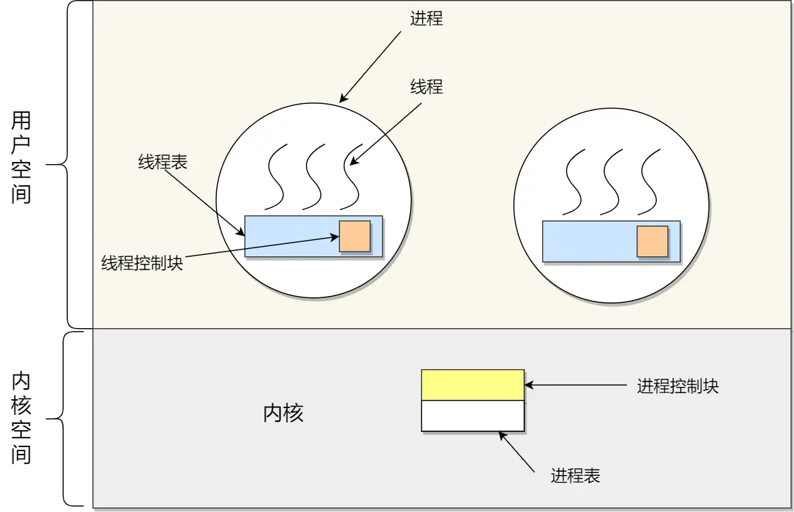
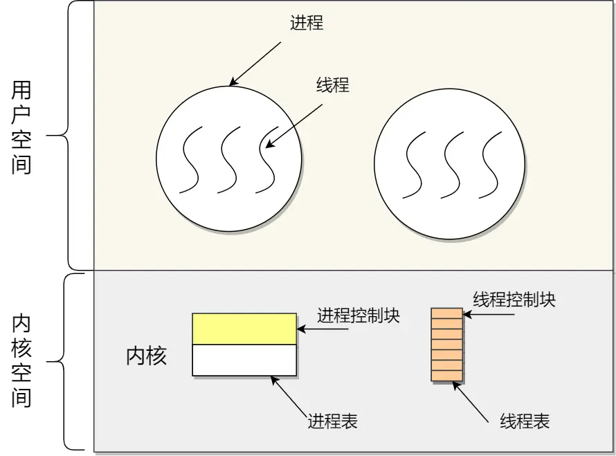
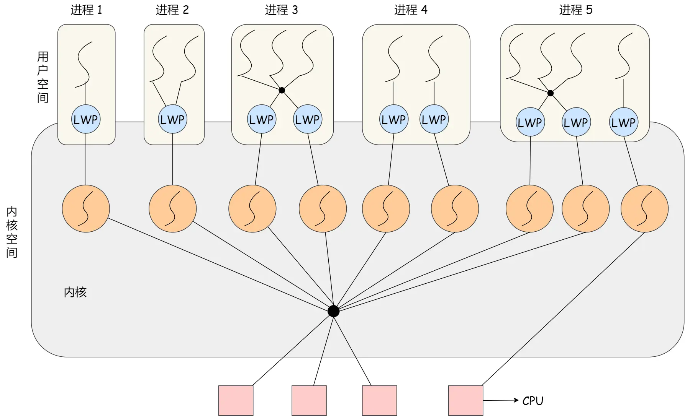

## Blog

### 算法

#### 详细布置

- 理论基础
- 232 用栈实现队列
- 225 用队列实现栈 
- 20  有效的括号
- 1047 删除字符串中的所有相邻重复项


#### 理论基础

了解一下 栈与队列的内部实现机制，文中是以C++为例讲解的。 

文章讲解：

https://programmercarl.com/%E6%A0%88%E4%B8%8E%E9%98%9F%E5%88%97%E7%90%86%E8%AE%BA%E5%9F%BA%E7%A1%80.html

队列是先进先出，栈是先进后出。

##### 栈

1. C++中stack 是容器么？

   > STL中栈往往不被归类为容器，而被归类为container adapter（容器适配器）

2. 我们使用的stack是属于哪个版本的STL？

   > SGI STL 由Silicon Graphics Computer Systems公司参照HP STL实现，被Linux的C++编译器GCC所采用，SGI STL是开源软件，源码可读性甚高

3. 我们使用的STL中stack是如何实现的？

   > **栈是以底层容器完成其所有的工作，对外提供统一的接口，底层容器是可插拔的（也就是说我们可以控制使用哪种容器来实现栈的功能）。**
   >
   > 栈的内部结构，栈的底层实现可以是vector，deque，list 都是可以的， 主要就是数组和链表的底层实现

   **SGI STL，如果没有指定底层实现的话，默认是以deque为缺省情况下栈的底层结构**

   ```cpp
   std::stack<int, std::vector<int> > third;  // 使用vector为底层容器的栈
   ```

4. stack 提供迭代器来遍历stack空间么？

   > 栈提供push 和 pop 等等接口，所有元素必须符合先进后出规则，所以栈不提供走访功能，也不提供迭代器(iterator)。 不像是set 或者map 提供迭代器iterator来遍历所有元素

##### 队列

1. C++中queue 是容器么？

   `queue`和`stack`一样，在C++中**不是标准容器**，而是一个**容器适配器**（container adapter）。

   - 容器适配器是对底层容器的一种封装，用于提供特定操作模式。
   - `queue`实现了**先进先出（FIFO）**的数据结构，提供`push`、`pop`、`front`和`back`等操作接口。

2. 我们使用的queue是属于哪个版本的STL？

   `queue`也是在C++98标准中引入的，并且在后续C++标准中保持兼容（包括C++11、C++17、C++20和C++23）。
   与`stack`一样，`queue`也是C++标准库的一部分，定义在头文件`<queue>`中，因此与具体的STL实现（如SGI STL或其他版本）无直接关系。现代C++标准库由编译器供应商实现，如GCC、Clang和MSVC等。

3. 我们使用的STL中queue是如何实现的？

   `queue`通过封装一个底层容器来实现FIFO操作。默认情况下，`queue`的底层容器是`std::deque`，但你可以通过模板参数指定其他支持双端操作的容器（如`std::list`）。

   - **`push`**：调用底层容器的`push_back`将元素添加到队尾。
   - **`pop`**：调用底层容器的`pop_front`移除队首元素。
   - **`front`**：调用底层容器的`front`返回队首元素。
   - **`back`**：调用底层容器的`back`返回队尾元素。

4. queue 提供迭代器来遍历 queue 空间么？

   `queue`不提供迭代器，也不支持直接遍历。

   - `queue`的设计目的是隐藏底层容器的实现细节，仅提供FIFO操作接口。
   - 如果需要访问底层元素，可以直接操作底层容器（通过容器适配器的构造函数指定底层容器类型）。


#### 232 用栈实现队列

大家可以先看视频，了解一下模拟的过程，然后写代码会轻松很多。

题目链接/文章讲解/视频讲解：

https://programmercarl.com/0232.%E7%94%A8%E6%A0%88%E5%AE%9E%E7%8E%B0%E9%98%9F%E5%88%97.html

先看视频，了解一下模拟的过程

一旦有弹出的行为，要把入栈里的所有元素都放到出栈里，这样才对所有的顺序进行了改变

```cpp
class MyQueue {
public:
    MyQueue() {
        
    }
    
    void push(int x) {
        input.push(x);
    }
    
    int pop() {
        if (output.empty()) {
            while (!input.empty()) {
                output.push(input.top());
                input.pop();
            }
        }
        int num = output.top();
        output.pop();
        return num;
    }
    
    int peek() {
        int num = this->pop();
        output.push(num);
        return num;
    }
    
    bool empty() {
        return output.empty() && input.empty();
    }
private:
    stack<int> input, output;
};
```

本题唯一的难点就是应该在什么时候将`input`中的元素弹栈到`output`中。可以多找几组测试数据模拟一下。

`pop()`，如果`output`是空的那么肯定需要加入数据，让`input`中的所有元素都弹栈到`output`中，==（注意是全部导入）==


#### 225 用队列实现栈 

可能大家惯性思维，以为还要两个队列来模拟栈，其实只用一个队列就可以模拟栈了。 

建议大家掌握一个队列的方法，更简单一些，可以先看视频讲解

题目链接/文章讲解/视频讲解：

https://programmercarl.com/0225.%E7%94%A8%E9%98%9F%E5%88%97%E5%AE%9E%E7%8E%B0%E6%A0%88.html

看了随想录中的提示，使用了2个队列，第二个队列做备份用。

因为出栈的是最后加入的元素，也就是在队列的末尾，因此需要先取出队列前面的元素，直接将这个末尾的元素返回。再将之前取出的元素依次放回到队列中

```cpp
class MyStack {
public:
    MyStack() {
        
    }
    
    void push(int x) {
        q.push(x);
    }
    
    int pop() {
        int num = q.back();
        while (!q.empty() && q.front() != num) {
            back_q.push(q.front());
            q.pop();
        }
        q.pop();
        while (!back_q.empty()) {
            q.push(back_q.front());
            back_q.pop();
        }
        // 上面的代码可以进行优化：q = back_q; 循环 back_q.pop();
        // queue 没有 clear()
        return num;
    }
    
    int top() {
        int num = pop();
        push(num);
        return num;
    }
    
    bool empty() {
        return q.empty() && back_q.empty();
    }
private:
    queue<int> q, back_q;
};
```

只用一个队列就可以模拟栈了。要进行弹栈时，队列中前面的元素取出后，加入到队尾，这样就不需要使用一个用来备份的队列了

```cpp
int pop() {
	int num = q.back();
	while (q.front() != num) {
		q.push(q.front());
		q.pop();
	}
	q.pop();
	return num;
}
```

**一个队列在模拟栈弹出元素的时候只要将队列头部的元素（除了最后一个元素外） 重新添加到队列尾部，此时再去弹出元素就是栈的顺序了。**


#### 20  有效的括号

讲完了栈实现队列，队列实现栈，接下来就是栈的经典应用了。 

大家先自己思考一下 有哪些不匹配的场景，在看视频 我讲的都有哪些场景，落实到代码其实就容易很多了。

题目链接/文章讲解/视频讲解：

https://programmercarl.com/0020.%E6%9C%89%E6%95%88%E7%9A%84%E6%8B%AC%E5%8F%B7.html

这道题目还是比较简单的，但是在写的时候还是要注意2点（踩过的坑）

1. 需要考虑栈为空的情况，即在第一次遇到右括号前，没有碰到过左括号
2. 一旦栈顶的元素不匹配，就直接返回不匹配，而不是等到最后在进行

```cpp
class Solution {
public:
    bool isValid(string s) {
        stack<char> sign;
        for (char ch : s) {
            if (ch == '(' || ch == '[' || ch == '{')
                sign.push(ch);
            else {
                // 如果栈为空，直接返回false
                if (sign.empty())
                    return false;
                char item = sign.top();
                if (item == '(' && ch == ')' ||
                    item == '[' && ch == ']' ||
                    item == '{' && ch == '}')
                    sign.pop();
                else return false;
            }
        }
        return sign.empty();
    }
};
```

在看了随想录后，给出的代码考虑的比我更仔细，首先判断了长度，如果是奇数直接返回

入栈时，直接入栈了右括号，这样在比较时会更加方便


#### 1047 删除字符串中的所有相邻重复项

栈的经典应用。 

要知道栈为什么适合做这种类似于爱消除的操作，因为栈帮助我们记录了 遍历数组当前元素时候，前一个元素是什么。

题目链接/文章讲解/视频讲解：

https://programmercarl.com/1047.%E5%88%A0%E9%99%A4%E5%AD%97%E7%AC%A6%E4%B8%B2%E4%B8%AD%E7%9A%84%E6%89%80%E6%9C%89%E7%9B%B8%E9%82%BB%E9%87%8D%E5%A4%8D%E9%A1%B9.html

这道题也是比较简单的，直接拿栈顶元素出来和字符串的元素比较，如果一样就出栈，否则让字符串元素入栈

值得注意的是，可以直接拿`string`作为栈

```cpp
class Solution {
public:
    string removeDuplicates(string s) {
        string str;
        for (char ch : s) {
            if (!str.empty() && str.back() == ch)
                str.pop_back();
            else str.push_back(ch);
        }
        return str;
    }
};
```


### 八股文

#### 进程和线程的区别

掌握程度：

- 理解进程和线程在资源拥有、执行、上下文切换、创建和销毁开销方面的差异， 能够清晰地描述进程和线程的定义、区别和联系。
- 知道进程间通信和线程间通信的不同方式及其特点。
- 如果有实际的多线程或多进程编程经验，能够结合实例讨论进程和线程的使用和最佳实践。

参考资料：
[【操作系统】进程和线程的区别]()

https://www.bilibili.com/video/BV1Wr4y1P7Yr/?share_source=copy_web&vd_source=9bb0aa9c2c3cc1b12ca6f343a55b4e80

[进程和线程的比较]()

https://xiaolincoding.com/os/4_process/process_base.html#线程与进程的比较


##### 进程

进程就是**应用程序在内存中分配的空间，也就是正在运行的程序**，各个进程之间互不干扰。同时进程保存着程序每一个时刻运行的状态。

> 程序：用某种编程语言(Java、Python 等)编写，能够完成一定任务或者功能的代码集合，是指令和数据的有序集合，是**一段静态代码**。

###### 进程的状态


**在一个进程的活动期间至少具备三种基本状态，即运行状态、就绪状态、阻塞状态**

- 运行状态（*Running*）：该时刻进程占用 CPU；
- 就绪状态（*Ready*）：可运行，由于其他进程处于运行状态而暂时停止运行；
- 阻塞状态（*Blocked*）：该进程正在等待某一事件发生（如等待输入/输出操作的完成）而暂时停止运行，这时，即使给它CPU控制权，它也无法运行；

进程还有另外两个基本状态：

- 创建状态（*new*）：进程正在被创建时的状态；
- 结束状态（*Exit*）：进程正在从系统中消失时的状态；

进程的状态变迁：

1. *NULL -> 创建状态*：一个新进程被创建时的第一个状态；

2. *创建状态 -> 就绪状态*：当进程被创建完成并初始化后，一切就绪准备运行时，变为就绪状态，这个过程是很快的；

3. *就绪态 -> 运行状态*：处于就绪状态的进程被操作系统的进程调度器选中后，就分配给 CPU 正式运行该进程；

4. *运行状态 -> 结束状态*：当进程已经运行完成或出错时，会被操作系统作结束状态处理；

5. *运行状态 -> 就绪状态*：处于运行状态的进程在运行过程中，由于分配给它的运行时间片用完，操作系统会把该进程变为就绪态，接着从就绪态选中另外一个进程运行；

6. *运行状态 -> 阻塞状态*：当进程请求某个事件且必须等待时，例如请求 I/O 事件；

7. *阻塞状态 -> 就绪状态*：当进程要等待的事件完成时，它从阻塞状态变到就绪状态；

> 如果有大量处于阻塞状态的进程，进程可能会占用着物理内存空间，显然不是我们所希望的，毕竟物理内存空间是有限的，被阻塞状态的进程占用着物理内存就一种浪费物理内存的行为。
>
> 所以，在虚拟内存管理的操作系统中，通常会把阻塞状态的进程的物理内存空间换出到硬盘，等需要再次运行的时候，再从硬盘换入到物理内存。

因此，用挂起状态，来**描述进程没有占用实际的物理内存空间的情况**

挂起状态可以分为两种：

- 阻塞挂起状态：进程在外存（硬盘）并等待某个事件的出现；
- 就绪挂起状态：进程在外存（硬盘），但只要进入内存，即刻立刻运行；

> 导致进程挂起的原因不只是因为进程所使用的内存空间不在物理内存，还包括如下情况：
>
> - 通过 sleep 让进程间歇性挂起，其工作原理是设置一个定时器，到期后唤醒进程。
> - 用户希望挂起一个程序的执行，比如在 Linux 中用 `Ctrl+Z` 挂起进程

###### 进程控制块

在操作系统中，是用**进程控制块**（*process control block，PCB*）数据结构来描述进程的

**PCB 是进程存在的唯一标识**，这意味着一个进程的存在，必然会有一个 PCB，如果进程消失了，那么 PCB 也会随之消失

PCB包含：

- **进程描述信息：**

  - 进程标识符：标识各个进程，每个进程都有一个并且唯一的标识符；
  - 用户标识符：进程归属的用户，用户标识符主要为共享和保护服务；

- **进程控制和管理信息：**

  - 进程当前状态，如 new、ready、running、waiting 或 blocked 等；
  - 进程优先级：进程抢占 CPU 时的优先级；

- **资源分配清单：**

  有关内存地址空间或虚拟地址空间的信息，所打开文件的列表和所使用的 I/O 设备信息。

- **CPU 相关信息：**

  CPU 中各个寄存器的值，当进程被切换时，CPU 的状态信息都会被保存在相应的 PCB 中，以便进程重新执行时，能从断点处继续执行。

PCB之间，通常是通过**链表**的方式进行组织，把具有**相同状态的进程链在一起，组成各种队列**

- 将所有处于就绪状态的进程链在一起，称为**就绪队列**；
- 把所有因等待某事件而处于等待状态的进程链在一起就组成各种**阻塞队列**；
- 另外，对于运行队列在单核 CPU 系统中则只有一个运行指针了，因为单核 CPU 在某个时间，只能运行一个程序。

###### 进程的控制

1. 创建进程

   操作系统允许一个进程创建另一个进程，而且允许子进程继承父进程所拥有的资源。

   创建进程的过程如下：

   - 申请一个空白的 PCB，并向 PCB 中填写一些控制和管理进程的信息，比如进程的唯一标识等；
   - 为该进程分配运行时所必需的资源，比如内存资源；
   - 将 PCB 插入到就绪队列，等待被调度运行；

2. 终止进程

   进程可以有 3 种终止方式：正常结束、异常结束以及外界干预（信号 `kill` 掉）。

   当子进程被终止时，其在父进程处继承的资源应当还给父进程。而当父进程被终止时，该父进程的子进程就变为孤儿进程，会被 1 号进程收养，并由 1 号进程对它们完成状态收集工作。

   终止进程的过程如下：

   - 查找需要终止的进程的 PCB；
   - 如果处于执行状态，则立即终止该进程的执行，然后将 CPU 资源分配给其他进程；
   - 如果其还有子进程，则应将该进程的子进程交给 1 号进程接管；
   - 将该进程所拥有的全部资源都归还给操作系统；
   - 将其从 PCB 所在队列中删除；

3. 阻塞进程

   当进程需要等待某一事件完成时，它可以调用阻塞语句把自己阻塞等待。而一旦被阻塞等待，它只能由另一个进程唤醒。

   阻塞进程的过程如下：

   - 找到将要被阻塞进程标识号对应的 PCB；
   - 如果该进程为运行状态，则保护其现场，将其状态转为阻塞状态，停止运行；
   - 将该 PCB 插入到阻塞队列中去；

4. 唤醒进程

   进程由「运行」转变为「阻塞」状态是由于进程必须等待某一事件的完成，所以处于阻塞状态的进程是绝对不可能叫醒自己的。

   如果某进程正在等待 I/O 事件，需由别的进程发消息给它，则只有当该进程所期待的事件出现时，才由发现者进程用唤醒语句叫醒它。

   唤醒进程的过程如下：

   - 在该事件的阻塞队列中找到相应进程的 PCB；
   - 将其从阻塞队列中移出，并置其状态为就绪状态；
   - 把该 PCB 插入到就绪队列中，等待调度程序调度

###### 进程的上下文切换

各个进程之间是共享 CPU 资源的，在不同的时候进程之间需要切换，让不同的进程可以在 CPU 执行，那么这个**一个进程切换到另一个进程运行，称为进程的上下文切换**

> CPU 上下文切换就是先把前一个任务的 CPU 上下文（CPU 寄存器和程序计数器）保存起来，然后加载新任务的上下文到这些寄存器和程序计数器，最后再跳转到程序计数器所指的新位置，运行新任务。
>
> 系统内核会存储保持下来的上下文信息，当此任务再次被分配给 CPU 运行时，CPU 会重新加载这些上下文，这样就能保证任务原来的状态不受影响，让任务看起来还是连续运行。
>
> 上面说到所谓的「任务」，主要包含进程、线程和中断。所以，可以根据任务的不同，把 CPU 上下文切换分成：**进程上下文切换、线程上下文切换和中断上下文切换**。

- 进程上下文切换

  进程是由内核管理和调度的，所以进程的切换只能发生在内核态。

  所以，**进程的上下文切换不仅包含了虚拟内存、栈、全局变量等用户空间的资源，还包括了内核堆栈、寄存器等内核空间的资源。**

  把交换的信息保存在进程的 PCB，当要运行另外一个进程的时候，需要从这个进程的 PCB 取出上下文，然后恢复到 CPU 中，这使得这个进程可以继续执行

  进程的上下文开销是很关键的，希望它的开销越小越好，这样可以使得进程可以把更多时间花费在执行程序上，而不是耗费在上下文切换

- 发生进程上线文切换的场景

  - 为了保证所有进程可以得到公平调度，CPU 时间被划分为一段段的时间片，这些时间片再被轮流分配给各个进程。这样，当某个进程的时间片耗尽了，进程就从运行状态变为就绪状态，系统从就绪队列选择另外一个进程运行；
  - 进程在系统资源不足（比如内存不足）时，要等到资源满足后才可以运行，这个时候进程也会被挂起，并由系统调度其他进程运行；
  - 当进程通过睡眠函数 sleep 这样的方法将自己主动挂起时，自然也会重新调度；
  - 当有优先级更高的进程运行时，为了保证高优先级进程的运行，当前进程会被挂起，由高优先级进程来运行；
  - 发生硬件中断时，CPU 上的进程会被中断挂起，转而执行内核中的中断服务程序；

##### 线程

**线程是进程当中的一条执行流程。**

同一个进程内多个线程之间可以共享代码段、数据段、打开的文件等资源，但每个线程各自都有一套独立的寄存器和栈，这样可以确保线程的控制流是相对独立的。

线程同样具有就绪、阻塞、执行三种基本状态，同样具有状态之间的转换关系

线程的优点：

- 一个进程中可以同时存在多个线程；
- 各个线程之间可以并发执行；
- 各个线程之间可以共享地址空间和文件等资源；

线程的缺点：

- 当进程中的一个线程崩溃时，会导致其所属进程的所有线程崩溃

###### 线程的上下文切换

操作系统的任务调度，实际上的调度对象是线程，而进程只是给线程提供了虚拟内存、全局变量等资源。

- 当进程只有一个线程时，可以认为进程就等于线程；
- 当进程拥有多个线程时，这些线程会共享相同的虚拟内存和全局变量等资源，这些资源在上下文切换时是不需要修改的；

线程也有自己的私有数据，比如栈和寄存器等，这些在上下文切换时也是需要保存的

线程上下文切换的是：

- 当两个线程不是属于同一个进程，则切换的过程就跟进程上下文切换一样；
- **当两个线程是属于同一个进程，因为虚拟内存是共享的，所以在切换时，虚拟内存这些资源就保持不动，只需要切换线程的私有数据、寄存器等不共享的数据**；

###### 线程的实现方式：

用户线程和内核线程的对应关系:

第一种关系是**多对一**的关系，也就是多个用户线程对应同一个内核线程

第二种是**一对一**的关系，也就是一个用户线程对应一个内核线程

第三种是**多对多**的关系，也就是多个用户线程对应到多个内核线程

- **用户线程（User Thread）**：在用户空间实现的线程，不是由内核管理的线程，是由用户态的线程库来完成线程的管理；

  用户线程是基于用户态的线程管理库来实现的，那么**线程控制块（Thread Control Block, TCB）** 也是在库里面来实现的，对于操作系统而言是看不到这个 TCB 的，它只能看到整个进程的 PCB。

  所以，**用户线程的整个线程管理和调度，操作系统是不直接参与的，而是由用户级线程库函数来完成线程的管理，包括线程的创建、终止、同步和调度等。**

  用户级线程的模型，也就类似==多对一==的关系，即多个用户线程对应同一个内核线程

  用户线程的**优点**：

  - 每个进程都需要有它私有的线程控制块（TCB）列表，用来跟踪记录它各个线程状态信息（PC、栈指针、寄存器），TCB 由用户级线程库函数来维护，可用于不支持线程技术的操作系统；
  - 用户线程的切换也是由线程库函数来完成的，无需用户态与内核态的切换，所以速度特别快；

  用户线程的**缺点**：

  - 由于操作系统不参与线程的调度，如果一个线程发起了系统调用而阻塞，那进程所包含的用户线程都不能执行了。
  - 当一个线程开始运行后，除非它主动地交出 CPU 的使用权，否则它所在的进程当中的其他线程无法运行，因为用户态的线程没法打断当前运行中的线程，它没有这个特权，只有操作系统才有，但是用户线程不是由操作系统管理的。
  - 由于时间片分配给进程，故与其他进程比，在多线程执行时，每个线程得到的时间片较少，执行会比较慢；

  

- **内核线程（Kernel Thread）**：在内核中实现的线程，是由内核管理的线程；

  **内核线程是由操作系统管理的，线程对应的 TCB 自然是放在操作系统里的，这样线程的创建、终止和管理都是由操作系统负责。**

  内核线程的模型，也就类似==一对一==的关系，即一个用户线程对应一个内核线程

  内核线程的**优点**：

  - 在一个进程当中，如果某个内核线程发起系统调用而被阻塞，并不会影响其他内核线程的运行；
  - 分配给线程，多线程的进程获得更多的 CPU 运行时间；

  内核线程的**缺点**：

  - 在支持内核线程的操作系统中，由内核来维护进程和线程的上下文信息，如 PCB 和 TCB；
  - 线程的创建、终止和切换都是通过系统调用的方式来进行，因此对于系统来说，系统开销比较大；

  

- **轻量级进程（LightWeight Process）**：在内核中来支持用户线程；

  **轻量级进程（\*Light-weight process，LWP\*）是内核支持的用户线程，一个进程可有一个或多个 LWP，每个 LWP 是跟内核线程一对一映射的，也就是 LWP 都是由一个内核线程支持，而且 LWP 是由内核管理并像普通进程一样被调度**。

  在大多数系统中，**LWP与普通进程的区别也在于它只有一个最小的执行上下文和调度程序所需的统计信息**。一般来说，一个进程代表程序的一个实例，而 LWP 代表程序的执行线程，因为一个执行线程不像进程那样需要那么多状态信息，所以 LWP 也不带有这样的信息。

  在 LWP 之上也是可以使用用户线程的，那么 LWP 与用户线程的对应关系就有三种：

  - `1 : 1`，即一个 LWP 对应 一个用户线程；
  - `N : 1`，即一个 LWP 对应多个用户线程；
  - `M : N`，即多个 LWP 对应多个用户线程；

  

  **1 : 1 模式**

  一个线程对应到一个 LWP 再对应到一个内核线程，如上图的进程 4，属于此模型。

  - 优点：实现并行，当一个 LWP 阻塞，不会影响其他 LWP；
  - 缺点：每一个用户线程，就产生一个内核线程，创建线程的开销较大。

  **N : 1 模式**

  多个用户线程对应一个 LWP 再对应一个内核线程，如上图的进程 2，线程管理是在用户空间完成的，此模式中用户的线程对操作系统不可见。

  - 优点：用户线程要开几个都没问题，且上下文切换发生用户空间，切换的效率较高；
  - 缺点：一个用户线程如果阻塞了，则整个进程都将会阻塞，另外在多核 CPU 中，是没办法充分利用 CPU 的。

  **M : N 模式**

  根据前面的两个模型混搭一起，就形成 `M:N` 模型，该模型提供了两级控制，首先多个用户线程对应到多个 LWP，LWP 再一一对应到内核线程，如上图的进程 3。

  - 优点：综合了前两种优点，大部分的线程上下文发生在用户空间，且多个线程又可以充分利用多核 CPU 的资源。

  **组合模式**

  如上图的进程 5，此进程结合 `1:1` 模型和 `M:N` 模型。开发人员可以针对不同的应用特点调节内核线程的数目来达到物理并行性和逻辑并行性的最佳方案

##### 进程和线程的区别

进程是一个独立的运行环境，而线程是在进程中执行的一个任务。他们两个本质的区别是**是否单独占有内存地址空间及其它系统资源（比如 I/O）**：

- 进程单独占有一定的内存地址空间，所以进程间存在内存隔离，数据是分开的，数据共享复杂但是同步简单，各个进程之间互不干扰；

  而线程共享所属进程占有的内存地址空间和资源，数据共享简单，但是同步复杂。

- 进程单独占有一定的内存地址空间，一个进程出现问题不会影响其他进程，不影响主程序的稳定性，可靠性高；

  一个线程崩溃可能影响整个程序的稳定性，可靠性较低。

- 进程单独占有一定的内存地址空间，进程的创建和销毁不仅需要保存寄存器和栈信息，还需要资源的分配回收以及页调度，开销较大；

  线程只独享必不可少的资源，如寄存器和栈，开销较小。

另外一个重要区别是，**进程是操作系统进行资源分配的基本单位，而线程是操作系统进行调度的基本单位**，即 CPU 分配时间的单位 。

线程能减少并发执行的时间和空间开销：

- 线程的创建时间比进程快，因为进程在创建的过程中，还需要资源管理信息，比如内存管理信息、文件管理信息，而线程在创建的过程中，不会涉及这些资源管理信息，而是共享它们；
- 线程的终止时间比进程快，因为线程释放的资源相比进程少很多；
- 同一个进程内的线程切换比进程切换快，因为线程具有相同的地址空间（虚拟内存共享），这意味着同一个进程的线程都具有同一个页表，那么在切换的时候不需要切换页表。而对于进程之间的切换，切换的时候要把页表给切换掉，而页表的切换过程开销是比较大的；
- 由于同一进程的各线程间共享内存和文件资源，那么在线程之间数据传递的时候，就不需要经过内核了，这就使得线程之间的数据交互效率更高了；


#### 并行和并发有什么区别

掌握程度：

- 能够清晰地描述并发和并行的定义、区别和联系。
- 理解并发和并行在实现、性能、应用场景和复杂性方面的差异。

参考资料：
[【一个视频告诉你“并发、并行、异步、同步”的区别】]()

https://www.bilibili.com/video/BV17V411e7Ua/?share_source=copy_web&vd_source=9bb0aa9c2c3cc1b12ca6f343a55b4e80


##### 并行

**并行（Parallel），当系统有一个以上CPU时，当一个CPU执行一个进程时，另一个CPU可以执行另一个进程，两个进程互不抢占CPU资源，可以同时进行，这种方式我们称之为并行(Parallel)。**

在单核cpu的计算机中，我们似乎也能“同时”做这些事情，但这不是真正意义上的并行，其底层是由于cpu快速切换执行任务，给我们一种同时运行的错觉而已。

但是，当计算机是多核cpu的时候，当一个CPU执行一个进程时，另一个CPU可以执行另一个进程，两个进程互不抢占CPU资源，可以同时进行，这时候才是真正的“同时”进行，我们称之为并行。

##### 并发

**并发（Concurrent），在操作系统中，是指一个时间段中有几个程序都处于已启动运行到运行完毕之间，且这几个程序都是在同一个处理机上运行。**

即，多个程序可以同时运行的现象，更细化的是多进程可以同时运行或者多指令可以同时运行

并发的重点在于它是一种现象。并发描述的是多进程同时运行的现象。但实际上，对于单核心CPU来说，同一时刻只能运行一个进程。

并发是一种现象，之所以能有这种现象的存在，和CPU的多少无关，而是和进程调度以及上下文切换有关的

##### 并行和并发的区别

并发和并行的区别很明显了。**它们虽然都说是"多个进程同时运行"，但是它们的"同时"不是一个概念。**

- **并行的"同时"是同一时刻可以多个进程在运行(处于running)，**
- **并发的"同时"是经过上下文快速切换，使得看上去多个进程同时都在运行的现象，是一种OS欺骗用户的现象**。

**当程序中写下多进程或多线程代码时，这意味着的是并发而不是并行**。

并发是因为多进程/多线程都是需要去完成的任务，不并行是因为并行与否由操作系统的调度器决定，可能会让多个进程/线程被调度到同一个CPU核心上。只不过调度算法会尽量让不同进程/线程使用不同的CPU核心，所以在实际使用中几乎总是会并行，但却不能以100%的角度去保证会并行。也就是说，**并行与否程序员无法控制，只能让操作系统决定**


#### 解释一下用户态和核心态

掌握程度：

- 能够清晰地描述用户态和核心态的定义、区别和它们在操作系统中的角色。
- 理解用户态和核心态在特权级别、系统调用、安全性和性能方面的差异。


用户态（User Mode）和核心态（Kernel Mode）代表了程序执行时所处的两种不同的特权级别。

它们通过限制和管理程序的执行权限，确保了系统的安全性、稳定性和效率。

用户态下的大部分应用程序可以安全地运行和交互，而核心态则保证了操作系统能够有效地管理和控制系统资源和硬件设备。

用户态到核心态的切换通过系统调用、异常和外围设备中断实现，这些机制保证了程序可以在需要时获取操作系统提供的服务和资源，同时有效地维护系统的整体安全和稳定性

- **用户态**：用户态是指程序运行时的一种受限状态。

  在用户态下，程序只能访问被操作系统明确允许的内存区域和硬件设备，不能直接操作系统内核或其他程序的内存空间。

  绝大多数应用程序都在用户态下运行，这样可以确保它们的运行不会影响到操作系统或其他程序的稳定性和安全性。

- **核心态**：核心态则是操作系统的特权级别，也称为特权态或监管态。

  在核心态下，操作系统拥有最高的权限和访问权限，可以执行特权指令，访问系统的所有资源和硬件设备。

  操作系统的关键部分，如调度程序、内存管理和设备驱动程序，都在核心态下运行

引入用户态和核心态的主要原因在于安全和效率的考虑

- **安全性**：通过将应用程序限制在用户态下运行，可以避免它们直接访问系统关键资源或其他程序的内存空间，从而防止恶意程序的扩散和系统的不稳定。
- **隔离性**：用户态和核心态的存在确保了操作系统内部不同部分之间的隔离，每个部分只能访问其被授权的资源，这样可以提高系统的稳定性和可靠性。
- **效率**：通过限制大部分程序在用户态下运行，可以提高系统的运行效率。只有在必要时才切换到核心态，这样可以减少不必要的系统开销和资源浪费。

当一个程序需要访问系统资源或执行特权操作时，就需要从用户态切换到核心态。这种切换通常发生在以下三种情况下：

- **系统调用（System Call）** ：系统调用是用户程序请求操作系统提供服务的一种机制。用户程序通过调用预先定义好的系统调用接口（例如Linux的int 80h中断），请求操作系统执行某些需要特权的操作，如文件操作、网络通信等。当用户程序发起系统调用时，CPU会自动将程序的执行模式从用户态切换到核心态，以便操作系统执行相应的服务，并返回结果给用户程序。
- **异常（Exception）** ：异常是指在程序执行过程中出现的意外情况，如内存访问错误（缺页异常）、非法指令等。当CPU检测到这些异常时，会立即暂停当前程序的执行，并将控制权转移给操作系统的异常处理程序，在核心态下处理这些异常情况。这种情况下的用户态到核心态的切换是由硬件自动触发的。
- **外围设备的中断（Interrupt）** ：外围设备（如硬盘、键盘、网络接口等）完成用户请求的操作后，会向CPU发出中断信号，通知操作系统有任务已经完成或需要处理。CPU收到中断信号后，会立即暂停当前程序的执行，并将控制权转移给相应的中断处理程序，在核心态下处理外围设备的响应。这种方式也会导致用户态到核心态的切换。


### 总结

今天的题目比较简单，都是对栈和队列特性的基础应用